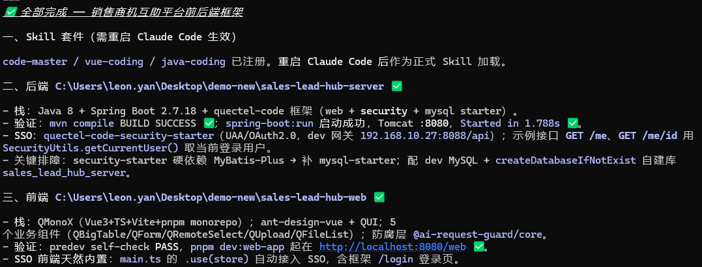

# AI 全程 0→1 全栈项目提效验证 · 系列总览与成果速览

> 📚 **《AI 全程 0→1 全栈项目实战》系列 · 总览篇（第 0 篇，开场导读）**
> **⓪ 总览** → ① 开箱姿势 → ② 方法论总纲 → ③ 需求评审 → ④ 项目配置 → ⑤ 验证纠偏 → ⑥ 数据落地 → ⑦ 联调切真
> 🗂 全程实战记录与完整截图见：[《0-1项目验证》](https://quectel.feishu.cn/wiki/Pbrhw9WLVigBR0kZ6fKcKcNEnoc)

---

## 一、这个实验在验证什么

**实验设定（刻意苛刻）**：一名对公司开发环境**不特别熟悉**、对目标项目**了解较少**的开发者，手里只有——

- 公司研发的 AI Skill 三件套（`code-master` / `vue-coding` / `java-coding`）+ 开发手册 + 已有组件库
- 一份 PRD 产品原型（30 页原型 + 42 个功能点 + 全局规约 + 模块 PRD）
- Claude Code（配合个人使用 AI 的经验技巧）

**约束**：全程不写一行手工代码，一切由 AI 执行、人只做决策与把关。

**三个验证目标**：

| # | 验证目标 | 结论 |
|---|---|---|
| 1 | AI 大模型提效是否真实、提在哪里 | ✅ 真实，且能量化到具体环节（见 §五） |
| 2 | 一般开发人员能否凭公司 skill + 需求完成一个 0→1 全栈项目 | ✅ 能——前提是姿势正确（见 §二） |
| 3 | 当前"skill + 门禁 + 设计文档驱动"的研发思路是否可行 | ✅ 可行，并实战暴露了若干 skill 待加强点（见 §八） |

**覆盖的完整环节**：skill 初始化项目与前后端框架搭建 → 需求分析评审 → Claude 项目化配置 → 前端完整呈现 → mock 数据一致性整理 → 数据库创建 → 接口开发 → 接口联调——0→1 全链路无断档。

---

## 二、结论先行（一页纸）

> **全程用 AI 做企业 0→1 全栈项目：能成。**
> 决定成败的不是模型多聪明，而是四条纪律：
> **① 把企业框架当黑盒**——以 skill/门禁为准，禁止 AI 用开源直觉自由发挥；
> **② 把门禁当真相**——self-check / typecheck / 编译 / JDBC 核库说了算，AI 说"应该没问题"不算数；
> **③ 把设计文档与决策纪要当唯一基准**——并行产出不漂移的根；
> **④ 人在真岔路拍板**——改产物、触红线、PRD 自相矛盾时停下问人，其余放手让 AI 跑。
>
> **AI 提供马力，skill 门禁提供刹车与护栏，人掌方向盘。**

---

## 三、全链路七阶段与交付物

| 阶段 | 对应篇 | 关键交付物 | 验收方式 |
|---|---|---|---|
| 环境与框架骨架 | ①② | 可编译可启动的前后端骨架（QMonoX + Spring Boot 2.7，web/security/mysql，登录可用） | mvn compile / spring-boot:run / pnpm dev self-check |
| 需求分析评审 | ③ | 评审报告（多角色交叉核对）+ 决策纪要 + SSOT 与模块 PRD 终稿 + 一致性校验 | 专职校验 agent + 人拍板 |
| AI 项目化配置 | ④ | CLAUDE.md / AGENTS.md / MEMORY.md 三件套（6 角色评审后修复） | 逐条断言对源码核验、假门禁清零 |
| 前端完整呈现 | ④→⑤ 之间 | 30 页产品原型前端全量高保真还原（多路后台 agent 并行打磨） | self-check 0/0 + typecheck 绿 + 人工走查 |
| 验证与纠偏 | ⑤ | 黑盒缺陷修复（mock 双重转换）+ 需求还原度评审 + 开发环境自愈 | 最小复现钉根因 + 对基线多角色核对 |
| 数据库 0→1 | ⑥ | 契约收口（枚举/SSOT/PRD 修正）+ 18 表 DDL + 种子数据 + 全套 MyBatis-Plus 实体 | 双角色评审 + mvn compile 绿 |
| 接口开发与联调 | ⑦ | requirement 竖切真实 SSO 打穿 + 12 步配方 + 模块级 mock 退场机制 + opportunity 等模块批量复制 | 五关验收：离线测试/真库集成/前端门禁/浏览器实测/JDBC 核库 |

*阶段成果之一：前后端框架骨架完成*

*阶段成果之二：产品原型在前端全量高保真还原*

*阶段成果之三：18 表 DDL + 种子数据 + 实体全套生成，双角色评审收口*

*阶段成果之四：首个模块竖切联调打穿,真数据在前后端之间流动*

---

## 四、成果清单（数字化速览）

- **总产出规模**：AI 手写约 **6.5 万行代码 + 1.9 万行文档**（代码文档比约 3.4:1）——后端 Java 24,201 行（395 个文件）、前端 Vue 17,731 行 + TS/JS 9,747 行、SQL 1,414 行、配置与 Mock 数据 5,229 行、分享页/设计稿 HTML 约 4,956 行、脚本约 1,522 行；文档 19,137 行（62 个 Markdown）。另有 PM 提供的原型 HTML 15,678 行与脚手架样式 3,279 行**未计入** AI 手写口径
- **框架骨架**：前后端各 1 套，符合部门框架规范，SSO/security/mysql 组件齐备
- **产品文档基线**：42 个 FEAT 全量评审；4 评审 agent + 6 产出 agent + 1 校验 agent + 1 调研 agent；关键纠错 1 例（登录方案差点按自建账密写错，调研证实框架默认即企业 SSO）
- **配置三件套**：3 个配置文件；6 角色评审揪出漏列模块、三处硬耦合写成两处、两个"假绿"门禁等问题并全部修复
- **前端**：30 页全量实现；mock 修复涉及 19 个 api 文件；还原度评审揪出 2 个整页缺失、多处枚举/字段契约冲突
- **数据层**：18 张表 DDL + 种子数据 + 全套实体/Mapper/配置；契约收口约 25 个文件（5+3 路 subagent 并行）
- **联调**：requirement 模块 12 类文件竖切配方；真实 SSO 账号打穿全流程 + JDBC 核库；opportunity 照配方复制**一次编译通过**；20 个模块的 mock 按"接口白名单/数据保留/页面碎片清剿"三层有序退场
- **沉淀资产**：黑盒坑与框架约定全部固化进项目记忆（env 白名单、序列化三坑、UAA 角色、乐观锁自补、MP null 静默跳过等）——后续会话与后续项目直接命中,不复踩

---

## 五、提效在哪里（诚实版）

**真提效的环节**：

| 环节 | 传统方式 | AI 方式 |
|---|---|---|
| 框架骨架搭建 | 照手册逐步操作、踩版本坑 | 一句话开场，skill 调度自动完成，AI 自修编译/启动问题 |
| 大体量 PRD 评审 | 拉会多岗位评审、数天 | 多角色 agent 并行独立评审 + 交叉核对，墙钟 = 最慢一份 |
| 大批量文档/代码生成 | 逐份手写 | 并行 subagent + 决策纪要锁口径，产出后一致性校验兜底 |
| 批量模块开发 | 每个模块从头做 | 首模块打穿成配方，后续模块只写 delta，边际成本断崖式下降 |
| 排障 | 凭经验猜、改一版试一版 | 最小复现/反编译/实发代码取证，一次钉死根因 |

**成本花在哪（同样诚实）**：① AI 自作主张翻车后的返工（前期姿势不对时最贵，约占早期开销一半——**这正是本系列方法论要消掉的**）；② 多角色 subagent 的并行开销（用"只喂最小上下文 + 知道何时停止评审"控制）；③ 黑盒取证的一次性投入（反编译/最小复现——查一次比错三版便宜）。

---

## 六、跨篇十大关键教训（核心）

1. **黑盒纪律**：企业框架里开源直觉经常是错的——env 只改白名单、框架约定反编译取证，不猜（②⑥）
2. **门禁即真相**：skill 不在场门禁也能守住合规；"绿而无效"的假门禁零容忍（②④⑤）
3. **设计文档驱动**：排期出自 skill 的设计文档进度表,不许 AI 拍脑袋手排（②）
4. **多角色评审 + 交叉核对**：独立才有价值,多方命中＝高可信,主控当整合官（③④⑤⑥）
5. **决策纪要 = 唯一基准**：并行产出不漂移的根;同一事实只在一处定义（③④）
6. **凡断言必取证**：技术方案查框架真实能力、契约抄页面实发 payload、任务定义从 transcript 抠（③⑥⑦）
7. **真岔路停下问人**：改产物/触红线/PRD 矛盾交人拍板;有默认值的自己定并说明（⑥）
8. **配方化 + 地基先行**：首模块慢慢打穿,配方摊薄边际成本;人人要踩的坑抽成 Phase 0 做一次（⑦）
9. **200 不算数,落库的行才算数**：单测全绿库仍可能是错的,JDBC 核库与门禁绿同权重（⑦）
10. **坑升格为资产**：每个坑修复后固化进记忆/红线/门禁——这是 AI 协作里 ROI 最高的一笔投入（②④⑤⑥⑦）

---

## 七、七篇导读（怎么用这套文档）

| 篇 | 讲什么 | 什么时候读 |
|---|---|---|
| ① 开箱姿势 | 环境准备、skill 安装、框架骨架的"没有弯路版"操作指南 | 新人第一次用套件,照着做 |
| ② 方法论总纲 | 黑盒纪律、门禁体系、0→1 主线流程与红线清单 | 开工前通读,树立总纲 |
| ③ 需求评审 | 多角色 PRD 评审 → 决策纪要 → 并行产出产品文档基线 | 拿到 PRD、开工前 |
| ④ 项目配置 | CLAUDE/AGENTS/MEMORY 三件套的移植、取证与评审 | 项目初始化时 |
| ⑤ 验证纠偏 | 交付后排障（最小复现钉黑盒）、需求还原度评审、环境自愈 | 前端交付后、"看起来对了"时 |
| ⑥ 数据落地 | 契约收口扫雷 → 反编译定框架约定 → 建库 → 双角色评审 | 从前端往数据层推进时 |
| ⑦ 联调切真 | 竖切配方、横切地基、五关验收、mock 三层退场 | 后端接口开发与联调阶段 |

> 推荐讲解顺序即编号顺序（= 实战时间线）；时间有限时讲 **⓪② + ⑤⑦**（总纲 + 两个最硬核的实战篇）。

---

## 八、给套件团队的实战反馈（本实验的副产品）

1. **SSO 联调卡点**：骨架阶段 localhost 的 SSO 登录 skill 无法一次跑通（两套登录入口、回调/跨站 cookie 环节卡住），且此处 skill 有跳步、未完全执行完——建议加强该步约束与引导（①②）
2. **插件注册表脆弱**：批量注册脚本的路径拼接 bug 会把 `installPath` 写坏，导致已装 skill 集体"失踪"；且注册表仅进程启动时读取、`/plugin` 不重启进程——建议修复拼接并在文档中写明"必须完全重启"（⑤）
3. **starter 文档与字节码不符**：文档称配置含乐观锁,实际字节码只有分页拦截器——建议文档与产物对齐,或在手册中明示"乐观锁需业务侧启用"（⑥）
4. **脚手架残留**：clean-demo 后仍有演示页残留触发 self-check FAIL;脚手架 adapter 模板的 `total` 类型在 Long→String 序列化下必坏——建议模板层修正（①⑦）

---

## 九、一句话收尾

> **这个实验证明的不是"AI 能替代开发",而是"一般开发者 + 公司 skill + 正确姿势 = 一条人掌方向盘的 0→1 高速公路"。**
> 七篇方法论就是这条路的路书:每一条红线都有截图为证,每一个结论都有门禁背书。
