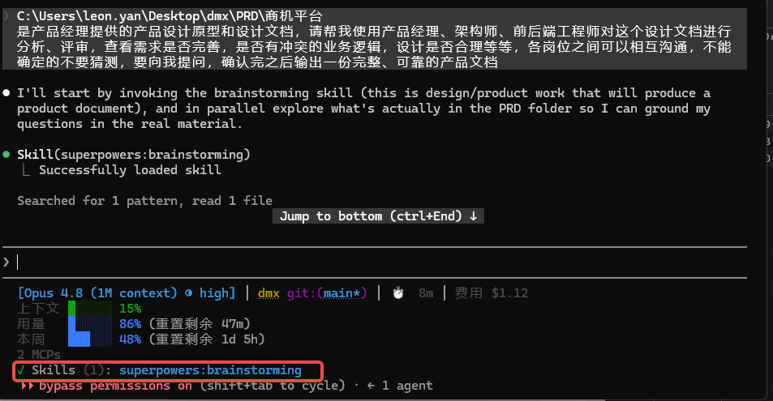
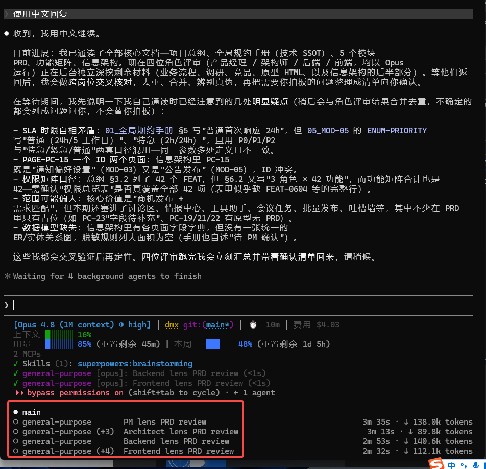
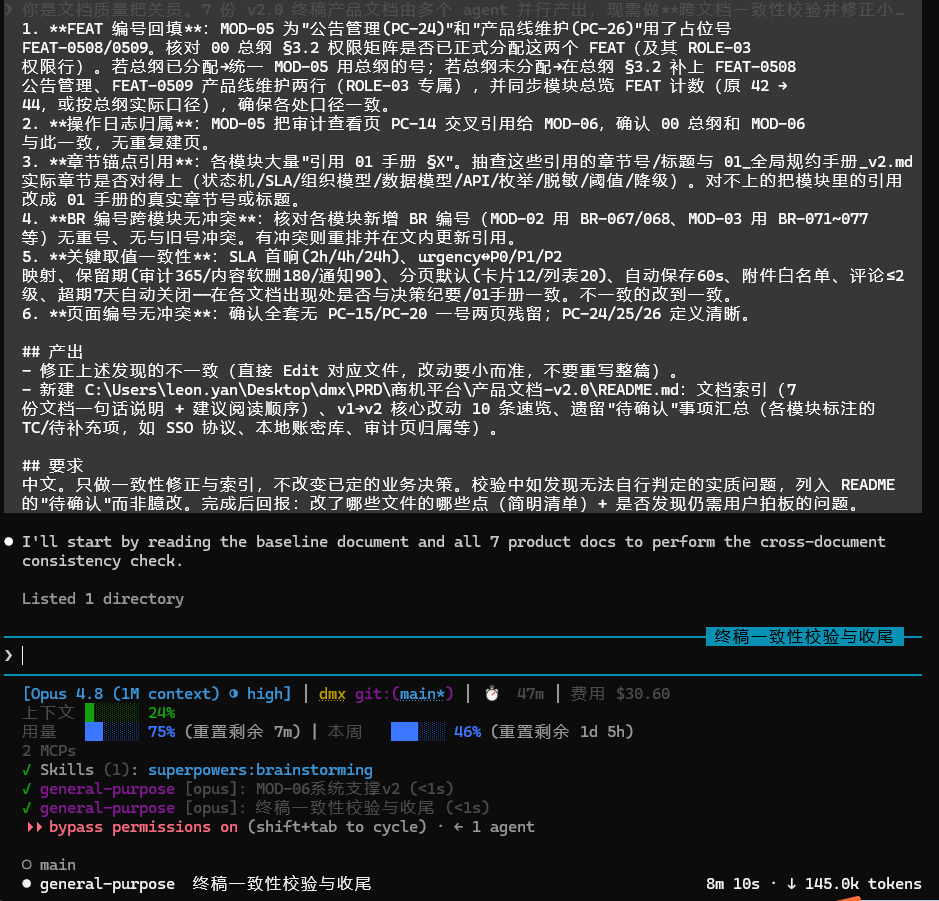
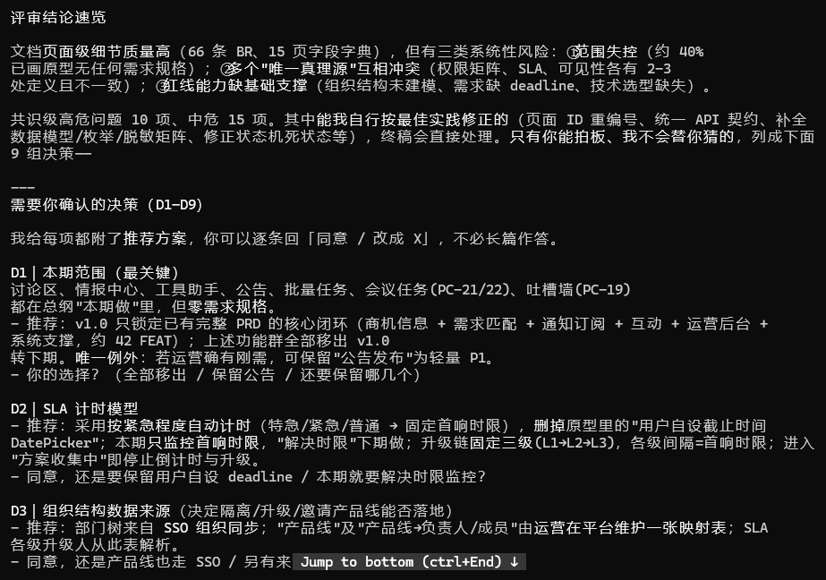
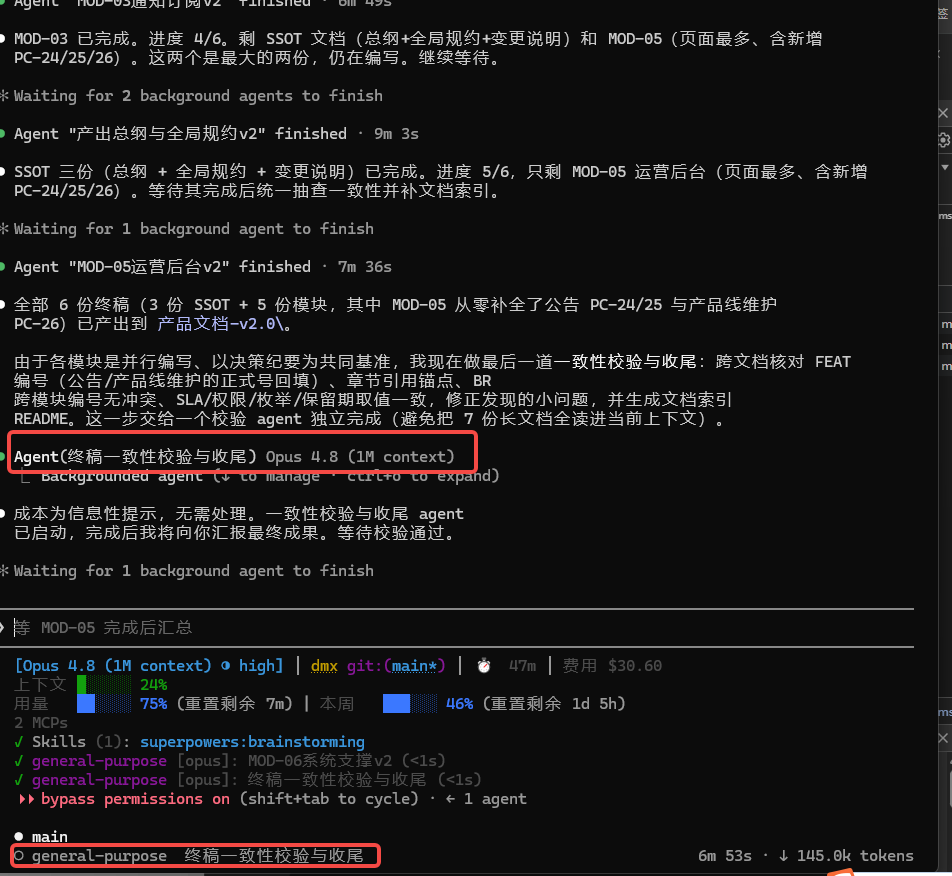
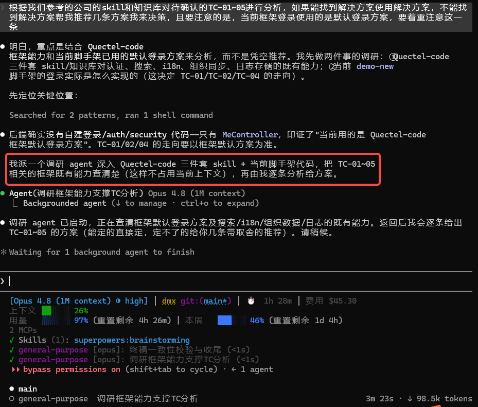
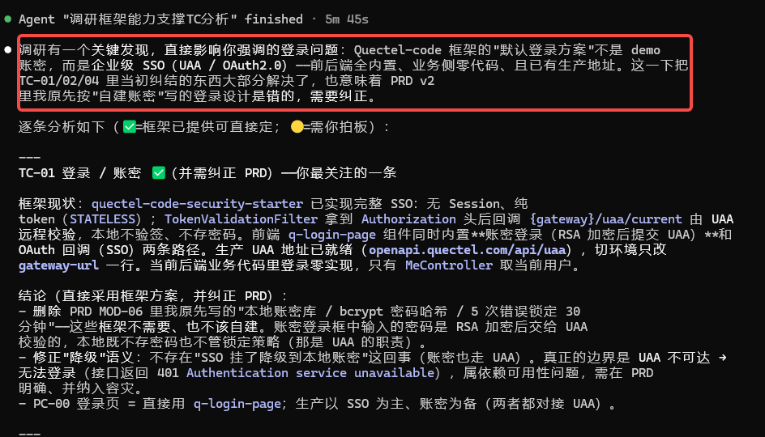
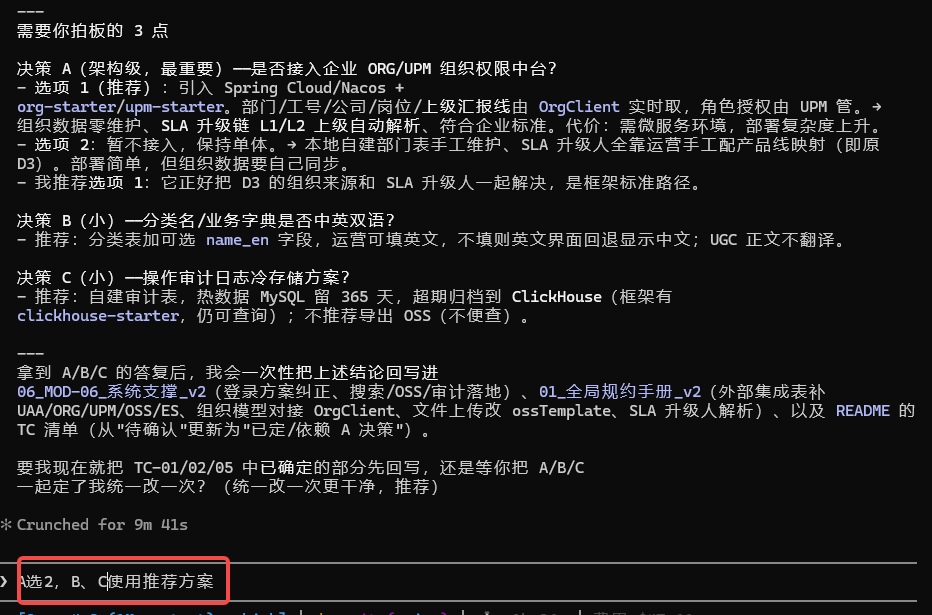
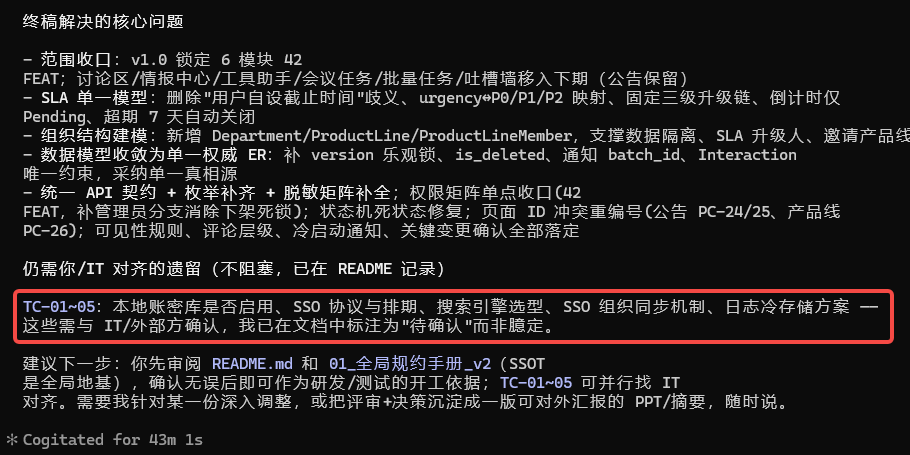

# 用 Claude Code 做 PRD 评审 → 可靠产品文档 · 方法论复盘

> 📚 **《AI 全程 0→1 全栈项目实战》系列 · 第 3 篇 / 共 7 篇**
> ⓪ 总览 → ① 开箱姿势 → ② 方法论总纲 → **③ 需求评审** → ④ 项目配置 → ⑤ 验证纠偏 → ⑥ 数据落地 → ⑦ 联调切真
> 🗂 全程实战记录与完整截图见：[《0-1项目验证》](https://quectel.feishu.cn/wiki/Pbrhw9WLVigBR0kZ6fKcKcNEnoc)

> 一次真实实验的复盘：**给 Claude Code 一份产品经理提供的原型+设计文档，让它以"多角色专家团队"的方式评审、找出需求缺失与业务冲突，向人确认后产出一套完整、自洽、可开工的产品文档。**
> 载体是内部「销售商机互助平台」（即本系列各篇的同一载体，PRD 阶段曾用名"商机信息发布平台"）的 PRD（30 页原型 + 42 个功能点 + 全局规约 + 5 个模块 PRD）。本文**只讲方法与工作流，不涉及具体业务**，与《Quectel-code AI 开发正确姿势》《AI 全程搭建 0→1 方法论》配套——那两份讲"写代码"，这份讲"评审文档与产出规格"。

---

## 一、结论先行（TL;DR）

**可行且高效——关键在于把 Claude Code 当成一个"可编排的专家团队"，而不是一个"更快的写手"。**

- ✅ Claude Code 能完成：通读大体量文档建立全局地图、以多角色独立视角挖出需求缺失/业务冲突、交叉核对去重、把决策收敛成清单向人拍板、以统一基准并行产出多份文档、跨文档一致性校验、贴着真实框架能力定技术方案。
- ⚠️ 最大的风险有三个：① **主控自己读所有文档 → 上下文爆掉**；② **多个 agent 并行写文档 → 口径漂移、互相打架**；③ **AI 替你猜业务决策 / 用开源直觉定技术方案 → 看似合理实则错**（本次就差点把"登录"按自建账密写，实际框架默认就是企业 SSO）。
- 🔑 让它安全落地的，是四个机制：**subagent 隔离上下文 + 决策纪要作唯一基准 + 一致性校验兜底 + "不确定就停下问人"**。

> 一句话方法论：**agent 提供并行马力与多视角，"决策纪要"提供统一基准，人在冲突点拍板，校验环节守住一致性。**

---

## 二、正确的主线流程（可照抄）

一条从"收到 PRD"到"交付可靠产品文档"的七步流水线：

```
1. 建全局地图（主控亲自读，别外包）
   └─ 通读骨干文档：项目总纲 / 全局规约(SSOT) / 各模块 PRD / 功能矩阵 / 信息架构
   └─ 目的：主控先有全局判断力，才能当"整合官"审阅 agent 的产出

2. 多角色并行评审（派 subagent，各一份独立视角）
   └─ 4 个角色 = 产品经理 / 架构师 / 后端 / 前端，各自 lens、各自读原始材料
   └─ 显式指定 Opus、background 并行；每个只交结构化发现（高危/中危/待确认/跨岗位关注）

3. 交叉核对 + 可信度分级（主控做，体现"岗位间沟通"）
   └─ 多角色独立命中同一问题 = 高可信；单角色发现 = 存疑待验
   └─ 去重合并成一份评审报告，标注可信度

4. 收敛成决策清单，向人拍板（不猜！）
   └─ 分两档：「可自动修正的」(编号冲突/补数据模型/统一取值) 主控直接改
   └─          「需业务拍板的」→ 决策清单 D1~Dn，每条给推荐方案 + 取舍，用文字讨论而非连环多选

5. 决策纪要 = 施工唯一基准（关键！）
   └─ 把所有拍板结果固化成一个文件，作为后续所有并行产出的 Single Source of Truth
   └─ 一致性的根就在这里——没有它，并行产出必然漂移

6. 并行产出终稿（多 subagent，各写一份，都读决策纪要）
   └─ SSOT 文档 + 各模块 PRD 各派一个 agent；独立上下文，避免主控溢出
   └─ 模块文档只"引用 SSOT、不重复定义"，天然收敛

7. 一致性校验收尾（专职 agent 兜底）
   └─ 跨文档核对：编号/章节锚点/规则冲突/关键取值一致
   └─ 修正 + 生成索引 README；发现拿不准的实质问题→回列"待确认"，不臆改
```


*实战现场：开发者对产品不熟悉，用多角色分析 + 提问的方式确认业务逻辑、确认需求*


*四个角色（PM/架构/后端/前端）各派一个 subagent，独立视角并行评审*

---

## 三、关键方法与技巧复盘（本文精华）

### 技巧 1 · 建全局地图这一步，主控必须亲自做

把"读 PRD"直接外包给 agent 很诱人，但主控若没有全局判断力，就无法审阅、去重、辨别 agent 产出的真伪。**主控先通读骨干（总纲/SSOT/模块/矩阵/IA），建立地图，再去编排 agent。** 本次正是因为主控先读透了全局规约，才能在 agent 报"SLA 时限冲突"时立刻判断这是真冲突还是误报。

### 技巧 2 · 用 subagent 做"多角色专家团队"，而不是一个人分饰四角

- **各角色独立上下文、独立读原始材料**：PM 看范围/指标/业务闭环，架构师看数据模型/状态机/集成，后端看接口/并发/规则可实现性，前端看原型-PRD 吻合度/交互/i18n。
- **独立才有价值**：四个 agent 互不可见，才能产生真正独立的发现；一个 agent 分饰四角会互相污染、趋同。
- **本次实证**：后端先发现"优先级双字段"，PM 独立发现"SLA 双模型（原型有 DatePicker）",架构师独立发现"组织结构未建模"，前端独立发现"页面 ID 一号两页"——四个视角合起来才是完整的问题全貌。


*实战现场：随时可以观察某个子 agent 的评审过程——多角色不是黑箱*

### 技巧 3 · 交叉核对 + 可信度分级 = 让"岗位间沟通"落地

用户要"各岗位相互沟通"。实现方式不是让 agent 互相聊（成本高、易发散），而是**主控当整合官做交叉核对**：多角色独立命中的问题标"高可信"，单角色发现的标"存疑"。这既去了重，也给了每条问题一个可信度权重，人一眼知道该先信哪条。


*实战现场：交叉核对后合成的评审结论——每条问题带可信度标注*


*多角色发现去重合并后的完整问题清单*

### 技巧 4 · 决策清单：区分"可自动修正"与"需人拍板"，且给推荐方案

- **可自动修正的**（页面重编号、补 version 乐观锁、统一分页默认值、修状态机死状态）→ 主控直接在终稿处理，不浪费人的注意力。
- **需业务拍板的**（本期范围、SLA 模型、数据隔离默认策略、关键指标基线）→ 收敛成 D1~Dn，**每条附推荐方案 + 取舍**，让人可以"同意/改成 X"快速回，而不是从零作答。
- **尊重协作偏好**：本次用文字分组讨论，而非甩一堆多选题——降低决策负担。


*实战现场：待确认问题收敛成决策清单，附推荐方案交人拍板*

### 技巧 5 · "决策纪要"是并行产出不漂移的唯一保证

多个 agent 并行写文档，最大风险是口径漂移（这个 agent 写"评论无限层级"、那个写"两级"）。解法：**先把所有拍板结果落成一个《决策纪要与修正基线》文件，声明为"施工唯一基准"**，所有产出 agent 都读它。SLA 取值、权限口径、数据模型、枚举收口值全在里面——agent 只需引用，不需自行发挥。本次 6 份文档并行产出后取值完全一致，靠的就是这一步。

### 技巧 6 · 贴着"框架真实能力"定技术方案，别用开源直觉（最重要的一条）

技术选型（搜索/存储/登录/组织数据）**不能凭 AI 的通用知识拍**。本次把待确认技术项派给一个调研 agent，去查公司 skill 知识库 + 反编译框架 jar + 内网 GitLab + 现有脚手架代码，拿到事实再定：
- **关键纠错**：原本按"自建本地账密库 + 密码哈希 + 5 次锁定"写登录降级——**调研发现框架默认登录本身就是生产级企业 SSO（UAA/OAuth2.0）**，账密框也是走 UAA 的，本地根本不该存密码。差一点就把一整套错误设计写进终稿。
- **顺带发现**：全文搜索、文件存储(OSS 预签名)、i18n、审计字段框架都有现成 starter，无需自研。


*实战现场：派调研 agent 查 skill 知识库/框架 jar/内网 GitLab，拿事实再定技术方案*


*调研结论：登录本身就是生产级企业 SSO，本地不该存密码——差点写进终稿的错误设计被事实拦下*

> 呼应《0→1 方法论》的"黑盒教训"：**企业框架里，开源直觉经常是错的；先查真实能力，再定方案。**

### 技巧 7 · 一致性校验 + 决策回写，形成闭环

- **并行产出后必须过一道校验**：专职 agent 跨文档查编号/锚点/规则冲突/取值。本次它揪出一处实质错误（FEAT-0507 被误标成"操作审计"，实为"发布量告警"）。


*实战现场：终稿一致性校验结果——专职 agent 兜底揪出跨文档不一致*
- **续做用 SendMessage 复用 agent 上下文**：校验 agent 已持有全局映射表，让它接着做锚点订正，比新起一个 agent 省。
- **二次决策也要回写闭环**：技术项拍板后统一回写终稿，并连带修正衍生的不一致（删了自建上传接口，就同步把引用它的模块也改掉）。

---

## 四、给"用 Claude Code 干评审/文档"的协作姿势

| 姿势 | 说明 |
|---|---|
| **主控先建全局地图，再编排 agent** | 没有全局判断力就无法审阅 agent 产出、辨真伪。骨干文档主控亲自读。 |
| **多视角要"独立"才有价值** | 派多个 agent 各扮一角、互不可见；一个 agent 分饰多角会趋同。 |
| **交叉核对定可信度** | 多角色独立命中＝高可信；单角色＝存疑。主控做整合，不让 agent 互聊发散。 |
| **不确定就停下问人** | 业务取舍、指标基线、安全默认策略——AI 一律不猜，收敛成带推荐的决策清单。 |
| **一个"决策纪要"锁死基准** | 并行产出前先落定 SSOT 文件，所有 agent 引用它，杜绝口径漂移。 |
| **技术方案贴真实能力** | 查 skill/知识库/反编译/现有代码拿事实，别用开源直觉拍板（尤其登录/鉴权）。 |
| **产出后必校验** | 编号/锚点/取值跨文档核对，专职 agent 兜底；拿不准的回列"待确认"不臆改。 |
| **保真不臆造** | 源里没有的标"待补充/待确认"，绝不编业务事实。 |

---

## 五、可复用检查清单（开工即用）

**评审前**
- [ ] 主控通读骨干文档（总纲/SSOT/模块/矩阵/IA），建立全局地图
- [ ] 想清楚要哪几个角色视角（本次：PM/架构/后端/前端）

**评审阶段**
- [ ] 每个角色一个 subagent，独立读原始材料，显式 Opus、background 并行
- [ ] agent 输出统一格式：高危 / 中危 / 待确认 / 跨岗位关注
- [ ] 主控交叉核对去重，标注可信度，合成一份评审报告

**决策阶段**
- [ ] 分"可自动修正"与"需人拍板"两档
- [ ] 需拍板的收敛成 D1~Dn，每条附推荐方案 + 取舍，文字讨论
- [ ] 拍板结果固化进《决策纪要》并声明为"施工唯一基准"

**产出阶段**
- [ ] SSOT 文档 + 各模块各派一个 agent，全部读决策纪要
- [ ] 模块文档"引用 SSOT、不重复定义"
- [ ] 产出后专职 agent 做一致性校验 + 生成索引 README

**技术选型**
- [ ] 待确认技术项派调研 agent 查真实框架能力（skill/知识库/反编译/现有代码）
- [ ] 基于事实定方案，尤其登录/鉴权/存储/搜索——别用开源直觉
- [ ] 二次决策统一回写，连带修正衍生不一致

**红线自问**
- [ ] 这条结论是"多角色印证/框架事实背书"的，还是我"觉得"的？
- [ ] 这个决策是业务该拍的吗？（是就别替他猜，去问）

---

## 六、效率与成本的诚实备注

- **成本主要花在两处**：① 多轮 subagent（评审 4 + 产出 6 + 校验 + 调研 + 回写，每个都是独立 Opus 上下文）；② 大体量文档的逐字保真产出。
- **省钱要点**：
  - **subagent 只喂最小必要上下文**：产出 agent 只读"决策纪要 + 它负责的那一份原 PRD"，不读全套。
  - **决策纪要一次锁定**：避免因基准不清导致的反复返工——一致性靠基准文件，不靠事后对齐。
  - **调研先行再定方案**：查一次框架真实能力（如登录=SSO）省下的返工，远大于调研本身的开销。
  - **background 并行**：评审 4 份、产出 6 份都并行跑，墙钟时间 = 最慢的一份，不是累加。
  - **续做用 SendMessage 复用上下文**，别为一个小续做重新起 agent 从头读。
- **可推广性**：这套"建地图 → 多角色评审 → 交叉核对 → 决策清单 → 决策纪要 → 并行产出 → 一致性校验"主线，适用于任何"评审既有设计 / 从原型产出规格 / 大体量文档重构"的场景，可作团队 SOP。

---

## 七、一页纸总纲

> **多角色 agent 提供并行马力与独立视角，《决策纪要》提供统一基准，人在冲突点拍板，校验环节守住一致性。**
> 用 Claude Code 做 PRD 评审与产品文档产出**能成且高效**，前提是：**主控先建全局地图、让多视角真正独立、不确定就问人、用一个基准文件锁死口径、技术方案贴真实框架能力、产出后必校验**——而不是让一个 agent 一口气把所有事都办了。
