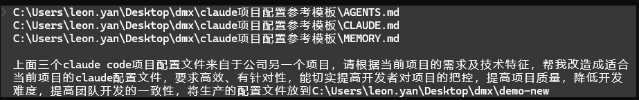
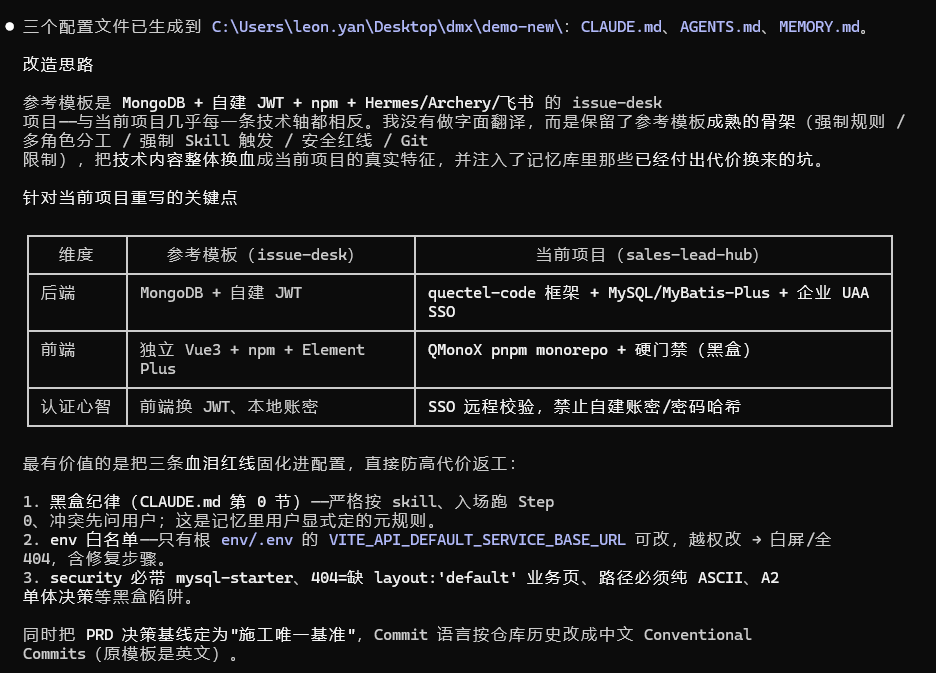
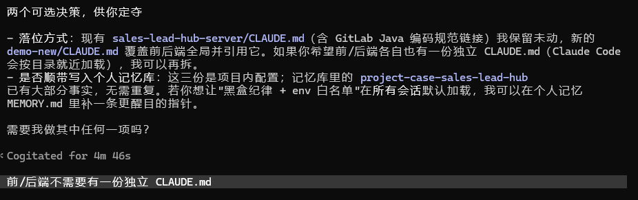
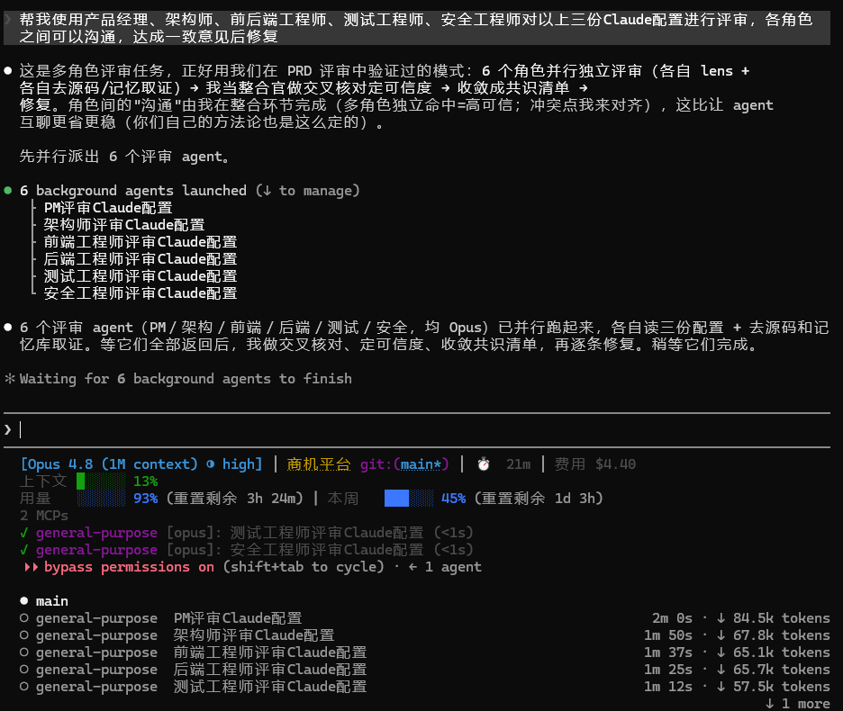
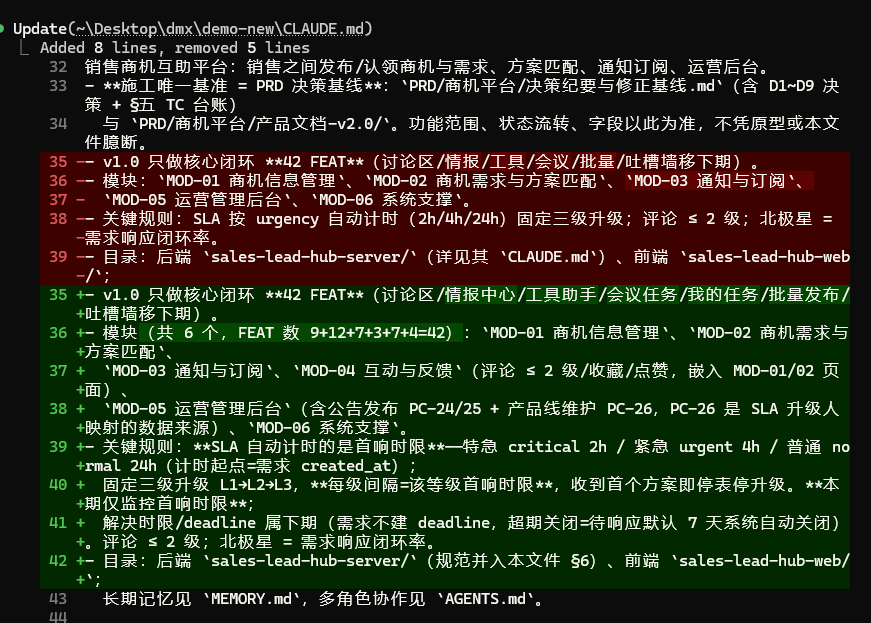
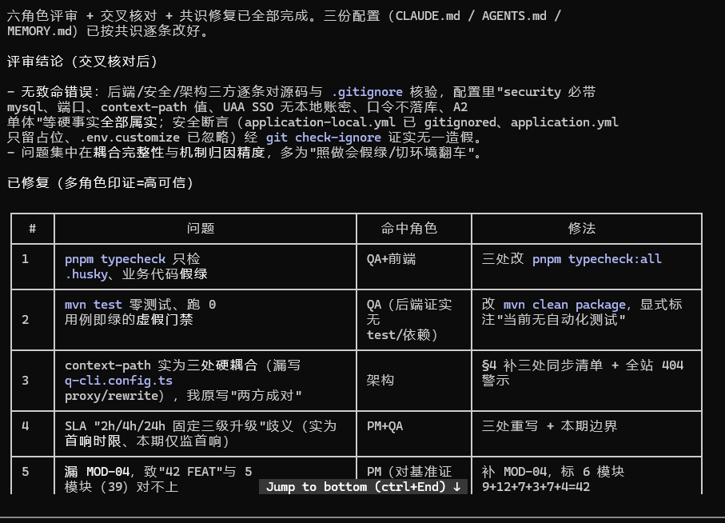

# 用 Claude Code 打造项目 AI 配置三件套 · 方法论复盘

> 📚 **《AI 全程 0→1 全栈项目实战》系列 · 第 4 篇 / 共 7 篇**
> ⓪ 总览 → ① 开箱姿势 → ② 方法论总纲 → ③ 需求评审 → **④ 项目配置** → ⑤ 验证纠偏 → ⑥ 数据落地 → ⑦ 联调切真
> 🗂 全程实战记录与完整截图见：[《0-1项目验证》](https://quectel.feishu.cn/wiki/Pbrhw9WLVigBR0kZ6fKcKcNEnoc)

> 一次真实实验的复盘：**把另一个项目的 Claude Code 配置（CLAUDE.md / AGENTS.md / MEMORY.md）移植改造成当前项目的配置，再用"多角色专家团队"评审这套配置本身、达成共识后修复。**
> 载体是「销售商机互助平台」（Quectel-code 企业框架 + QMonoX + UAA SSO）。本文**只讲方法与工作流**，与《AI 全程搭建 0→1 方法论》《Quectel-code AI 开发正确姿势》《用 Claude Code 做 PRD 评审与产品文档方法论》配套——那三份讲"写代码 / 用框架 / 评审 PRD"，这份讲**给项目配一套 AI 规则文件，并把它做对**。

---

## 一、结论先行（TL;DR）

**配置文件是 AI 对项目"把控力"的底座，值得像评审代码一样认真做——但它极易"看似权威、实则误导"。**

- ✅ 一套好的三件套能让 AI（和团队）在整个项目里保持一致：`CLAUDE.md`=强制规则、`AGENTS.md`=多角色协作、`MEMORY.md`=长期记忆，各司其职、互不重复。
- ⚠️ 最大的风险有三个：① **照着参考项目"翻译" → 技术栈张冠李戴**（参考项目是 MongoDB/自建 JWT/npm，当前是 MySQL/UAA SSO/pnpm，几乎每条都相反）；② **配置里的技术断言凭 AI 直觉写 → 自信地写错**（本次被评审揪出：模块少列一个致 FEAT 数对不上、context-path 实为三处硬耦合却写成"两方成对"、门禁命令"绿而无效"）；③ **配置声称的门禁/命令根本跑不通或假绿**（`typecheck` 只检 husky、`mvn test` 零测试即绿）。
- 🔑 让它落地可靠的，是四条：**留骨架换血肉注红线 + 双源取证（源码＋记忆库）+ 多角色评审配置本身 + 假门禁零容忍**。

> 一句话方法论：**参考模板给骨架，源码与记忆库给事实，血泪坑升格成红线，再让多角色像审代码一样把配置逐条对源码核验——配置不是写出来的，是"验"出来的。**

---

## 二、正确的主线流程（可照抄）

一条从"拿到参考配置"到"交付经过评审的可靠配置"的七步流水线：

```
1. 读参考模板，建"骨架认知"（先读，别急着改）
   └─ 认清哪些是可继承的通用骨架：强制规则 / 角色分工 / Skill 触发 / 安全红线 / Git 限制
   └─ 哪些是参考项目专属、必须整体换掉的技术血肉

2. 摸当前项目的真实技术特征（双源取证，别假设）
   └─ 源码源：pom.xml / package.json / application.yml / env / 目录树 / 脚手架
   └─ 记忆源：项目记忆库（踩过的坑、黑盒约束、架构决策）+ PRD 决策基线
   └─ 逐轴列差异表：后端框架 / 持久层 / 认证 / 包管理 / 门禁 …… 凡不同全换

3. 留骨架、换血肉、注红线（这是移植的精华）
   └─ 骨架照搬结构，技术内容按差异表整体替换
   └─ 把记忆库里"用代价换来的坑"升格为红线（env 白名单 / 黑盒纪律 / 启动必炸项）

4. 一份统管、消除断链（别留多份各自漂移）
   └─ 删冗余（子目录重复的 CLAUDE.md），把唯一内容并入主文件，修所有交叉引用
   └─ 三件套内同一事实只在一处定义，其余引用——重复即漂移之源

5. 决策留给人，不臆断（给推荐，问用户）
   └─ commit 语言 / 是否分目录 / 要不要加测试依赖——附推荐让人快速拍板

6. 多角色评审配置本身（派 subagent，各一份独立视角）
   └─ PM / 架构 / 前端 / 后端 / QA / 安全，各自 lens、各自去源码＋记忆取证
   └─ 输出统一格式：高危 / 中危 / 待确认 / 建议 / 跨岗位关注

7. 交叉核对 → 共识 → 修复 → 闭环（主控当整合官）
   └─ 多角色独立命中＝高可信；单角色但源码坐实＝采纳；冲突点主控对齐
   └─ 修配置，顺带补评审牵出的上游（产品文档）与下游（缺测试）真问题
```


*实战现场：对项目的 Claude 进行配置——移植参考模板前先建骨架认知*


*留骨架、换血肉、注红线：技术内容按逐轴差异表整体替换*


*生成后的配置结构——CLAUDE.md 强制规则 / AGENTS.md 多角色协作 / MEMORY.md 长期记忆各司其职*

---

## 三、关键方法与技巧复盘（本文精华）

### 技巧 1 · 移植 = 留骨架、换血肉、注红线，绝不是"翻译"

参考模板最值钱的是**成熟的结构**（多角色分工、强制 Skill 触发、安全红线、Git 策略），最危险的是**技术内容**。本次参考项目与当前项目在后端框架/持久层/认证/包管理/门禁上几乎全相反——直接翻译＝把 MongoDB、自建 JWT、npm、Hermes/飞书/Archery 一整套错误技术栈搬进来。正确做法：**骨架照搬，血肉按"逐轴差异表"整体换掉，再把红线注进去**。

### 技巧 2 · 双源取证：源码 + 记忆库，凡技术断言必对源码核实

配置里每一条"技术基准"都是给 AI 的事实断言，写错就是系统性误导。事实有两个来源，缺一不可：
- **源码源**：`pom.xml`（starter 组合）、`application.yml`（端口/context-path/口令占位）、`env/.env`（白名单变量）、`package.json`（真实脚本名）、目录树（分层是否已存在）。
- **记忆源**：项目记忆库沉淀的**黑盒坑与架构决策**——"security 必带 mysql 否则启动炸"、"env 白名单越权改致白屏"、"A2 不接 ORG/UPM 保持单体"、"登录是 UAA SSO 不是本地账密"。这些开源直觉给不了。

### 技巧 3 · 记忆库是配置的金矿——把血泪坑升格成"红线 / 第 0 节黑盒纪律"

配置最高的价值，不在复述技术栈（那源码能查），而在**固化那些用代价换来、且反直觉的约束**。本次把记忆里的坑提炼成显式红线：`env` 只有一个变量可改、改完必须重快照；context-path 三处硬耦合漏一处全站 404；项目路径必须纯 ASCII；后端 security 必带 mysql-starter。并在 `CLAUDE.md` 开篇立"**第 0 节 黑盒纪律**"：企业框架是黑盒，以 skill/门禁为准、禁止开源直觉自由推断——这一条能挡掉最多的返工。

### 技巧 4 · 一份统管、消除断链——重复即漂移

三件套里同一事实若在多处各写一遍，很快就会各自漂移（评审确实揪出"技术基准表三处重复、已出现同源偏差各自表述"）。本次删掉了子目录里冗余的 `CLAUDE.md`，把它唯一独有的内容（内网编码规范链接）并入主文件，再修掉所有指向它的交叉引用。原则：**同一事实只在一处定义（SSOT），其余引用不复制**。

### 技巧 5 · 像评审代码一样评审配置——多角色去源码取证（本文核心）

配置写完不等于对。本次复用了 PRD 评审那套"多角色专家团队"，把评审对象从"产品设计"换成"配置文档本身"：**6 个角色（PM/架构/前端/后端/QA/安全）各一个 subagent，独立 lens，各自去源码＋记忆库核对配置里的每条断言**。成效直接：


*实战现场：开发人员自审之后，对重要配置文件发起 6 角色评审*


*各角色独立取证的发现——配置里"自信写错"的断言被逐条揪出*


*交叉核对取共识后修复——配置不是写出来的，是"验"出来的*
- **PM**：对基准查出配置漏列 MOD-04，导致"42 FEAT"与列出的 5 个模块（39）对不上。
- **架构**：查 `q-cli.config.ts` 发现 context-path 是**三处硬编码耦合**，配置却写成"env 一处成对"——照配置改必全站 404。
- **前端/QA**：`pnpm typecheck` 只检 `.husky`、业务代码**假绿**；`mvn test` 零测试即绿的**虚假门禁**。
- **安全**：逐条 `git check-ignore` 核实"口令未提交"断言**全部属实**（也印证：没问题就是没问题，不硬凑）。

### 技巧 6 · 假门禁是隐形杀手——命令必须"真能跑、真能验"

配置里最阴险的不是写错事实，而是给出一条**看着像门禁、实则空过**的命令。上线清单写 `mvn test`，但没有测试类、没有测试依赖，跑 0 用例直接绿，给 QA 虚假安全感；写 `pnpm typecheck`，但根 `tsconfig` 只 include `.husky`，业务页有类型错也 PASS。评审专抓这类"绿而无效"，修法是让门禁**真覆盖**：改 `typecheck:all`、把 `mvn test` 从占位改成真门禁（补 `spring-boot-starter-test` + 一个离线可跑的契约测试，且刻意不用 `@SpringBootTest` 以免硬依赖 DB 假红）。

### 技巧 7 · 评审会牵出上游与下游的真问题——顺藤补齐、闭环回写

对配置的核验，会照见**它所依赖的上游**和**它所描述的下游**的裂缝：
- **上游**：配置写"UAA 不可达即 401、无本地账密降级"，PM 却发现**产品总纲 4 处仍写"SSO 降级账号密码"**（与决策基线 TC-01 矛盾）——顺手把产品文档回改一致，否则研发照总纲会做出被明令禁止的设计。
- **下游**：配置把 `mvn test` 立为门禁，评审发现后端**根本没有测试**——补齐依赖与基线测试，让门禁名副其实。
- 二者都要**闭环回写**：改一处，连带把引用它、与它矛盾的地方一起修平。

### 技巧 8 · 决策留给人——给推荐、问用户，不臆断

配置里有些选择是"人该拍的"：commit 用中文还是英文、要不要每个子目录各放一份 CLAUDE.md、`mvn test` 的死结（要真测试须加依赖，撞"新依赖须同意"红线）是批准依赖还是承认免测。这些一律**收敛成带推荐的问题问用户**，不替他猜。本次三处决策全部由用户拍板后才落地。

---

## 四、给"用 Claude Code 打造项目配置"的协作姿势

| 姿势 | 说明 |
|---|---|
| **留骨架、换血肉、注红线** | 参考模板只借结构；技术内容按逐轴差异表整体替换，别翻译。 |
| **双源取证** | 每条技术断言都对源码核实，再叠记忆库的黑盒坑与架构决策；黑盒项目尤甚。 |
| **血泪坑升格红线** | 记忆库里反直觉、用代价换来的约束，写成显式红线 / 第 0 节黑盒纪律——这是配置最高价值。 |
| **一份统管、消断链** | 删冗余、并唯一内容、修交叉引用；同一事实只一处定义，重复即漂移。 |
| **像审代码一样审配置** | 多角色 subagent 各扮一角、独立去源码取证；交叉核对定可信度，主控当整合官。 |
| **假门禁零容忍** | 配置里的命令必须真能跑、真能验；专抓"绿而无效"（typecheck 假绿 / mvn test 零测试）。 |
| **顺藤补齐、闭环回写** | 评审牵出的上游产品文档矛盾、下游缺测试，一并修平并回写一致。 |
| **决策留给人** | 语言 / 分目录 / 依赖取舍——给推荐问用户，不臆断。 |

---

## 五、可复用检查清单（开工即用）

**移植阶段**
- [ ] 先读参考模板，分清"可继承骨架"与"必换血肉"
- [ ] 读源码（pom/package.json/application.yml/env/目录树）+ 记忆库 + PRD 基准，列逐轴差异表
- [ ] 骨架照搬、技术内容整体换、血泪坑升格红线（含黑盒纪律第 0 节）
- [ ] 删冗余配置、并唯一内容、修所有交叉引用（同一事实一处定义）
- [ ] 语言 / 分目录 / 依赖等决策，给推荐问用户

**评审阶段**
- [ ] 每个角色一个 subagent（PM/架构/前端/后端/QA/安全），独立去源码＋记忆取证
- [ ] 输出统一格式：高危 / 中危 / 待确认 / 建议 / 跨岗位关注
- [ ] 主控交叉核对：多角色命中＝高可信、单角色但源码坐实＝采纳、冲突点对齐

**修复阶段**
- [ ] 高可信共识逐条修；假门禁改成真覆盖（typecheck:all、mvn test 真门禁）
- [ ] 评审牵出的上游产品文档矛盾、下游缺测试一并补齐并回写
- [ ] 需人拍板项收敛成带推荐的问题，落地后回写配置

**红线自问**
- [ ] 这条技术断言我对源码核实过吗，还是 AI"觉得"的？
- [ ] 这条命令真能跑、跑绿是否真代表通过（会不会零用例假绿）？
- [ ] 这套配置里同一事实是否只有一处、其余是引用？

---

## 六、效率与成本的诚实备注

- **成本主要花在两处**：① 6 个评审 subagent（每个独立 Opus 上下文、各自去源码取证）；② 逐文件精确回改（配置 + 牵连的产品文档）。
- **省钱要点**：
  - **评审并行、主控整合**：6 份评审 background 并行，墙钟＝最慢一份；角色间"沟通"由主控做交叉核对，而非让 agent 互聊发散（沿用 PRD 评审的省钱姿势）。
  - **双源取证一次到位**：把源码事实查准，避免"写错→评审揪→返工"的来回；查一次比错一版便宜。
  - **配置即长期资产**：一次性把黑盒坑固化进红线，后续每个会话都省下重新踩坑/重新解释的开销——这是三件套 ROI 最高的地方。
- **可推广性**：这套"读模板 → 双源取证 → 留骨架换血肉注红线 → 一份统管 → 多角色评审 → 交叉核对共识 → 修复闭环"主线，适用于**任何"给项目/团队新配一套 AI 规则文件"或"接手存量配置做体检"**的场景，可作团队 SOP。

---

## 七、一页纸总纲

> **参考模板给骨架，源码与记忆库给事实，血泪坑升格成红线，多角色像审代码一样把配置逐条对源码核验。**
> 用 Claude Code 打造项目 AI 配置三件套**能成且高价值**，前提是：**别翻译要换血、每条断言对源码取证、把黑盒坑写成红线、一份统管消断链、假门禁零容忍、评审牵出的上下游一并补齐、该人拍的板不替他猜**——而不是把参考配置改几个名字就交差。
