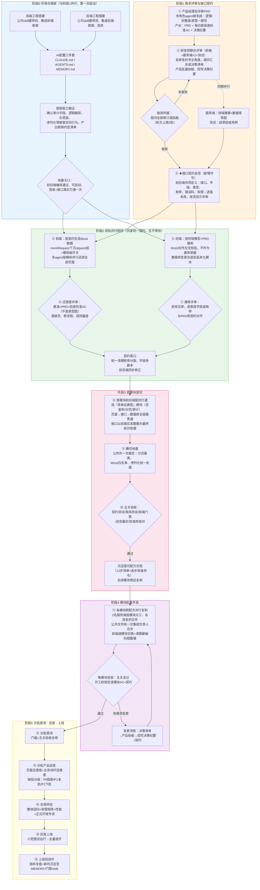
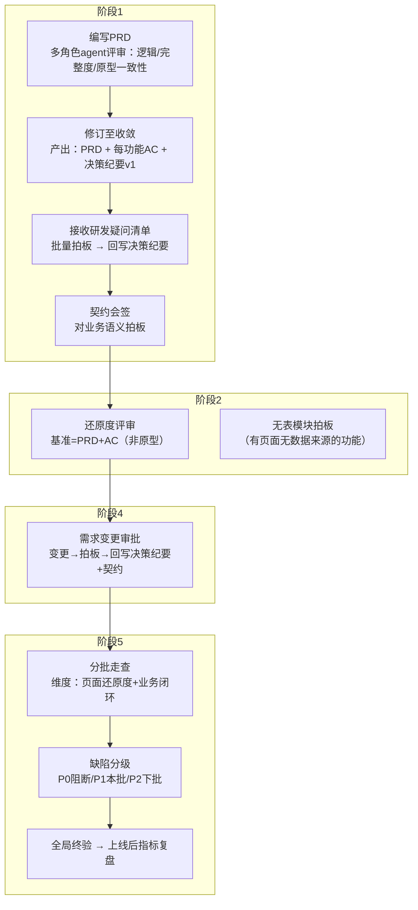
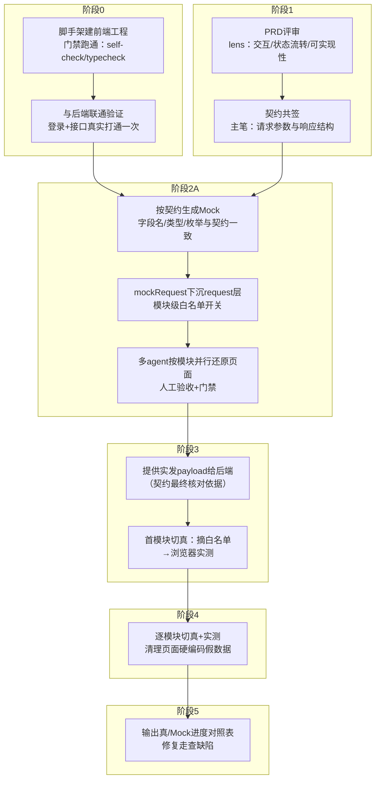
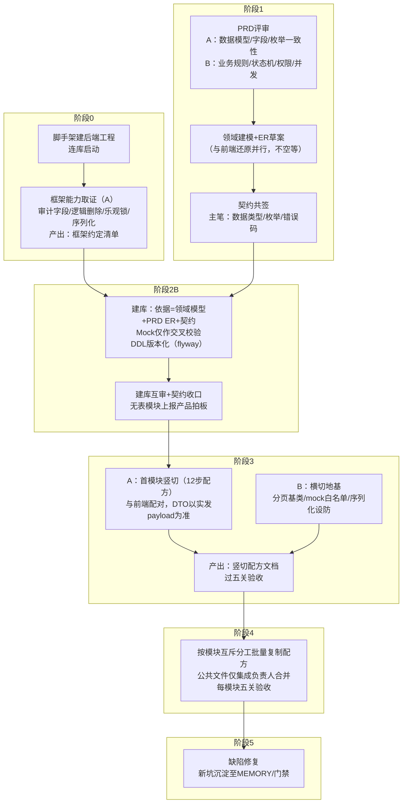
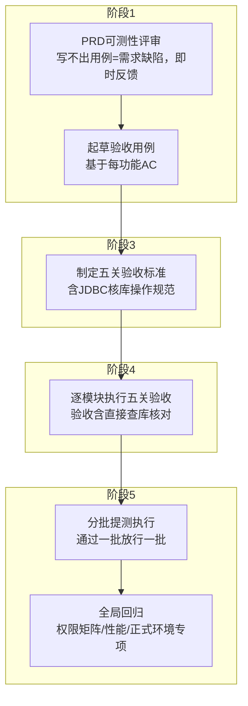

# AI 提效协同开发模式：岗位作业说明书

> v4.0 ｜ 2026-07-24 ｜ 适用：前后端分离项目（1 产品 + 1 测试 + 2 服务端 + 1 前端）
> 四角色（产品/架构/前端/服务端）多轮 agent 评审定稿。修正记录见文末附录。

---

## 一、总流程

### 1.1 阶段总览

### 1.2 详细流程图

| 阶段 | 准入条件 | 退出条件（关口） |
|---|---|---|
| 0 环境与框架 | 立项 | 前后端工程编译通过、可启动、登录及接口贯通一次、框架约定清单产出 |
| 1 需求与契约 | PRD 初稿 | 评审问题全部闭环（修订或拍板）、AC 齐备、接口契约三方会签 |
| 2 Mock 还原 ∥ 建库 | 契约签署 | 全页面 Mock 可演示、还原度评审通过；DDL 评审通过、契约收口完成 |
| 3 首模块竖切 | 阶段 2 双轨完成 | 五关验收通过、竖切配方文档产出 |
| 4 批量开发 | 配方产出 | 每模块五关验收逐一通过 |
| 5 提测上线 | 首批模块验收通过 | 分批走查闭环、全局回归通过、灰度上线 |

---

## 二、术语注解

| 术语 | 定义 |
|---|---|
| **接口契约** | 前后端会签的接口定义文档：URL/method、请求参数、响应结构、字段类型（含 Long→String 策略）、枚举全集、null 策略、日期格式、错误码、权限。全项目唯一数据源（SSOT），Mock 与 DDL 均由其派生，变更须双方评审。 |
| **决策纪要** | 产品维护的拍板台账。所有需求疑问、变更的唯一记录处；未回写决策纪要的口头结论无效。 |
| **AC（验收标准）** | 每个功能"做成什么样算合格"的判定条件，PRD 定稿时同步产出，供还原度评审、测试用例、产品走查共同引用。 |
| **Mock** | 后端就绪前前端使用的模拟数据。须由契约派生；通过 request 层 `mockRequest` 包装 + 模块级白名单开关管理，切真=摘除白名单，页面代码零改动。 |
| **竖切** | 选一个模块从页面→接口→库表全链路打通。首模块竖切产出"配方"（12 步清单+各步验收命令），后续模块按配方复制，任务只写 delta。 |
| **横切地基** | 所有模块共用的公共件（分页基类、mock 白名单注册、序列化统一处理），在首模块竖切后一次性完成，避免逐模块重复踩坑。 |
| **门禁** | 机器自动检查：前端 self-check 0 错 + typecheck 绿；后端 compile 绿 + 测试绿。门禁不过=未完成，人工判断不可替代门禁。 |
| **五关验收** | 模块完成的统一标准：① 离线契约测试绿 ② 真库集成测试绿 ③ 前端门禁 0 错 ④ 浏览器实测正常 ⑤ JDBC 核库（直接查库确认行数与字段值正确，"接口 200 不算数，落库的行才算数"）。 |
| **切真** | 将模块数据源从 Mock 切换为真实接口。三层退场：接口层摘白名单、数据层 Mock 文件保留可回退、页面层清理硬编码假数据。 |
| **契约收口** | 建库落定前，统一清理枚举跨模块分裂、字段多副本、PRD 明文未落地项，前后端同步修正。 |

---

## 三、岗位流程图与作业说明

### 3.1 产品经理

| 步骤 | 作业内容 | 产出物 | 完成标准 |
|---|---|---|---|
| PRD 评审 | 以多角色 agent（逻辑/完整度/原型一致性）并行评审自己的 PRD，逐条修订 | PRD、每功能 AC、决策纪要 v1 | 评审发现全部落入"已修订/已拍板"两档 |
| 答疑拍板 | 研发疑问以"决策清单（含推荐方案）"形式提交，批量书面拍板 | 决策纪要更新 | 无口头结论；疑问清单清零 |
| 契约会签 | 对契约中的业务语义（枚举含义、状态定义、权限归属）拍板 | 契约签署记录 | 三方会签完成 |
| 还原度评审 | 对照 PRD+AC 逐页核对 Mock 页面：缺页/断流程/规则偏差 | 分层结论（硬冲突/缺页/规则偏差/待拍板） | 结论逐条闭环 |
| 分批走查 | 测试放行一批走查一批；业务闭环维度必查（链路级缺失比页面级更高危） | 缺陷清单（分级） | P0 清零方可上线该批 |

---

### 3.2 前端开发

| 步骤 | 作业内容 | 产出物 | 完成标准 |
|---|---|---|---|
| 工程初始化 | 严格按公司 skill 建工程（黑盒不跳步），跑通门禁 | 可启动前端工程 | 门禁 0 错、登录+接口贯通 |
| 契约共签 | 主笔各接口的请求参数、响应结构、分页字段 | 契约文档（前端部分） | 后端会签 |
| Mock 生成 | 由契约派生 Mock，枚举/字段单点定义；`mockRequest(<DTO>, () => 真实请求)` 包装，库保持 real 模式 | Mock 数据 + 模块级白名单 | 契约测试断言 Mock 符合契约 |
| 页面还原 | 按模块分组、多 agent 并行还原；页面代码不感知 mock/real | 全量页面 | 门禁 0 错、全流程可演示 |
| 切真 | 后端每就绪一个模块，摘该模块白名单并实测；专项清理硬编码假数据（写死的下拉项/人员列表/分类 id） | 切真模块 | 浏览器实测正常、无 NaN/空页/Invalid Date |
| 进度对照 | 输出各模块真/Mock 状态表供产品走查 | 进度对照表 | 与白名单状态一致 |

---

### 3.3 服务端开发（2 人，标注 A/B 分工）

| 步骤 | 作业内容 | 产出物 | 完成标准 |
|---|---|---|---|
| 框架取证 | 反编译 starter 确认：审计字段填充、主键策略、逻辑删除语义、乐观锁是否实装、序列化行为；以字节码为准不信文档 | 框架约定清单（入 MEMORY） | 清单覆盖建库/竖切所需全部约定 |
| PRD 评审 | A 查数据模型（字段全集、枚举跨模块一致性）；B 查业务规则（状态机全集与合法迁移、权限模型、并发/幂等、审计与软删语义） | 疑问决策清单 | 疑问全部拍板闭环 |
| 契约共签 | 主笔字段类型策略、枚举全集、null 策略、错误码 | 契约文档（后端部分） | 前端会签 |
| 建库 | 权威源排序：领域模型+PRD ER+契约 ＞ 契约收口校验 ＞ Mock 样本；DDL 全部走版本化脚本 | DDL 脚本 + ER 图 | 互审通过、编译绿、契约收口完成 |
| 竖切/地基 | A 打首模块（契约→DDL→DAO→DTO/VO→Convert→测试→Controller）；B 做公共件；**公共文件不并行改** | 竖切配方文档 | 五关验收通过 |
| 批量复制 | 模块级文件互斥分工；公共文件增量回传集成负责人统一合并跑门禁 | 各模块代码 | 每模块五关验收 |

---

### 3.4 测试工程师

| 步骤 | 作业内容 | 产出物 | 完成标准 |
|---|---|---|---|
| 可测性评审 | 对 PRD 逐功能试写用例，不可测项（条件缺失、结果不明确、规则矛盾）反馈产品 | 可测性问题清单 | 问题全部闭环 |
| 用例起草 | 基于 AC 编写验收用例与边界用例 | 用例库 v1 | 覆盖全部 AC |
| 验收标准 | 与研发共同定义五关验收操作规范；聚合统计类模块（看板/报表）排入最后批次（依赖上游真数据） | 五关验收规范 | 各关有明确操作命令与判定 |
| 模块验收 | 每模块执行五关；置空/更新类操作必须 JDBC 核库 | 验收记录 | 五关全绿 |
| 全局回归 | 权限矩阵逐角色验证、性能抽查、正式环境专项（仅生产环境暴露的问题） | 回归报告 | 阻断项清零 |

---

## 四、协作规则（全岗位）

1. **两个唯一数据源**：需求口径以决策纪要为准，数据口径以接口契约为准；未回写文档的结论无效。
2. **门禁即完成标准**：门禁不过=未完成；模块完成=五关验收全绿。
3. **评审收敛规则**：每次 agent 评审须定义输入、输出物、收敛判据；轮次上限 2；发现只允许两种去向——修订或拍板。
4. **变更单一入口**：需求/契约变更走"决策清单→产品拍板→回写决策纪要与契约→关联方同步修正"，禁止口头变更。
5. **并行边界**：agent 可并行产出，人的拍板/裁决/合并为串行节点，须计入排期；公共文件禁止并行修改。
6. **资产沉淀**：每次排障、每个模块切真后，新增约定与坑固化至 MEMORY/门禁/skill。

---

## 附录 A：相对原始草案的修正记录（评审追溯用）

| 原草案 | 问题（级别/提出角色） | 修正 |
|---|---|---|
| 前端单独评审 PRD | P0：状态机/一致性/权限缺服务端视角（四方一致） | 前端+服务端×2+测试联合多 lens 评审 |
| 无接口契约环节 | P0：Mock 承载不了类型/枚举/null 策略（架构/前端/服务端） | 新增契约会签环节，契约=SSOT |
| 照 Mock 建库 | P0：视图数据反推领域模型（服务端/架构/前端） | 建库权威=领域模型+PRD ER+契约 |
| 照页面组织服务端逻辑 | P0：页面表达不出业务规则（服务端） | 逻辑源自 PRD、结构源自 DDL、接口源自契约 |
| "多轮评审以此类推" | P0：无收敛标准（四方一致） | 评审收敛规则（协作规则第 3 条） |
| Mock 与切真无架构衔接 | P0：切真=逐页重写（前端） | mockRequest 下沉 + 模块级白名单 |
| 提测全部完成后才走查 | P0：与分批提测矛盾（产品） | 分批提测→分批走查 |
| 后端竖切与前端打磨分离 | P1：契约中间漂移（前端） | 合并为前后端配对竖切 |
| 无横切地基 | P1：公共坑逐模块重复（架构/前端/服务端） | 竖切后一次性完成公共件 |
| 竖切选"最简单"模块 | P2：沉淀不出配方（产品） | 改选"简单且典型"（含鉴权/分页/审计） |
| 双后端分工未定义 | P1：公共文件并发冲突（服务端/架构） | 文件互斥+中心化合并 |
| 测试仅在提测出现 | P1：测试右移（四方一致） | 测试左移至 PRD 评审 |
| 服务端前期无产出 | P1：早期闲置（服务端/前端） | 并行做建模/契约/框架取证 |
| 上线即终点 | P2：无灰度无度量（产品/架构） | 灰度+上线后指标复盘+资产沉淀 |
| 无分支/门禁/环境策略 | P1（架构） | 阶段 0 锁定环境；验收挂门禁 |

## 附录 B：竖切配方 12 步（首模块填实各步验收命令）

1. 契约核对（以前端实发 payload 为准）
2. DDL/实体（对齐框架约定清单）
3. DAO 层
4. DTO/VO（类型策略按契约）
5. Convert 层
6. Convert 离线契约测试（断言键名风格/日期格式/关键 key 恒在）
7. ErrorCode 定义
8. Service 层（业务规则以 PRD 为权威）
9. Service 单测
10. Controller 层（权限 fail-closed）
11. 真库集成测试（隔离标签；类名规约防假绿）
12. 前端切真 → 浏览器实测 → JDBC 核库

## 附录 C：技术设防清单（服务端/前端共用）

- 序列化三坑：分页 total 转字符串（前端 `Number()` 兜底）；NON_NULL 丢 key（断言关键 key 恒在）；LocalDateTime 带 `'T'`（VO 级统一日期格式）
- Mock 开关：模块级白名单，禁全局单布尔（未就绪模块 404 风暴）
- 置空字段：注意 ORM 对 null 的静默跳过策略，DO 显式声明更新策略
- 权限：统一认证无业务角色时查本地角色表、fail-closed；异常抛框架可识别类型
- 框架宣称能力（乐观锁等）：以字节码取证为准，缺则业务侧自补
- 环境：API 地址⇄context-path⇄代理三者成对锁定；确认连本地而非测试环境
