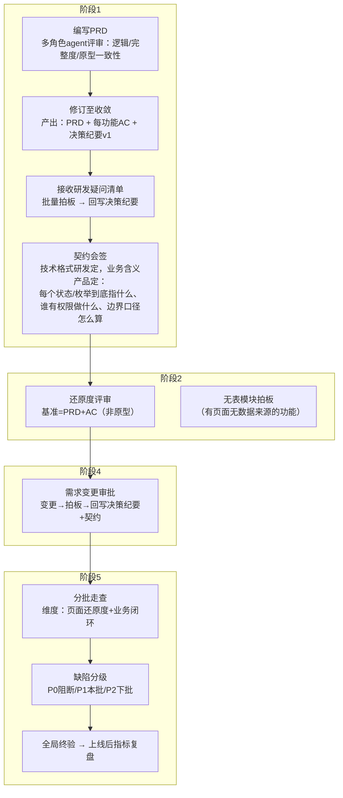
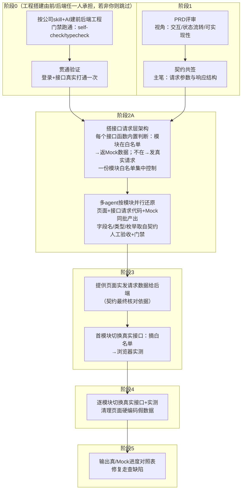
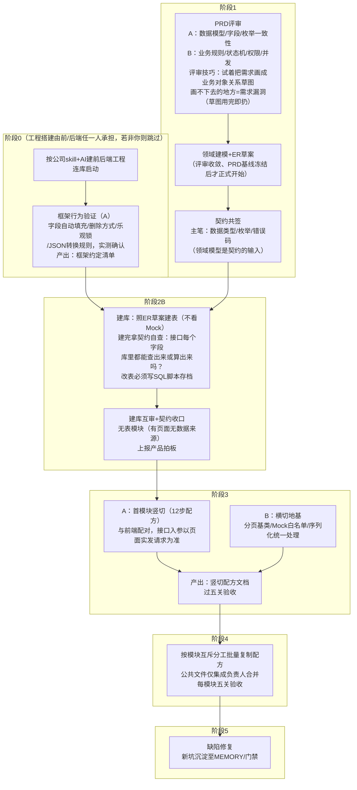
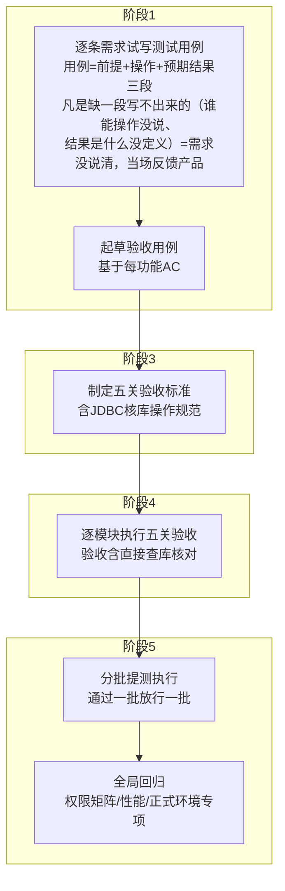

# AI 提效协同开发模式：岗位作业说明书

> v4.0 ｜ 2026-07-24 ｜ 适用：前后端分离项目（1 产品 + 1 测试 + 2 服务端 + 1 前端）
> 四角色（产品/架构/前端/服务端）多轮 agent 评审定稿。
> 文末附录为选读，有需要再看，不影响正文理解：**附录 A《竖切配方 12 步》**——服务端做首模块竖切时对照使用；**附录 B《完整作业示例》**——以"商机认领"为例演示从需求到建库评审的每步产出物，各岗位第一次执行流程时参考。

---

## 一、总流程

### 1.1 阶段总览


### 1.2 详细流程图

```mermaid
flowchart TD
    subgraph PH0["阶段0 环境与框架（与阶段1并行，第一天启动）"]
        A1["工程搭建（前/后端任一名工程师执行，无须分工）<br/>按公司skill+AI辅助建项目<br/>拉取集成前后端框架、连库"]
        A1 --> A2["AI配置三件套<br/>CLAUDE.md / AGENTS.md / MEMORY.md"]
        A2 --> A3["框架行为验证（不轻信文档，实测+反编译确认）<br/>创建人/创建时间等字段框架会自动填吗？<br/>删除是真删还是标记删？乐观锁真的装了吗？<br/>接口返回JSON的字段名/类型转换规则是什么？<br/>产出：框架约定清单（全组开发遵循）"]
        A3 --> A4{"环境验收关口：<br/>前后端编译通过、可启动、<br/>登录+接口真实打通一次"}
    end

    subgraph PH1["阶段1 需求评审与接口契约"]
        B1["① 产品经理自评审PRD<br/>多角色agent评审：逻辑/完整度/原型一致性<br/>产出：PRD + 每功能验收标准AC + 决策纪要"]
        B1 --> B2["② 研发侧联合评审（前端+服务端×2+测试）<br/>各审各的专业角度，疑问汇总成决策清单<br/>产品批量拍板、回写决策纪要"]
        B2 --> B3{"收敛判据：<br/>疑问全部修订或拍板<br/>（轮次上限2轮）"}
        B3 -->|未收敛| B2
        B3 -->|收敛，PRD基线冻结| B5["服务端：领域建模+ER草案<br/>（基于冻结后的PRD基线，作为契约的输入）<br/>测试：基于AC起草验收用例"]
        B5 --> B4["③ ★接口契约会签（新增环节）<br/>前后端共同定义：接口、字段、类型、<br/>枚举、错误码、权限；进版本库，改须双方评审"]
    end

    subgraph PH2["阶段2 双轨并行制作（共享同一契约，互不等待）"]
        C1["④ 前端：多agent按模块并行还原<br/>页面+接口请求代码+Mock数据同批产出<br/>页面样式看原型，字段名/类型/枚举均取自契约<br/>（接口函数内置Mock/真实切换，按模块白名单控制）"]
        C2["⑤ 后端：照ER草案建数据库表<br/>（不看Mock、不看页面）<br/>建完拿契约逐接口自查：接口要返回的<br/>每个字段，库里都能查出来或算出来吗？<br/>改表必须写SQL脚本入库存档，可追溯可回滚"]
        C1 --> C3{"⑥ 还原度评审：<br/>基准=PRD+验收标准AC（不是原型图）<br/>查缺页、断流程、规则偏差"}
        C2 --> C4{"⑦ 建库评审：<br/>研发互审，逐表逐字段逐枚举<br/>与PRD和契约对齐"}
        C3 --> C5["契约收口：清理三类不一致<br/>①同一枚举在不同模块取值不同<br/>②同一字段/字典在多处各自定义、写法不一<br/>③PRD明文要求但两端都没落地<br/>前后端同步修正"]
        C4 --> C5
    end

    subgraph PH3["阶段3 首模块竖切"]
        D1["⑧ 首模块前后端配对打通<br/>选『简单且典型』模块（含鉴权/分页/审计）<br/>页面→接口→数据库全链路贯通<br/>接口以前端实发数据为最终核对依据"]
        D1 --> D2["⑨ 横切地基<br/>公共件一次做完：分页基类、<br/>Mock白名单、序列化统一处理"]
        D2 --> D3{"⑩ 五关验收：<br/>契约测试/真库测试/前端门禁<br/>/浏览器实测/查库核对"}
        D3 -->|通过| D4["沉淀竖切配方文档<br/>（12步清单+各步验收命令）<br/>后续模块照此复制"]
    end

    subgraph PH4["阶段4 模块批量开发"]
        E1["⑪ 各模块照配方并行复制<br/>2名服务端按模块分工、各改各的文件<br/>公共文件统一交集成负责人合并<br/>（该角色由服务端一人兼任）<br/>前端逐模块切换真实接口+清理硬编码假数据"]
        E1 --> E2{"每模块验收：五关全过<br/>开工前锁定该模块AC+契约"}
        E2 -->|有需求变更| E3["变更流程：决策清单<br/>→产品拍板→回写决策纪要+契约"]
        E3 --> E1
    end

    subgraph PH5["阶段5 分批提测 · 走查 · 上线"]
        F1["⑫ 分批提测<br/>门槛=五关验收全绿"]
        F1 --> F2["⑬ 分批产品走查<br/>页面还原度+业务闭环双维度<br/>缺陷分级：P0阻断/P1本批/P2下批"]
        F2 --> F3["⑭ 全局终验<br/>整体回归+权限矩阵+性能+正式环境专项"]
        F3 --> F4["⑮ 灰度上线<br/>小范围试运行→全量放开"]
        F4 --> F5["⑯ 上线后闭环<br/>指标复盘+新坑沉淀至MEMORY/门禁/skill"]
    end

    A4 --> C1
    A4 --> C2
    B4 --> C1
    B4 --> C2
    C5 --> D1
    D4 --> E1
    E2 -->|通过| F1

    style PH0 fill:#e8f4fd,stroke:#2196f3
    style PH1 fill:#fff3e0,stroke:#ff9800
    style PH2 fill:#e8f5e9,stroke:#4caf50
    style PH3 fill:#fce4ec,stroke:#e91e63
    style PH4 fill:#f3e5f5,stroke:#9c27b0
    style PH5 fill:#fffde7,stroke:#fbc02d
```



| 阶段 | 准入条件 | 退出条件（关口） |
|---|---|---|
| 0 环境与框架 | 立项 | 前后端工程编译通过、可启动、登录及接口贯通一次、框架约定清单产出 |
| 1 需求与契约 | PRD 初稿 | 评审问题全部闭环（修订或拍板）、AC 齐备、接口契约三方会签 |
| 2 Mock 还原 ∥ 建库 | 契约签署 | 全页面 Mock 可演示、还原度评审通过；建库评审通过、契约收口完成 |
| 3 首模块竖切 | 阶段 2 双轨完成 | 五关验收通过、竖切配方文档产出 |
| 4 批量开发 | 配方产出 | 每模块五关验收逐一通过 |
| 5 提测上线 | 首批模块验收通过 | 分批走查闭环、全局回归通过、灰度上线 |

---

## 二、术语注解

| 术语 | 定义 |
|---|---|
| **接口契约** | 前后端会签的接口定义文档：URL/method、请求参数、响应结构、字段类型（含 Long→String 策略）、枚举全集、null 策略、日期格式、错误码、权限。全项目唯一数据源（SSOT，同一信息只有这一份权威定义），前端 Mock 与后端接口出入参对象（DTO）均由其派生（数据库表则依据领域模型设计，契约仅作核对清单），变更须双方评审。 |
| **决策纪要** | 产品维护的拍板台账。所有需求疑问、变更的唯一记录处；未回写决策纪要的口头结论无效。 |
| **领域建模** | 把 PRD 的文字需求整理成"业务对象清单"：有哪些业务对象、各有什么属性、对象间什么关系、状态如何流转。只依赖冻结后的 PRD，不依赖页面和接口——数据库结构取决于业务本身，不取决于展示方式。 |
| **ER 草案** | 领域模型翻译成的库表结构草图：对象→表、属性→字段、多对多→关联表、状态→枚举。是契约会签的输入；阶段 2 正式建库时定稿（字段类型细节、索引在建库时补齐）。 |
| **AC（验收标准）** | 每个功能"做成什么样算合格"的判定条件，PRD 定稿时同步产出，供还原度评审、测试用例、产品走查共同引用。 |
| **Mock** | 后端就绪前前端使用的模拟数据。与页面代码同批产出：结构与字段名照契约、值为样例数据——页面和 Mock 各自锚定契约，因而天然匹配，不存在"谁先谁后"。通过 request 层 `mockRequest` 包装 + 模块级白名单开关管理，切换真实接口=摘除白名单，页面代码零改动。Mock 只服务前端，后端建库与验证均不使用 Mock。 |
| **唯一对齐面** | 前后端只在接口边界对齐（由契约约束出入参的字段名/类型/枚举）。库表结构是后端内部实现，由 Convert 层负责库表↔接口的映射；页面结构是前端内部实现。库表与页面互不约束，不要求一致。 |
| **字段覆盖度核对** | 后端建库完成后的核对动作：以契约为清单，逐接口检查出参的每个字段在库中有直接列或可计算来源（如"最近跟进时间"须可由跟进记录表算出）。核对的依据是契约，不是 Mock。 |
| **DDL / DTO / VO / DAO / Convert** | 后端常用缩略语：DDL=建表脚本；DTO=接口出入参对象；VO=返回给前端的视图对象；DAO=数据库访问层；Convert=库表数据↔接口数据的转换层（联表拼名称、类型转换都在这层做）。 |
| **竖切** | 选一个模块从页面→接口→库表全链路打通。首模块竖切产出"配方"（12 步清单+各步验收命令），后续模块按配方复制，任务只写增量差异（delta）。 |
| **横切地基** | 所有模块共用的公共件（分页基类、mock 白名单注册、序列化统一处理），在首模块竖切后一次性完成，避免逐模块重复踩坑。 |
| **门禁** | 机器自动检查：前端 self-check 0 错 + typecheck 绿；后端 compile 绿 + 测试绿。门禁不过=未完成，人工判断不可替代门禁。 |
| **五关验收** | 模块完成的统一标准：① 离线契约测试绿 ② 真库集成测试绿 ③ 前端门禁 0 错 ④ 浏览器实测正常 ⑤ JDBC 核库（直接查库确认行数与字段值正确，"接口 200 不算数，落库的行才算数"）。 |
| **切换真实接口** | 将模块数据源从 Mock 切换为真实接口。三层退场：接口层摘白名单、数据层 Mock 文件保留可回退、页面层清理硬编码假数据。 |
| **契约收口** | 建库落定前的统一清理，专治三类不一致：① 同一枚举在不同模块取值不同（如商机状态 A 页面用 `archived`、B 页面用 `expired`）；② 同一字段/字典在多处各自定义、写法不一（如 `5G模组` 与 `5G 模组`）；③ PRD 明文要求但两端都没落地的项。清理结果前后端同步修正。 |

---

## 三、岗位流程图与作业说明

### 3.1 产品经理



| 步骤 | 作业内容 | 产出物 | 完成标准 |
|---|---|---|---|
| PRD 评审 | 以多角色 agent（逻辑/完整度/原型一致性）并行评审自己的 PRD，逐条修订 | PRD、每功能 AC、决策纪要 v1 | 评审发现全部落入"已修订/已拍板"两档 |
| 答疑拍板 | 研发疑问以"决策清单（含推荐方案）"形式提交，批量书面拍板 | 决策纪要更新 | 无口头结论；疑问清单清零 |
| 契约会签 | 回答契约里的"业务含义"问题并拍板：每个状态/枚举到底指什么（"已关闭"和"已下架"的区别）、谁有权限做什么（下架权归谁）、边界口径怎么算（金额含不含税）——技术格式不用管，研发定 | 契约签署记录 | 三方会签完成 |
| 还原度评审 | 对照 PRD+AC 逐页核对 Mock 页面：缺页/断流程/规则偏差 | 分层结论（硬冲突/缺页/规则偏差/待拍板） | 结论逐条闭环 |
| 分批走查 | 测试放行一批走查一批；业务闭环维度必查（链路级缺失比页面级更高危） | 缺陷清单（分级） | P0 清零方可上线该批 |

---

### 3.2 前端开发



| 步骤 | 作业内容 | 产出物 | 完成标准 |
|---|---|---|---|
| 工程初始化 | 由前/后端任一名工程师按公司 skill+AI 辅助建前后端工程（黑盒不跳步，无须分工），跑通门禁 | 可启动的前后端工程 | 门禁 0 错、登录+接口贯通 |
| 契约共签 | 主笔各接口的请求参数、响应结构、分页字段（依据：原型 + PRD + 领域模型） | 契约文档（前端部分） | 后端会签 |
| 接口请求层架构 | 第一天就按"将来要接真实接口"的结构写：每个接口函数内置一层判断——该模块在 Mock 白名单里就返回 Mock 数据，不在就发真实请求，写法如 `mockRequest('模块名', Mock数据, () => 真实请求)`；用一份模块白名单集中控制哪些模块走 Mock，不开请求库的全局 Mock 模式 | 接口请求层骨架 | 后端每做好一个模块，把它从白名单删掉即完成切换，页面代码一行不改 |
| 页面还原 | 按模块分组、多 agent 并行还原；每模块的页面、接口请求代码、Mock 数据同批产出——页面样式看原型，字段名/类型/枚举取自契约（页面与 Mock 各自锚定契约，天然匹配）；枚举/字段单点定义；页面代码不感知 mock/real | 全量页面 + 各模块 Mock | 门禁 0 错、契约测试断言 Mock 符合契约、全流程可演示 |
| 切换真实接口 | 后端每就绪一个模块，摘该模块白名单并实测；专项清理硬编码假数据（写死的下拉项/人员列表/分类 id） | 已接真实接口的模块 | 浏览器实测正常、无 NaN/空页/Invalid Date |
| 进度对照 | 输出各模块真/Mock 状态表供产品走查 | 进度对照表 | 与白名单状态一致 |

---

### 3.3 服务端开发（2 人，标注 A/B 分工）



| 步骤 | 作业内容 | 产出物 | 完成标准 |
|---|---|---|---|
| 框架行为验证 | 反编译框架组件包（starter）逐项确认：创建人/时间等字段是否自动填充、主键生成策略、删除是真删还是标记删、乐观锁是否真的装了、返回 JSON 的字段名/类型转换规则；以实测结果为准，不信文档 | 框架约定清单（入 MEMORY） | 清单覆盖建库/竖切所需全部约定 |
| PRD 评审 | A 查数据模型（字段全集、枚举跨模块一致性）；B 查业务规则（状态机全集与合法迁移、权限模型、并发/幂等（同一操作重复执行结果不变）、审计与软删语义）。评审技巧：试着把需求画成"业务对象+关系"草图，哪里画不下去（状态说不清、关系对不上）哪里就是需求漏洞，当场提给产品；草图用完即扔，不是交付物，正式建模等基线冻结后再做 | 疑问决策清单 | 疑问全部拍板闭环 |
| 领域建模 | 评审收敛、PRD 基线冻结后正式建模：实体/关系/状态机/枚举定稿，形成 ER 草案，作为契约会签的输入 | 领域模型 + ER 草案 | 与冻结版 PRD 逐项对应，无悬空实体 |
| 契约共签 | 主笔字段类型策略、枚举全集、null 策略、错误码 | 契约文档（后端部分） | 前端会签 |
| 建库 | 依据=领域模型+ER 草案（不照 Mock、不照页面建表）；建库完成后以契约为清单逐接口做字段覆盖度核对（出参每个字段在库中有直接列或可计算来源）；建表脚本（DDL）全部版本化管理 | DDL 脚本 + ER 图 + 覆盖度核对记录 | 互审通过、编译绿、覆盖度核对无缺口、契约收口完成 |
| 竖切/地基 | A 打首模块（契约→DDL→DAO→DTO/VO→Convert→测试→Controller）；B 做公共件；**公共文件不并行改** | 竖切配方文档 | 五关验收通过 |
| 批量复制 | 模块级文件互斥分工；公共文件增量回传集成负责人统一合并跑门禁 | 各模块代码 | 每模块五关验收 |

---

### 3.4 测试工程师



| 步骤 | 作业内容 | 产出物 | 完成标准 |
|---|---|---|---|
| 可测性评审 | 对 PRD 逐功能试写测试用例（用例=前提+操作+预期结果三段）；凡是缺一段写不出来的——谁能操作没说、失败算什么没定义、预期结果说不清、两条规则互相矛盾——就是需求没说清楚，当场反馈产品补充 | 可测性问题清单 | 问题全部闭环 |
| 用例起草 | 基于 AC 编写验收用例与边界用例 | 用例库 v1 | 覆盖全部 AC |
| 验收标准 | 与研发共同定义五关验收操作规范；聚合统计类模块（看板/报表）排入最后批次（依赖上游真数据） | 五关验收规范 | 各关有明确操作命令与判定 |
| 模块验收 | 每模块执行五关；置空/更新类操作必须 JDBC 核库 | 验收记录 | 五关全绿 |
| 全局回归 | 权限矩阵逐角色验证、性能抽查、正式环境专项（仅生产环境暴露的问题） | 回归报告 | 阻断项清零 |

---

## 四、协作规则（全岗位）

1. **两个唯一数据源**：需求口径以决策纪要为准，数据口径以接口契约为准；未回写文档的结论无效。
2. **门禁即完成标准**：门禁不过=未完成；模块完成=五关验收全绿。
3. **评审收敛规则**：每次 agent 评审须定义输入、输出物、收敛判据；轮次上限 2；发现只允许两种去向——修订或拍板。
4. **变更单一入口**：需求/契约变更走"决策清单→产品拍板→回写决策纪要与契约→关联方同步修正"，禁止口头变更。
5. **并行边界**：agent 可并行产出，人的拍板/裁决/合并为串行节点，须计入排期；公共文件禁止并行修改。
6. **资产沉淀**：每次排障、每个模块切换真实接口后，新增约定与坑固化至 MEMORY/门禁/skill。

---

## 附录 A：竖切配方 12 步

1. 契约核对（以前端页面实发请求数据为准）
2. DDL/实体（对齐框架约定清单）
3. DAO 层
4. DTO/VO（类型策略按契约）
5. Convert 层
6. Convert 离线契约测试（断言键名风格/日期格式/关键 key 恒在）
7. ErrorCode 定义
8. Service 层（业务规则以 PRD 为权威）
9. Service 单测
10. Controller 层（权限校验 fail-closed：查不到权限即拒绝）
11. 真库集成测试（隔离标签；注意测试类命名规约，防止用例未被执行却显示构建成功）
12. 前端切换真实接口 → 浏览器实测 → JDBC 核库

## 附录 B：完整作业示例——一条需求从 PRD 走到建库评审

> 以"商机认领"为例，演示 需求基线 → 领域建模+ER 草案 → 契约会签 → ④前端还原 → ⑤服务端建库 → ⑦建库评审 的各步产出物（B.0~B.5，按时序）；B.6/B.7 是两个配套实操专题（竖切怎么做、研发联合评审怎么做）。各岗位第一次执行流程时照此对标。

### B.0 输入：冻结后的 PRD 基线（节选）

> **FEAT-03 认领商机**：销售在商机大厅看到"待认领"商机列表（显示标题、客户、行业、预计金额、发布人、发布时间），可认领非自己发布的商机；一个商机同时只能被一人认领，认领后状态变为"跟进中"，列表中不再展示。
> **AC**：① 双人同时认领，只有一人成功，另一人收到明确提示；② 认领自己发布的商机被阻止；③ 认领成功后商机出现在"我的跟进"中。

### B.1 领域建模 + ER 草案（服务端）

**第一步：从 PRD 圈出名词，判定"实体还是属性"**——逐个问一句："它有自己的生命周期和多条记录吗，还是只是别人身上的一个信息？"

| 名词 | 判定 | 理由 |
|---|---|---|
| 商机 | ✅ 实体 | 有创建、流转、结束的完整生命周期 |
| 跟进记录 | ✅ 实体 | 一个商机下有多条，每条独立产生 |
| 产品线 | ✅ 实体（字典类） | 有限集合，被多个商机引用 |
| 客户名称、预计金额 | ❌ 属性 | PRD 没有"管理客户"的需求，只是商机上的字段——**没被要求管理的名词不建表** |

**后续三步**：定属性（每条溯源到 PRD 原文）→ 定关系（1:N 加外键、M:N 建关联表）→ 画状态机（画不下去处=需求缺口）。产出（节选）：

```
实体：商机 opportunity、用户 sys_user（框架已有）
关系：sys_user 1—N opportunity（publisher_id）
      sys_user 1—N opportunity（claimer_id，可空；每个商机至多 1 名认领人）
状态机全集（5 态，完整迁移表见 B.2 枚举字典）：
        pending / following / won / closed / removed
        本需求 FEAT-03 触发的迁移：pending → following（认领）
        约束：同一商机只能有一个 claimer（并发互斥 → 建库时落实现）
属性溯源：标题/客户/行业/预计金额/发布人 ← FEAT-03 第一句
          claim_time ← AC③（"我的跟进"按认领时间排，PRD 隐含）
疑问清单（交产品拍板）：认领后能否取消认领？→ 拍板：本期不做
```

要点：每个属性必须溯源到 PRD 原文（拦 AI 幻觉）；建不下去的地方上报拍板，禁止自己猜。

### B.2 契约会签（前后端共签，节选）

```markdown
## OPP-02 待认领商机列表
GET /api/v1/opportunities?status=pending&page_num=1&page_size=20
响应 data：{ total: number, list: [ { id: string, title: string,
  customer_name: string, industry: string, expect_amount: string,
  publisher_name: string, publish_time: string(datetime) } ] }

## OPP-03 认领商机
POST /api/v1/opportunities/{id}/claim
响应 data：{ id: string, status: enum:opportunity_status, claim_time: string }
错误码：40302 已被他人认领 ｜ 40303 不能认领自己发布的 ｜ 40404 不存在或已下架
```

契约由三部分组成，缺一不可。上面 OPP-02/03 是第三部分"逐接口块"的节选，另两部分样例：

**第一部分：全局约定**（写一次管所有接口，专治联调最常撞的类型/格式问题）：

```markdown
- 字段命名：snake_case（下划线，如 customer_name）
- ID：库里是 bigint，出参一律转 string（防前端数字精度丢失）
- 金额：出参 string、单位元、两位小数；时间："yyyy-MM-dd HH:mm:ss"（不带'T'）
- 分页：入参 page_num/page_size（上限100）；出参 { total, list }，total 必须是数字
- 空值：约定过的字段永远出现，无值给 null（禁止整个 key 消失）
```

**第二部分：枚举字典**（全项目唯一定义处，前端 Mock、后端枚举类、测试断言都抄这里，谁都不许自己再定义一份）：

```markdown
### opportunity_status 商机状态
| 值        | 含义   | 可迁移到 |
| pending   | 待认领 | following / removed |
| following | 跟进中 | won / closed / removed |
| won       | 已成交 | removed |
| closed    | 已关闭 | pending（重新开放）/ removed |
| removed   | 已下架 | （终态） |
```

三部分签署后 ④⑤ 同一天开工，互不再等。

**接口清单从哪来（没有页面代码时的推导四步法）**——输入是原型+PRD+领域模型，不需要已还原的页面：

1. **从原型推"读"接口**：逐页面问"这块数据谁供给"——列表页→分页查询、详情页→详情接口、下拉框→字典接口
2. **从 PRD 动词和 AC 推"写"接口**：每个用户动作动词（发布/认领/下架）=一个命令接口
3. **从状态机核对**：每条状态迁移边必须有触发它的接口；找不到的（如"已成交"没写谁在哪操作）=需求缺口，报产品拍板
4. **从领域模型查漏**：每个实体过一遍增删改查（CRUD），缺的确认"本期不做"记入决策纪要，不默默漏掉

实操中四步由 agent 执行（喂原型+PRD+领域模型，产出接口目录初稿），前端核"原型每块数据有接口供数"，后端核"每个接口领域模型撑得住"。**会签内部工序：推目录 → 逐接口填字段细节（业务字段在此落定）→ 双方核对签署**。三小步全部完成才算会签完毕；④⑤ 开工时拿到的是"全局约定+枚举字典+逐接口块"三部分俱全的字段级契约，不是只有目录。④ 还原时发现缺接口属正常，走契约变更（双方确认、版本+1）——契约先行要求"90% 提前锁定+10% 变更受控"，不是零遗漏。

### B.3 第④步：前端作业（页面+接口请求代码+Mock 同批产出）

**（a）Mock 数据**——结构照契约"响应 data"，值为样例：

```ts
// mock/opportunity.ts
export const mockOpportunityList = {
  total: 2,
  list: [
    { id: "1001", title: "某车企5G模组需求", customer_name: "XX汽车",
      industry: "车载", expect_amount: "500000.00",
      publisher_name: "张三", publish_time: "2026-07-20 10:30:00" },
  ]
}
```

**（b）接口请求代码（api 层）**——mockRequest 包装，库保持 real 模式，模块级白名单：

```ts
// api/opportunity.ts
export const fetchOpportunityList = (params) =>
  mockRequest('opportunity',                    // 模块级白名单 key
    mockOpportunityList,                        // 后端未就绪 → 返回 Mock
    () => http.get('/api/v1/opportunities', { params }))  // 就绪后走真接口

export const claimOpportunity = (id, remark) =>
  mockRequest('opportunity',
    { id, status: 'following', claim_time: '2026-07-21 09:00:00' },
    () => http.post(`/api/v1/opportunities/${id}/claim`, { remark }))
```

**（c）页面**——只认契约字段名，不感知数据真假；失败分支按契约错误码给提示（40302→"该商机已被认领"，40303→"不能认领自己发布的商机"）。

此时产品即可在浏览器走查完整流程（列表→认领→我的跟进），虽然数据全是 Mock。

**Mock 的组织方式：实体池+接口视图**——同一实体的样例值只在实体池定义一次，各接口 Mock 从池里过滤出自己的视图（大厅列表=`filter(status==='pending')`、我的跟进=`filter(claimer_id===当前用户)`），防止同一商机在列表页与详情页字段值不一致，还可低成本模拟跨页联动（认领时改池内 status）。**边界**：Mock 只保证结构一致（字段/类型/枚举照契约），不保证行为一致——写操作不持久化、并发互斥不做真实模拟，AC 里的并发类用例（如"双人同时认领仅一人成功"）Mock 阶段验不了，留竖切阶段用真库验；产品走查 Mock 页面验"页面全不全、流程点得通"，不验数据联动与并发。

**接口请求代码的职责边界**——只做接口请求层：拼 URL、组入参、发请求/返 Mock、轻量展示适配（`Number(total)` 兜底、日期格式化）。跨表数据组装（如联查 sys_user 得 publisher_name）是服务端 Convert/Service 层职责；若前端发现需要把多个接口数据融合成新业务对象，说明契约缺一个聚合接口——回头改契约，不在前端拼。

### B.4 第⑤步：服务端作业（照 ER 建库，不看 Mock、不看页面）

**分表不依据契约，依据 ER 草案**。⑤ 的本质是"ER 草案 → 正式 DDL"的机械翻译，六条规则：

| ER 草案元素 | 落库规则 | 本例 |
|---|---|---|
| 实体 | 一实体一表 | 商机→opportunity |
| 1:N 关系 | N 方加外键列 | 跟进记录表加 opportunity_id |
| 1:0..1 关系 | 加可空外键列 | 商机表加 claimer_id NULL |
| M:N 关系 | 单独建关联表 | opportunity_product_line |
| 字典类实体 | 字典表 | product_line |
| 状态机 | status 列，取值=枚举字典 | status DEFAULT 'pending' |

再叠加框架约定清单（阶段 0 框架行为验证的产出）：审计四件套、deleted、雪花 ID；并发写的表补 version。

**契约在 ⑤ 只当核对清单用，三个用途**：① 类型映射核对（契约 string(元) ↔ 库 DECIMAL，差异记入 Convert 任务）；② **推索引**——查询接口的入参就是访问路径（按 status 查列表→idx_status，按 claimer 查→idx_claimer）；③ 字段覆盖度核对（见下文 b）。

**业务逻辑的组织**：库里只放结构/约束/索引（不用触发器、存储过程）；业务规则放 Service 层，**从 AC 逐条翻译**：AC①并发互斥→条件更新（`UPDATE ... WHERE status='pending' AND claimer_id IS NULL`，影响行数=0 抛 40302）；AC②→Service 校验 publisher_id 抛 40303；状态迁移合法性→统一按枚举字典迁移表校验。Convert 层放库表↔契约的形态转换（DECIMAL→string、联查拼 publisher_name、Long→String）。

**（a）版本化 DDL**——照 ER 草案 + 框架约定清单：

```sql
-- V2__create_opportunity.sql
CREATE TABLE opportunity (
  id            BIGINT PRIMARY KEY,               -- 雪花ID（框架约定）
  title         VARCHAR(100) NOT NULL,
  customer_name VARCHAR(100) NOT NULL,
  industry      VARCHAR(50),
  expect_amount DECIMAL(12,2),
  description   TEXT,
  status        VARCHAR(20) NOT NULL DEFAULT 'pending',
  publisher_id  BIGINT NOT NULL,
  claimer_id    BIGINT NULL,
  claim_time    DATETIME NULL,
  version       INT NOT NULL DEFAULT 0,           -- 通用乐观锁（并发写保护）
  create_time   DATETIME, create_by BIGINT,       -- 审计四件套（框架约定）
  update_time   DATETIME, update_by BIGINT,
  deleted       CHAR(1) NOT NULL DEFAULT 'N',     -- 逻辑删除（框架约定）
  KEY idx_status (status), KEY idx_claimer (claimer_id)
);
```

注意 `version` 字段：它不来自契约也不来自页面——AC①"双人同时认领只有一人成功"提示这张表存在并发写，因此按框架约定补充通用乐观锁字段（认领互斥本身由 Service 层条件更新实现，见 B.4 开头的 AC 翻译表）。**业务规则源自 PRD 的具体体现：照 Mock 建表永远不会出现这个字段。**

**（b）字段覆盖度核对**——以契约为清单逐字段找库内来源：

| 契约字段 | 库内来源 | 结论 |
|---|---|---|
| list[].title / customer_name / … | opportunity 直接列 | ✅ |
| list[].publisher_name | 库里只有 publisher_id，名字在 sys_user | ✅ 可计算（联查），记入 Convert 层任务 |
| claim 响应 claim_time | opportunity.claim_time | ✅ |

### B.5 第⑦步：建库评审（研发互审 + agent 辅助）

**输入**：DDL 脚本 + ER 草案 + 契约 + 冻结 PRD。**做法**：未参与建库的另一名服务端发起多角色 agent 评审，三个清单跑完人裁决：

| 核对项 | 方法 | 本例中典型会抓到的问题 |
|---|---|---|
| 逐表对 PRD/ER | 每张表指回实体，每个实体有表 | 若商机表里出现 `product_lines JSON` 字段 → 打回：M:N 须按 ER 建 `opportunity_product_line` 关联表（JSON 走不了索引反查） |
| 逐字段对契约 | 复查覆盖度核对表 + 类型核对 | `expect_amount` 契约出参 string(元)、库为 DECIMAL → 确认 Convert 层负责转换，记录而非改库 |
| 逐枚举对字典 | 库默认值/CHECK 与枚举字典比对 | 若 DDL 写 `DEFAULT 'PENDING'`（大写）而字典为小写 → 打回：枚举分叉零容忍 |

**输出**：评审记录（打回项/记录项）→ 修正后 DDL 复审 → 进入**契约收口**：本轮暴露的契约级问题（如契约漏了"我的跟进"排序所需的 claim_time 字段）统一修订契约、同步前端 Mock——双轨在此对齐后才进入阶段 3 竖切。

**本示例体现的核心机制**：④与⑤全程零沟通却不跑偏——前端只锚契约、后端只锚 ER+PRD，两个锚点在①②③已互相对齐；⑦是开工后第一次交叉核对，专抓"各自正确、合并后不一致"的问题。

### B.6 阶段 3 竖切实操：分工、联调与配方沉淀

**分工**：前后端配对、后端为主力——服务端 A 负责主体实现（接口+测试+配方记录），前端配合契约终核与切换真实接口，服务端 B 同期做横切地基不参与本模块。全程 2~3 天，面对面联调仅约半天。

**第一段：后端独立实现（1~1.5 天，前端无须在场）**
照契约+DDL 自下而上：DAO → DTO/VO → Convert → Service → Controller，每层带测试。Convert 离线契约测试（断言键名为下划线风格（snake_case）、日期无 'T'、关键 key 恒在）就是"模拟前端"的第一道调试——传统联调最易出错的字段名/类型/日期问题在此被测试拦截，这是竖切联调只需半天的原因。结束标志：三层测试全绿。

**第二段：契约终核（半小时，联调前关键动作）**
前端打开 Mock 页面 F12 抓页面实发请求（或给接口请求代码），后端逐字段比对 DTO：实发有 remark 而 DTO 没有→后端补；page_size 撞上限→前端改。判断标准：类型文件与文档都可能与实际不符，页面实发请求不会。

**第三段：切换真实接口联调（半天）**
① 环境先对齐：本地起后端、前端代理指向本地（不是测试环境），此条不确认，后续联调结果全部无效；② 摘该模块 Mock 白名单；③ 浏览器带真实登录态逐条走 AC（认领成功→重复认领应 40302→认领自己的应 40303）；④ 每走一条 JDBC 查库核对（claimer_id 写入了吗、status 变了吗）——页面显示成功不算数。
排障分工：接口 4xx/5xx→后端看日志；200 但页面 NaN/空白→前端查接口请求代码；字段对不上→对契约裁决，谁偏离谁改，契约本身错走变更。

**第四段：配方沉淀（半天，竖切的第二产出物）**

① 边做边记：让 agent 全程记录每步命令与踩坑，结束后由 agent 从会话整理配方初稿、人修订（不要事后凭记忆写）；② 成文入库 `docs/竖切配方.md`，每步三行——做什么、验收命令、踩坑及规避；前端同步沉淀切换真实接口清单（摘白名单步骤、adapter 兜底项、硬编码排查点）；③ 配方评审：服务端 B+前端过一遍，唯一标准="没参与竖切的人能否不问问题照着做完"；④ 用第二个模块验证：由服务端 B（非 A）照配方执行，B 卡壳处即配方待补处，跑通后配方定稿、阶段 4 批量开工。

### B.7 步骤②研发侧联合评审实操：按评审维度分工的五步法

**原则**：AI 多角色解决"一个人如何看得全"，人的分工解决"谁对哪块负责"。四人都让 AI 做全维度评审=四份 80% 重复的清单且无人对遗漏负责，因此按评审维度分工——每人认领一个专业维度并对该维度的遗漏负责，AI 多角色只在自己的维度内使用。

**第 1 步：产品发评审包**（评审前）——候选 PRD+原型+AC+决策清单模板，宣布时间盒（并行评审 1 天、拍板半天）；全员用同一版本。

**第 2 步：四人并行、各评各自认领的维度**（1 天）：

| 岗位 | 负责的评审维度 | agent 可扮演的子角色 |
|---|---|---|
| 前端 | 交互/状态流转/可实现性 | 交互设计师、前端架构、"较真的用户" |
| 服务端 A | 数据模型/字段/枚举一致性 | 数据建模专家、DBA |
| 服务端 B | 业务规则/状态机/权限/并发 | 业务架构师、安全审计 |
| 测试 | 可测性/边界/异常路径 | 测试设计、"破坏性用户" |

两条规矩：① 发现不属于自己维度的问题，附注一行转给对应负责人即可，不展开；② **AI 原始输出必须人筛过才提交**（删幻觉、每条补"PRD 位置+严重度 P0/P1/P2+建议方案"）——给产品的是人确认过的清单，不是 AI 的原始输出。

**第 3 步：整合人合并去重**（半天，建议测试担任）——多人命中同一问题标"高可信"；分三类：a) 笔误→产品直接改；b) 决策项→进决策清单；c) 跨岗位冲突→拉 15 分钟短会。

**第 4 步：产品批量处理**（半天）——a 类修订 PRD；b 类书面批量拍板回写决策纪要；c 类短会当场定。禁止口头答疑，口头结论不进纪要等于没发生。

**第 5 步：二轮复核只看改动点**（半天）——各岗位只核"改动部分+自己提的问题是否解决"，不重新全量评审（这是"轮次上限 2"守得住的原因）。全部问题落入"已修订/已拍板"两档→收敛，基线冻结。

**时间总账**：1+0.5+0.5+0.5 ≈ 2.5 天完成收敛，替代"一场评审会+会后两周陆续返工"。
