# Quectel商机信息发布平台 · 业务流程编译产出

> **数据源**：`research.md` §三角色画像 + §五现状流转叙事 + §七核心实体速写
> **渲染时间**：2026-05-27
> **角色注册表**：ROLE-01 销售人员 | ROLE-02 产品经理 | ROLE-03 运营管理员
> **节点**：/2 Process
> **版本**：v1.0

---

## 模块 A：跨职能泳道图（To-Be 系统流程）

### A-1 产品信息发布与获取

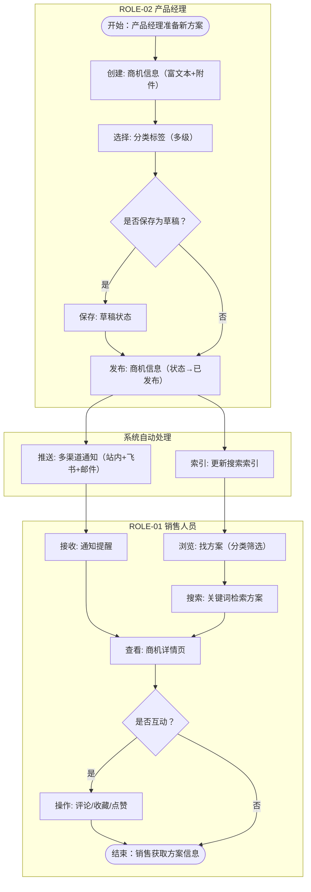

### A-2 通知订阅与触达

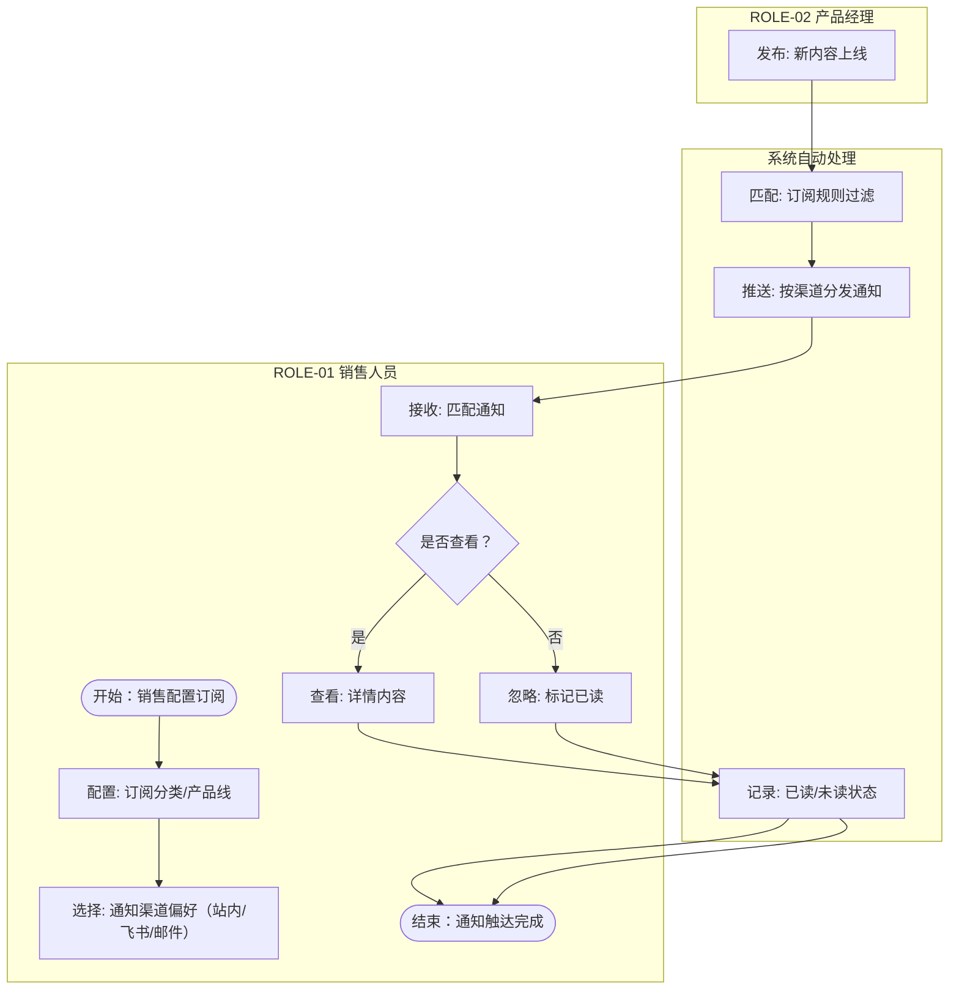

### A-3 商机需求-方案匹配与采纳

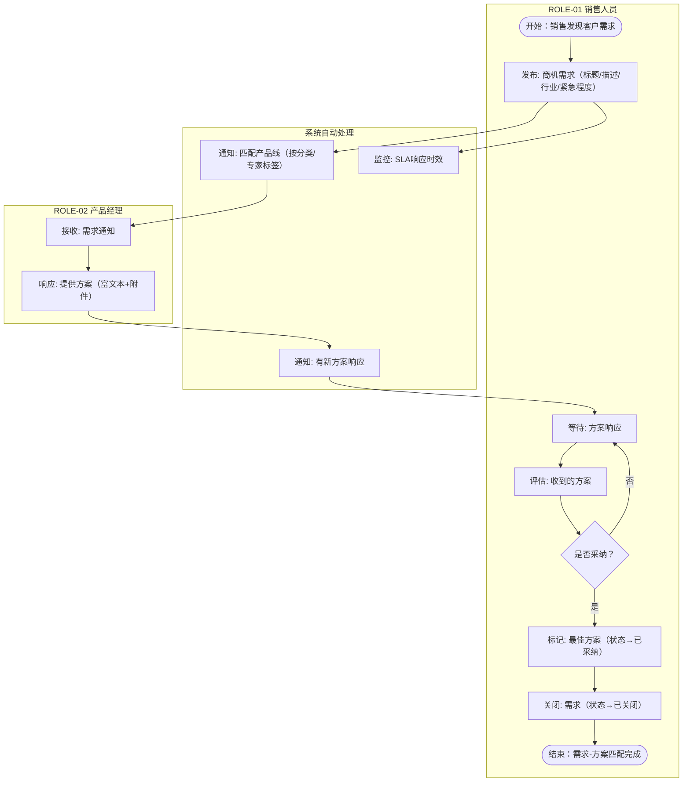

---

## 模块 B：有限状态机（FSM）

### B-1 商机信息（Opportunity）状态机

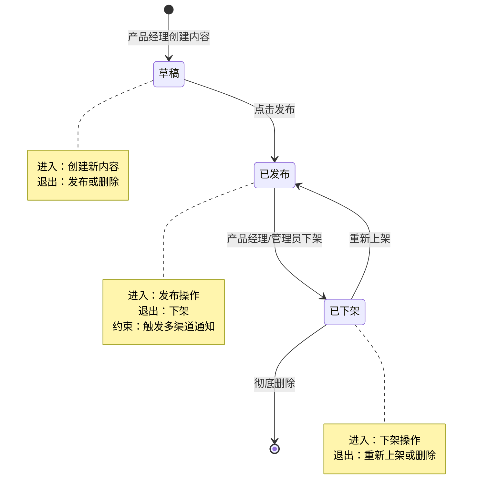

**状态字典表**

| 状态 | 英文 | 进入条件 | 退出条件 | 关键约束 |
|------|------|----------|----------|----------|
| 草稿 | Draft | 产品经理创建新商机信息 | 发布 / 删除 | 仅创建者可编辑 |
| 已发布 | Published | 点击发布按钮 | 下架 | 触发通知推送；内容可被搜索浏览 |
| 已下架 | Archived | 产品经理或管理员执行下架 | 重新上架 / 彻底删除 | 前台不可见；可恢复 |

### B-2 商机需求（OpportunityRequest）状态机

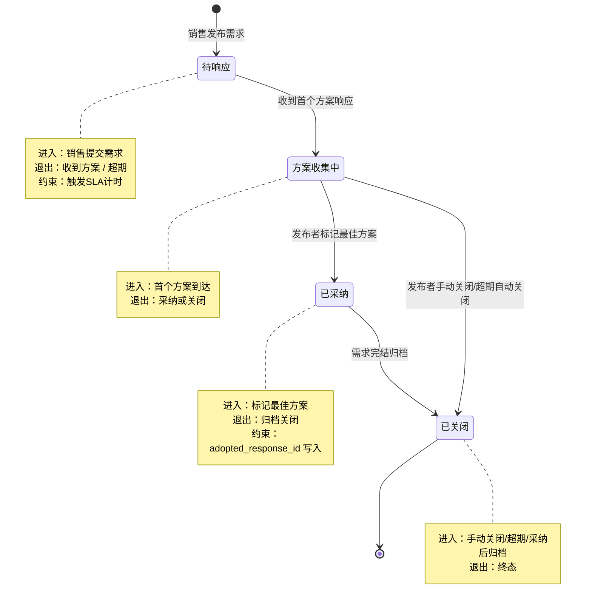

**状态字典表**

| 状态 | 英文 | 进入条件 | 退出条件 | 关键约束 |
|------|------|----------|----------|----------|
| 待响应 | Pending | 销售发布需求 | 收到首个方案 / 超期关闭 | 启动SLA计时器 |
| 方案收集中 | Collecting | 首个方案响应到达 | 采纳 / 手动关闭 / 超期关闭 | 可持续接收方案 |
| 已采纳 | Adopted | 发布者标记最佳方案 | 归档关闭 | 写入 adopted_response_id |
| 已关闭 | Closed | 手动关闭 / 超期 / 采纳后归档 | 终态 | 不可重开 |

### B-3 通知（Notification）状态机

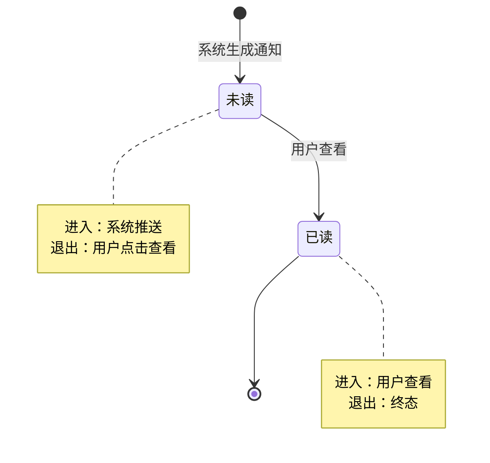

**状态字典表**

| 状态 | 英文 | 进入条件 | 退出条件 | 关键约束 |
|------|------|----------|----------|----------|
| 未读 | Unread | 系统生成通知推送 | 用户点击查看 | 计入未读角标 |
| 已读 | Read | 用户查看通知 | 终态 | 从未读列表移除 |

---

## 模块 C：核心实体关系图（ER）

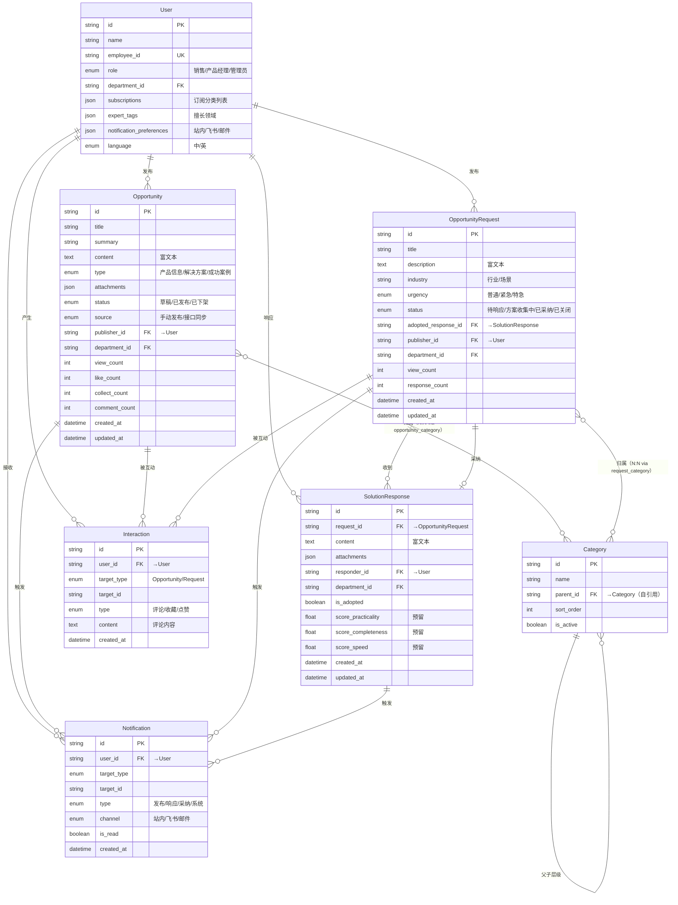

---

## 模块 D：SLA 规则矩阵

| 优先级 | 级别名称 | 首次响应时限 | 解决时限 | 触发场景示例 | 超时升级对象 |
|--------|----------|-------------|----------|-------------|-------------|
| P0 | 特急 | 2h | 24h | 紧急程度=特急的商机需求；重大客户项目机会 | L1→产品线负责人 → L2→STKH-02产品管理部负责人 → L3→STKH-04管理层 |
| P1 | 紧急 | 4h | 48h | 紧急程度=紧急的商机需求；限时投标项目 | L1→产品线负责人 → L2→STKH-02产品管理部负责人 |
| P2 | 普通 | 24h | 5个工作日 | 紧急程度=普通的常规需求 | L1→产品线负责人 |
| — | 内容发布通知 | 30min（触达） | — | 商机信息发布后通知推送 | 系统告警→ROLE-03运营管理员 |
| — | 搜索性能 | — | — | 页面加载≤2s；搜索响应≤1s | 技术告警→STKH-03 IT部门 |

> 数据来源：§六.4 NFR约束卡片（并发性能+可用性SLA）+ RISK-02（产品线不响应）+ ITIL最佳实践

---

## 模块 E：异常分支与红线规则

### E-1 SLA超时升级链（溯源：RISK-02 + SLA矩阵）

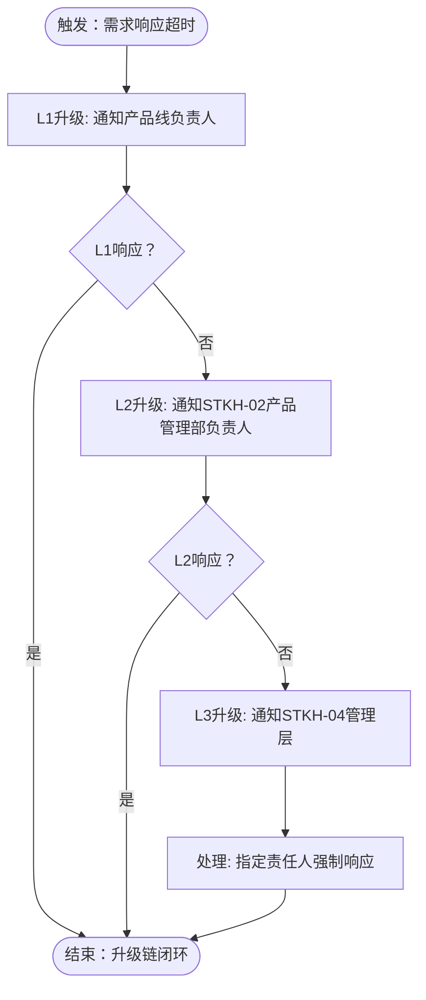

### E-2 新方案发布无人知晓（溯源：翻车记录1 + PAIN-002）

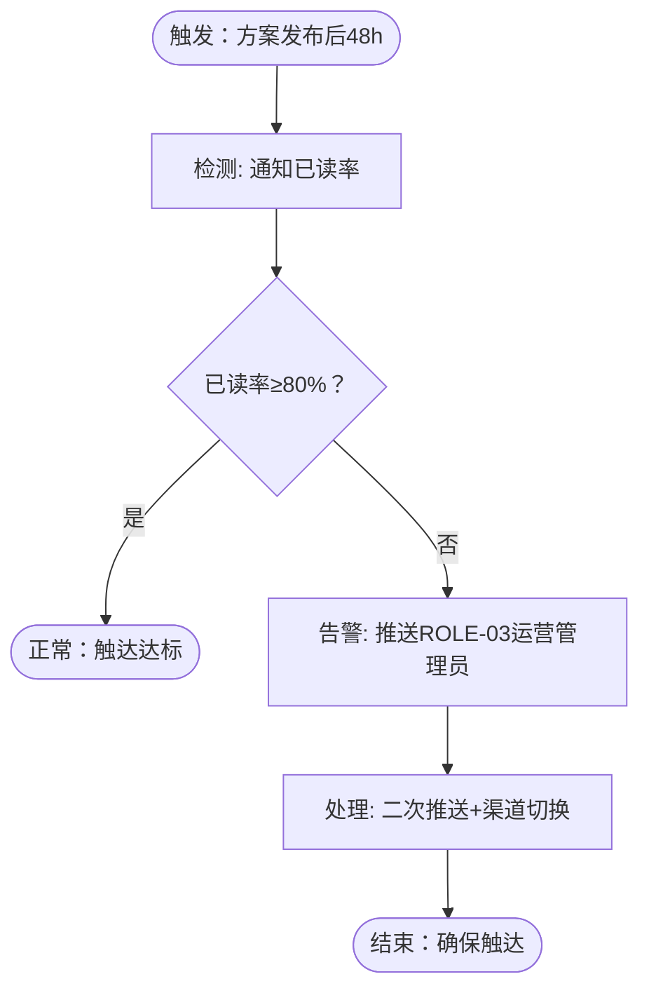

### E-3 旧价报价致合同纠纷（溯源：翻车记录2 + PAIN-002）

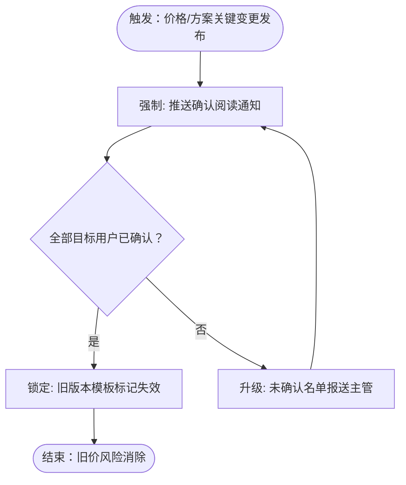

### E-4 重复询问同样问题（溯源：翻车记录3 + PAIN-004）

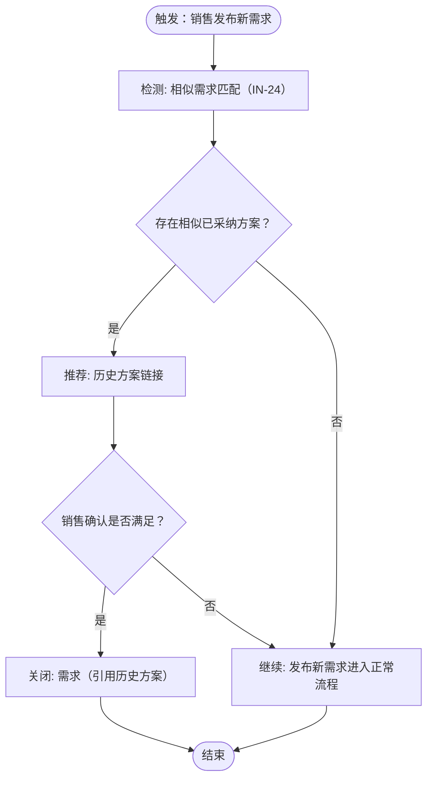

### E-5 权限配置出错致数据泄漏（溯源：RISK-05）

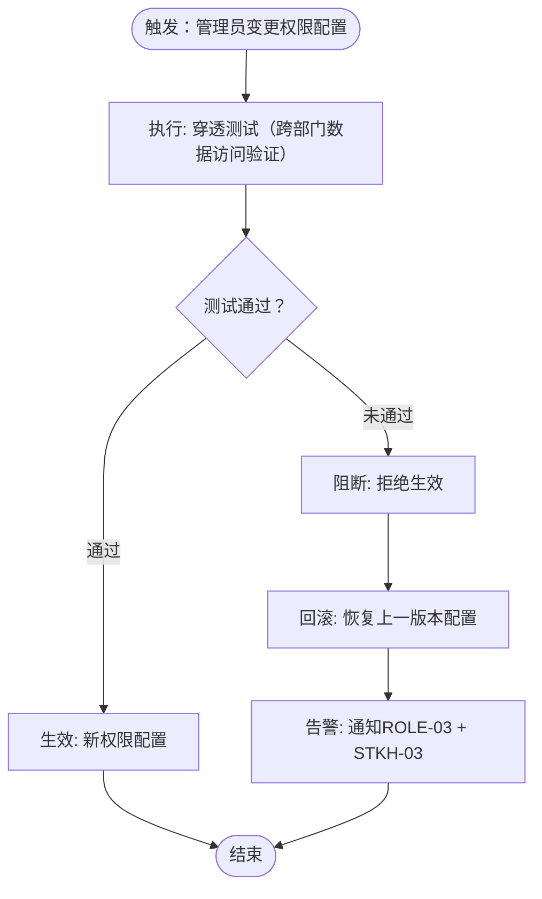

### E-6 平台空城（溯源：RISK-01 + PAIN-001）

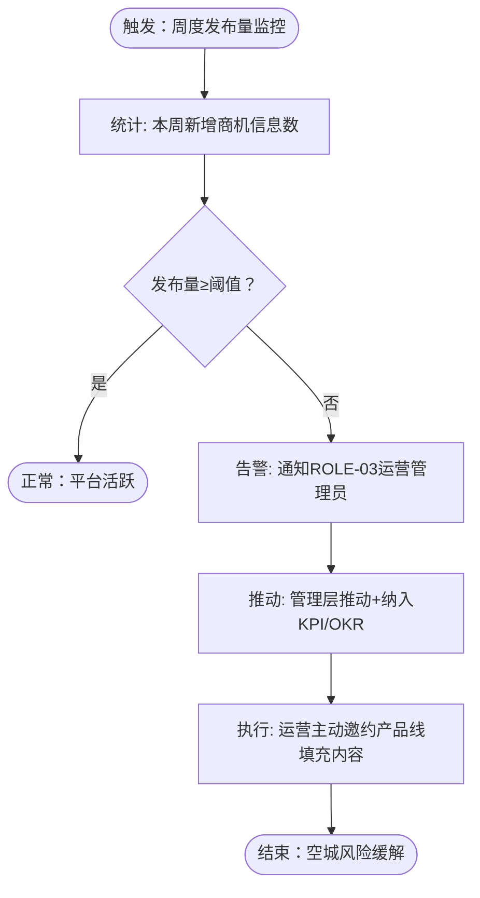

### E-7 产品线不响应需求（溯源：RISK-02 + PAIN-004）

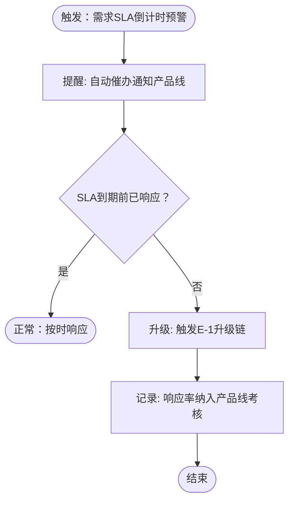

### 红线溯源汇总表

| 编号 | 红线场景 | 溯源 | 防护机制 |
|------|---------|------|---------|
| E-1 | SLA超时升级链 | RISK-02 + SLA矩阵 | 三级升级（产品线负责人→产品管理部→管理层） |
| E-2 | 新方案发布无人知晓 | 翻车记录1 + PAIN-002 | 48h已读率监控+二次推送 |
| E-3 | 旧价报价致合同纠纷 | 翻车记录2 + PAIN-002 | 强制确认阅读+旧模板锁定 |
| E-4 | 重复询问同样问题 | 翻车记录3 + PAIN-004 | 相似需求检测+历史方案推荐 |
| E-5 | 权限配置出错致数据泄漏 | RISK-05 | 穿透测试阻断+自动回滚 |
| E-6 | 平台空城 | RISK-01 + PAIN-001 | 发布量监控+KPI推动+运营邀约 |
| E-7 | 产品线不响应需求 | RISK-02 + PAIN-004 | SLA倒计时催办+考核纳入 |

---

*文档版本：v1.0 | 渲染日期：2026-05-27 | 节点：/2 Process*
*数据源：research.md（/0 需求调研 v1.0）*
