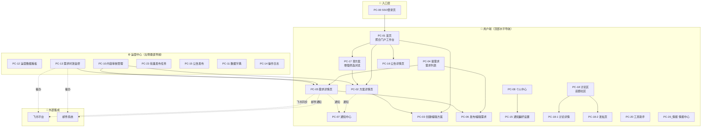

# Quectel商机信息发布平台 · 项目总纲

> **定位**：本文件是项目全局索引与业务概述，面向研发/测试/PM 全角色。
> **关联文档**：全局技术规约统一收口至 `01_全局规约手册.md`，各模块详细需求见 `02~07_*.md`。
> **上游数据源**：/0 需求调研 → /2 业务流程 → /3 功能架构 → /3-1 信息架构 → /4 交互原型

---

## 1. 文档信息

### 1.1 修订记录

| 版本号 | 修改日期 | 修改人 | 修改内容 |
|-------|---------|-------|---------|
| v1.0 | 2026-07-17 | PM | 初始版本，基于 v1.1 原型全量生成 |

### 1.2 名词术语

| 术语 | 说明 |
|------|------|
| 商机信息 / 方案 | 产品经理发布的正式产品信息、解决方案、成功案例，供销售查阅下载 |
| 商机需求 | 销售人员发布的方案求助，描述客户场景和需要的方案类型 |
| 方案响应 | 产品经理针对某个商机需求提交的方案答复（富文本+附件） |
| 采纳 | 需求发布者将某个方案响应标记为"最佳方案" |
| SSO | 对接企业统一认证系统的单点登录 |
| SLA | 需求响应时效的监控与升级机制 |
| 用户端 | 面向销售人员和产品经理的前台界面（顶部水平导航） |
| 运营中心 | 面向运营管理员的后台管理界面（左侧垂直导航） |

---

## 2. 需求概述

### 2.1 业务背景

Quectel 销售团队 500+ 人、产品团队 500+ 人，商机信息（产品方案、解决方案、成功案例）长期分散在微信群、飞书群、邮件和共享文档中，缺乏统一管理平台。销售人员查找方案需要逐个渠道翻找、私聊产品经理、翻聊天记录，效率极低。

同时，产品经理发布新方案后只能通过群发消息或口头通知，信息容易被淹没，销售往往不知道新方案已发布。销售在客户现场发现商机需求后，只能碎片化地在群里问"谁有 XX 方案？"，缺乏结构化的需求-方案匹配机制，响应慢、无法追踪、优质方案被埋没。

**四个核心痛点**：
| 痛点 | 描述 | 影响 |
|------|------|------|
| PAIN-001 信息分散 | 产品信息分散在多个渠道，销售逐个翻找 | 查找效率低，反复问同样问题 |
| PAIN-002 触达无效 | 新产品发布无高效触达，群消息被淹没 | 销售不知晓新方案，产品经理觉得"发了但没人看" |
| PAIN-003 反馈缺失 | 一线反馈无结构化通道沉淀 | 有价值反馈靠零散聊天，无法反哺研发 |
| PAIN-004 匹配断裂 | 销售有需求但找不到对口产品方案 | 客户等待，内部找人靠运气 |

### 2.2 项目目标

> 来源：{{/0 research.md 项目基座·Business Outcome}}

- **核心定位**：内部商机信息发布与需求-方案双向匹配平台，填补 CRM 系统与办公协作工具之间的空白
- **关键指标**（上线后跟踪）：
  - 平台活跃率（DAU/MAU）
  - 商机信息发布量（周度）
  - 需求方案响应时效（从发布到首个方案的平均时长）
  - 方案采纳率（被采纳方案数 / 总方案响应数）
  - 通知触达率（推送后 48h 已读率 ≥ 80%）

### 2.3 需求范围

| 本期做 | 本期不做 |
|-------|---------|
| 商机信息（方案）发布/浏览/搜索/详情 | 完整 CRM / 销售漏斗 |
| 商机需求发布/方案响应/采纳/关闭 | 客户 360 视图 |
| 站内通知 + 飞书推送 + 邮件通知 | 低代码自定义表单 |
| 评论（多级嵌套）/收藏/点赞 | 应用市场 / 插件生态 |
| 运营后台：内容审核/分类维护/SLA监控/数据看板/操作日志/公告管理 | 复杂 BI / 深度数据分析 |
| SSO 单点登录 + 账号密码降级 | 移动端原生 App |
| 讨论区/情报中心/工具助手/批量发布任务 | — |

---

## 3. 用户角色与权限

### 3.1 角色定义

| 角色名称 | 角色说明 | 典型用户 | 数据范围 |
|---------|---------|---------|---------|
| ROLE-01 销售人员 | 浏览方案、搜索、发布商机需求、采纳方案、接收通知 | 一线销售、销售主管（500+人） | 本部门数据（可配置跨部门） |
| ROLE-02 产品经理 | 创建/发布/下架方案、响应商机需求、提供方案 | 各产品线 PM（500+人） | 本人创建的内容 + 被邀请的需求 |
| ROLE-03 运营管理员 | 内容审核、分类维护、用户权限配置、SLA监控、数据看板、操作审计 | 平台运营团队（3~5人） | 全平台数据（无限制） |

### 3.2 权限总览

> 🛑 此表为全系统权限的唯一真理来源。各模块 PRD 的"权限归属"声明必须从此处复制。

| 功能（FEAT-ID） | ROLE-01 销售 | ROLE-02 产品经理 | ROLE-03 管理员 | 备注 |
|--------------|------------|----------------|--------------|------|
| FEAT-0101 创建商机信息 | 🚫 | ✅ | 🚫 | ROLE-02 专属 |
| FEAT-0102 选择分类标签 | 🚫 | ✅ | 🚫 | 随 FEAT-0101 |
| FEAT-0103 保存草稿 | 🚫 | ✅ | 🚫 | 仅创建者可见可编辑 |
| FEAT-0104 发布商机信息 | 🚫 | 📋 | 🚫 | 📋 仅本人创建的草稿 |
| FEAT-0105 下架商机信息 | 🚫 | 📋 | ✅ | 📋 仅本人发布；ROLE-03 全平台 |
| FEAT-0106 重新上架 | 🚫 | 📋 | ✅ | 📋 仅本人下架；ROLE-03 全平台 |
| FEAT-0107 浏览方案列表 | 👁️ | 👁️ | 👁️ | 受数据隔离配置约束 |
| FEAT-0108 关键词搜索 | ✅ | ✅ | ✅ | — |
| FEAT-0109 查看商机详情 | 👁️ | 👁️ | 👁️ | — |
| FEAT-0201 发布商机需求 | ✅ | 🚫 | 🚫 | ROLE-01 专属 |
| FEAT-0202 设置紧急程度 | ✅ | 🚫 | 🚫 | 随 FEAT-0201 |
| FEAT-0203 响应提供方案 | 🚫 | ✅ | 🚫 | ROLE-02 专属 |
| FEAT-0204 查看方案列表 | 👁️ | 👁️ | 👁️ | — |
| FEAT-0205 标记最佳方案 | 📋 | 🚫 | 🚫 | 📋 仅需求发布者 |
| FEAT-0206 关闭需求 | 📋 | 🚫 | ✅ | 📋 仅发布者本人 |
| FEAT-0207 相似需求检测 | 系统自动 | 系统自动 | — | P2 |
| FEAT-0208 专家标签匹配 | 系统自动 | 系统自动 | — | P2 |
| FEAT-0209 设置可见范围 | ✅ | 🚫 | 🚫 | 随 FEAT-0201 |
| FEAT-0210 邀请产品线 | ✅ | 🚫 | 🚫 | 随 FEAT-0201 |
| FEAT-0211 方案提交邮件通知 | 🚫 | ✅ | 🚫 | 随 FEAT-0203 |
| FEAT-0212 方案同步飞书 | 🚫 | ✅ | 🚫 | 随 FEAT-0203 |
| FEAT-0301 配置订阅规则 | ✅ | ✅ | — | 个人维度 |
| FEAT-0302 选择通知渠道 | ✅ | ✅ | — | 个人维度 |
| FEAT-0303 多渠道通知推送 | 系统自动 | 系统自动 | — | — |
| FEAT-0304 查看通知列表 | ✅ | ✅ | ✅ | — |
| FEAT-0305 标记通知已读 | ✅ | ✅ | ✅ | — |
| FEAT-0306 已读率监控 | — | — | ✅ | ROLE-03 专属 |
| FEAT-0307 强制确认阅读 | ✅ | ✅ | — | 收到关键通知时 |
| FEAT-0401 评论 | ✅ | ✅ | ✅ | ROLE-03 可删违规评论 |
| FEAT-0402 收藏 | ✅ | ✅ | — | 个人维度 |
| FEAT-0403 点赞 | ✅ | ✅ | — | — |
| FEAT-0501 用户角色权限配置 | 🚫 | 🚫 | ✅ | ROLE-03 专属 |
| FEAT-0502 部门数据隔离配置 | 🚫 | 🚫 | ✅ | ROLE-03 专属 |
| FEAT-0503 内容审核管理 | 🚫 | 🚫 | ✅ | ROLE-03 专属 |
| FEAT-0504 分类体系维护 | 🚫 | 🚫 | ✅ | ROLE-03 专属 |
| FEAT-0505 运营数据统计 | 🚫 | 🚫 | ✅ | ROLE-03 专属 |
| FEAT-0506 SLA 时效监控 | 🚫 | 🚫 | ✅ | ROLE-03 专属，系统自动升级 |
| FEAT-0507 发布量监控告警 | 系统自动 | — | ✅ | ROLE-03 接收告警 |
| FEAT-0601 SSO 单点登录 | ✅ | ✅ | ✅ | 全角色 |
| FEAT-0602 搜索索引维护 | 系统自动 | 系统自动 | — | — |
| FEAT-0603 操作日志审计 | 🚫 | 🚫 | ✅ | ROLE-03 专属 |
| FEAT-0604 中英文切换 | ✅ | ✅ | ✅ | 全局组件 |

---

## 4. 全局产品架构

### 4.1 全局页面/业务流转路由图

> 完整页面清单（30 页面）及路由对照详见 `系统功能架构图.md` §三。

### 4.2 模块总览

| 模块编号 | 模块名称 | 归属端 | 模块定位 | FEAT 数 | 对应 PRD |
|---------|---------|-------|---------|---------|---------|
| MOD-01 | 商机信息管理 | 用户端 | 方案发布/浏览/搜索/详情查看 | 9 | `02_MOD-01_商机信息管理.md` |
| MOD-02 | 商机需求与方案匹配 | 用户端 | 需求发布/方案响应/采纳/关闭 | 12 | `03_MOD-02_商机需求与方案匹配.md` |
| MOD-03 | 通知与订阅 | 用户端 | 订阅配置/多渠道通知/已读率监控 | 7 | `04_MOD-03_通知与订阅.md` |
| MOD-04 | 互动与反馈 | 用户端（嵌入式） | 评论/收藏/点赞（无独立页面，嵌入 PC-02/PC-05） | 3 | 合并至 MOD-01、MOD-02 PRD |
| MOD-05 | 运营管理后台 | 运营中心 | 内容审核/SLA监控/数据看板/分类维护/公告/批量任务 | 7 | `05_MOD-05_运营管理后台.md` |
| MOD-06 | 系统支撑 | 公共层 | SSO登录/搜索索引/操作审计/国际化 | 4 | `06_MOD-06_系统支撑.md` |

---

## 5. 全局交互与公共组件规范

> 🛑 本章从 `双端交互规范.md` 凝练，适用于本平台所有页面。各模块 PRD 的操作说明引用此处基线。

### 5.1 B端交互基线

| 维度 | 规则 |
|------|------|
| **主框架** | 用户端：顶部导航栏（高 56px）+ 内容区；运营中心：左侧导航（宽 220px，可折叠至 64px）+ 右侧内容区 |
| **内容区** | 最小宽度 1200px，超宽屏居中限宽 1440px |
| **分页** | 默认每页 12/20 条，可选切换；底部显示总条数 |
| **排序** | 默认按创建时间倒序 |
| **空状态** | 必须有空状态占位图 + 引导文案 |
| **加载** | 骨架屏优先，超过 3 秒展示"加载中"文案 |
| **表单校验** | `onBlur` 即时校验 + `onSubmit` 全量校验；必填字段标签前红色星号 `*` |
| **操作反馈** | 成功：顶部 Message 绿色提示，3 秒消失；删除：二次确认弹窗；提交中：按钮 Loading + 禁用 |
| **批量操作** | 勾选后底部浮出操作栏，显示已勾选数量 |

### 5.2 防腐容灾基线

| 场景 | 降级方案 |
|------|---------|
| **接口超时** | 表格展示空状态 + "刷新"按钮，筛选区保持可用 |
| **Token 过期** | 静默刷新，失败则跳转登录页 |
| **权限不足** | 页面级：展示"无权限"占位页；按钮级：隐藏或 disabled |
| **删除不可逆数据** | 二次确认弹窗，明示被删数据关键标识 |
| **表单中途离开** | 浏览器 `beforeunload` 拦截提示 |
| **大数据量列表** | 前端虚拟滚动或强制分页 |
| **文件导出超时** | 异步导出 + 通知中心通知结果 |

---

## 6. 非功能需求

### 6.1 性能要求

| 指标 | 要求 |
|------|------|
| 首屏加载时间 | < 2s（P99，桌面端） |
| 搜索响应时间 | < 1s（P99） |
| 列表最大数据量 | 支持 200 条不分页不降速 |
| 并发用户数 | 支持 200 用户同时操作 |
| 文件上传 | 单文件 ≤ 50MB，单次总量 ≤ 200MB |

> 详细阈值基线参见 `01_全局规约手册.md` §5。

### 6.2 安全与合规

| 维度 | 要求 |
|------|------|
| 认证 | SSO 统一登录，Token 过期自动刷新 |
| 授权 | 基于角色的访问控制（RBAC），3 角色 × 42 功能 |
| 数据隔离 | 默认不隔离，管理员可配置部门级隔离规则 |
| 审计 | 关键操作全量记录（操作人/时间/类型/IP/变更快照） |
| 前端安全 | 评论内容 XSS 过滤；文件类型白名单校验 |

> 详细脱敏矩阵参见 `01_全局规约手册.md` §4。

### 6.3 兼容性

| 维度 | 要求 |
|------|------|
| 浏览器 | Chrome 90+、Edge 90+、Firefox 90+ |
| 分辨率 | ≥ 1366×768（推荐 1920×1080） |
| 语言 | 中文（默认）+ 英文切换 |
| 移动端 | 本期不做移动端适配，后续迭代评估 |

---

## 7. 附录

### 7.1 原型地址

- **原型门户**：`living-docs/prototypes/index.html`
- **导航外壳**：`living-docs/prototypes/prototype-shell.js`
- **覆盖范围**：30 个 HTML 页面（PC-00 ~ PC-23），含列表/详情/表单/看板/弹窗/抽屉全类型

### 7.2 关联文档

| 文档 | 路径 | 说明 |
|------|------|------|
| 全局规约手册 | `01_全局规约手册.md` | 状态机字典、外部集成、脱敏矩阵、性能阈值、降级策略 |
| MOD-01 PRD | `02_MOD-01_商机信息管理.md` | 方案发布/浏览/搜索/详情（含评论/收藏/点赞嵌入） |
| MOD-02 PRD | `03_MOD-02_商机需求与方案匹配.md` | 需求发布/方案响应/采纳/关闭（含评论/收藏/点赞嵌入） |
| MOD-03 PRD | `04_MOD-03_通知与订阅.md` | 订阅配置/通知列表/偏好设置 |
| MOD-05 PRD | `05_MOD-05_运营管理后台.md` | 内容审核/SLA监控/数据看板/分类维护/公告/批量任务 |
| MOD-06 PRD | `06_MOD-06_系统支撑.md` | SSO登录/搜索索引/操作审计/国际化 |
| 需求调研 | `../research.md` | /0 产出 |
| 竞品分析 | `../competitor-analysis.md` | /1 产出 |
| 业务流程 | `../business-process.md` | /2 产出 |
| 功能矩阵 | `../feature-matrix.md` | /3 产出 |
| 信息架构 | `../information-architecture.md` | /3-1 产出 |
