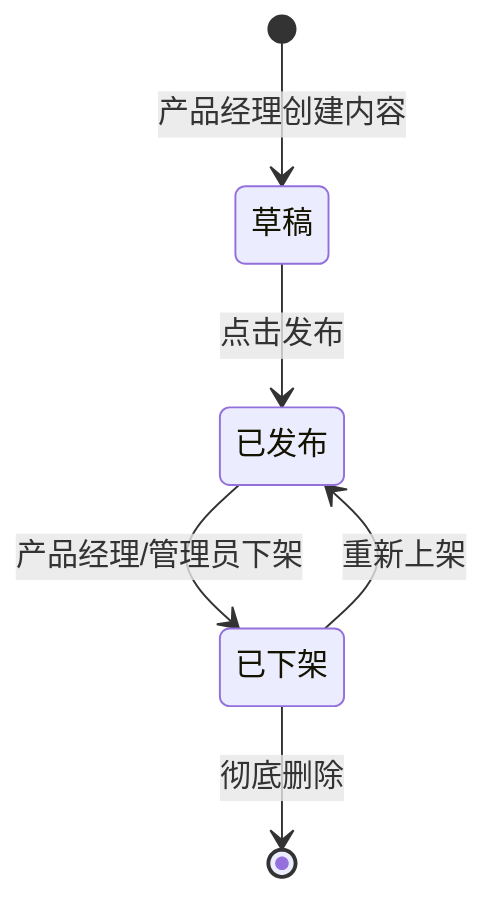
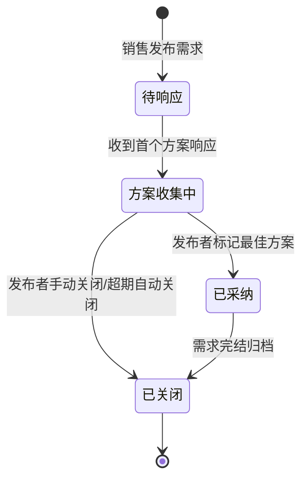
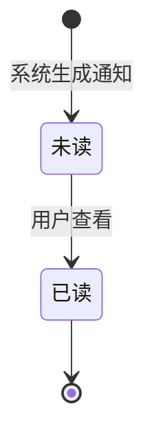

# Quectel商机信息发布平台 · 全局规约手册

> **定位**：本文件是全系统技术规约的**唯一真理来源**（Single Source of Truth）。
> **包含内容**：状态机字典、外部系统集成、数据脱敏矩阵、性能阈值基线、防腐降级策略。
> **使用规则**：各模块 PRD 通过 `{{强制数据源绑定}}` 从本文件中获取参数值，禁止在模块内重复定义。
> **上游数据源**：/2 业务流程（FSM + SLA + 红线） + /3-1 信息架构（字段字典） + /0 需求调研（NFR）

---

## 文档变更记录

| 版本 | 日期 | 修改人 | 修改内容 | 影响范围 |
|-----|------|------|---------|---------|
| v1.0 | 2026-07-17 | PM | 初始版本，基于 v1.1 原型全量生成 | 全系统 |

---

## 1. 状态机字典

> 🛑 **唯一真理点**：全系统的业务状态定义统一在此处管理。各模块 PRD 仅引用此处的状态编号和名称，严禁在模块内重复定义状态值。

### 1.1 商机信息（Opportunity）状态机

> 来源：{{/2 business-process.md §B-1}}

| 状态编号 | 状态名称 | 英文 | 进入条件 | 退出条件 | 关键约束 |
|---------|---------|------|---------|---------|---------|
| OPP-S1 | 草稿 | Draft | 产品经理创建新商机信息 | 发布 / 删除 | 仅创建者可编辑 |
| OPP-S2 | 已发布 | Published | 点击发布按钮 | 下架 | 触发通知推送；内容可被搜索浏览 |
| OPP-S3 | 已下架 | Archived | 产品经理或管理员执行下架 | 重新上架 / 彻底删除 | 前台不可见；可恢复 |

### 1.2 商机需求（OpportunityRequest）状态机

> 来源：{{/2 business-process.md §B-2}}

| 状态编号 | 状态名称 | 英文 | 进入条件 | 退出条件 | 关键约束 |
|---------|---------|------|---------|---------|---------|
| REQ-S1 | 待响应 | Pending | 销售发布需求 | 收到首个方案 / 超期关闭 | 启动 SLA 计时器 |
| REQ-S2 | 方案收集中 | Collecting | 首个方案响应到达 | 采纳 / 手动关闭 / 超期关闭 | 可持续接收方案 |
| REQ-S3 | 已采纳 | Adopted | 发布者标记最佳方案 | 归档关闭 | 写入 adopted_response_id |
| REQ-S4 | 已关闭 | Closed | 手动关闭 / 超期 / 采纳后归档 | 终态 | 不可重开 |

### 1.3 通知（Notification）状态机

> 来源：{{/2 business-process.md §B-3}}

| 状态编号 | 状态名称 | 英文 | 进入条件 | 退出条件 | 关键约束 |
|---------|---------|------|---------|---------|---------|
| NOTIF-S1 | 未读 | Unread | 系统生成通知推送 | 用户点击查看 | 计入未读角标 |
| NOTIF-S2 | 已读 | Read | 用户查看通知 | 终态 | 从未读列表移除 |

---

## 2. 外部系统集成与边界拓扑

| 系统名称 | 数据流向 | 交互类型 | 触发场景 | 超时阈值 | 异常降级方案 |
|---------|---------|---------|---------|---------|------------|
| **企业 SSO** | 入向：用户认证 Token | 同步 HTTP | 用户登录时调用 | 5s | 降级为账号密码登录表单（PAGE-PC-00） |
| **飞书开放平台** | 出向：消息推送 | 异步 API | 通知推送、催办通知、方案摘要同步 | 10s | 站内信兜底；失败不阻断主流程；重试 3 次后记录告警 |
| **飞书群机器人** | 出向：方案摘要 | 异步 Webhook | 产品经理提交方案时（FEAT-0212 开关开启） | 5s | 失败不阻断方案提交；Toast 提示"飞书同步失败，可稍后在通知中心查看" |
| **邮件系统（SMTP）** | 出向：邮件通知 | 异步 SMTP | 方案提交通知（FEAT-0211）、催办通知 | 15s | 失败不阻断主流程；站内信兜底 |
| **全文搜索引擎** | 出向：索引更新 | 异步消息 | 方案发布/修改/下架时 | 30s | 搜索降级为数据库 LIKE 查询；管理后台告警 |

---

## 3. AI 算法能力全局规范

> 🚧 本项目当前无 AI/算法模型需求。FEAT-0207（相似需求检测）和 FEAT-0208（专家标签匹配推荐）为 P2 优先级，本期不做详细 AI 规约。
>
> 后续迭代若启用 AI 能力，按 `AI能力描述规范.md` 的"四元描述模型"（目标 → I/O → 验收阈值 → 兜底策略）补充本章节。

---

## 4. 数据脱敏矩阵

> 🛑 此表为所有敏感字段的脱敏规则唯一定义点。各模块 PRD 在字段说明的"备注"列中引用此处规则。

| 敏感字段 | 脱敏规则 | 适用场景 | 解密通道 |
|---------|---------|---------|---------|
| 用户手机号（User.phone） | 中间 4 位替换为 `****`，如 `138****5678` | 列表展示、详情展示 | 无（本期不提供解密，仅运营管理员可查看完整手机号） |
| 用户邮箱（User.email） | 仅站内展示完整邮箱；导出数据时脱敏为 `u***@domain.com` | 数据导出 | ROLE-03 数据导出时可选"脱敏导出"勾选 |
| 操作审计 IP 地址（AuditLog.ip） | 列表直接展示；对外导出时后 2 段替换为 `*.*` | 对外数据提供 | ROLE-03 直接查看不受限 |

> 📝 说明：当前 /3-1 字段字典中"脱敏规则"列大部分为空。上述三条基于平台常见敏感字段推演（`🚧 AI 补充，待PM确认`）。平台不涉及身份证号、银行卡号等强敏感数据。

---

## 5. 性能与全局阈值基线

> 🛑 此处为全系统业务参数唯一真理点。各模块 PRD 在业务规则中引用此处数值。

| 阈值类别 | 参数名 | 阈值 | 触发行为 | 适用端 |
|---------|-------|------|---------|-------|
| 接口响应 | API 超时 | 10s | 展示"网络异常，请稍后重试"+ 重试按钮 | 全端 |
| 上传 | 单文件最大 | 50MB | 前端拦截，超出提示"文件不能超过 50MB" | 全端 |
| 上传 | 单次总量 | 200MB | 前端累计计算，超出提示"附件总量不能超过 200MB" | 全端 |
| 文件类型 | 允许格式 | pdf / pptx / docx / xlsx / jpg / png / zip | 前端 `accept` + 后端校验，非法格式拒绝 | 全端 |
| 搜索 | 关键词最小长度 | 2 字符 | 输入 < 2 字符不触发搜索 | 用户端 |
| 搜索 | 响应时间 | ≤ 1s（P99） | 超时展示"搜索超时，请缩小范围重试" | 用户端 |
| 分页 | 默认每页 | 12（卡片视图）/ 20（列表视图） | — | 用户端 |
| 分页 | 可选每页 | 12/24/48（卡片）/ 10/20/50/100（列表） | — | 用户端 |
| 防抖 | 按钮防重复点击 | 3s（发布/提交/删除等写操作） | 按钮 Loading + disabled | 全端 |
| 防抖 | 点赞/收藏切换 | 1s | 按钮 disabled，异步返回后恢复 | 用户端 |
| 评论 | 单条最大长度 | 500 字符 | 输入框右下角实时计数器；超出禁用提交 | 用户端 |
| 搜索历史 | localStorage 自动保存 | 最多 5 条，FIFO 淘汰，去重 | 超出上限淘汰最早记录 | 用户端 |
| 通知 | 已读率监控 | 48h 后检测，阈值 80% | 低于阈值触发二次推送 + 管理员告警 | 系统自动 |
| SLA | 特急首次响应 | 2h | 超时触发三级升级链 | 系统自动 |
| SLA | 紧急首次响应 | 4h | 超时触发二级升级链 | 系统自动 |
| SLA | 普通首次响应 | 24h | 超时触发一级升级链 | 系统自动 |

---

## 6. 防腐守卫与降级策略

> 来源：{{/2 business-process.md §E-1~E-7 红线分支}}

### 6.1 业务红线降级链

| 编号 | 红线场景 | 防护机制 | 降级兜底 |
|------|---------|---------|---------|
| E-1 | SLA 超时未响应 | 三级升级链：L1 产品线负责人 → L2 产品管理部负责人 → L3 管理层 | 系统自动执行升级，无需人工触发 |
| E-2 | 方案发布后无人知晓 | 48h 已读率监控 < 80% → 二次推送 + 渠道切换 | 管理员手动发起定向推送 |
| E-3 | 价格/方案关键变更致合同纠纷 | 强制确认阅读 + 未确认名单报送主管 + 旧版本模板标记失效 | 关键变更走人工审批发布流程 |
| E-4 | 重复询问同样问题 | 发布需求时相似需求检测 + 推荐历史已采纳方案 | P2 功能，本期可用户自行搜索 |
| E-5 | 权限配置出错致数据泄漏 | 变更时自动穿透测试验证 → 未通过则阻断 + 回滚 | 管理员手动回滚 + IT 协助排查 |
| E-6 | 平台内容空城 | 周度发布量监控 + 低于阈值告警 → 运营推动填充 | 管理员主动邀约产品线发布 |
| E-7 | 产品线不响应需求 | SLA 倒计时催办 + 响应率纳入考核 | 管理员手动指派责任人 |

### 6.2 通用系统降级策略

| 场景 | 降级方案 |
|------|---------|
| **SSO 服务不可用** | 展示账号密码登录表单（PAGE-PC-00 降级模式） |
| **飞书 API 不可用** | 站内信兜底；消息队列缓存，服务恢复后补推 |
| **邮件服务不可用** | 站内信兜底；提示"邮件发送失败，请查看站内通知" |
| **搜索引擎异常** | 降级为数据库 LIKE 模糊查询；管理后台告警 |
| **文件存储服务异常** | 上传失败提示；已上传文件（CDN/OSS）不受影响 |
| **Token 过期** | 静默刷新；失败则跳转登录页并提示"登录已过期，请重新登录" |
| **并发登录冲突** | 后登录踢出前登录，被踢用户弹窗"账号已在其他设备登录" |
| **表单中途离开** | 浏览器 `beforeunload` 拦截 + 草稿自动保存（编辑中每 30s 存草稿） |
| **大批量操作（如批量下架）** | 展示影响范围预估 + 异步执行 + 通知中心通知结果 |

---

*文档版本：v1.0 | 渲染日期：2026-07-17 | 节点：/5 PRD*
*数据源：business-process.md（/2）+ information-architecture.md（/3-1）+ research.md（/0）*
