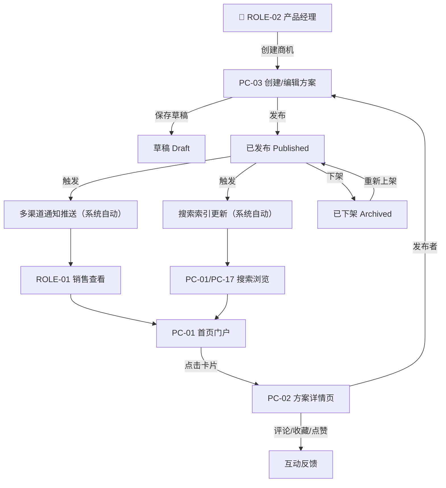

# MOD-01 商机信息管理 · 模块 PRD

> **模板**：B端后台模块（b-end-module）
> **上游数据源**：{{/3 feature-matrix.md}} + {{/3-1 information-architecture.md}} + {{/2 business-process.md}}
> **关联文档**：权限引用 `00_项目总纲.md` §3.2、状态机引用 `01_全局规约手册.md` §1.1、交互基线 `01_全局规约手册.md` §5~§6

---

## 文档变更记录

| 版本 | 日期 | 修改人 | 修改内容 | 影响范围 |
|-----|------|------|---------|---------|
| v1.0 | 2026-07-17 | PM | 初始版本 | MOD-01 + MOD-04 互动嵌入 |

---

> **权限归属**：详见 `00_项目总纲.md` §3.2。本模块涉及 FEAT-0101~0109（商机信息管理）、FEAT-0401~0403（互动反馈嵌入）。ROLE-01 可浏览/搜索/评论/收藏/点赞；ROLE-02 可创建/编辑/发布/下架本人内容；ROLE-03 可管理全平台内容。
> **引用基准**：角色权限定义详见 `00_项目总纲.md`。

---

## 业务流程

### 核心业务流程

> 来源：{{/2 business-process.md §A-1 产品信息发布与获取}}

### 状态流转

> 🛑 状态定义引用 `01_全局规约手册.md` §1.1 商机信息状态机。

| 当前状态 | 触发动作 | 操作角色 | 流转至状态 | 降级/回退 |
|---------|---------|---------|----------|----------|
| — | 创建商机信息 | ROLE-02 | Draft | — |
| Draft | 保存草稿 | ROLE-02 | Draft（原地） | — |
| Draft | 发布 | ROLE-02 | Published | — |
| Published | 下架 | ROLE-02（本人）/ ROLE-03 | Archived | — |
| Published | 编辑后重新发布 | ROLE-02 | Published（内容更新） | — |
| Archived | 重新上架 | ROLE-02（本人）/ ROLE-03 | Published | — |
| Archived | 彻底删除 | ROLE-03 | 删除 | — |

---

## 功能需求说明

### 功能描述

> 来源：{{/3 feature-matrix.md MOD-01}}

商机信息管理是平台核心模块，解决 PAIN-001（信息分散）和 PAIN-003（反馈缺失）。产品经理通过 PC-03 创建方案（富文本+附件+分类标签），发布后自动通知订阅用户；销售人员通过 PC-01 首页和 PC-17 查方案发现方案，进入 PC-02 详情页查看全文、下载附件、参与评论/收藏/点赞互动。

**覆盖 FEAT**：FEAT-0101~0109（9 项）+ FEAT-0401~0403（3 项互动，嵌入 PC-02）
**覆盖页面**：PC-01（首页）、PC-02（方案详情页）、PC-03（创建/编辑方案）、PC-17（查方案）

### 非功能要求

遵循 `01_全局规约手册.md` 全局 NFR 基准，以下列出本模块特殊要求：

| 指标 | 要求 | 测量方式 |
|-----|------|---------|
| 首屏加载时间 | < 2s（P99，桌面端） | Lighthouse 测试 |
| 列表最大数据量 | 支持 200 条不分页（卡片视图 12/24/48，列表 10/20/50/100） | 压测 |
| 富文本编辑器 | 支持图片粘贴/上传（单图 ≤ 10MB）、表格、代码块 | 功能测试 |
| 并发用户数 | 200 用户同时浏览/搜索不报错 | JMeter 压测 |

---

### 页面说明：PC-01 首页（聚合门户工作台）

> 来源：{{/3-1 PAGE-PC-01}}

**页面类型**：T1 筛选列表页 | **关联 FEAT**：FEAT-0107、FEAT-0108

**布局区域**：
- Z1 页面头部工具栏：分类筛选（Cascader）、类型筛选（Select）、排序方式（Select）、视图切换（SegmentedControl: 卡片/列表）
- Z2 内容列表区：卡片/列表视图展示已发布方案
- Z3 分页器

---

#### 字段说明：PC-01

<!-- contract:frozen v1.0 -->
| 序号 | 字段名称 | 字段类型 | 必填 | 默认值 | 校验规则 | 备注 |
|-----|---------|---------|------|-------|---------|------|
| 1 | 分类筛选 (category_filter) | Cascader 级联选择 | 否 | 全部 | 引用 Category 实体树 | — |
| 2 | 类型筛选 (type_filter) | Select 下拉 | 否 | 全部 | ENUM-OPP-TYPE：product_info / solution / success_case | — |
| 3 | 排序方式 (sort_by) | Select 下拉 | 否 | latest | ENUM-SORT-OPP：latest / hottest / most_liked | — |
| 4 | 视图模式 (view_mode) | SegmentedControl | 否 | card | card / list | localStorage 持久化 |
| 5 | 商机标题 (title) | Text 只读 | — | — | VARCHAR(100) | 卡片/列表主标题 |
| 6 | 摘要 (summary) | Text 只读 | — | — | VARCHAR(200)，超出截断+省略号 | 卡片副文本 |
| 7 | 类型标签 (type) | Tag 只读 | — | — | ENUM-OPP-TYPE | 颜色区分 |
| 8 | 分类标签 (categories) | Tag[] 只读 | — | — | 最多显示 3 个+N | — |
| 9 | 发布人 (publisher_name) | Text 只读 | — | — | VARCHAR(50) | — |
| 10 | 发布时间 (created_at) | Text 只读 | — | — | 相对时间 ≤ 7 天，> 7 天显示日期 | — |
| 11 | 浏览量 (view_count) | Text 只读 | — | 0 | ≥1000 显示 "1k+" | — |
| 12 | 点赞数 (like_count) | Text 只读 | — | 0 | — | — |
| 13 | 收藏数 (collect_count) | Text 只读 | — | 0 | — | — |
| 14 | 评论数 (comment_count) | Text 只读 | — | 0 | — | — |
| 15 | 每页条数 (page_size) | Select | 否 | 12（卡片）/ 20（列表） | 12/24/48 或 10/20/50/100 | — |
<!-- contract:end -->

#### 操作说明：PC-01

| 操作名称 | 触发方式 | 前置条件 | 操作逻辑 | 操作反馈 |
|---------|---------|---------|---------|---------|
| 分类/类型/排序筛选 | onChange | — | 重新请求列表，page 重置为 1 | Loading → 列表刷新 |
| 视图切换 | onClick | — | 本地切换卡片/列表视图，localStorage 持久化 | 即时切换，无请求 |
| 点击卡片/行 | onClick | — | 路由跳转 → PC-02（方案详情页），URL 携带 opportunity_id | — |
| 分页切换 | onChange | — | 请求对应页数据 | Loading → 列表刷新 |
| 每页条数切换 | onChange | — | page 重置为 1，重新请求 | Loading → 列表刷新 |

#### 业务规则

| 规则编号 | 规则描述 |
|---------|---------|
| BR-001 | **列表可见性**：仅展示 status=Published 的商机信息；草稿/已下架不可见。 |
| BR-002 | **搜索范围**：关键词搜索覆盖 title + summary + content 全文索引，结果按相关度 + sort_by 排序。 |
| BR-003 | **空搜索引导**：搜索结果为空时展示空状态插画 + "换个关键词试试" + 热门推荐。 |

#### 异常与边界处理

| 场景 | 处理方式 |
|------|---------|
| 列表为空（无已发布商机） | 展示空状态插画 + "暂无商机信息，请联系产品经理发布" |
| 网络异常/加载失败 | 展示错误提示 + 重试按钮 |
| 搜索无结果 | 空状态插画 + "换个关键词试试" + 热门推荐 |

---

### 页面说明：PC-02 方案详情页

> 来源：{{/3-1 PAGE-PC-02}}

**页面类型**：T2 详情展示页 | **关联 FEAT**：FEAT-0109、FEAT-0105、FEAT-0106、FEAT-0401、FEAT-0402、FEAT-0403

**布局区域**：
- Z1 面包屑：找方案 > {类型} > {标题}
- Z2 主信息区：标题、类型 Tag、发布人·部门、发布时间、分类标签、浏览量/点赞/收藏/评论数、"编辑"/"下架"/"重新上架"按钮（发布者/管理员可见）
- Z3 正文区：富文本渲染
- Z4 附件区：附件列表（下载/预览）
- Z5 互动操作栏：👍 点赞 + ⭐ 收藏
- Z6 评论区：评论输入框 + 树形嵌套评论列表

**子视图**：PC-02.CONFIRM-01（下架确认）、PC-02.CONFIRM-02（重新上架确认）

---

#### 字段说明：PC-02

<!-- contract:frozen v1.0 -->
| 序号 | 字段名称 | 字段类型 | 必填 | 默认值 | 校验规则 | 备注 |
|-----|---------|---------|------|-------|---------|------|
| 1 | 面包屑 (breadcrumb) | Breadcrumb 只读 | — | — | 动态：找方案 > {type} > {title} | — |
| 2 | 标题 (title) | Text 只读 | — | — | VARCHAR(100) | — |
| 3 | 类型 (type) | Tag 只读 | — | — | ENUM-OPP-TYPE | — |
| 4 | 发布人 (publisher_name) | Text 只读 | — | — | VARCHAR(50) | — |
| 5 | 发布人部门 (publisher_dept) | Text 只读 | — | — | VARCHAR(50) | — |
| 6 | 发布时间 (created_at) | Text 只读 | — | — | YYYY-MM-DD HH:mm | — |
| 7 | 分类标签 (categories) | Tag[] 只读 | — | — | — | — |
| 8 | 浏览量 (view_count) | Text 只读 | — | 0 | 24h 内同一用户去重 | — |
| 9 | 点赞数 (like_count) | Text 只读 | — | 0 | — | — |
| 10 | 收藏数 (collect_count) | Text 只读 | — | 0 | — | — |
| 11 | 评论数 (comment_count) | Text 只读 | — | 0 | — | — |
| 12 | 正文 (content) | RichTextViewer 只读 | — | — | TEXT，支持图片/表格/代码块渲染 | — |
| 13 | 附件列表 (attachments) | FileList 只读 | — | [] | JSON，单文件 ≤ 50MB，总量 ≤ 200MB | 引用 `01_全局规约手册.md` §5 上传阈值 |
| 14 | 是否已点赞 (is_liked) | IconButton toggle | — | false | 当前用户维度 | — |
| 15 | 是否已收藏 (is_collected) | IconButton toggle | — | false | 当前用户维度 | — |
| 16 | 评论内容 (comment_text) | TextArea | 提交时必填 | — | VARCHAR(500)，非空校验，XSS 过滤 | — |
| 17 | 评论列表 (comments) | List 只读 | — | — | 按 created_at DESC，嵌套树形渲染，无限层级；is_deleted=true 显示"[该评论已被作者删除]" | — |
| 18 | 父评论 ID (parent_comment_id) | Hidden | — | NULL | 一级评论为 NULL，回复时指向父评论 ID | — |
<!-- contract:end -->

#### 操作说明：PC-02

| 操作名称 | 触发方式 | 前置条件 | 操作逻辑 | 操作反馈 |
|---------|---------|---------|---------|---------|
| 面包屑"找方案" | onClick | — | 路由跳转 → PC-01 | — |
| "编辑"按钮 | onClick | 当前用户=publisher_id 且 status∈{Draft, Published} | 路由跳转 → PC-03（编辑模式），URL 携带 opportunity_id | — |
| "下架"按钮 | onClick | 当前用户=publisher_id 或 ROLE-03，且 status=Published | 打开 PC-02.CONFIRM-01 | — |
| "重新上架"按钮 | onClick | 当前用户=publisher_id，且 status=Archived | 打开 PC-02.CONFIRM-02 | — |
| 附件"下载" | onClick | — | 浏览器下载文件 | 3s 防重复点击 |
| 附件"预览" | onClick | 文件类型∈{pdf, pptx, docx, xlsx, jpg, png} | 新标签页/内嵌预览器打开 | — |
| 点赞按钮 | onClick | 已登录 | toggle is_liked，POST/DELETE Interaction(type=like) | 数字 +1/-1 动画；Toast "已点赞"/"已取消"；1s 防抖 |
| 收藏按钮 | onClick | 已登录 | toggle is_collected，POST/DELETE Interaction(type=collect) | 图标高亮切换；Toast "已收藏"/"已取消"；1s 防抖 |
| "发表评论" | onClick | 已登录，comment_text 非空 | POST Interaction(type=comment)，刷新评论列表 | Toast "评论成功"；清空输入框；3s 防抖 |
| "回复" | onClick | 已登录 | 展开内联回复输入框，POST Interaction(type=comment, parent_comment_id=被回复评论 ID) | Toast "回复成功"；3s 防抖 |
| "删除"（仅自己评论） | onClick | 已登录，当前用户=评论作者 | 二次确认弹窗 → PUT Interaction/{id}/soft-delete | Toast "评论已删除"；内容替换为 "[该评论已被作者删除]"；3s 防抖 |
| "加载更多"评论 | onClick | 存在下一页 | 追加加载下一页评论 | Loading 状态 |

#### 子视图：PC-02.CONFIRM-01 下架确认

| 操作名称 | 触发方式 | 前置条件 | 操作逻辑 | 操作反馈 |
|---------|---------|---------|---------|---------|
| "确认下架" | onClick | — | PUT /opportunities/{id}/archive，status → Archived | Toast "已下架"；页面刷新；3s 防抖 |
| "取消" | onClick | — | 关闭弹窗 | — |

- Confirm 标题："确认下架"，描述："下架后该商机信息将对所有用户不可见，但可随时重新上架。"

#### 子视图：PC-02.CONFIRM-02 重新上架确认

| 操作名称 | 触发方式 | 前置条件 | 操作逻辑 | 操作反馈 |
|---------|---------|---------|---------|---------|
| "确认上架" | onClick | — | PUT /opportunities/{id}/publish，status → Published，触发通知推送+索引更新 | Toast "已重新上架"；页面刷新；3s 防抖 |
| "取消" | onClick | — | 关闭弹窗 | — |

- Confirm 标题："确认重新上架"，描述："上架后将重新触发通知推送，确认内容已更新无误？"

#### 业务规则

| 规则编号 | 规则描述 |
|---------|---------|
| BR-004 | **浏览量去重**：同一用户 24h 内重复访问同一商机，view_count 仅计 1 次。 |
| BR-005 | **操作按钮可见性**：编辑/下架/重新上架按钮仅对 publisher_id=当前用户 或 ROLE-03 可见，按当前 status 动态渲染。 |
| BR-006 | **评论权限**：所有已登录用户可评论，支持无限层级嵌套回复；评论不可编辑；用户可删除自己的评论（软删除）；ROLE-03 可删除任何违规评论。 |
| BR-007 | **附件大小限制**：单附件 ≤ 50MB，单商机附件总量 ≤ 200MB。引用 `01_全局规约手册.md` §5。 |

#### 异常与边界处理

| 场景 | 处理方式 |
|------|---------|
| 商机不存在（opportunity_id 无效） | 404 页面 + "商机不存在或已被删除" + 返回按钮 |
| 已下架商机被非发布者/非管理员访问 | 提示"该内容已下架" + 返回按钮 |
| 评论 XSS 防御 | 前端过滤 HTML 标签，后端二次转义 |
| 并发编辑冲突 | 后保存者提示"内容已被 {姓名} 于 {时间} 修改，请刷新后重试" |

---

### 页面说明：PC-03 创建/编辑方案

> 来源：{{/3-1 PAGE-PC-03}}

**页面类型**：T6 表单录入页 | **关联 FEAT**：FEAT-0101、FEAT-0102、FEAT-0103、FEAT-0104

**布局区域**：
- Z1 页面标题栏：< 返回 + "创建商机信息" / "编辑商机信息"
- Z2 基础信息区：标题、类型、分类标签（Cascader 多选）、摘要
- Z3 富文本编辑区：支持图片粘贴/上传、表格、代码块
- Z4 附件上传区：拖拽/点击上传
- Z5 底部操作栏：[保存草稿] [发布]

**子视图**：PC-03.CONFIRM-01（发布确认）

---

#### 字段说明：PC-03

<!-- contract:frozen v1.0 -->
| 序号 | 字段名称 | 字段类型 | 必填 | 默认值 | 校验规则 | 备注 |
|-----|---------|---------|------|-------|---------|------|
| 1 | 标题 (title) | Input | ✅ | — | VARCHAR(100)，1~100 字符 | 空值+长度校验 |
| 2 | 类型 (type) | Select | ✅ | — | ENUM-OPP-TYPE：product_info / solution / success_case | 空值校验 |
| 3 | 分类标签 (category_ids) | Cascader 多选 | ✅ | — | 引用 Category 实体树，1~5 个 | ≥1 校验；≤5 校验 |
| 4 | 摘要 (summary) | TextArea | 否 | — | VARCHAR(200)，0~200 字符 | 列表卡片预览文本 |
| 5 | 正文 (content) | RichTextEditor | ✅（发布时） | — | TEXT，支持图片粘贴/上传（单图 ≤ 10MB） | 发布时非空校验；草稿允许空 |
| 6 | 附件 (attachments) | Upload 多文件 | 否 | [] | JSON，单文件 ≤ 50MB，总量 ≤ 200MB；允许 pdf/doc/docx/xls/xlsx/ppt/pptx/jpg/png/zip | 引用 `01_全局规约手册.md` §5 |
<!-- contract:end -->

#### 操作说明：PC-03

| 操作名称 | 触发方式 | 前置条件 | 操作逻辑 | 操作反馈 |
|---------|---------|---------|---------|---------|
| "返回" | onClick | — | 检测表单变更：有 → 弹窗"离开将丢失未保存内容"；无 → 直接返回 PC-01 或 PC-02 | — |
| "保存草稿" | onClick | 至少填写 title | POST/PUT /opportunities（status=Draft） | Toast "草稿已保存"；3s 防抖 |
| "发布" | onClick | title+type+category_ids+content 均已填写 | 打开 PC-03.CONFIRM-01 | 校验失败 → 标红 + Toast "请填写必填字段"；3s 防抖 |
| 富文本图片粘贴 | onPaste | — | 自动上传至 OSS，返回 URL 插入编辑器 | 上传中 Loading 占位图 |
| 上传附件 | onChange | — | 逐文件校验大小/类型后上传 | 进度条；校验失败 → Toast |
| 删除附件 (✕) | onClick | — | 移除附件引用 | 文件项移除 |
| 自动保存 | 定时 | 编辑模式，表单有变更 | 每 60s 静默触发草稿保存 | 静默 |

#### 子视图：PC-03.CONFIRM-01 发布确认

| 操作名称 | 触发方式 | 前置条件 | 操作逻辑 | 操作反馈 |
|---------|---------|---------|---------|---------|
| "确认发布" | onClick | — | POST/PUT /opportunities/{id}/publish，status → Published，触发通知+索引 | Toast "发布成功"；路由跳转 → PC-02；3s 防抖 |
| "取消" | onClick | — | 关闭弹窗，返回编辑状态 | — |

- Confirm 标题："确认发布"；描述："发布后将自动通知订阅用户，确认内容无误？"
- 编辑已发布内容时，额外显示 Checkbox："☐ 通知已订阅用户内容已更新"（默认不勾选）

#### 业务规则

| 规则编号 | 规则描述 |
|---------|---------|
| BR-008 | **草稿可见性**：草稿状态商机仅创建者可见可编辑。 |
| BR-009 | **发布触发通知**：发布操作触发多渠道通知推送（FEAT-0303 后台执行）+ 搜索索引更新（FEAT-0602 后台执行）。 |
| BR-010 | **编辑已发布内容**：已发布商机可直接编辑并重新发布，默认不触发二次通知。 |
| BR-011 | **自动保存减负**：编辑器每 60 秒自动保存草稿，减轻多字段表单的认知负担。 |
| BR-012 | **分类标签上限**：每个商机最多关联 5 个分类标签。 |

#### 异常与边界处理

| 场景 | 处理方式 |
|------|---------|
| 并发编辑冲突 | 后保存者提示"内容已被 {姓名} 于 {时间} 修改，请刷新后重试" |
| 附件上传失败 | 文件项显示 ❌ + "上传失败，点击重试" |
| 富文本图片上传失败 | 占位图替换为 broken-image + 重试提示 |
| 草稿自动保存失败 | 静默失败不弹窗，底部状态栏显示"自动保存失败，请手动保存" |

---

### 页面说明：PC-17 查方案

> 来源：{{/3-1 PAGE-PC-17}} + 原型文件

**页面类型**：T1 筛选列表页 | **关联 FEAT**：FEAT-0107、FEAT-0108 | **优先级**：P1

PC-17 为增强搜索浏览页面，与 PC-01 首页共用相同的筛选和列表组件，差异在于：
- 默认进入时焦点在搜索框
- 左侧可选分类树侧边浏览
- 更丰富的筛选组合（类型+分类+时间范围）
- 与 PC-01 共享 BR-001~003 业务规则

---

#### 字段说明：PC-17（增量字段，基础字段同 PC-01）

| 序号 | 字段名称 | 字段类型 | 必填 | 默认值 | 校验规则 | 备注 |
|-----|---------|---------|------|-------|---------|------|
| 1 | 时间范围筛选 | DateRangePicker | 否 | — | — | 按发布时间范围过滤 |
| 2 | 分类树侧边栏 | Tree 只读 | — | 全部展开 | 引用 Category 实体树 | 点击节点直接筛选 |

#### 操作说明：PC-17

| 操作名称 | 触发方式 | 前置条件 | 操作逻辑 | 操作反馈 |
|---------|---------|---------|---------|---------|
| 分类树节点点击 | onClick | — | 筛选该分类及子分类下的全部方案 | Loading → 列表刷新 |
| 时间范围筛选 | onChange | — | 重新请求列表 | Loading → 列表刷新 |
| 其余操作 | 同 PC-01 | 同 PC-01 | 同 PC-01 | 同 PC-01 |

---

## 验收标准（Acceptance Criteria）

> 覆盖 PC-01、PC-02、PC-03、PC-17 四大页面核心路径

| AC-ID | Given | When | Then | 测试类型 |
|-------|-------|------|------|---------|
| AC-001 | 平台有 50 条已发布方案 | ROLE-01 进入 PC-01 首页 | 列表展示 12 条/页（卡片视图），可切换至列表视图，分页器正常 | 功能测试 |
| AC-002 | 用户在 PC-01 | 选择分类筛选 → 选择排序"最热门" | 列表刷新，展示匹配分类的方案，按浏览量降序 | 功能测试 |
| AC-003 | 搜索框输入"5G" | 回车搜索 | 返回 title/summary/content 匹配"5G"的全部方案，结果高亮 | 功能测试 |
| AC-004 | 平台无任何已发布方案 | ROLE-01 进入 PC-01 | 展示空状态插画 + "暂无商机信息，请联系产品经理发布" | 边界测试 |
| AC-005 | ROLE-02 登录，进入 PC-03 | 填写标题+类型+分类+正文，点击发布 → 确认 | status=Published，跳转 PC-02，通知推送触发 | 功能测试 |
| AC-006 | ROLE-02 正在编辑方案 | 不填标题直接点击发布 | 标题标红 + Toast "请填写必填字段"，不触发发布 | 异常测试 |
| AC-007 | ROLE-02 正在编辑方案 | 仅填标题，点击保存草稿 | status=Draft，Toast "草稿已保存" | 功能测试 |
| AC-008 | 用户进入 PC-02 查看方案 | 页面加载完成 | 标题/正文/附件/发布人/分类等全部信息正确展示 | 功能测试 |
| AC-009 | 用户在 PC-02 | 点击点赞按钮 | 点赞数 +1，按钮高亮；再次点击取消，-1 | 功能测试 |
| AC-010 | 用户在 PC-02 | 点击收藏按钮 | 收藏数 +1，图标高亮；再次点击取消 | 功能测试 |
| AC-011 | 用户在 PC-02 | 输入评论内容 → 发表 | 评论列表刷新，新评论出现在顶部 | 功能测试 |
| AC-012 | 用户在 PC-02 对自己评论 | 点击删除 → 确认 | 评论内容替换为"[该评论已被作者删除]" | 功能测试 |
| AC-013 | 某条评论下已有 3 条回复 | 用户点击回复 → 输入 → 提交 | 新回复嵌套在父评论下，树形展示正确 | 功能测试 |
| AC-014 | ROLE-02 查看自己发布的方案 | 在 PC-02 点击"下架" → 确认 | status=Archived，页面刷新，按钮变为"重新上架" | 功能测试 |
| AC-015 | 非发布者访问已下架方案 | 输入 URL 直接访问 | 提示"该内容已下架" + 返回按钮 | 异常测试 |
| AC-016 | 用户在 PC-03 | 上传 60MB 文件 | 前端拦截，Toast "文件不能超过 50MB" | 边界测试 |
| AC-017 | 用户在 PC-03 | 编辑器 60s 无操作 | 静默自动保存草稿 | 功能测试 |
| AC-018 | 两人同时编辑同一商机 | 后保存者点保存 | Toast "内容已被 {姓名} 于 {时间} 修改，请刷新后重试" | 异常测试 |

---

*文档版本：v1.0 | 渲染日期：2026-07-17 | 节点：/5 PRD*
*数据源：feature-matrix.md（/3）+ information-architecture.md（/3-1）+ business-process.md（/2）*
