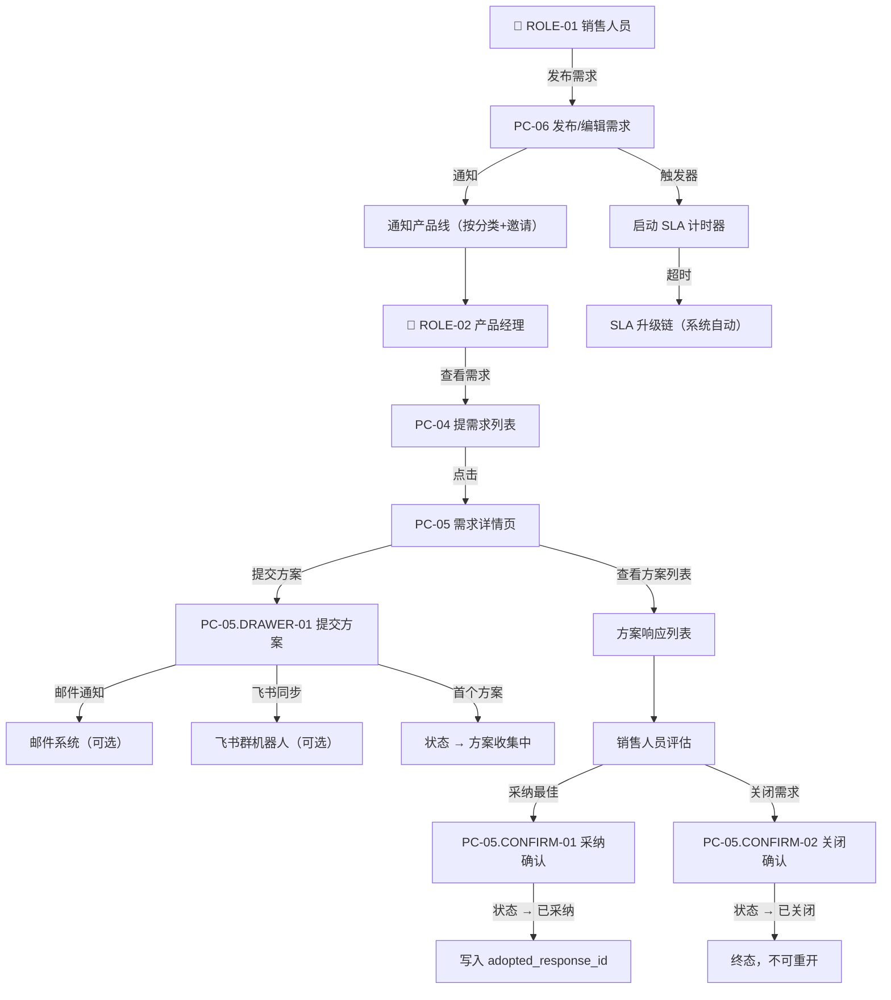

# MOD-02 商机需求与方案匹配 · 模块 PRD

> **模板**：B端后台模块（b-end-module）
> **上游数据源**：{{/3 feature-matrix.md}} + {{/3-1 information-architecture.md}} + {{/2 business-process.md}}
> **关联文档**：权限引用 `00_项目总纲.md` §3.2、状态机引用 `01_全局规约手册.md` §1.2、交互基线 `01_全局规约手册.md` §5~§6

---

## 文档变更记录

| 版本 | 日期 | 修改人 | 修改内容 | 影响范围 |
|-----|------|------|---------|---------|
| v1.0 | 2026-07-17 | PM | 初始版本 | MOD-02（含 MOD-04 互动嵌入）+ FEAT-0209~0212 |

---

> **权限归属**：详见 `00_项目总纲.md` §3.2。本模块涉及 FEAT-0201~0212（需求与方案匹配）、FEAT-0401~0403（互动反馈嵌入）。ROLE-01 可发布需求/采纳方案/关闭需求/评论/收藏/点赞/设置可见范围/邀请产品线；ROLE-02 可响应提供方案/配置邮件通知/飞书同步；ROLE-03 可管理全平台需求。
> **引用基准**：角色权限定义详见 `00_项目总纲.md`。

---

## 业务流程

### 核心业务流程

> 来源：{{/2 business-process.md §A-3 商机需求-方案匹配与采纳}}

### 状态流转

> 🛑 状态定义引用 `01_全局规约手册.md` §1.2 商机需求状态机。

| 当前状态 | 触发动作 | 操作角色 | 流转至状态 | 降级/回退 |
|---------|---------|---------|----------|----------|
| — | 发布需求 | ROLE-01 | Pending | — |
| Pending | 收到首个方案响应 | ROLE-02 | Collecting | — |
| Collecting | 采纳最佳方案 | ROLE-01（发布者） | Adopted | — |
| Collecting / Pending / Adopted | 手动关闭 | ROLE-01（发布者） | Closed | — |
| Pending / Collecting | 超期自动关闭 | 系统 | Closed | — |
| Adopted | 归档关闭 | ROLE-01 / 系统 | Closed | — |

---

## 功能需求说明

### 功能描述

> 来源：{{/3 feature-matrix.md MOD-02}}

商机需求与方案匹配是平台差异化核心模块，解决 PAIN-004（需求-方案匹配断裂）。销售人员通过 PC-06 发布需求（含紧急程度、可见范围、邀请产品线），系统自动匹配通知产品经理；产品经理通过 PC-04 发现需求，在 PC-05 中提交方案（可配置邮件通知和飞书同步）；销售人员评估方案后采纳最佳方案或关闭需求。全程 SLA 自动计时监控。

**覆盖 FEAT**：FEAT-0201~0212（12 项）+ FEAT-0401~0403（3 项互动，嵌入 PC-05）
**覆盖页面**：PC-04（提需求列表）、PC-05（需求详情页）、PC-06（发布/编辑需求）

### 非功能要求

遵循 `01_全局规约手册.md` 全局 NFR 基准。

---

### 页面说明：PC-04 提需求（需求列表）

> 来源：{{/3-1 PAGE-PC-04}}

**页面类型**：T1 筛选列表页 | **关联 FEAT**：FEAT-0201（入口）、FEAT-0204

**布局区域**：
- Z1 页面头部工具栏：[+ 发布需求] 按钮（仅 ROLE-01 可见）、分类筛选、紧急程度筛选、状态筛选、排序方式
- Z2 需求列表区
- Z3 分页器

---

#### 字段说明：PC-04

| 序号 | 字段名称 | 字段类型 | 必填 | 默认值 | 校验规则 | 备注 |
|-----|---------|---------|------|-------|---------|------|
| 1 | 分类筛选 | Cascader 级联选择 | 否 | 全部 | 引用 Category 实体树 | — |
| 2 | 紧急程度筛选 | Select 下拉 | 否 | 全部 | ENUM-URGENCY：normal / urgent / critical | — |
| 3 | 状态筛选 | Select 下拉 | 否 | 全部 | ENUM-REQ-STATUS：Pending / Collecting / Adopted / Closed | — |
| 4 | 排序方式 | Select 下拉 | 否 | latest | ENUM-SORT-REQ：latest / urgency_first / most_responses | — |
| 5 | 需求标题 | Text 只读 | — | — | VARCHAR(100) | — |
| 6 | 紧急程度 | Tag 只读 | — | normal | 特急红色/紧急橙色/普通绿色 | — |
| 7 | 行业场景 | Text 只读 | — | — | VARCHAR(50) | — |
| 8 | 分类标签 | Tag[] 只读 | — | — | 最多显示 3 个+N | — |
| 9 | 发布人 | Text 只读 | — | — | VARCHAR(50) | — |
| 10 | 发布人部门 | Text 只读 | — | — | VARCHAR(50) | — |
| 11 | 发布时间 | Text 只读 | — | — | 相对时间 ≤ 7 天，> 7 天显示日期 | — |
| 12 | 方案响应数 | Text 只读 | — | 0 | — | — |
| 13 | 浏览量 | Text 只读 | — | 0 | ≥1000 显示 "1k+" | — |
| 14 | 状态 | Tag 只读 | — | — | ENUM-REQ-STATUS，颜色区分 | — |
| 15 | 每页条数 | Select | 否 | 10 | 10/20/50 | — |

#### 枚举清单

| 枚举字段 | 枚举值 | 显示名称 | 说明 |
|---------|--------|---------|------|
| ENUM-URGENCY | normal | 普通 | 常规需求 |
| ENUM-URGENCY | urgent | 紧急 | 限时项目 |
| ENUM-URGENCY | critical | 特急 | 重大客户，触发置顶+加急通知 |
| ENUM-REQ-STATUS | Pending | 待响应 | 已发布等待方案 |
| ENUM-REQ-STATUS | Collecting | 方案收集中 | 已有方案响应 |
| ENUM-REQ-STATUS | Adopted | 已采纳 | 已标记最佳方案 |
| ENUM-REQ-STATUS | Closed | 已关闭 | 终态 |
| ENUM-SORT-REQ | latest | 最新发布 | 按 created_at DESC |
| ENUM-SORT-REQ | urgency_first | 紧急优先 | 特急>紧急>普通 |
| ENUM-SORT-REQ | most_responses | 最多响应 | 按 response_count DESC |

#### 操作说明：PC-04

| 操作名称 | 触发方式 | 前置条件 | 操作逻辑 | 操作反馈 |
|---------|---------|---------|---------|---------|
| "发布需求"按钮 | onClick | ROLE-01 已登录 | 路由跳转 → PC-06（新建模式） | — |
| 筛选项 | onChange | — | 重新请求列表，page 重置为 1 | Loading → 列表刷新 |
| 点击需求行 | onClick | — | 路由跳转 → PC-05（需求详情页），URL 携带 request_id | — |
| 分页器 | onChange | — | 请求对应页数据 | Loading → 列表刷新 |

#### 业务规则

| 规则编号 | 规则描述 |
|---------|---------|
| BR-013 | **需求可见性**：所有状态的需求对所有已登录用户可见（含已关闭，便于复用历史方案）。 |
| BR-014 | **特急置顶**：urgency=critical 的需求在默认排序下始终置顶。 |
| BR-015 | **发布按钮权限**："发布需求"按钮仅 ROLE-01 可见。 |

#### 异常与边界处理

| 场景 | 处理方式 |
|------|---------|
| 需求列表为空 | 空状态 + "暂无商机需求，销售人员可发布需求寻找方案" |
| 网络异常 | 错误提示 + 重试按钮 |

---

### 页面说明：PC-05 需求详情页

> 来源：{{/3-1 PAGE-PC-05}}

**页面类型**：T2 详情展示页 | **关联 FEAT**：FEAT-0203、FEAT-0204、FEAT-0205、FEAT-0206、FEAT-0211、FEAT-0212、FEAT-0401~0403

**布局区域**：
- Z1 面包屑：提需求 > {标题}
- Z2 需求基本信息：标题、紧急程度 Tag、状态 Tag、SLA 剩余时间倒计时、发布人·部门、发布时间、行业、分类标签、浏览量/点赞/收藏数、可见范围展示、已邀请产品线展示、[关闭需求]按钮（发布者/管理员可见）
- Z3 需求描述区：富文本渲染
- Z4 方案响应区：[+ 提交方案] 按钮（ROLE-02 可见）、方案列表（已采纳⭐置顶）+ [采纳为最佳] 按钮
- Z5 互动操作栏：👍 点赞 + ⭐ 收藏
- Z6 评论区：评论输入框 + 树形嵌套评论列表

**子视图**：PC-05.DRAWER-01（提交方案）、PC-05.CONFIRM-01（采纳确认）、PC-05.CONFIRM-02（关闭确认）

---

#### 字段说明：PC-05

| 序号 | 字段名称 | 字段类型 | 必填 | 默认值 | 校验规则 | 备注 |
|-----|---------|---------|------|-------|---------|------|
| 1 | 面包屑 | Breadcrumb 只读 | — | — | 提需求 > {title} | — |
| 2 | 标题 | Text 只读 | — | — | VARCHAR(100) | — |
| 3 | 紧急程度 | Tag 只读 | — | — | ENUM-URGENCY | — |
| 4 | 状态 | Tag 只读 | — | — | ENUM-REQ-STATUS | — |
| 5 | SLA 剩余时间 | Countdown 只读 | — | — | 仅 status∈{Pending, Collecting} 显示；超时显示红色"已超时" | 引用 `01_全局规约手册.md` §5 SLA 阈值 |
| 6 | 发布人 | Text 只读 | — | — | VARCHAR(50) | — |
| 7 | 发布人部门 | Text 只读 | — | — | VARCHAR(50) | — |
| 8 | 发布时间 | Text 只读 | — | — | YYYY-MM-DD HH:mm | — |
| 9 | 行业场景 | Text 只读 | — | — | VARCHAR(50) | — |
| 10 | 分类标签 | Tag[] 只读 | — | — | — | — |
| 11 | 浏览量 | Text 只读 | — | 0 | 24h 内同一用户去重 | — |
| 12 | 点赞数 | Text 只读 | — | 0 | — | — |
| 13 | 收藏数 | Text 只读 | — | 0 | — | — |
| 14 | 可见范围 | Text+Tag 只读 | — | — | JSON {type, values}，展示为 Tag 列表 | FEAT-0209 |
| 15 | 已邀请产品线 | Tag[] 只读 | — | — | 未指定时显示"系统自动匹配" | FEAT-0210 |
| 16 | 需求描述 | RichTextViewer 只读 | — | — | TEXT，支持图片/表格渲染 | — |
| 17 | 方案列表 | List 只读 | — | — | 按 is_adopted DESC + created_at ASC | — |
| 18 | 方案内容（每项） | Text 只读 | — | — | TEXT，摘要截断 200 字 | — |
| 19 | 方案附件（每项） | FileList 只读 | — | — | JSON | — |
| 20 | 响应人（每项） | Text 只读 | — | — | VARCHAR(50) | — |
| 21 | 是否已采纳（每项） | Badge 只读 | — | false | 采纳项显示 ⭐ 最佳 | — |
| 22 | 是否已点赞 | IconButton toggle | — | false | 当前用户维度 | — |
| 23 | 是否已收藏 | IconButton toggle | — | false | 当前用户维度 | — |
| 24 | 评论内容 | TextArea | 提交时必填 | — | VARCHAR(500)，非空校验，XSS 过滤 | — |
| 25 | 评论列表 | List 只读 | — | — | 嵌套树形，无限层级；is_deleted 显示 "[该评论已被作者删除]" | — |
| 26 | 父评论 ID | Hidden | — | NULL | 一级评论为 NULL | — |

#### 操作说明：PC-05

| 操作名称 | 触发方式 | 前置条件 | 操作逻辑 | 操作反馈 |
|---------|---------|---------|---------|---------|
| 面包屑"提需求" | onClick | — | 路由跳转 → PC-04 | — |
| "关闭需求"按钮 | onClick | 当前用户=publisher_id，status∈{Pending, Collecting, Adopted} | 打开 PC-05.CONFIRM-02 | — |
| "提交方案"按钮 | onClick | ROLE-02 已登录，status∈{Pending, Collecting} | 打开 PC-05.DRAWER-01 | — |
| "采纳为最佳"按钮 | onClick | 当前用户=publisher_id，status∈{Collecting}，该方案未被采纳 | 打开 PC-05.CONFIRM-01 | — |
| 方案附件"下载" | onClick | — | 浏览器下载 | 3s 防重复 |
| 方案"展开全文" | onClick | response_content 超 200 字 | 展开完整方案内容 | — |
| 点赞 | onClick | 已登录 | toggle，POST/DELETE Interaction(type=like, target_type=Request) | 数字 ±1；Toast；1s 防抖 |
| 收藏 | onClick | 已登录 | toggle，POST/DELETE Interaction(type=collect, target_type=Request) | 图标切换；Toast；1s 防抖 |
| "发表评论" | onClick | 已登录，comment_text 非空 | POST Interaction(type=comment, target_type=Request) | Toast "评论成功"；清空；3s 防抖 |
| "回复" | onClick | 已登录 | 展开内联输入框 → POST Interaction(type=comment, target_type=Request, parent_comment_id) | Toast "回复成功"；3s 防抖 |
| "删除"评论 | onClick | 已登录，当前用户=评论作者 | 二次确认 → PUT Interaction/{id}/soft-delete | Toast "评论已删除"；3s 防抖 |

#### 业务规则

| 规则编号 | 规则描述 |
|---------|---------|
| BR-016 | **方案提交权限**：仅 ROLE-02 可提交方案；发布者不可自己响应自己的需求。 |
| BR-017 | **采纳权限**：仅需求发布者可标记最佳方案。 |
| BR-018 | **SLA 倒计时**：SLA 剩余时间按 urgency 对应时限实时倒计时（特急 2h / 紧急 4h / 普通 24h），超时显示红色"已超时 Xh"。引用 `01_全局规约手册.md` §5。 |
| BR-019 | **方案排序**：已采纳方案始终置顶显示 ⭐ 标记，其余按提交时间正序。 |
| BR-020 | **关闭不可重开**：需求关闭后为终态，不可重新打开。 |
| BR-021 | **浏览量去重**：同一用户 24h 内重复访问去重。 |

#### 异常与边界处理

| 场景 | 处理方式 |
|------|---------|
| 需求不存在（request_id 无效） | 404 页面 + 返回提需求 |
| 已关闭需求操作限制 | 禁止提交方案/采纳/再次关闭，仅可查看和评论 |
| 邮件/飞书发送失败 | 方案正常提交成功，Toast "方案提交成功（邮件/飞书推送失败，已记录重试队列）" |

---

### 子视图：PC-05.DRAWER-01 提交方案响应

**触发来源**：Z4"提交方案"按钮 | **视图形态**：Drawer 抽屉（720px 右侧） | **阻断级别**：模态

#### 字段说明

| 序号 | 字段名称 | 字段类型 | 必填 | 默认值 | 校验规则 | 备注 |
|-----|---------|---------|------|-------|---------|------|
| 1 | 方案内容 (content) | RichTextEditor | ✅ | — | TEXT，非空校验 | 支持图片/表格/代码块 |
| 2 | 附件 (attachments) | Upload 多文件 | 否 | [] | 单文件 ≤ 50MB，总量 ≤ 200MB | 引用 `01_全局规约手册.md` §5 |
| 3 | 邮件通知对象 (email_recipients) | Checkbox.Group | 否 | ['publisher'] | 可选：publisher（需求发布者）/ responders（已响应产品线人员）/ followers（关注者） | FEAT-0211 |
| 4 | 自定义邮件接收人 (custom_email_recipients) | Select tags | 否 | [] | 支持输入邮箱地址或搜索人员 | FEAT-0211 |
| 5 | 飞书机器人同步 (feishu_sync) | Switch | 否 | true | BOOLEAN | FEAT-0212 |

#### 操作说明

| 操作名称 | 触发方式 | 前置条件 | 操作逻辑 | 操作反馈 |
|---------|---------|---------|---------|---------|
| "提交方案" | onClick | content 非空 | POST /solution-responses；首方案触发 Pending→Collecting；按配置发送邮件/飞书 | Toast "方案提交成功，已发送邮件通知：{角色列表}、{自定义邮箱列表}，已同步至飞书机器人"；关闭抽屉；刷新方案列表；3s 防抖 |
| "取消" | onClick | — | 检测内容 → 有："放弃已输入内容？" [确认/取消] → 关闭；无：直接关闭 | — |

#### 业务规则

| 规则编号 | 规则描述 |
|---------|---------|
| BR-022 | **同一需求重复响应**：同一产品经理可对同一需求多次提交方案，不做去重限制。 |
| BR-065 | **邮件通知**：提交成功后，若 email_recipients 或 custom_email_recipients 非空，自动发送邮件通知。邮件内容含方案摘要、提交人、需求链接。 |
| BR-066 | **飞书同步**：提交成功后，若 feishu_sync=true，将方案摘要推送至默认飞书群机器人。 |

---

### 子视图：PC-05.CONFIRM-01 采纳方案确认

| 操作名称 | 触发方式 | 前置条件 | 操作逻辑 | 操作反馈 |
|---------|---------|---------|---------|---------|
| "确认采纳" | onClick | — | PUT /requests/{id}/adopt，写入 adopted_response_id，status → Adopted，通知方案提供者 | Toast "已采纳"；页面刷新；3s 防抖 |
| "取消" | onClick | — | 关闭弹窗 | — |

- Confirm 标题："采纳为最佳方案"；描述："采纳后该方案将标记为最佳，需求状态变为已采纳。"

---

### 子视图：PC-05.CONFIRM-02 关闭需求确认

| 操作名称 | 触发方式 | 前置条件 | 操作逻辑 | 操作反馈 |
|---------|---------|---------|---------|---------|
| "确认关闭" | onClick | — | PUT /requests/{id}/close，status → Closed | Toast "需求已关闭"；页面刷新；3s 防抖 |
| "取消" | onClick | — | 关闭弹窗 | — |

- Confirm 标题："关闭需求"；描述："关闭后将无法重新打开，也无法继续接收方案响应。"
- 若无已采纳方案，额外提示："⚠️ 该需求尚无采纳方案，确认直接关闭？"

---

### 页面说明：PC-06 发布/编辑需求

> 来源：{{/3-1 PAGE-PC-06}}

**页面类型**：T6 表单录入页 | **关联 FEAT**：FEAT-0201、FEAT-0202、FEAT-0207、FEAT-0209、FEAT-0210

**布局区域**：
- Z1 页面标题栏：< 返回 + "发布商机需求" / "编辑商机需求"
- Z2 基础信息区：标题、紧急程度（Select）、行业场景、分类标签（Cascader 多选）
- Z2.5 可见范围卡片：Radio.Group（全部可见 / 按部门 / 按人员）+ 条件选择器
- Z2.6 邀请产品线卡片：Cascader 多选（可选，最多 10 个）
- Z3 富文本编辑区
- Z4 相似需求推荐区（P2 占位）
- Z5 底部操作栏：[发布需求]

**子视图**：PC-06.CONFIRM-01（发布确认）

---

#### 字段说明：PC-06

| 序号 | 字段名称 | 字段类型 | 必填 | 默认值 | 校验规则 | 备注 |
|-----|---------|---------|------|-------|---------|------|
| 1 | 标题 (title) | Input | ✅ | — | VARCHAR(100)，1~100 字符 | — |
| 2 | 紧急程度 (urgency) | Select | ✅ | normal | ENUM-URGENCY | — |
| 3 | 行业场景 (industry) | Input | 否 | — | VARCHAR(50) | — |
| 4 | 分类标签 (category_ids) | Cascader 多选 | ✅ | — | 1~5 个 | — |
| 5 | 需求描述 (description) | RichTextEditor | ✅ | — | TEXT，非空校验 | 支持图片/表格 |
| 6 | 可见范围类型 (visibility_type) | Radio.Group | ✅ | all | all / dept / personnel | FEAT-0209 |
| 7 | 可见部门 (visible_depts) | TreeSelect 多选 | 条件必填 | — | visibility_type=dept 时必填 | FEAT-0209 |
| 8 | 可见人员 (visible_personnel) | Select 多选 | 条件必填 | — | visibility_type=personnel 时必填，按姓名/工号搜索 | FEAT-0209 |
| 9 | 邀请产品线 (invited_product_lines) | Cascader 多选 | 否 | — | 最多 10 个 | FEAT-0210 |
| 10 | 相似需求 (similar_requests) | List 只读 | — | — | P2 功能，v1.0 占位 | FEAT-0207 |

#### 操作说明：PC-06

| 操作名称 | 触发方式 | 前置条件 | 操作逻辑 | 操作反馈 |
|---------|---------|---------|---------|---------|
| "返回" | onClick | — | 检测变更 → 有："离开将丢失内容" [确认/取消]；无：直接返回 PC-04 | — |
| "发布需求" | onClick | title+urgency+category_ids+description 均已填写 | 打开 PC-06.CONFIRM-01 | 校验失败 → 标红 + Toast；3s 防抖 |
| 可见范围切换 | onChange | — | all → 隐藏子选择器；dept → 展示部门 TreeSelect；personnel → 展示人员 Select | 条件必填联动 |
| 产品线选择 | onChange | — | 更新 invitedProductLines 状态 | 底部提示更新 |

#### 子视图：PC-06.CONFIRM-01 发布确认

| 操作名称 | 触发方式 | 前置条件 | 操作逻辑 | 操作反馈 |
|---------|---------|---------|---------|---------|
| "确认发布" | onClick | — | POST /opportunity-requests，status → Pending，触发 SLA 计时+通知匹配产品经理 | Toast "需求已发布"；路由跳转 → PC-05；3s 防抖 |
| "取消" | onClick | — | 关闭弹窗 | — |

- Confirm 标题："确认发布需求"；描述："发布后将通知相关产品线，并启动 SLA 响应计时。"
- 弹窗内展示：① 可见范围摘要 ② 邀请产品线列表（有邀请时显示产品线名称，无邀请时显示"系统自动匹配"）
- urgency=critical 时，额外红色提示："⚠️ 特急需求将触发加急通知并置顶展示。"

#### 业务规则

| 规则编号 | 规则描述 |
|---------|---------|
| BR-023 | **需求无草稿**：商机需求不支持草稿功能（与商机信息不同），发布即生效。 |
| BR-024 | **特急加急通知**：urgency=critical 发布后触发加急通知（站内弹窗+飞书@相关产品经理），并在提需求置顶。 |
| BR-025 | **相似需求检测**（P2 占位）：提交标题后异步检索已采纳需求的 title+description 相似度 > 70% 的历史需求。 |
| BR-026 | **发布触发 SLA**：需求发布后立即启动 SLA 计时器，按 urgency 对应时限开始倒计时。引用 `01_全局规约手册.md` §5。 |
| BR-063 | **可见范围默认值**：新建需求默认"全部可见"，切换为按部门/人员但未指定值时，发布校验拦截。 |
| BR-064 | **邀请产品线定向通知**：指定 invited_product_lines 则仅通知对应产品线产品经理；未指定则按分类标签自动匹配。 |

#### 异常与边界处理

| 场景 | 处理方式 |
|------|---------|
| 网络异常发布失败 | Toast "发布失败，请重试" + 表单内容保留不清空 |

---

## 验收标准（Acceptance Criteria）

| AC-ID | Given | When | Then | 测试类型 |
|-------|-------|------|------|---------|
| AC-101 | ROLE-01 登录，进入 PC-06 | 填写标题+紧急程度+分类+描述，默认可见范围"全部可见"，点击发布 → 确认 | status=Pending，跳转 PC-05，SLA 计时器启动，通知推送 | 功能测试 |
| AC-102 | ROLE-01 在 PC-06 | 选择可见范围"按部门"，选择"A部门"，点击发布 | 仅 A 部门人员可见该需求 | 功能测试 |
| AC-103 | ROLE-01 在 PC-06 | 选择紧急程度"特急"，点击发布 | 需求发布后触发加急通知 + 在 PC-04 置顶 | 功能测试 |
| AC-104 | ROLE-01 在 PC-06 | 选择邀请产品线"车规 GNSS"，发布 | 仅车规 GNSS 产品经理收到定向通知 | 功能测试 |
| AC-105 | ROLE-01 在 PC-06 | 标题填空，点击发布 | 标题标红 + Toast "请填写必填字段" | 异常测试 |
| AC-106 | ROLE-02 登录，进入 PC-05 | 点击"提交方案" → 输入内容+附件 → 勾选邮件通知"需求发布者" → 开启飞书同步 → 提交 | 方案提交成功，Toast 提示邮件已发送+飞书已同步；方案列表刷新 | 功能测试 |
| AC-107 | ROLE-02 在 PC-05.DRAWER-01 | 方案内容为空，点击提交 | 标红 + Toast | 异常测试 |
| AC-108 | ROLE-02 在 PC-05.DRAWER-01 | 关闭飞书同步开关，提交 | 方案提交成功，不推送飞书机器人 | 功能测试 |
| AC-109 | 需求发布者进入 PC-05 | 有 3 个方案，点击其中一个"采纳为最佳"→ 确认 | 该方案显示 ⭐ 最佳标记，status=Adopted，通知方案提供者 | 功能测试 |
| AC-110 | 需求发布者进入 PC-05 | status=Collecting，点击"关闭需求"→ 确认 | status=Closed，"关闭需求"按钮隐藏 | 功能测试 |
| AC-111 | 需求发布者进入 PC-05 | status=Collecting 且无已采纳方案，点击关闭确认 | 弹窗提示"⚠️ 该需求尚无采纳方案" | 边界测试 |
| AC-112 | 用户访问已关闭需求 | status=Closed | "提交方案"和"采纳"和"关闭"按钮均不展示，仅可查看和评论 | 异常测试 |
| AC-113 | 需求 SLA 超时 | urgency=normal，24h 后无方案 | 状态栏显示红色"已超时"，触发 SLA 升级链 | 功能测试 |
| AC-114 | 非需求发布者点击"采纳" | PC-05 某个方案行 | "采纳为最佳"按钮不可见 | 权限测试 |

---

*文档版本：v1.0 | 渲染日期：2026-07-17 | 节点：/5 PRD*
*数据源：feature-matrix.md（/3）+ information-architecture.md（/3-1）+ business-process.md（/2）*
