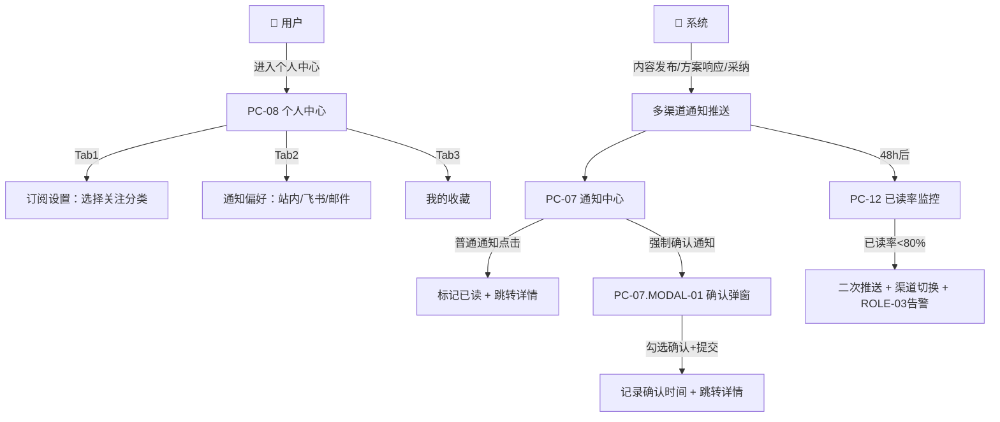

# MOD-03 通知与订阅 · 模块 PRD

> **模板**：B端后台模块（b-end-module）
> **上游数据源**：{{/3 feature-matrix.md}} + {{/3-1 information-architecture.md}} + {{/2 business-process.md}}
> **关联文档**：权限引用 `00_项目总纲.md` §3.2、状态机引用 `01_全局规约手册.md` §1.3、交互基线 `01_全局规约手册.md` §5~§6

---

## 文档变更记录

| 版本 | 日期 | 修改人 | 修改内容 | 影响范围 |
|-----|------|------|---------|---------|
| v1.0 | 2026-07-17 | PM | 初始版本 | MOD-03 全部 FEAT |

---

> **权限归属**：详见 `00_项目总纲.md` §3.2。本模块涉及 FEAT-0301~0307。ROLE-01/ROLE-02 可配置订阅/查看通知/标记已读/强制确认；ROLE-03 额外可监控已读率。
> **引用基准**：状态机引用 `01_全局规约手册.md` §1.3。

---

## 业务流程

### 状态流转

> 🛑 引用 `01_全局规约手册.md` §1.3 通知状态机。

| 当前状态 | 触发动作 | 操作角色 | 流转至状态 |
|---------|---------|---------|----------|
| — | 系统生成通知 | 系统 | Unread |
| Unread | 用户点击通知 | 用户 | Read |
| Unread | "全部标记已读" | 用户 | Read |

---

## 功能描述

> 来源：{{/3 feature-matrix.md MOD-03}}

通知与订阅模块解决 PAIN-002（触达无效）。用户通过 PC-08 配置订阅分类和通知渠道偏好；系统在内容发布/方案响应/采纳时自动匹配推送；用户通过 PC-07 统一管理通知，关键变更强制确认阅读。系统 48h 后自动监控已读率，低于 80% 触发二次推送。

**覆盖 FEAT**：FEAT-0301~0307（7 项）
**覆盖页面**：PC-07（通知中心）、PC-08（个人中心）、PC-15（通知偏好设置）

### 非功能要求

遵循 `01_全局规约手册.md` 全局 NFR 基准。通知保留 90 天超期归档。

---

## 页面说明：PC-07 通知中心

**页面类型**：T1 筛选列表页 | **关联 FEAT**：FEAT-0304、FEAT-0305、FEAT-0307

### 字段说明

| 序号 | 字段名称 | 字段类型 | 必填 | 默认值 | 校验规则 | 备注 |
|-----|---------|---------|------|-------|---------|------|
| 1 | 未读数 | Badge | — | 0 | 实时同步 APP-SHELL 铃铛角标 | — |
| 2 | 阅读状态筛选 | SegmentedControl | 否 | all | all / unread / read | — |
| 3 | 类型筛选 | Select | 否 | 全部 | ENUM-NOTIFY-TYPE：publish / response / adopt / system | — |
| 4 | 已读状态 | Dot 指示器 | — | 🔴未读 | is_read 布尔 | — |
| 5 | 通知类型 | Tag 只读 | — | — | ENUM-NOTIFY-TYPE | — |
| 6 | 通知标题 | Text 只读 | — | — | VARCHAR(200)，系统模板生成 | — |
| 7 | 触发人 | Text 只读 | — | — | VARCHAR(50)，系统通知无触发人 | — |
| 8 | 通知时间 | Text 只读 | — | — | 相对时间 ≤ 7 天 | — |
| 9 | 强制确认标记 | Badge 只读 | — | false | 显示 [!强制] 标签 | FEAT-0307 |
| 10 | 目标类型/ID | Hidden | — | — | 用于跳转：Opportunity → PC-02，Request → PC-05 | — |
| 11 | 每页条数 | Select | 否 | 20 | 20/50/100 | — |

### 操作说明

| 操作名称 | 触发方式 | 前置条件 | 操作逻辑 | 操作反馈 |
|---------|---------|---------|---------|---------|
| 筛选/类型切换 | onChange | — | 重新请求列表，page 重置为 1 | Loading → 刷新 |
| "全部标记已读" | onClick | 存在未读通知 | PUT /notifications/read-all | Toast "已全部标记已读"；未读数归零；3s 防抖 |
| 点击普通通知 | onClick | is_force_confirm=false | 标记已读 → 按 target_type 跳转详情 | 未读数 -1；行变为已读样式 |
| 点击强制确认通知 | onClick | is_force_confirm=true | 打开 PC-07.MODAL-01 | — |

### 业务规则

| 规则编号 | 规则描述 |
|---------|---------|
| BR-027 | **自动标记已读**：点击通知行即自动标记已读，无需额外操作。 |
| BR-028 | **未读角标同步**：通知中心未读数与 TOPBAR 铃铛角标实时双向同步。 |
| BR-029 | **强制确认不可批量**：is_force_confirm=true 的通知不受"全部标记已读"影响，必须逐条确认。 |
| BR-030 | **通知保留期限**：90 天超期自动归档不展示。 |

### 异常处理

| 场景 | 处理方式 |
|------|---------|
| 通知为空 | 空状态 + "暂无通知" |
| 通知目标已删除 | Toast "该内容已不存在"，标记已读但不跳转 |

---

### 子视图：PC-07.MODAL-01 强制确认阅读弹窗

**视图形态**：Modal 模态对话框（640px） | **阻断级别**：模态（不可点击遮罩关闭，不可 ESC）

| 序号 | 字段名称 | 字段类型 | 必填 | 校验规则 | 备注 |
|-----|---------|---------|------|---------|------|
| 1 | 变更标题 | Text 只读 | — | VARCHAR(200) | — |
| 2 | 变更内容摘要 | RichTextViewer 只读 | — | TEXT | — |
| 3 | 确认勾选 | Checkbox | ✅ | 必须勾选才能提交 | "我已阅读并知悉以上变更内容" |

| 操作名称 | 触发方式 | 前置条件 | 操作逻辑 | 操作反馈 |
|---------|---------|---------|---------|---------|
| "确认已阅读" | onClick | checkbox=true | PUT /notifications/{id}/force-confirm，记录确认时间 → 跳转详情 | Toast "已确认"；3s 防抖 |
| 遮罩层/ESC | — | — | 阻止关闭（强制确认不允许关闭） | — |

| 规则编号 | 规则描述 |
|---------|---------|
| BR-031 | **强制确认审计**：确认操作记录用户 ID+确认时间，供 ROLE-03 查看未确认名单并报送主管。 |
| BR-032 | **旧版本失效**：关键变更（如价格调整）发布后，关联旧版本文档自动标记"⚠️ 已失效"水印。 |

---

## 页面说明：PC-08 个人中心

**页面类型**：T2 详情展示页 | **关联 FEAT**：FEAT-0301、FEAT-0302、FEAT-0402

### 布局：Z1 用户信息卡片 → Z2 Tab：[订阅设置 | 通知偏好 | 我的收藏 | 我的发布]

### 字段说明

| 序号 | 字段名称 | 字段类型 | 必填 | 校验规则 | 备注 |
|-----|---------|---------|------|---------|------|
| 1 | 头像/姓名/部门/工号 | 只读 | — | SSO 同步不可编辑 | — |
| 2 | 角色 | Tag 只读 | — | ROLE-01/02/03 | — |
| 3 | 订阅分类 | Cascader 多选 | 否 | 引用 Category 实体树，无上限 | Tab1 |
| 4 | 站内通知 | Checkbox | — | 始终勾选不可取消（强制渠道） | Tab2 |
| 5 | 飞书通知 | Checkbox | — | 默认开启 | Tab2 |
| 6 | 邮件通知 | Checkbox | — | 默认关闭 | Tab2 |
| 7 | 收藏类型筛选 | SegmentedControl | 否 | opportunity / request | Tab3 |
| 8 | 收藏列表 | List 只读 | — | 按收藏时间 DESC | Tab3 |
| 9 | 发布记录列表 | List 只读 | — | 按 created_at DESC | Tab4 |

### 操作说明

| 操作名称 | 触发方式 | 前置条件 | 操作逻辑 | 操作反馈 |
|---------|---------|---------|---------|---------|
| Tab 切换 | onClick | — | 切换内容区，URL hash 同步 | — |
| 订阅"保存" | onClick | — | PUT /users/me/subscriptions | Toast "订阅设置已保存"；3s 防抖 |
| 通知偏好"保存" | onClick | — | PUT /users/me/notification-preferences | Toast "通知偏好已保存"；3s 防抖 |
| 收藏项点击 | onClick | — | 跳转 PC-02（商机）或 PC-05（需求） | — |
| "取消收藏" | onClick | — | DELETE Interaction(type=collect) | Toast "已取消收藏"；1s 防抖 |
| 发布记录点击 | onClick | — | 跳转 PC-02 或 PC-05 | — |

### 业务规则

| 规则编号 | 规则描述 |
|---------|---------|
| BR-033 | **站内通知强制**：站内通知始终开启不可取消，确保最低触达覆盖。 |
| BR-034 | **订阅为空时全推**：未配置订阅分类时，默认接收所有分类通知。 |
| BR-035 | **个人信息不可编辑**：姓名/部门/工号/角色由 SSO 同步，仅展示。 |

### 异常处理

| 场景 | 处理方式 |
|------|---------|
| 收藏项已删除 | 灰显 + "内容已删除"，点击不跳转 |
| SSO 信息同步延迟 | 底部灰色提示"信息每 24h 自动同步" |

---

## 页面说明：PC-15 通知偏好设置

> **页面类型**：T6 表单页 | **关联 FEAT**：FEAT-0301、FEAT-0302 | **优先级**：P2
> 入口：PC-08 个人中心 → [通知偏好]

### 字段说明

| 序号 | 字段名称 | 字段类型 | 必填 | 备注 |
|-----|---------|---------|------|------|
| 1~N | 通知类型 × 接收渠道矩阵 | Switch 开关矩阵 | 否 | 行：新方案/需求响应/评论/系统公告...；列：站内信/飞书/邮件；站内信列强制开启不可关 |

---

## 验收标准

| AC-ID | Given | When | Then | 测试类型 |
|-------|-------|------|------|---------|
| AC-201 | 用户进入 PC-07，有 5 条未读通知 | 点击"全部标记已读" | 5 条全部变已读，未读数归零，铃铛角标同步清零 | 功能测试 |
| AC-202 | 用户有 1 条强制确认通知（价格变更） | 点击该通知 | 弹出强制确认 Modal，不可 ESC/遮罩关闭，必须勾选确认 | 功能测试 |
| AC-203 | 用户未勾选确认 checkbox | 点击"确认已阅读" | 按钮 disabled，不可点击 | 边界测试 |
| AC-204 | 用户进入 PC-08 Tab2 | 取消飞书勾选 → 保存 | 后续通知仅通过站内推送，不再推送飞书 | 功能测试 |
| AC-205 | 用户在 Tab3 点击收藏项 | 对应商机已删除 | 灰显 + "内容已删除"，点击不跳转 | 异常测试 |
| AC-206 | 系统生成通知后 48h | 已读率 < 80% | 二次推送触发，ROLE-03 收到告警 | 功能测试 |
| AC-207 | 用户配置订阅分类"5G 模组" | 产品经理发布匹配分类的方案 | 用户收到通知，非订阅分类不推送 | 功能测试 |

---

*文档版本：v1.0 | 渲染日期：2026-07-17 | 节点：/5 PRD*
