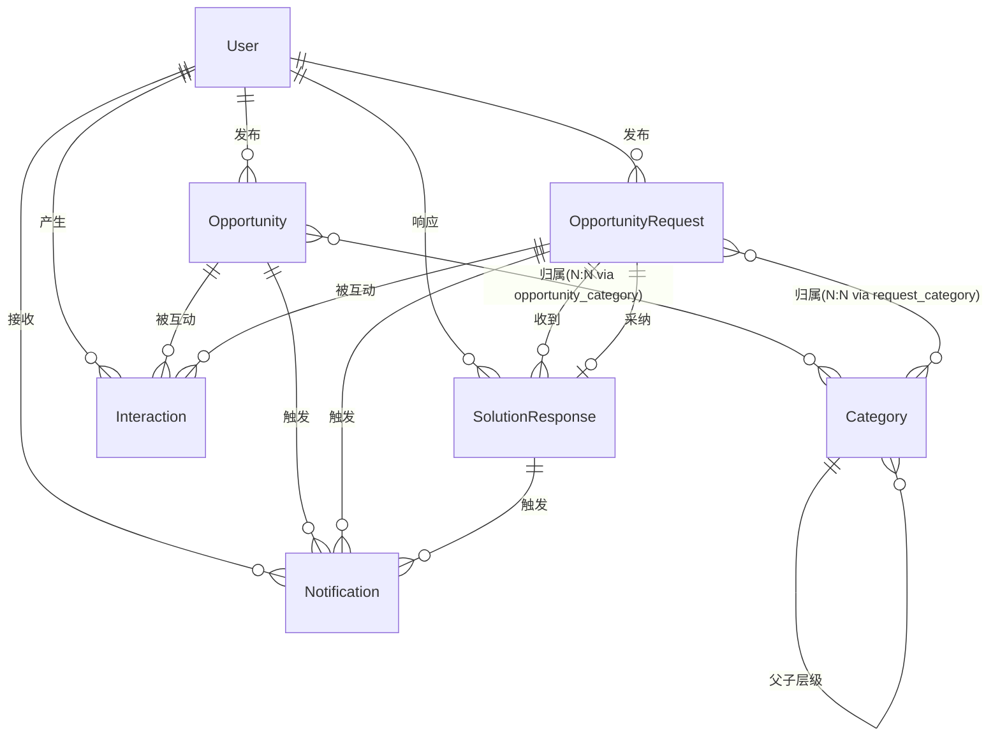

# Quectel商机信息发布平台 — 需求调研数据包

> 节点：/0 Research
> 版本：v1.0
> 日期：2026-05-14
> 来源：销售部新系统需求评估会议（2026-05-12）+ PM三轮投料 + 竞品参考

---

## 一、项目基座

| 字段 | 内容 |
|------|------|
| **项目名称** | Quectel商机信息发布平台 |
| **触发事件** | 销售部门商机信息分散在微信群、飞书群、邮件、线下文档中，缺乏统一平台管理；产品经理发布新方案无高效触达渠道；销售有商机需求时无法快速匹配产品方案 {{来源：会议纪要 2026-05-12}} |
| **不做的后果** | 销售获取产品信息效率持续低下，商机响应周期长，跨部门协作靠人肉传递，优质方案埋没；待定量化 |
| **Business Outcome** | 待定（需业务方确认量化目标） |
| **Product Outcome** | 待定（需上线后度量） |
| **成功度量方案** | 待测量——建议上线后跟踪：平台活跃率、商机发布量、方案响应时效、采纳率 |
| **决策链** | 待定 |
| **企业规模** | 销售500+人，产品500+人 |
| **目标用户** | 销售人员、产品经理、运营管理员 |

---

## 二、痛点机会树

### PAIN-001：商机信息分散，销售获取效率低

| 字段 | 内容 |
|------|------|
| **痛点描述** | 产品信息、解决方案、成功案例分散在多个渠道（微信群、飞书群、邮件、共享文档），销售需要逐个渠道翻找 {{会议纪要}} |
| **影响角色** | ROLE-01（销售人员） |
| **当前应对** | 私聊产品经理、翻聊天记录、靠个人收藏和记忆 |
| **发生频率** | 日常高频，几乎每天 |
| **量化损失** | 待定（建议度量：销售每周花在信息查找上的时间） |
| **情绪标注** | 😤 烦躁——反复问同样的问题，产品也烦 |
| **机会假设** | 集中化信息平台可将查找时间降低70%+ |
| **关联 IN-SCOPE** | IN-01, IN-02, IN-03 |
| **L2子节点** | L2-1：产品方案无统一发布入口 → 解决后消解父痛点80%；L2-2：历史信息无法检索 → 解决后消解父痛点60% |

### PAIN-002：产品发布信息无有效触达渠道

| 字段 | 内容 |
|------|------|
| **痛点描述** | 产品经理发布新产品/方案时，只能群发消息或口头通知，信息容易被淹没，销售无法第一时间知道新动态 {{会议纪要 + PM投料}} |
| **影响角色** | ROLE-01（销售人员）、ROLE-02（产品经理） |
| **当前应对** | 飞书群发消息、部门会议口头同步 |
| **发生频率** | 每周数次 |
| **量化损失** | 待定（建议度量：新产品发布后销售知晓率和知晓时效） |
| **情绪标注** | 😩 无力——产品经理觉得发了但销售说没看到 |
| **机会假设** | 多渠道主动推送（站内+飞书+邮件）可使知晓率>90% |
| **关联 IN-SCOPE** | IN-04, IN-10, IN-11 |
| **L2子节点** | L2-1：群消息易被刷屏淹没 → 解决后消解父痛点70%；L2-2：无订阅机制，无法精准推送 → 解决后消解父痛点60% |

### PAIN-003：产品与销售缺乏结构化反馈通道

| 字段 | 内容 |
|------|------|
| **痛点描述** | 销售对产品方案的反馈（好不好用、客户反应）无结构化渠道沉淀，只能靠零散聊天，产品无法有效收集一线反馈反哺研发 {{PM投料}} |
| **影响角色** | ROLE-01（销售人员）、ROLE-02（产品经理） |
| **当前应对** | 微信/飞书私聊、季度复盘会口头反馈 |
| **发生频率** | 持续存在 |
| **量化损失** | 待定 |
| **情绪标注** | 😕 遗憾——有价值反馈被遗忘 |
| **机会假设** | 互动功能（评论/点赞/收藏）可沉淀可量化的反馈数据 |
| **关联 IN-SCOPE** | IN-05, IN-22 |
| **L2子节点** | L2-1：反馈无法关联到具体产品/方案 → 解决后消解父痛点70% |

### PAIN-004：销售有商机需求但找不到对口产品方案

| 字段 | 内容 |
|------|------|
| **痛点描述** | 销售发现客户需求后，不知道公司是否有对应产品/方案，靠私聊碎片化询问各产品线，响应慢、无法追踪、优质方案埋没 {{PM投料}} |
| **影响角色** | ROLE-01（销售人员）、ROLE-02（产品经理） |
| **当前应对** | 微信群/飞书群发问"谁有XX方案？"，多人零散回复，信息淹没 |
| **发生频率** | 每周多次 |
| **量化损失** | 待定（建议度量：需求从发布到获得有效方案的平均时长） |
| **情绪标注** | 😫 焦急——客户在等方案，内部找不到人 |
| **机会假设** | 需求-方案匹配机制可将响应时效从天级降至小时级 |
| **关联 IN-SCOPE** | IN-12, IN-13, IN-14, IN-16 |
| **L2子节点** | L2-1：无统一需求发布入口 → 解决后消解父痛点60%；L2-2：无方案响应和采纳追踪 → 解决后消解父痛点80% |

---

## 三、利益相关方地图

### 3.1 利益相关方识别

| ID | 角色 | 利益诉求 | 影响力 | 态度预判 |
|----|------|---------|--------|---------|
| STKH-01 | 销售部负责人 | 提升团队获取商机信息效率，缩短成单周期 | 高 | 积极推动 |
| STKH-02 | 产品管理部负责人 | 高效发布产品信息，收集一线反馈反哺研发 | 高 | 支持 |
| STKH-03 | IT部门 | 系统可控、安全合规、与现有系统集成 | 中 | 中立偏支持 |
| STKH-04 | 管理层 | 看到商机流转数据、团队协作效率提升 | 高 | 关注ROI |

### 3.2 RACI矩阵

| 事项 | STKH-01 销售部 | STKH-02 产品部 | STKH-03 IT | STKH-04 管理层 |
|------|---------------|---------------|------------|---------------|
| 范围变更决策 | C | C | I | A |
| 技术选型 | I | I | R | A |
| 上线决策 | C | C | R | A |
| 内容规范制定 | R | A | I | I |
| 分类体系定义 | C | R | I | A |

---

## 四、角色画像

### ROLE-01：销售人员

| 字段 | 内容 |
|------|------|
| **角色名** | 销售人员 |
| **用户规模** | 500+人 |
| **核心JTBD** | 当我在拜访客户前/中/后，我想要快速找到匹配客户需求的产品方案和成功案例，以便高效响应客户、提升成单率 |
| **关键任务** | ① 按行业/产品分类浏览商机信息；② 搜索特定产品方案；③ 收藏常用方案；④ 发布商机需求征集产品方案；⑤ 评估和采纳方案 |
| **最大期待** | 信息一站式获取，不用到处找人问；发布需求后能快速收到专业方案 |
| **使用场景** | PC办公+移动端外出拜访 |
| **技术素养** | 中等，习惯使用飞书/微信 |

### ROLE-02：产品经理

| 字段 | 内容 |
|------|------|
| **角色名** | 产品经理 |
| **用户规模** | 500+人 |
| **核心JTBD** | 当我有新产品/方案发布时，我想要高效触达所有相关销售并收集一线反馈，以便第一时间知道有哪些新商机、客户有哪些新需求，从而反哺产品研发 |
| **关键任务** | ① 发布产品信息/解决方案/成功案例；② 管理分类标签；③ 响应销售商机需求提供方案；④ 查看反馈和互动数据 |
| **最大期待** | 第一时间知道有哪些新的商机，客户有哪些新的需求，从而反哺产品研发；发布内容能被精准推送到目标销售 |
| **使用场景** | PC端为主 |
| **技术素养** | 较高 |

### ROLE-03：运营管理员

| 字段 | 内容 |
|------|------|
| **角色名** | 运营管理员 |
| **用户规模** | 3~5人 |
| **核心JTBD** | 当平台运营过程中，我想要高效管理用户权限、内容质量和平台数据，以便确保平台健康运转、信息安全可控 |
| **关键任务** | ① 用户权限配置；② 内容审核与管理；③ 分类体系维护；④ 数据统计分析 |
| **最大期待** | 管理操作简洁高效，异常情况有告警 |
| **使用场景** | PC端后台 |
| **技术素养** | 较高 |

---

## 五、现状流转叙事

### 流转线1：产品信息发布与获取（现状）

```
产品经理准备方案文档(30min~2h)
    → 😐 飞书群/微信群发消息(5min)
    → 消息被其他聊天刷屏淹没
    → 😤 销售需要时翻聊天记录(15~30min)
    → 找不到就私聊产品经理再问(等待1h~1天)
    → 😩 产品经理重复回答同样问题
```

**已知翻车记录**：某产品线新方案发布2周后，仍有60%+销售不知道该方案存在，导致客户询问时无法响应，丢失潜在商机。根因：群消息触达率低，无订阅/推送机制。

### 流转线2：销售获取通知（现状）

```
产品发布新内容
    → 😐 飞书群@所有人(瞬间)
    → 大部分人未点开查看
    → 😤 重要更新无人知晓
    → 线下会议口头强调(延迟3~7天)
    → 😕 信息时效性严重滞后
```

**已知翻车记录**：关键产品价格调整通知在群里发布后，部分销售仍按旧价报价，造成合同纠纷。根因：无强制确认阅读机制，无多渠道冗余触达。

### 流转线3：商机需求-方案匹配（现状）

```
销售发现客户需求(现场)
    → 😫 微信群/飞书群发问"谁有XX方案？"(5min)
    → 多人零散回复，信息碎片化(等待数小时~1天)
    → 😤 信息淹没无法追溯
    → 销售凭记忆选方案
    → 无采纳记录，无法复盘
    → 😩 类似需求下次重新问一遍
```

**已知翻车记录**：销售A在群里问过某行业方案，3天后销售B问同样问题，无人记得之前已回答过，产品经理重复劳动。根因：无结构化需求发布和方案沉淀机制。

---

## 六、范围契约

### 6.1 明确要做 (In-Scope)

| 编号 | 范围描述 | 关联 PAIN | 优先级 | 本期交付标准 |
|------|---------|-----------|--------|-------------|
| IN-01 | 找方案（信息浏览/搜索/详情） | PAIN-001 | P0 | 分类浏览、关键词搜索、详情页查看 |
| IN-02 | 内容发布管理（富文本/分类/附件/草稿/发布/下架） | PAIN-001 | P0 | 产品经理/管理员可发布和管理内容 |
| IN-03 | 分类管理（多级自定义分类标签） | PAIN-001 | P0 | 支持多级分类，发布者可自定义 |
| IN-04 | 通知提醒（自动推送+订阅机制） | PAIN-002 | P1 | 新内容发布推送站内消息 |
| IN-05 | 互动功能（评论/收藏/点赞） | PAIN-003 | P1 | 基础互动，数据可沉淀 |
| IN-06 | 后台管理（用户权限/内容管理） | — | P0 | 角色权限配置、内容审核 |
| IN-07 | SSO对接 | — | P0 | 对接企业统一认证 |
| IN-08 | 国际化（中英文） | — | P1 | 界面中英文切换 |
| IN-09 | 部门数据隔离（默认关闭，可开启） | — | P1 | 功能实现但默认不启用 |
| IN-10 | 飞书订阅号通知 | PAIN-002 | P1 | 产品发布新内容通过飞书订阅号推送 |
| IN-11 | Outlook邮件通知 | PAIN-002 | P1 | 可选邮件同步通知 |
| IN-12 | 商机需求发布 | PAIN-004 | P0 | 销售发布需求（标题/描述/行业/紧急程度） |
| IN-13 | 方案响应与留言 | PAIN-004 | P0 | 产品线在需求下留言提供方案 |
| IN-14 | 采纳标记 | PAIN-004 | P0 | 需求发布者标记最佳方案，状态变"已解决" |
| IN-15 | 热度排行榜 | PAIN-001 | P1 | 按浏览/互动/采纳率生成排行 |
| IN-16 | 紧急需求标记 | PAIN-004 | P1 | 普通/紧急/特急，紧急置顶+加急通知 |
| IN-17 | 专家标签匹配 | PAIN-004 | P2 | 产品经理设擅长领域标签，自动推荐 |
| IN-18 | 商机周报自动生成 | PAIN-001 | P1 | 按周汇总新增商机/热门需求/响应率等 |
| IN-19 | 方案模板库 | PAIN-004 | P1 | 高频方案沉淀为模板，一键套用 |
| IN-20 | 商机地图（行业×产品矩阵视图） | PAIN-001 | P1 | 矩阵视图看清方案覆盖与空白 |
| IN-21 | 关注/跟踪动态流 | PAIN-002 | P1 | 关注商机或产品线，动态实时推送 |
| IN-22 | 销售战报/成功案例闭环沉淀 | PAIN-003 | P1 | 成单后回填战报，关联商机+方案 |
| IN-23 | AI摘要与智能标签 | PAIN-001 | P2 | 发布时AI自动生成摘要和标签 |
| IN-24 | 相似需求合并提示 | PAIN-004 | P2 | 检测相似需求，提示合并 |
| IN-25 | 数据驾驶舱 | — | P2 | 管理端可视化看板 |
| IN-26 | 移动端扫码快捷发布 | PAIN-004 | P2 | H5扫码发布+语音转文字 |
| IN-27 | 方案点评打分 | PAIN-003 | P2 | 实用性/完整性/响应速度三维打分 |

### 6.2 明确不做 (Out-Scope)

| 编号 | 范围描述 | 为什么不做 | 替代方案 | 未来解锁条件 |
|------|---------|-----------|---------|-------------|
| OUT-01 | 产品库接口同步（第二阶段） | 产品库系统暂无规范接口 | 第一阶段手动发布 | 产品管理部完成接口规范 |
| OUT-02 | CRM系统集成 | 当前阶段聚焦信息发布，CRM集成复杂度高 | 手动关联客户信息 | 商机平台稳定运行+CRM开放API |
| OUT-03 | 高级数据分析/BI | 一期数据量不足以支撑深度分析 | 基础数据统计+导出 | 平台运营6个月+数据积累 |
| OUT-04 | 打分机制集成 | 属于其他模块，本期不涉及 | 独立模块处理 | 管理层明确整合需求 |
| OUT-05 | 问题记录反馈模块 | 属于客户360系统范畴 | 客户360系统处理 | 架构组确认集成方案 |

### 6.3 风险登记簿

| RISK-ID | 风险类别 | 风险描述 | 发生概率 | 影响等级 | 预案/缓解策略 | 责任人 |
|---------|---------|---------|---------|---------|-------------|--------|
| RISK-01 | 组织风险 | 产品经理发布意愿低，平台内容稀少形成"空城" | 中 | 高 | 管理层推动纳入KPI/OKR；初期由运营团队主动邀约填充内容 | 运营管理员 |
| RISK-02 | 组织风险 | 产品线不主动响应销售需求，需求-方案匹配机制空转 | 中 | 高 | 设置响应时效SLA；响应率纳入产品线考核；管理层站台推动 | STKH-02 |
| RISK-03 | 技术风险 | SSO对接周期不确定，可能影响上线进度 | 中 | 中 | 预留账号密码登录作为降级方案；提前与IT部门对齐排期 | IT部门 |
| RISK-04 | 技术风险 | 飞书/Outlook通知接口限流或审批周期长 | 低 | 中 | 站内消息作为兜底通知渠道；提前申请飞书开放平台权限 | IT部门 |
| RISK-05 | 数据风险 | 部门数据隔离规则复杂，权限配置出错导致信息泄漏 | 低 | 高 | 默认关闭该功能；上线前做权限穿透测试 | 运营管理员 |

### 6.4 NFR 约束卡片

| NFR维度 | 具体指标 |
|---------|---------|
| **平台终端** | PC Web端（主）+ 移动端H5（辅） |
| **并发与性能** | 峰值并发200人；核心页面加载 ≤ 2s；搜索响应 ≤ 1s |
| **安全等级** | 数据分级L2（内部商业信息）；传输HTTPS加密；审计日志保留180天 |
| **可用性 SLA** | 99.5%；降级策略：通知服务不可用时降级为站内消息 |
| **数据迁移** | 无历史数据迁移（全新平台） |
| **国际化** | 涉及；语言：中文/英文；时区：UTC+8为主 |
| **审计追溯** | 关键操作审计：操作人/操作时间/操作类型/IP |
| **可观测性** | 应用日志INFO级；核心API响应时间监控；异常告警推送 |

---

## 七、核心实体速写与关系图

### 7.1 实体卡片

#### 实体 #1：商机信息（Opportunity）

| 字段分组 | 预设字段 | 来源依据 |
|---------|---------|---------|
| 核心识别 | id, title, summary | IN-01 信息浏览需要标题和摘要展示 |
| 内容 | content(富文本), type(产品信息/解决方案/成功案例), attachments | IN-02 内容发布管理 |
| 分类 | category_ids(多选) | IN-03 分类管理 |
| 状态 | status(草稿/已发布/已下架), source(手动发布/接口同步) | IN-02 发布流程 |
| 发布信息 | publisher_id, department_id, created_at, updated_at | 基础审计需求 |
| 统计 | view_count, like_count, collect_count, comment_count | IN-05/IN-15 互动和排行 |

#### 实体 #2：商机需求（OpportunityRequest）

| 字段分组 | 预设字段 | 来源依据 |
|---------|---------|---------|
| 核心识别 | id, title, description(富文本) | IN-12 商机需求发布 |
| 分类 | industry(行业/场景), category_ids | IN-12 需求分类 |
| 紧急程度 | urgency(普通/紧急/特急) | IN-16 紧急需求标记 |
| 状态 | status(待响应/方案收集中/已采纳/已关闭), adopted_response_id | IN-14 采纳标记 |
| 发布信息 | publisher_id, department_id, created_at, updated_at | 基础审计 |
| 统计 | view_count, response_count | IN-15 排行 |

#### 实体 #3：方案响应（SolutionResponse）

| 字段分组 | 预设字段 | 来源依据 |
|---------|---------|---------|
| 核心识别 | id, request_id, content(富文本), attachments | IN-13 方案响应留言 |
| 响应人 | responder_id, department_id | IN-13 产品线响应 |
| 采纳 | is_adopted | IN-14 采纳标记 |
| 评价 | score_practicality, score_completeness, score_speed | IN-27 方案打分（预留） |
| 时间 | created_at, updated_at | 基础审计 |

#### 实体 #4：分类标签（Category）

| 字段分组 | 预设字段 | 来源依据 |
|---------|---------|---------|
| 核心 | id, name, parent_id(支持多级), sort_order | IN-03 分类管理 |
| 状态 | is_active | 分类启用/停用管理 |

#### 实体 #5：用户（User）

| 字段分组 | 预设字段 | 来源依据 |
|---------|---------|---------|
| 核心识别 | id, name, employee_id | IN-07 SSO对接 |
| 组织 | role(销售/产品经理/管理员), department_id | ROLE-01~03 |
| 个性化 | subscriptions(订阅分类列表), expert_tags(擅长领域) | IN-04订阅/IN-17专家标签 |
| 设置 | notification_preferences(站内/飞书/邮件), language(中/英) | IN-10/IN-11/IN-08 |

#### 实体 #6：互动（Interaction）

| 字段分组 | 预设字段 | 来源依据 |
|---------|---------|---------|
| 核心 | id, user_id, target_type(Opportunity/Request), target_id | IN-05 互动功能 |
| 行为 | type(评论/收藏/点赞), content(评论内容) | IN-05 |
| 时间 | created_at | 基础审计 |

#### 实体 #7：通知（Notification）

| 字段分组 | 预设字段 | 来源依据 |
|---------|---------|---------|
| 核心 | id, user_id, target_type, target_id | IN-04 通知提醒 |
| 通知 | type(发布/响应/采纳/系统), channel(站内/飞书/邮件), is_read | IN-04/IN-10/IN-11 |
| 时间 | created_at | 基础审计 |

### 7.2 实体关系图



> ⚠️ 护栏：以上字段为初始种子。任何新增字段必须在 `/3` 功能架构阶段通过三查审计后方可追加。

---

## 八、假设验证前置计划

### ASMP-001：集中化平台能显著提升信息获取效率

| 字段 | 内容 |
|------|------|
| 假设陈述 | 我们相信提供集中化商机信息平台，对销售人员，会导致信息查找时间减少70%+ |
| 关联 PAIN | PAIN-001 |
| 风险等级 | 中——若假设为假，平台使用率低但不至于返工 |
| 假设类别 | 价值假设 |
| 验证方式 | 上线后对比：销售获取方案信息的平均耗时（前后对比） |
| 验证时机 | 上线后1个月 |
| 通过标准 | 信息获取耗时降低50%以上 |
| 失败应对 | 分析是内容不足还是搜索体验差，针对性优化 |

### ASMP-002：多渠道推送能使知晓率>90%

| 字段 | 内容 |
|------|------|
| 假设陈述 | 我们相信站内+飞书+邮件多渠道推送，对销售人员，会导致新产品知晓率从当前不足40%提升至90%+ |
| 关联 PAIN | PAIN-002 |
| 风险等级 | 低——通知渠道可逐步叠加 |
| 假设类别 | 价值假设 |
| 验证方式 | 跟踪通知的已读率/点击率 |
| 验证时机 | 上线后2周 |
| 通过标准 | 通知已读率>80% |
| 失败应对 | 分析哪个渠道触达率最高，集中资源优化该渠道 |

### ASMP-003：互动功能能有效沉淀一线反馈

| 字段 | 内容 |
|------|------|
| 假设陈述 | 我们相信评论/点赞/收藏功能，对销售和产品经理，会导致有效反馈量提升，产品可获得结构化的一线数据 |
| 关联 PAIN | PAIN-003 |
| 风险等级 | 中——若无人互动则功能闲置 |
| 假设类别 | 价值假设 |
| 验证方式 | 统计上线后互动率（评论数/浏览数） |
| 验证时机 | 上线后1个月 |
| 通过标准 | 互动率>5%（每20次浏览产生1次互动） |
| 失败应对 | 考虑增加激励机制或简化互动操作 |

### ASMP-004：产品线愿意主动响应销售需求

| 字段 | 内容 |
|------|------|
| 假设陈述 | 我们相信需求-方案匹配机制，对产品经理，会导致其主动响应销售需求而非被动等待分配 |
| 关联 PAIN | PAIN-004 |
| 风险等级 | 高——若产品线不响应，核心功能空转 |
| 假设类别 | 价值假设 |
| 验证方式 | 上线后统计响应率（有方案响应的需求占比） |
| 验证时机 | MVP上线后2周 |
| 通过标准 | 响应率>60% |
| 失败应对 | 引入管理层推动+响应时效SLA+纳入产品线考核 |

### ASMP-005：采纳标记能沉淀最佳方案供复用

| 字段 | 内容 |
|------|------|
| 假设陈述 | 我们相信采纳标记功能，对销售团队，会导致优质方案可被后续相似需求复用，减少重复询问 |
| 关联 PAIN | PAIN-004 |
| 风险等级 | 中——若无人查看历史采纳方案则沉淀无意义 |
| 假设类别 | 可用性假设 |
| 验证方式 | 跟踪已采纳方案被二次引用/浏览的频率 |
| 验证时机 | MVP上线后1个月 |
| 通过标准 | 已采纳方案月均被引用≥3次 |
| 失败应对 | 增加"相似需求推荐"功能，主动推送历史方案 |

---

## 附录：竞品亮点参考

| # | 亮点功能 | 竞品启发 | 对应IN-SCOPE |
|---|---------|---------|-------------|
| HL-01 | 需求-方案匹配看板 | Salesforce Opportunity Board | IN-12/13/14 |
| HL-02 | 方案PK投票 | 钉钉协作 | IN-13（预留） |
| HL-03 | 智能推荐/相似匹配 | Salesforce Einstein | IN-23/24 |
| HL-04 | 热度排行榜 | 知乎/社区类产品 | IN-15 |
| HL-05 | 专家标签体系 | Confluence People | IN-17 |
| HL-06 | 需求悬赏/紧急标记 | Stack Overflow Bounty | IN-16 |
| HL-07 | 商机周报自动生成 | Salesforce Dashboard | IN-18 |
| HL-08 | 方案模板库 | Confluence Templates | IN-19 |
| HL-09 | 商机地图（行业×产品矩阵） | 钉钉商机看板 | IN-20 |
| HL-10 | 关注/跟踪动态流 | GitHub Watch / 飞书订阅 | IN-21 |
| HL-11 | 销售战报/案例闭环 | 钉钉日志 | IN-22 |
| HL-12 | AI摘要与智能标签 | Notion AI / Copilot | IN-23 |
| HL-13 | 相似需求合并提示 | Jira Duplicate Detection | IN-24 |
| HL-14 | 数据驾驶舱 | Power BI / Salesforce Report | IN-25 |
| HL-15 | 移动端扫码快捷发布 | 企业微信 | IN-26 |
| HL-16 | 方案点评打分 | 大众点评/Stack Overflow | IN-27 |

---

*文档版本：v1.0 | 创建日期：2026-05-14 | 节点：/0 Research*
*基于会议纪要 + PM三轮投料 + 竞品参考整理*
