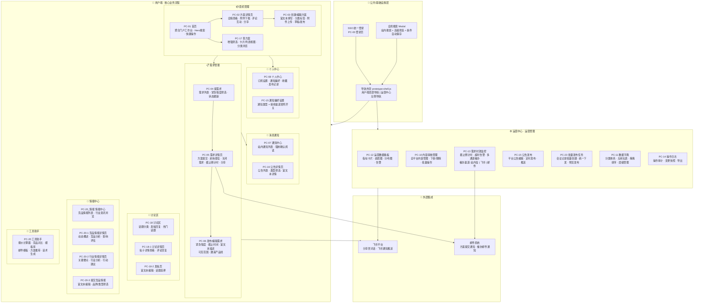
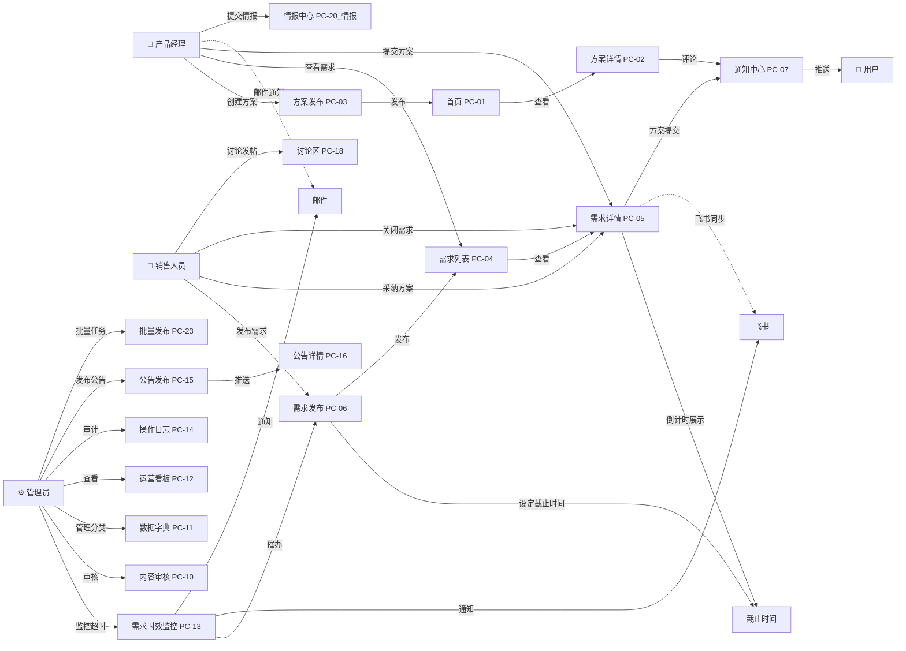

# Quectel商机信息发布平台 · 系统功能架构图

> 基于交互原型 v1.1 整理 | 共 30 个页面 | 2026-07-17
> 最近更新：移除AI智能助手、搜索自动保存、新增讨论区/情报中心/工具助手/公告模块/批量发布任务

---

## 一、架构总览（Mermaid 图）



---

## 二、功能模块详细分解

```
Quectel商机信息发布平台
│
├─ 🔐 公共层
│  ├─ SSO统一登录 (PC-00)
│  │  ├─ 企业SSO登录
│  │  └─ 账号密码降级登录
│  │
│  ├─ 导航外壳 (prototype-shell.js)
│  │  ├─ 用户端：顶部水平导航栏
│  │  │  ├─ Logo + 系统名称
│  │  │  ├─ 首页 / 查方案 / 提需求 / 讨论区 主导航
│  │  │  ├─ 全局搜索入口
│  │  │  ├─ 通知铃铛（含未读徽标）
│  │  │  ├─ 语言切换
│  │  │  └─ 用户头像下拉 → 个人中心 / 切换运营中心 / 退出
│  │  │
│  │  └─ 运营中心：左侧垂直导航 + 顶部栏
│  │     ├─ Logo + 运营中心
│  │     ├─ 运营看板
│  │     ├─ 内容审核
│  │     ├─ 需求时效监控
│  │     ├─ 会议任务管理
│  │     ├─ 批量发布任务
│  │     ├─ 公告发布
│  │     ├─ 数据字典
│  │     ├─ 操作日志
│  │     ├─ 侧边栏折叠/展开
│  │     └─ 用户头像下拉 → 个人中心 / 切换用户端 / 退出
│  │
│  └─ 全局搜索 (Modal)
│     ├─ 站内搜索（方案 + 需求）
│     ├─ 高级筛选（类型 / 分类）
│     ├─ 搜索条件自动保存（localStorage，最多5条，去重，先进先出）
│     └─ 搜索结果高亮 + 一键跳转
│
├─ 👤 用户端（18个页面）
│  │
│  ├─ 📦 商机管理
│  │  ├─ PC-01 首页（聚合门户工作台）
│  │  │  ├─ Hero搜索区（关键词搜索）
│  │  │  ├─ 数据概览（方案数、需求数、响应率等）
│  │  │  ├─ 快捷操作入口
│  │  │  ├─ 热门方案推荐
│  │  │  ├─ 讨论热帖
│  │  │  └─ 工具入口
│  │  │
│  │  ├─ PC-02 方案详情页
│  │  │  ├─ 方案全貌展示（标题、类型、分类、描述、附件）
│  │  │  ├─ 附件下载
│  │  │  ├─ 评论互动（发表/删除自己的评论，递归嵌套）
│  │  │  ├─ 分享 Modal（飞书对话 / 复制链接）
│  │  │  ├─ 关注/收藏
│  │  │  └─ 相关方案推荐
│  │  │
│  │  ├─ PC-03 创建/编辑方案
│  │  │  ├─ 基本信息（标题、类型、分类）
│  │  │  ├─ 富文本编辑器（描述内容）
│  │  │  ├─ 附件上传
│  │  │  ├─ 保存草稿
│  │  │  └─ 发布
│  │  │
│  │  └─ PC-17 查方案
│  │     ├─ 增强筛选（类型、分类、时间）
│  │     ├─ 卡片视图 / 列表视图切换
│  │     ├─ 分类树侧边浏览
│  │     └─ 搜索结果展示
│  │
│  ├─ 📋 需求管理
│  │  ├─ PC-04 提需求（需求列表）
│  │  │  ├─ 搜索 + 紧急程度筛选 + 状态筛选
│  │  │  ├─ 卡片视图 / 列表视图切换
│  │  │  ├─ 需求卡片：标题、摘要、分类标签、状态、发布者、时间
│  │  │  └─ 点击进入需求详情
│  │  │
│  │  ├─ PC-05 需求详情页
│  │  │  ├─ 需求全貌展示
│  │  │  ├─ 截止时间动态倒计时（已截止/剩余分钟/剩余小时/剩余天）
│  │  │  ├─ 提交方案（富文本 + 附件 + 邮件通知配置 + 飞书同步开关）
│  │  │  ├─ 方案列表 + 采纳最佳方案
│  │  │  ├─ 关闭需求
│  │  │  ├─ 可见范围展示 + 已邀请产品线
│  │  │  ├─ 评论互动
│  │  │  └─ 分享 Modal（飞书 / 复制链接）
│  │  │
│  │  └─ PC-06 发布/编辑需求
│  │     ├─ 基本信息（标题、分类）
│  │     ├─ 紧急程度选择
│  │     ├─ 期望响应截止时间（DatePicker，含时分）
│  │     ├─ 可见范围设置（全部可见/按部门/按人员）
│  │     ├─ 邀请产品线回答（Cascader多选）
│  │     ├─ 富文本描述（含填写引导）
│  │     └─ 发布
│  │
│  ├─ 💬 讨论区
│  │  ├─ PC-18 讨论区
│  │  │  ├─ 话题分类筛选
│  │  │  ├─ 热门话题列表
│  │  │  ├─ 最新帖子列表
│  │  │  └─ 发帖入口
│  │  │
│  │  ├─ PC-18-1 讨论详情页
│  │  │  ├─ 帖子正文（富文本渲染）
│  │  │  ├─ 发布者信息
│  │  │  └─ 评论回复列表
│  │  │
│  │  └─ PC-18-2 发帖页
│  │     ├─ 富文本编辑
│  │     ├─ 话题选择
│  │     └─ 内容预览 → 发布
│  │
│  ├─ 📡 情报中心
│  │  ├─ PC-20_情报 情报中心
│  │  │  ├─ 竞品情报列表（品牌筛选、类型筛选）
│  │  │  ├─ 行业资讯列表
│  │  │  └─ 提交情报入口
│  │  │
│  │  ├─ PC-20-1 竞品情报详情页
│  │  │  ├─ 动态概述
│  │  │  ├─ 竞品分析
│  │  │  ├─ 影响评估
│  │  │  ├─ 评论讨论
│  │  │  └─ 相关推荐
│  │  │
│  │  ├─ PC-20-2 行业情报详情页
│  │  │  ├─ 关键要点
│  │  │  ├─ 行业分析
│  │  │  ├─ 对Quectel影响
│  │  │  ├─ 分类行动建议
│  │  │  └─ 评论讨论
│  │  │
│  │  └─ PC-20-3 提交竞品情报
│  │     ├─ 富文本编辑器
│  │     └─ 品牌/类型/行业选择
│  │
│  ├─ 🔧 工具助手
│  │  └─ PC-20 工具助手
│  │     ├─ 报价计算器
│  │     ├─ 竞品对比
│  │     ├─ 模板库
│  │     ├─ 邮件模板
│  │     ├─ 方案推荐
│  │     ├─ 话术生成
│  │     └─ 智能撰写
│  │
│  ├─ 👤 个人中心
│  │  ├─ PC-08 个人中心
│  │  │  ├─ 我的订阅（方案分类订阅）
│  │  │  ├─ 通知偏好入口 → PC-15
│  │  │  ├─ 我的收藏
│  │  │  └─ 我的发布记录
│  │  │
│  │  └─ PC-15 通知偏好设置
│  │     └─ 通知类型 × 接收渠道 矩阵开关
│  │        ├─ 通知类型：新方案、需求响应、评论、系统公告...
│  │        └─ 接收渠道：站内信 / 飞书 / 邮件
│  │
│  └─ 🔔 消息通知
│     ├─ PC-07 通知中心
│     │  ├─ 通知列表（未读/已读）
│     │  ├─ 通知类型标签
│     │  ├─ 强制确认阅读（关键通知）
│     │  └─ 更新全局未读徽标
│     │
│     └─ PC-16 公告详情页
│        ├─ 公告列表（按类型筛选：通知/政策/活动/其他）
│        ├─ 公告详情富文本渲染
│        ├─ 未读标记
│        └─ URL参数直达（?id=ANN-XXX）
│
├─ ⚙️ 运营中心（7个页面）
│  │
│  ├─ PC-12 运营数据看板
│  │  ├─ 指标卡片（方案数、需求数、响应率、满意度）
│  │  ├─ 趋势图（发布趋势、响应趋势）
│  │  ├─ 分布图（分类分布、状态分布）
│  │  └─ 告警列表（超时需求、异常内容）
│  │
│  ├─ PC-10 内容审核管理
│  │  ├─ 全平台内容列表（方案 + 需求）
│  │  ├─ 状态筛选（待审/已发布/已下架）
│  │  ├─ 下架/恢复操作
│  │  ├─ 删除操作
│  │  ├─ 手动排序/置顶
│  │  ├─ 替发方案
│  │  └─ 批量操作
│  │
│  ├─ PC-13 需求时效监控 ⭐
│  │  ├─ 统计面板（总数/正常/预警/超时）
│  │  ├─ 需求时效列表
│  │  │  ├─ 实时倒计时（每30秒刷新）
│  │  │  ├─ 状态：正常 / 预警（≤8h）/ 危险（≤2h）/ 超时
│  │  │  └─ 筛选：全部 / 即将超时 / 已超时
│  │  └─ 催办功能（Modal）
│  │     ├─ 发送对象：发布者 / 相关产品线负责人（多选）/ 自定义
│  │     ├─ 通知方式：站内信 / 飞书 / 邮件（多选）
│  │     ├─ 催办消息（可选自定义）
│  │     └─ 催办历史记录
│  │
│  ├─ PC-23 批量发布任务
│  │  ├─ 从会议记录批量创建行动项
│  │  ├─ 统一下发执行人
│  │  └─ 预览后发布
│  │
│  ├─ PC-15 公告发布
│  │  ├─ 公告列表（通知/政策/活动/其他）
│  │  ├─ 创建/编辑公告（富文本）
│  │  ├─ 定时发布
│  │  ├─ 推送横幅设置
│  │  └─ 发布/撤回
│  │
│  ├─ PC-11 数据字典（分类体系维护）
│  │  ├─ 左侧分类树（支持展开/折叠）
│  │  ├─ 右侧分类详情表
│  │  ├─ 拖拽排序
│  │  ├─ 新增/编辑/删除分类
│  │  └─ 层级管理（一级/二级/三级）
│  │
│  └─ PC-14 操作日志
│     ├─ 操作记录列表（时间、操作人、操作类型、对象）
│     ├─ 变更快照（变更前后对比）
│     ├─ 筛选（时间范围、操作类型、操作人）
│     └─ 导出功能
│
└─ 🔗 外部集成
   ├─ 飞书平台
   │  ├─ 分享至飞书对话
   │  ├─ 飞书消息推送（通知/催办）
   │  └─ 飞书群机器人同步（方案提交摘要）
   │
   └─ 邮件系统
      ├─ 方案提交邮件通知（可选角色+自定义邮箱）
      └─ 催办邮件通知
```

---

## 三、页面与路由对照表

| 编号 | 页面名称 | 所属模块 | 优先级 | 端口 |
|------|---------|---------|--------|------|
| PC-00 | 登录页 | 公共 | P0 | — |
| PC-01 | 首页 | 用户端·商机 | P0 | user |
| PC-02 | 方案详情页 | 用户端·商机 | P0 | user |
| PC-03 | 创建/编辑方案 | 用户端·商机 | P0 | user |
| PC-04 | 提需求 | 用户端·需求 | P0 | user |
| PC-05 | 需求详情页 | 用户端·需求 | P0 | user |
| PC-06 | 发布/编辑需求 | 用户端·需求 | P0 | user |
| PC-07 | 通知中心 | 用户端·消息 | P0 | user |
| PC-08 | 个人中心 | 用户端·个人 | P1 | user |
| PC-15 | 通知偏好设置 | 用户端·个人 | P2 | user |
| PC-16 | 公告详情页 | 用户端·消息 | P1 | user |
| PC-17 | 查方案 | 用户端·商机 | P1 | user |
| PC-18 | 讨论区 | 用户端·讨论 | P1 | user |
| PC-18-1 | 讨论详情页 | 用户端·讨论 | P1 | user |
| PC-18-2 | 发帖页 | 用户端·讨论 | P1 | user |
| PC-20 | 工具助手 | 用户端·工具 | P2 | user |
| PC-20_情报 | 情报中心 | 用户端·情报 | P1 | user |
| PC-20-1 | 竞品情报详情页 | 用户端·情报 | P1 | user |
| PC-20-2 | 行业情报详情页 | 用户端·情报 | P1 | user |
| PC-20-3 | 提交竞品情报 | 用户端·情报 | P1 | user |
| PC-10 | 内容审核管理 | 运营中心 | P0 | admin |
| PC-11 | 数据字典 | 运营中心 | P0 | admin |
| PC-12 | 运营数据看板 | 运营中心 | P1 | admin |
| PC-13 | 需求时效监控 | 运营中心 | P0 | admin |
| PC-14 | 操作日志 | 运营中心 | P1 | admin |
| PC-15 | 公告发布 | 运营中心 | P1 | admin |
| PC-23 | 批量发布任务 | 运营中心 | P0 | admin |

---

## 四、核心数据流



---

## 五、关键交互说明

| 功能 | 涉及页面 | 交互方式 |
|------|---------|---------|
| **分享** | PC-02, PC-05 | Modal → 飞书对话 / 复制链接 |
| **截止倒计时** | PC-05, PC-13 | dayjs 实时计算，颜色分级（正常/预警/危险/超时） |
| **催办** | PC-13 | Modal → 选择对象 + 渠道 + 消息 → 发送记录 |
| **全局搜索** | 所有页面 | 快捷键打开 Modal，站内搜索 + 高级筛选，搜索条件自动保存（去重，最多5条，FIFO淘汰） |
| **通知确认** | PC-07 | 关键通知必须点击"确认已知" |
| **草稿** | PC-03 | 编辑中可保存草稿，后续继续编辑 |
| **方案采纳** | PC-05 | 需求发布者从多个方案中标记最佳 |
| **方案邮件通知** | PC-05 | 提交方案时可配置邮件通知对象（需求发布者/已响应产品线/关注者）+ 自定义邮箱 |
| **飞书同步** | PC-05 | 提交方案时可开启飞书群机器人消息同步 |
| **可见范围** | PC-06 | 发布需求时设置可见范围（全部/按部门/按人员） |
| **邀请产品线** | PC-06 | 发布需求时定向邀请特定产品线回答 |
| **内容下架** | PC-10 | 管理员可下架违规内容，支持批量操作 + 手动排序/置顶/替发 |
| **分类拖拽** | PC-11 | 左侧树形结构支持拖拽调整层级顺序 |
| **操作审计** | PC-14 | 记录所有关键操作，支持变更前后对比 |
| **公告管理** | PC-15(admin), PC-16(user) | 运营端发布/撤回公告，用户端类型筛选查看，支持置顶+横幅推送 |
| **批量任务** | PC-23 | 从会议记录批量创建行动项，统一下发执行人 |
| **讨论区** | PC-18, 18-1, 18-2 | 话题分类浏览、发帖回复、热门话题推荐 |
| **情报中心** | PC-20_情报, 20-1~3 | 竞品情报+行业资讯浏览、提交、评论讨论 |
| **工具助手** | PC-20 | 报价计算器、竞品对比、模板库、邮件模板、话术生成、智能撰写 |

---

> 📁 文件位置：`商机平台/living-docs/prototypes/`  
> 📄 原型门户：`index.html`
