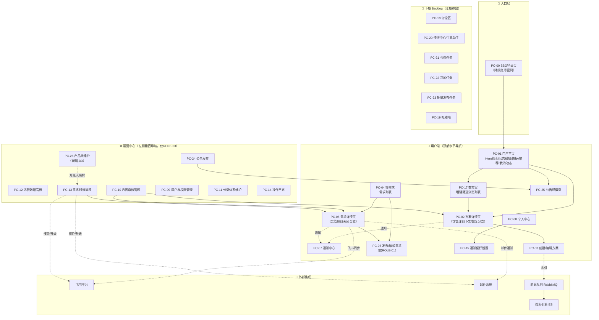

# Quectel 商机信息发布平台 · 项目总纲（v2.0 终稿）

> **定位**：本文件是项目全局索引与业务概述，面向研发/测试/PM 全角色。
> **关联文档**：全系统技术规约统一收口至 `01_全局规约手册_v2.md`（技术 SSOT）；各模块详规见 `02~06_*.md`。
> **施工基准**：本文件严格遵循《决策纪要与修正基线》（D1~D9 + 技术默认项 + 可自动修正项）；如与旧版 v1.0 PRD 冲突，以本文件为准。
> **上游数据源**：/0 需求调研 → /2 业务流程 → /3 功能架构 → /3-1 信息架构 → /4 交互原型 → 评审决策纪要

---

## 1. 文档信息

### 1.1 修订记录

| 版本号 | 修改日期 | 修改人 | 修改内容 |
|-------|---------|-------|---------|
| v1.0 | 2026-07-17 | PM | 初始版本，基于 v1.1 原型全量生成 |
| **v2.0** | **2026-07-18** | **PM** | **评审修正版：落实 D1~D9 决策，收敛范围至 6 模块 42 FEAT，重编号页面，统一权限矩阵与 NFR。详见 `变更说明_v1到v2.md`** |

### 1.2 名词术语

| 术语 | 说明 |
|------|------|
| 商机信息 / 方案 | 产品经理发布的正式产品信息、解决方案、成功案例，供销售查阅下载 |
| 商机需求 | 销售人员发布的方案求助，描述客户场景和需要的方案类型 |
| 方案响应 | 产品经理针对某个商机需求提交的方案答复（富文本+附件） |
| 采纳 | 需求发布者将某个方案响应标记为"最佳方案" |
| SSO | 对接企业统一认证系统的单点登录 |
| SLA | 需求响应时效的监控与升级机制（本期仅监控首响时限，见 §6.4 与 01 手册 §2） |
| 产品线（ProductLine） | 产品团队的业务分组，含负责人/成员映射，由运营在平台维护（见 D3） |
| 用户端 | 面向销售人员和产品经理的前台界面（顶部水平导航） |
| 运营中心 | 面向运营管理员的后台管理界面（左侧垂直导航），入口仅 ROLE-03 可见 |
| 下期 Backlog | 已画原型但本期不实现的功能群，见 §2.4 |

---

## 2. 需求概述

### 2.1 业务背景

Quectel 销售团队 500+ 人、产品团队 500+ 人，商机信息（产品方案、解决方案、成功案例）长期分散在微信群、飞书群、邮件和共享文档中，缺乏统一管理平台。销售人员查找方案需要逐个渠道翻找、私聊产品经理、翻聊天记录，效率极低。

同时，产品经理发布新方案后只能通过群发消息或口头通知，信息容易被淹没，销售往往不知道新方案已发布。销售在客户现场发现商机需求后，只能碎片化地在群里问"谁有 XX 方案？"，缺乏结构化的需求-方案匹配机制，响应慢、无法追踪、优质方案被埋没。

**四个核心痛点**：

| 痛点 | 描述 | 影响 |
|------|------|------|
| PAIN-001 信息分散 | 产品信息分散在多个渠道，销售逐个翻找 | 查找效率低，反复问同样问题 |
| PAIN-002 触达无效 | 新产品发布无高效触达，群消息被淹没 | 销售不知晓新方案，产品经理觉得"发了但没人看" |
| PAIN-003 反馈缺失 | 一线反馈无结构化通道沉淀 | 有价值反馈靠零散聊天，无法反哺研发 |
| PAIN-004 匹配断裂 | 销售有需求但找不到对口产品方案 | 客户等待，内部找人靠运气 |

### 2.2 项目目标

> 来源：{{/0 research.md 项目基座·Business Outcome}} + 决策 D6

- **核心定位**：内部商机信息发布与需求-方案双向匹配平台，填补 CRM 系统与办公协作工具之间的空白。
- **北极星指标**：**需求响应闭环率** = 被采纳或关闭且至少有一个方案响应的需求数 ÷ 总需求数。
- **指标机制**：采用**分阶段基线机制**（用户暂无历史数据）——详见 §6.4。

### 2.3 需求范围（v1.0，D1 收口）

> 🛑 v1.0 = **仅 6 个已有完整规格的核心闭环模块，共 42 个 FEAT**。所有本期不做项统一收敛至 §2.4「下期 Backlog」。

| 本期做（v1.0） | 本期不做 |
|-------|---------|
| MOD-01 商机信息：发布/浏览/搜索/详情 | 完整 CRM / 销售漏斗 |
| MOD-02 需求与方案匹配：需求发布/方案响应/采纳/关闭 | 客户 360 视图 |
| MOD-03 通知与订阅：订阅配置/多渠道通知/已读率监控 | 低代码自定义表单 |
| MOD-04 互动（嵌入）：评论（最多 2 级）/收藏/点赞 | 应用市场 / 插件生态 |
| MOD-05 运营后台：内容审核/分类维护/SLA 监控/数据看板/操作日志/**公告管理**/**产品线维护** | 复杂 BI / 深度数据分析 |
| MOD-06 系统支撑：SSO 登录 + 账号密码降级/搜索索引/操作审计/国际化 | 移动端原生 App / 移动端适配 |

**说明**：
- **公告（发布 PC-24 / 详情 PC-25）为唯一保留例外**：运营 P1、轻量，纳入 MOD-05 与 MOD-03（用户端详情），不移出。
- **产品线维护（PC-26）为本期新增**：承载 D3 组织结构中"产品线↔负责人/成员"映射，是 SLA 自动升级的数据前提，纳入 MOD-05。

### 2.4 下期 Backlog（本期移出）

> 以下功能群已有原型但**无 FEAT 规格、无数据实体、无验收标准**，与核心价值（商机发布 + 需求匹配）相关性弱，本期移出，转下期评估（对应评审 H-1）。

| 功能群 | 原型页 | 移出理由 | 状态 |
|-------|-------|---------|------|
| 讨论区 / 话题社区 | PC-18 系列 | 无规格，社区运营属独立产品方向 | 下期 |
| 情报中心 | PC-20 情报系列 | 无规格，情报采集为独立能力域 | 下期 |
| 工具助手 | PC-20 | 无规格，与 PC-20 情报中心撞号（已消解） | 下期 |
| 会议任务管理 | PC-21 | 无规格，属协同办公范畴 | 下期 |
| 我的任务 | PC-22 | 无规格，导航不可达 | 下期 |
| 批量发布任务 | PC-23 | P0 标注但正文仅"🚧 待原型细化"，无字段 | 下期 |
| 吐槽墙 | PC-19 | 无规格 | 下期 |
| SLA 解决时限监控 | — | D2：本期仅监控首响时限 | 下期 |
| 方案打分（score_*） | PC-05 相关 | D2/§三.4：打分为下期，移除孤儿字段 | 下期 |
| FEAT-0207 相似需求检测 / FEAT-0208 专家标签匹配 | — | P2，本期保留 FEAT 占位但不做 AI 实现 | 下期（占位） |

---

## 3. 用户角色与权限

### 3.1 角色定义（D5c：单人单角色）

> 🛑 **单人单角色**：一个账号在任一时刻仅归属一个角色，三角色互斥专精。**运营中心入口仅 ROLE-03 可见**，销售/产品经理界面不显示"切换到运营中心"。

| 角色名称 | 角色说明 | 典型用户 | 数据范围 |
|---------|---------|---------|---------|
| ROLE-01 销售人员 | 浏览方案、搜索、**发布商机需求**、采纳方案、接收通知 | 一线销售、销售主管（500+人） | 本部门数据（可配置跨部门，默认不隔离，见 D4） |
| ROLE-02 产品经理 | 创建/发布/下架方案、响应商机需求、提供方案、标记关键变更 | 各产品线 PM（500+人） | 本人创建的内容 + 被邀请的需求 |
| ROLE-03 运营管理员 | 内容审核、分类维护、**产品线维护**、用户权限配置、SLA 监控、数据看板、公告管理、操作审计 | 平台运营团队（3~5人） | 全平台数据（无限制） |

### 3.2 权限总览（唯一真理源 · 3 角色 × 42 功能）

> 🛑 此表为全系统权限的**唯一真理来源**。各模块 PRD 的"权限归属"声明必须从此处复制。
> 图例：✅ 完整 | 👁️ 只读 | 📋 受限（见备注）| 🚫 无权限 | 🤖 系统自动
> **口径统一**：全系统 = **42 功能**（废止 IA 旧版"38 功能"表述；补齐 FEAT-0209~0212）。

#### MOD-01 商机信息管理（9）

| 功能（FEAT-ID） | ROLE-01 销售 | ROLE-02 产品经理 | ROLE-03 管理员 | 备注 |
|--------------|:-:|:-:|:-:|------|
| FEAT-0101 创建商机信息 | 🚫 | ✅ | 🚫 | ROLE-02 专属 |
| FEAT-0102 选择分类标签 | 🚫 | ✅ | 🚫 | 随 FEAT-0101 |
| FEAT-0103 保存草稿 | 🚫 | ✅ | 🚫 | 仅创建者可见可编辑 |
| FEAT-0104 发布商机信息 | 🚫 | 📋 | 🚫 | 📋 仅本人创建的草稿 |
| FEAT-0105 下架商机信息 | 🚫 | 📋 | ✅ | 📋 ROLE-02 仅本人发布；ROLE-03 全平台 |
| FEAT-0106 重新上架 | 🚫 | 📋 | 📋 | **D5a 谁下架谁恢复**：ROLE-02 仅恢复本人下架；ROLE-03 仅恢复管理员下架（PC-02 补管理员分支） |
| FEAT-0107 浏览方案列表 | 👁️ | 👁️ | 👁️ | 受数据隔离配置约束 |
| FEAT-0108 关键词搜索 | ✅ | ✅ | ✅ | — |
| FEAT-0109 查看商机详情 | 👁️ | 👁️ | 👁️ | — |

#### MOD-02 需求与方案匹配（12）

| 功能（FEAT-ID） | ROLE-01 销售 | ROLE-02 产品经理 | ROLE-03 管理员 | 备注 |
|--------------|:-:|:-:|:-:|------|
| FEAT-0201 发布商机需求 | ✅ | 🚫 | 🚫 | **D5b：ROLE-01 专属**（修正原型"销售和产品均可发布"） |
| FEAT-0202 设置紧急程度 | ✅ | 🚫 | 🚫 | 随 FEAT-0201（urgency，见 01 手册 §2） |
| FEAT-0203 响应提供方案 | 🚫 | ✅ | 🚫 | ROLE-02 专属 |
| FEAT-0204 查看方案列表 | 👁️ | 👁️ | 👁️ | — |
| FEAT-0205 标记最佳方案 | 📋 | 🚫 | 🚫 | 📋 仅需求发布者本人 |
| FEAT-0206 关闭需求 | 📋 | 🚫 | ✅ | 📋 ROLE-01 仅关本人需求；**ROLE-03 可强制关闭（PC-05 补管理员分支）** |
| FEAT-0207 相似需求检测 | 🤖 | 🤖 | — | P2，本期占位不实现 |
| FEAT-0208 专家标签匹配 | 🤖 | 🤖 | — | P2，本期占位不实现 |
| FEAT-0209 设置可见范围 | ✅ | 🚫 | 🚫 | 随 FEAT-0201（all/dept/personnel，D4 收窄控制） |
| FEAT-0210 邀请产品线 | ✅ | 🚫 | 🚫 | 随 FEAT-0201（定向通知产品线成员） |
| FEAT-0211 方案提交邮件通知 | 🚫 | ✅ | 🚫 | 随 FEAT-0203 |
| FEAT-0212 方案同步飞书 | 🚫 | ✅ | 🚫 | 随 FEAT-0203 |

#### MOD-03 通知与订阅（7）

| 功能（FEAT-ID） | ROLE-01 销售 | ROLE-02 产品经理 | ROLE-03 管理员 | 备注 |
|--------------|:-:|:-:|:-:|------|
| FEAT-0301 配置订阅规则 | ✅ | ✅ | ✅ | 个人维度（新用户默认订阅本部门相关分类，D9） |
| FEAT-0302 选择通知渠道 | ✅ | ✅ | ✅ | 个人维度（站内必达；飞书/邮件按偏好） |
| FEAT-0303 多渠道通知推送 | 🤖 | 🤖 | 🤖 | 系统自动分发，同类 10 分钟合并 |
| FEAT-0304 查看通知列表 | 👁️ | 👁️ | 👁️ | 各角色仅本人通知 |
| FEAT-0305 标记通知已读 | ✅ | ✅ | ✅ | 各角色操作本人通知 |
| FEAT-0306 已读率监控 | 🚫 | 🚫 | ✅ | ROLE-03 专属（按 NotificationBatch 聚合） |
| FEAT-0307 强制确认阅读 | 📋 | 📋 | ✅ | **D8：触发权限=ROLE-02 发布者手动勾选**；ROLE-01/02 被动确认；ROLE-03 监控未确认名单 |

#### MOD-04 互动与反馈（3，嵌入 PC-02/PC-05）

| 功能（FEAT-ID） | ROLE-01 销售 | ROLE-02 产品经理 | ROLE-03 管理员 | 备注 |
|--------------|:-:|:-:|:-:|------|
| FEAT-0401 评论 | ✅ | ✅ | ✅ | **最多 2 级**（评论+回复，D7）；ROLE-03 可删违规评论 |
| FEAT-0402 收藏 | ✅ | ✅ | — | 个人维度，唯一约束防重复 |
| FEAT-0403 点赞 | ✅ | ✅ | — | 唯一约束防重复 |

#### MOD-05 运营管理后台（7）

| 功能（FEAT-ID） | ROLE-01 销售 | ROLE-02 产品经理 | ROLE-03 管理员 | 备注 |
|--------------|:-:|:-:|:-:|------|
| FEAT-0501 用户角色权限配置 | 🚫 | 🚫 | ✅ | ROLE-03 专属（PC-09） |
| FEAT-0502 部门数据隔离配置 | 🚫 | 🚫 | ✅ | 默认关闭；变更触发穿透测试（降级方案见 01 手册 §9）+ 审计 |
| FEAT-0503 内容审核管理 | 🚫 | 🚫 | ✅ | ROLE-03 专属（PC-10） |
| FEAT-0504 分类体系维护 | 🚫 | 🚫 | ✅ | ROLE-03 专属（PC-11） |
| FEAT-0505 运营数据统计 | 🚫 | 🚫 | 👁️ | ROLE-03 只读（PC-12，业务库聚合） |
| FEAT-0506 SLA 时效监控 | 🚫 | 🚫 | ✅ | ROLE-03 查看；🤖 系统自动升级链（PC-13） |
| FEAT-0507 发布量监控告警 | 🚫 | 🚫 | ✅ | 🤖 系统告警，ROLE-03 处理 |

> **公告管理（PC-24 发布 / PC-25 详情）与产品线维护（PC-26）** 作为 MOD-05 子功能纳入运营后台，其功能点合并在上述运营能力中（公告发布归 FEAT-0503 内容治理域，产品线维护为 D3 新增运营页），不新增 FEAT 编号以维持 42 FEAT 口径。

#### MOD-06 系统支撑（4）

| 功能（FEAT-ID） | ROLE-01 销售 | ROLE-02 产品经理 | ROLE-03 管理员 | 备注 |
|--------------|:-:|:-:|:-:|------|
| FEAT-0601 SSO 单点登录 | ✅ | ✅ | ✅ | 全角色；不可用时降级账号密码 |
| FEAT-0602 搜索索引维护 | 🤖 | 🤖 | 🤖 | 系统自动（ES + 异步 outbox） |
| FEAT-0603 操作日志审计 | 🚫 | 🚫 | 👁️ | ROLE-03 只读，不可删改 |
| FEAT-0604 中英文切换 | ✅ | ✅ | ✅ | 全局组件 |

> **FEAT 合计**：MOD-01(9) + MOD-02(12) + MOD-03(7) + MOD-04(3) + MOD-05(7) + MOD-06(4) = **42**。

---

## 4. 全局产品架构

### 4.1 全局页面/业务流转路由图（v2 重编号）

> **重编号（D 三.1，消除一号两页）**：
> - `PC-15` = **仅**通知偏好设置（MOD-03）；
> - 公告发布 → **PC-24**（MOD-05 运营中心）；公告详情 → **PC-25**（用户端）；
> - 产品线维护 → **PC-26**（MOD-05，新增）；
> - `PC-09` 用户与权限管理补入运营中心导航；
> - PC-18/19/20/21/22/23 系列均移出 v1.0（灰显标注"下期"）。

> **本期用户端页面**：PC-00、PC-01、PC-02、PC-03、PC-04、PC-05、PC-06、PC-07、PC-08、PC-15、PC-17、PC-25。
> **本期运营中心页面**：PC-09、PC-10、PC-11、PC-12、PC-13、PC-14、PC-24、PC-26。

### 4.2 模块总览

| 模块编号 | 模块名称 | 归属端 | 模块定位 | FEAT 数 | 对应 PRD |
|---------|---------|-------|---------|:-:|---------|
| MOD-01 | 商机信息管理 | 用户端 | 方案发布/浏览/搜索/详情查看 | 9 | `02_MOD-01_商机信息管理_v2.md` |
| MOD-02 | 需求与方案匹配 | 用户端 | 需求发布/方案响应/采纳/关闭 | 12 | `03_MOD-02_需求与方案匹配_v2.md` |
| MOD-03 | 通知与订阅 | 用户端 | 订阅配置/多渠道通知/已读率监控/公告详情 | 7 | `04_MOD-03_通知与订阅_v2.md` |
| MOD-04 | 互动与反馈 | 用户端（嵌入式） | 评论（≤2 级）/收藏/点赞（嵌入 PC-02/PC-05） | 3 | 合并至 MOD-01、MOD-02 PRD |
| MOD-05 | 运营管理后台 | 运营中心 | 内容审核/SLA 监控/看板/分类/公告(PC-24/25)/产品线维护(PC-26) | 7 | `05_MOD-05_运营管理后台_v2.md` |
| MOD-06 | 系统支撑 | 公共层 | SSO 登录/搜索索引/操作审计/国际化 | 4 | `06_MOD-06_系统支撑_v2.md` |

---

## 5. 全局交互与公共组件规范

> 🛑 本章为全平台交互基线。各模块 PRD 的操作说明引用此处。详细阈值见 `01_全局规约手册_v2.md` §7。

### 5.1 B 端交互基线

| 维度 | 规则 |
|------|------|
| **主框架** | 用户端：顶部导航栏（高 56px）+ 内容区；运营中心：左侧导航（宽 220px，可折叠至 64px）+ 右侧内容区，入口仅 ROLE-03 |
| **内容区** | 最小宽度 1200px，超宽屏居中限宽 1440px；桌面端 ≥1366×768（本期不做移动端适配） |
| **分页** | **列表一律分页**：列表视图默认 20 条/页，卡片视图默认 12 条/页；底部显示总条数（修正"200 条不分页"，见 §6.1） |
| **大列表** | 超长列表启用虚拟滚动或强制分页，禁止一次性全量渲染 |
| **排序** | 默认按创建时间倒序；统一 `sort_by`/`order` 参数（见 01 手册 §5） |
| **空状态** | 必须有空状态占位图 + 引导文案 |
| **加载** | 骨架屏优先，超过 3 秒展示"加载中"文案 |
| **表单校验** | `onBlur` 即时校验 + `onSubmit` 全量校验；必填字段标签前红色星号 `*` |
| **富文本** | 全站统一富文本编辑器（Tiptap/Quill 二选一，全站一致），支持图片上传（走 OSS）、表格、代码块 |
| **操作反馈** | 成功：顶部 Message 绿色提示，3 秒消失；删除：二次确认弹窗；提交中：按钮 Loading + 禁用 |
| **写操作幂等** | 发布/提交/采纳/关闭等携带 `Idempotency-Key`（见 01 手册 §5） |

### 5.2 防腐容灾基线

| 场景 | 降级方案 |
|------|---------|
| **接口超时** | 表格展示空状态 + "刷新"按钮，筛选区保持可用 |
| **Token 过期** | 静默刷新，失败则跳转登录页 |
| **权限不足** | 页面级：展示"无权限"占位页；按钮级：隐藏或 disabled（运营入口对非 ROLE-03 隐藏） |
| **删除不可逆数据** | 二次确认弹窗，明示被删数据关键标识 |
| **表单中途离开** | 浏览器 `beforeunload` 拦截 + 草稿每 60s 自动保存 |
| **大数据量列表** | 前端虚拟滚动或强制分页 |
| **文件导出超时** | 异步导出 + 通知中心通知结果 |
| **外部系统不可用** | SSO/飞书/邮件/搜索均有兜底，见 01 手册 §8 |

---

## 6. 非功能需求

### 6.1 性能要求（NFR 修正）

> 🛑 **修正**：原"列表最大数据量：支持 200 条不分页"为口径误植——"200"实为**峰值并发用户数**。本期统一为"列表一律分页/虚拟滚动"。

| 指标 | 要求 |
|------|------|
| 首屏加载时间 | < 2s（P99，桌面端） |
| 搜索响应时间 | < 1s（P99） |
| **峰值并发用户数** | **200 用户同时操作**（数据量级假设：用户 ~1000） |
| 列表渲染策略 | **一律分页**（列表 20/页、卡片 12/页）；大列表虚拟滚动，不做"200 条不分页" |
| 文件上传 | 单文件 ≤ 50MB，单次总量 ≤ 200MB |
| 数据量级假设 | 商机+需求首年 ~2 万条、评论/互动 ~10 万、通知 ~百万级 |

> 详细阈值基线参见 `01_全局规约手册_v2.md` §7。

### 6.2 安全与合规

| 维度 | 要求 |
|------|------|
| 认证 | SSO 统一登录，Token 过期自动刷新；不可用时降级账号密码 |
| 授权 | 基于角色的访问控制（RBAC），**3 角色 × 42 功能**；单人单角色 |
| 数据隔离 | 默认不隔离；管理员可配置部门级隔离；叠加规则 = 可见范围 ∩ 部门隔离（取交集，更严者生效，D4） |
| 穿透测试 | 隔离配置变更走"配置快照 + 预设越权用例集 + 人工确认后生效"（降级，去掉自动回滚承诺，见 01 手册 §9） |
| 审计 | 关键操作全量记录（操作人/时间/类型/IP/变更快照），保留 365 天 |
| 前端安全 | 评论内容 XSS 过滤；文件类型白名单校验 |

> 详细脱敏矩阵参见 `01_全局规约手册_v2.md` §6。

### 6.3 兼容性

| 维度 | 要求 |
|------|------|
| 浏览器 | Chrome 90+、Edge 90+、Firefox 90+ |
| 分辨率 | ≥ 1366×768（推荐 1920×1080） |
| 语言 | 中文（默认）+ 英文切换 |
| 移动端 | **本期不做移动端适配**（原型移动适配不作为交付项） |

### 6.4 关键指标机制（D6）

> 🛑 用户暂无历史数据，采用**分阶段基线机制**：上线后第 1 个月采集基线，第 2 个月由业务方在基线上定目标值。运营红线阈值先取初始经验值，第 2 个月校准。

**北极星指标**：

| 指标 | 口径 | 采集方式 |
|------|------|---------|
| 需求响应闭环率 | 被采纳或关闭且至少有 1 个方案响应的需求数 ÷ 总需求数 | 业务库聚合（OpportunityRequest.status ∈ {Adopted, Closed} 且 response_count ≥ 1） |

**五项过程指标（同步采集，业务库聚合，非前端埋点）**：

| 指标 | 口径 | 初始阈值/目标 |
|------|------|-------------|
| 平台活跃率 | DAU/MAU（按登录/关键操作去重） | 第 1 月采基线 |
| 商机发布量（周度） | 每周新增 Opportunity(published) 数 | 运营红线：周发布量 < 20 触发告警（初始经验值） |
| 需求响应时效 | 从需求 created_at 到首个方案响应的平均时长 | 第 1 月采基线 |
| 方案采纳率 | 被采纳方案数 ÷ 总方案响应数 | 第 1 月采基线 |
| 通知触达率 | 推送后 48h 已读率（按 NotificationBatch 聚合） | 运营红线：< 80% 触发二次推送 + 告警（初始经验值） |

---

## 7. 附录

### 7.1 原型地址

- **原型门户**：`living-docs/prototypes/index.html`
- **导航外壳**：`living-docs/prototypes/prototype-shell.js`
- **本期覆盖**：20 个页面（见 §4.1 清单）；PC-18/19/20/21/22/23 系列原型保留但本期不实现。

### 7.2 关联文档

| 文档 | 路径 | 说明 |
|------|------|------|
| 全局规约手册（技术 SSOT） | `01_全局规约手册_v2.md` | 状态机 / SLA 单一模型 / 组织结构 / 数据模型 ER / API 契约 / 枚举 / 脱敏 / 阈值 / 降级 |
| MOD-01 PRD | `02_MOD-01_商机信息管理_v2.md` | 方案发布/浏览/搜索/详情（含评论/收藏/点赞嵌入） |
| MOD-02 PRD | `03_MOD-02_需求与方案匹配_v2.md` | 需求发布/方案响应/采纳/关闭 |
| MOD-03 PRD | `04_MOD-03_通知与订阅_v2.md` | 订阅配置/通知列表/偏好设置/公告详情 |
| MOD-05 PRD | `05_MOD-05_运营管理后台_v2.md` | 内容审核/SLA/看板/分类/公告(PC-24/25)/产品线维护(PC-26) |
| MOD-06 PRD | `06_MOD-06_系统支撑_v2.md` | SSO/搜索索引/操作审计/国际化 |
| 决策纪要与修正基线 | `../决策纪要与修正基线.md` | 施工唯一基准（D1~D9） |
| 变更说明 | `变更说明_v1到v2.md` | v1→v2 修正台账 |

---

*文档版本：v2.0 | 渲染日期：2026-07-18 | 节点：/5 PRD 终稿*
*施工基准：决策纪要与修正基线（D1~D9 + 技术默认 + 可自动修正项）*
