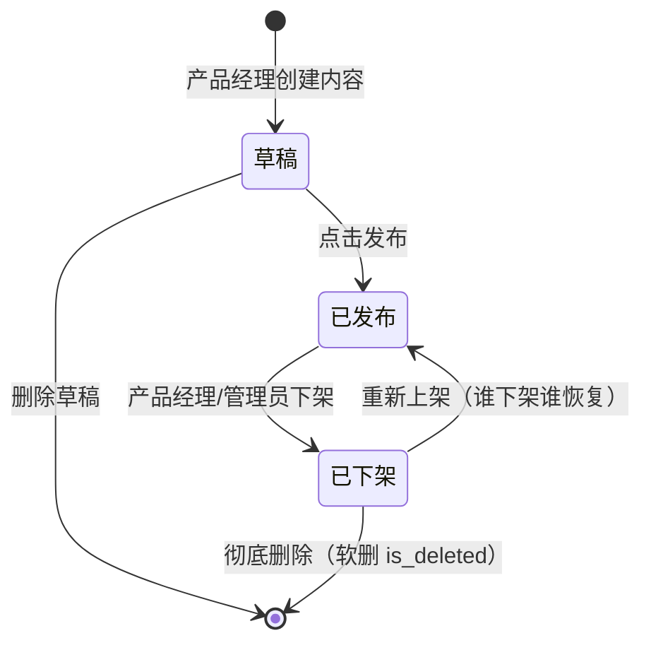
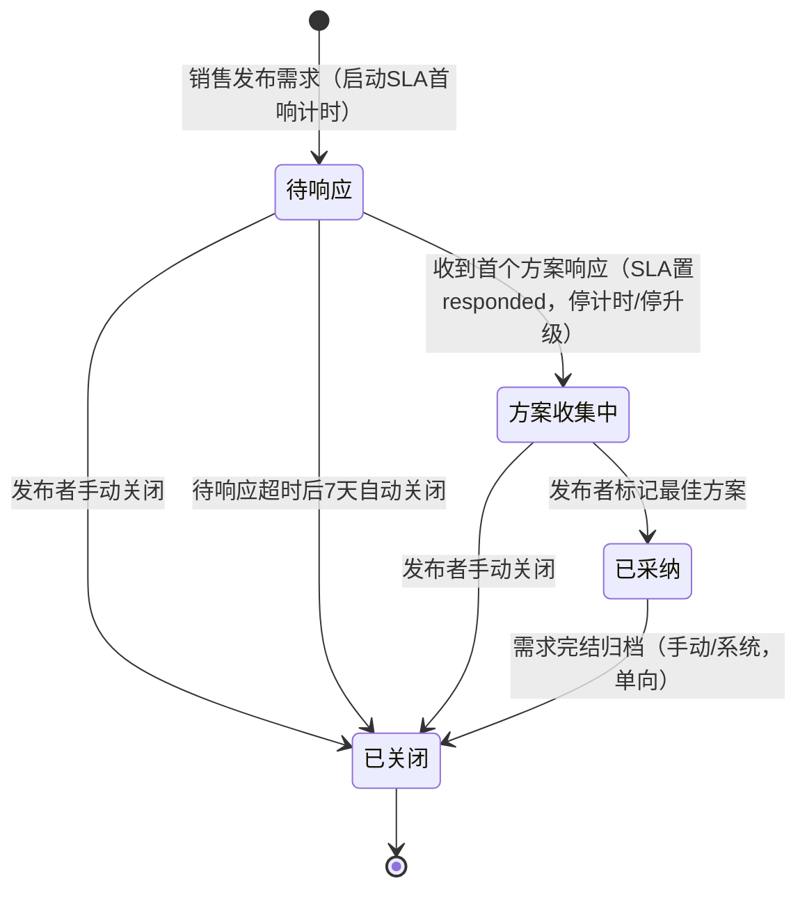
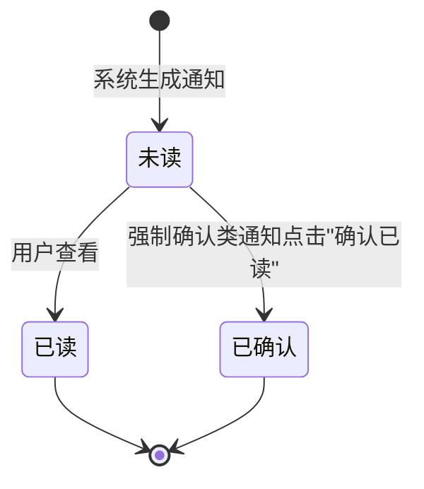
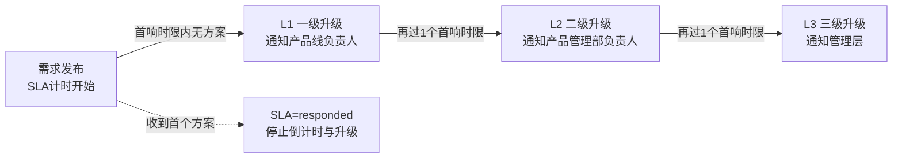
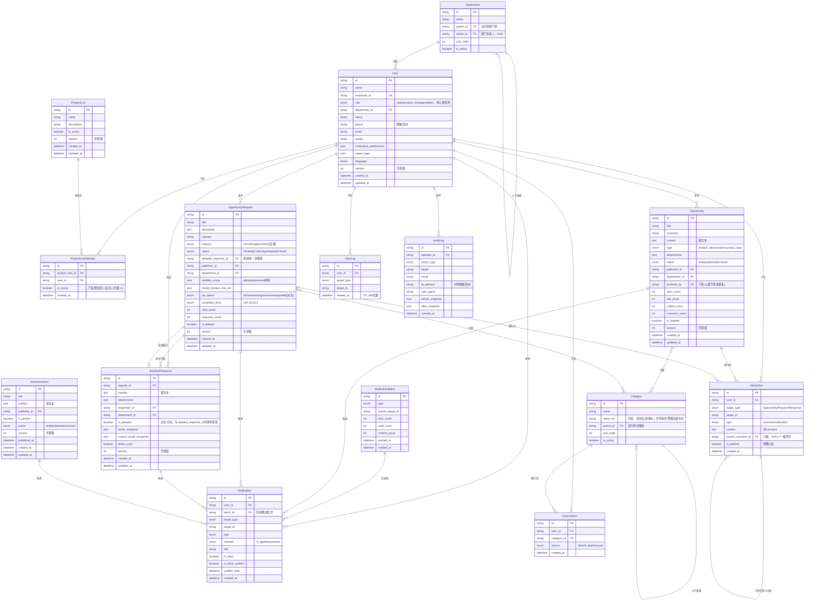

# Quectel 商机信息发布平台 · 全局规约手册（v2.0 终稿 · 技术 SSOT）

> **定位**：本文件是全系统技术规约的**唯一真理来源**（Single Source of Truth）。
> **包含**：状态机字典 / SLA 单一模型 / 组织结构模型 / 统一数据模型 ER / 统一 API 契约 / 枚举总表 / 数据脱敏矩阵 / 性能阈值基线 / 外部集成与降级 / 穿透测试降级方案。
> **使用规则**：各模块 PRD 通过 `{{强制数据源绑定}}` 从本文件获取参数值，禁止在模块内重复定义。任何冲突以本文件为准。
> **施工基准**：《决策纪要与修正基线》D1~D9 + 技术默认项 + 可自动修正项。

---

## 文档变更记录

| 版本 | 日期 | 修改人 | 修改内容 | 影响范围 |
|-----|------|------|---------|---------|
| v1.0 | 2026-07-17 | PM | 初始版本，基于 v1.1 原型全量生成 | 全系统 |
| **v2.0** | **2026-07-18** | **PM** | **SLA 单一模型收口、组织结构建模、数据模型收敛为单一权威 ER、新增统一 API 契约与组织模型章节、枚举/脱敏/阈值补全、穿透测试降级** | **全系统** |
| v2.1 | 2026-07-18 | PM | 二次决策 TC-01~05 落定（框架能力 + A2/B/C）：登录改框架 UAA/OAuth2.0（§8，无本地账密库）；搜索用 elasticsearch-starter+EsHelper（§8）；组织不接 ORG/UPM，部门/产品线本地维护（§3、§4）；Category 增可选 name_en（§4，决策 B）；文件走 oss-starter 预签名（§5.3、§8）；审计 365 天超期归档 ClickHouse（§7，决策 C） | §3、§4、§5.3、§7、§8 |

---

## 0. 文档编号约定（FEAT / PC / BR）

> 🛑 本节为全套 v2.0 文档的编号规范，**正式生效**。各模块 PRD 与总纲一致遵循。

| 编号类别 | 规则 |
|---------|------|
| **FEAT 功能编号** | **全局唯一**；口径为 **3 角色 × 42 FEAT**，唯一真理源在 `00_项目总纲_v2.md` §3.2。公告管理、产品线维护为 MOD-05 子功能，**不新增 FEAT 编号**（公告并入 FEAT-0503 内容治理域、产品线维护为 D3 新增运营页），以维持 42 口径。 |
| **PC 页面编号** | **全局唯一**（PC-00 ~ PC-26）；重编号规则见总纲 §4.1。 |
| **BR 业务规则编号** | **采用模块内局部编号**——各模块 PRD 自行维护 BR 序列，**允许跨模块重号**（例：`BR-056` 在 MOD-05 表"SLA 已响应终止"、在 MOD-06 表"搜索异步最终一致"，二者互不冲突）。**跨模块引用 BR 一律带 `MOD-xx` 前缀**（如"MOD-05 BR-053"）；模块内引用可省略前缀。本手册中出现的 BR 编号（如 §2 SLA 模型引用的 `BR-018` / `BR-056`）默认指其 SLA 语义所属模块（MOD-02 / MOD-05）的对应规则。 |

---

## 1. 状态机字典

> 🛑 **唯一真理点**：全系统业务状态统一在此定义。各模块 PRD 仅引用此处状态编号和名称，严禁重复定义状态值。

### 1.1 商机信息（Opportunity）状态机

> 来源：{{/2 business-process.md §B-1}}



| 状态编号 | 状态名称 | 英文 | 进入条件 | 退出条件 | 关键约束 |
|---------|---------|------|---------|---------|---------|
| OPP-S1 | 草稿 | Draft | 产品经理创建新商机信息 | 发布 / 删除 | 仅创建者可编辑 |
| OPP-S2 | 已发布 | Published | 点击发布按钮 | 下架 | 触发通知推送（异步 outbox）；内容可被搜索浏览 |
| OPP-S3 | 已下架 | Archived | 产品经理或管理员执行下架 | 重新上架 / 彻底删除 | 前台不可见；**谁下架谁恢复**（D5a）：管理员下架仅管理员可恢复，发布者下架仅发布者可恢复 |

### 1.2 商机需求（OpportunityRequest）状态机

> 来源：{{/2 business-process.md §B-2}} + 决策 D2 + 可自动修正项 §三.3（补 `待响应→已关闭` 两条边，消除死状态；采纳单向 Adopted→Closed）



| 状态编号 | 状态名称 | 英文 | 进入条件 | 退出条件 | 关键约束 |
|---------|---------|------|---------|---------|---------|
| REQ-S1 | 待响应 | Pending | 销售发布需求 | 收到首个方案 / 手动关闭 / **超期自动关闭** | 启动 SLA 首响计时器；**仅此状态显示倒计时**（修正 BR-018） |
| REQ-S2 | 方案收集中 | Collecting | 首个方案响应到达 | 采纳 / 手动关闭 | SLA 置 responded、停止倒计时与升级（BR-056）；可持续接收方案 |
| REQ-S3 | 已采纳 | Adopted | 发布者标记最佳方案 | 归档至 Closed（单向） | 写入 `adopted_response_id`；**采纳后不可改采纳** |
| REQ-S4 | 已关闭 | Closed | 手动关闭 / 待响应超期 / 采纳后归档 | 终态 | 不可重开；需求在其可见范围内对所有状态可见（含已关闭，便于复用，D4） |

> **消除死状态**：v1.0 状态图中"待响应"无直达"已关闭"边——若需求发布后从未收到方案，既无法进入 Collecting 也无法关闭，形成死状态。v2 补 `待响应→已关闭`（手动 + 超期）两条边。
> **超期自动关闭规则**：见 §2.5。

### 1.3 通知（Notification）状态机

> 来源：{{/2 business-process.md §B-3}}



| 状态编号 | 状态名称 | 英文 | 进入条件 | 退出条件 | 关键约束 |
|---------|---------|------|---------|---------|---------|
| NOTIF-S1 | 未读 | Unread | 系统生成通知推送 | 用户查看 / 确认 | 计入未读角标；归属某 NotificationBatch |
| NOTIF-S2 | 已读 | Read | 用户查看通知 | 终态 | 从未读列表移除 |
| NOTIF-S3 | 已确认 | Confirmed | 强制确认类通知（is_force_confirm=true）点击"确认已读" | 终态 | 写 `confirm_time`；进入 FEAT-0306 已读率/未确认名单统计 |

---

## 2. SLA 单一模型（D2 · 唯一真理源）

> 🛑 本章为全系统 SLA 的**唯一真理源**，替代 v1.0 中散落于 PRD/business-process/IA/PC-13 的多处相互冲突定义（评审 H-2）。
> **模型选择**：采用**按紧急程度自动计时**；**删除**"用户自设截止时间（deadline）"字段与原型 DatePicker。本期**仅监控首响时限**，"解决时限"列入下期。

### 2.1 首响时限唯一真理表

| urgency（存储） | priority（展示派生） | 首响时限 | 计时起点 | 时区 | 计时口径 |
|:-:|:-:|:-:|:-:|:-:|:-:|
| critical 特急 | P0 | **2h** | 需求 `created_at` | 服务器 UTC+8 | 自然时（不扣非工作时间/节假日） |
| urgent 紧急 | P1 | **4h** | 需求 `created_at` | 服务器 UTC+8 | 自然时 |
| normal 普通 | P2 | **24h** | 需求 `created_at` | 服务器 UTC+8 | 自然时 |

> **自然时**：本期不引入工作日历/节假日/暂停恢复语义（该复杂度随"解决时限"一并下期评估）。

### 2.2 urgency ↔ priority 映射规则

| 维度 | 规则 |
|------|------|
| 存储字段 | `OpportunityRequest.urgency` ∈ {normal, urgent, critical} —— **唯一存储字段** |
| 展示字段 | `priority` ∈ {P2, P1, P0} —— **派生**，不落库，由 urgency 映射 |
| 映射 | critical → P0；urgent → P1；normal → P2 |

> 消除 H-2b：v1.0 数据模型用 `urgency`，SLA 监控页用 `priority`，二者映射从未写明。v2 明确 urgency 存储、priority 派生。

### 2.3 升级链模型（固定三级）



| 规则 | 定义 |
|------|------|
| 结构 | **固定三级** L1 → L2 → L3（所有 urgency 统一，不随优先级变链长；消除 H-2d） |
| 各级间隔 | = 该等级**首响时限**（如 normal 每级 24h、urgent 每级 4h、critical 每级 2h） |
| 触发条件 | 需求处于 Pending 且首响时限累计超时 |
| 升级人解析 | L1=产品线负责人、L2=产品管理部负责人、L3=管理层（均取自 §3 组织/产品线映射表，非手动下拉） |
| 停止条件 | 进入 Collecting（收到首个方案）→ SLA 置 responded，**停止倒计时与升级**（BR-056） |
| 升级动作 | 站内必达 + 飞书/邮件催办（按升级人偏好）；每次升级写 AuditLog(action_type=sla_escalation) |

### 2.4 倒计时显示规则（修正 BR-018）

| 状态 | 倒计时显示 |
|------|-----------|
| Pending 待响应 | **显示**首响倒计时（剩余 < 首响时限 30% 时置 warning 标色；超时置 overdue） |
| Collecting 方案收集中 | **不显示**（已首响，responded，H-2e 修正） |
| Adopted / Closed | 不显示 |

### 2.5 需求超期自动关闭规则

> 需求**不引入 deadline 字段**（消除 H-6）；超期关闭由 SLA 首响时限派生。

| 规则 | 定义 |
|------|------|
| 触发 | 需求持续处于 Pending（首响超时后仍无任何方案响应） |
| 有效期 | 首响时限之后，**待响应状态延续满 7 天**自动关闭（默认值，取"待响应超时后 7 天"） |
| 动作 | 系统置 status=Closed；发送关闭通知给发布者；写 AuditLog |
| 例外 | 一旦进入 Collecting（收到方案），不触发自动关闭 |

### 2.6 解决时限（下期）

> ⏭️ **本期不做**：解决时限（P0=24h / P1=48h / P2=5 工作日）及其所需的工作日历、节假日、暂停恢复语义列入下期。v1.0 SLA 监控页（PC-13）仅呈现首响时限相关指标。

---

## 3. 组织结构模型（D3）

> 🛑 建模 v1.0 缺失的组织维度（评审 H-3），支撑数据隔离、SLA 自动升级、邀请产品线定向通知、可见范围四项能力。
>
> **二次决策 TC-04（A2）**：**不接入 ORG/UPM，保持单体**（不引入 Spring Cloud/Nacos）。登录身份来自 UAA 的 7 个字段（id/username/phoneNumber/email/name/tenantId/roles），**不含部门/工号**；故 **Department、ProductLine 及用户归属、各级升级负责人均由运营在平台本地维护**（不使用 ORG 的组织同步与 `getUserSupervisorIds`）。

### 3.1 数据来源与维护职责

| 组织实体 | 数据来源 | 维护方 | 说明 |
|---------|---------|-------|------|
| Department 部门树 | **平台本地维护**（UAA 不提供部门字段） | **运营（ROLE-03，PC-26）** | `User.department_id`、`Opportunity.department_id` 外键指向此表；用户↔部门归属由运营维护（或首次登录补录，默认运营维护） |
| ProductLine 产品线 | 平台本地维护 | **运营（ROLE-03，PC-26）** | 产品团队业务分组 |
| ProductLineMember 产品线成员 | 平台本地维护 | **运营（ROLE-03，PC-26）** | 产品线 ↔ 用户映射，含 `is_owner` 负责人标记 |

### 3.2 SLA 升级人解析规则

| 升级级别 | 解析来源 | 解析逻辑 |
|:-:|------|---------|
| L1 产品线负责人 | ProductLineMember | 取需求关联产品线（invited_product_line_ids 首选，否则按分类映射产品线）中 `is_owner=true` 的用户 |
| L2 产品管理部负责人 | Department + 配置 | 取"产品管理部"部门负责人（部门树中该部门 owner） |
| L3 管理层 | 配置项 | 平台配置的管理层收件人清单（PC-26 或系统配置维护） |

> 解析结果为空时降级：无法解析 L1 则直接升 L2；均无法解析则告警运营手动指派（E-7 兜底）。

---

## 4. 统一数据模型（单一权威 ER）

> 🛑 收敛 v1.0 两份不一致 ER（business-process §C vs IA §ER）为**单一权威**（评审 H-10、§三.4）。
> **本次落实**：新增 Department/ProductLine/ProductLineMember/ViewLog/NotificationBatch/Announcement/Subscription 实体；全主业务实体加 `version` 乐观锁；补 `is_deleted`/`batch_id`/`parent_comment_id`；Interaction 唯一约束；采纳单一真相源；移除 `score_*` 孤儿字段。

### 4.1 实体清单

| 序号 | 实体 | 英文名 | 建模优先级 | 说明 |
|:-:|------|------|:-:|------|
| 1 | 用户 | User | P0 | 登录身份来自 UAA（id/username/phone/email/name/tenantId/roles）+ 本系统本地扩展字段（部门/产品线归属、language 等；工号 employee_id 本地维护可选） |
| 2 | 部门 | Department | P0 | **新增**，**平台本地维护**（UAA 不提供部门），部门树自引用 |
| 3 | 产品线 | ProductLine | P0 | **新增**，运营本地维护 |
| 4 | 产品线成员 | ProductLineMember | P0 | **新增**，产品线↔用户+负责人标记 |
| 5 | 分类标签 | Category | P0 | 自引用树结构；增可选 `name_en`（决策 B 双语，空则英文界面回退中文） |
| 6 | 商机信息 | Opportunity | P0 | 核心实体，FSM OPP |
| 7 | 商机需求 | OpportunityRequest | P0 | 核心实体，FSM REQ |
| 8 | 方案响应 | SolutionResponse | P0 | 需求-方案匹配核心 |
| 9 | 互动记录 | Interaction | P1 | 评论（≤2 级）/收藏/点赞统一 |
| 10 | 通知 | Notification | P0 | FSM NOTIF + 强制确认 |
| 11 | 通知批次 | NotificationBatch | P0 | **新增**，支撑按批次已读率 |
| 12 | 订阅 | Subscription | P0 | **新增（独立实体）**，订阅规则落库（替代 User.subscriptions JSON） |
| 13 | 浏览记录 | ViewLog | P1 | **新增**，24h 浏览去重，唯一键 + TTL |
| 14 | 操作日志 | AuditLog | P1 | 只读追加，不可篡改 |
| 15 | 公告 | Announcement | P1 | **新增**，运营公告（PC-24/25） |

> 关联表（N:M）：`opportunity_category`、`request_category`。
> 运营告警 Alert 保留为轻量派生表（低发布量/低触达/SLA 超时告警），字段沿用 v1.0，本手册不重复展开。

### 4.2 ER 图



### 4.3 关键约束与决策落实

| 项 | 规则 | 对应决策 |
|----|------|---------|
| 乐观锁 | 所有可并发写主业务实体（User/Opportunity/OpportunityRequest/SolutionResponse/ProductLine/Announcement）加 `version`，更新走 `WHERE version=?` 乐观锁 | §三.4 |
| 软删除 | Opportunity/OpportunityRequest 加 `is_deleted`；Interaction 加 `is_deleted`（占位"[该评论已被作者删除]"） | §三.4、D7 |
| 采纳单一真相源 | 以 `OpportunityRequest.adopted_response_id` 为准；`SolutionResponse.is_adopted` 为派生/冗余，**同一事务**内更新，读以 adopted_response_id 为准 | §三.4 |
| 评论层级 | `parent_comment_id` **仅允许 2 级**（NULL=一级评论；非 NULL 必须指向一级评论，禁止对回复再回复） | D7 |
| Interaction 唯一约束 | 对 like/collect 建唯一索引 `(user_id, target_type, target_id, type)`（防重复点赞/收藏、计数错乱）；comment 不受此约束 | §三.4、H-10 |
| ViewLog 去重 | 唯一键 `(user_id, target_type, target_id)` + TTL 24h，用于浏览去重后再自增 view_count | §三.4、H-10 |
| 通知批次 | Notification 加 `batch_id`；已读率/触达率按 NotificationBatch 聚合（total/read/confirm） | §三.4、H-10 |
| 订阅落库 | Subscription 独立实体（替代 User.subscriptions JSON）；`source` 区分默认部门订阅与手动订阅 | D9 |
| 移除孤儿字段 | 删除 SolutionResponse.`score_practicality`/`score_completeness`/`score_speed`（打分下期） | §三.4、D2 |
| 可见性 | OpportunityRequest 有 `visibility_scope`（收窄）；Opportunity **不加** visibility_scope（全员可见，D4） | D4 |

---

## 5. 统一 API 契约规范

> 🛑 收敛 v1.0 不成体系的接口（评审 H-9）。所有模块接口遵循本节。

### 5.1 通用约定

| 维度 | 规范 |
|------|------|
| Base 路径 | `/api/v1` |
| 资源命名 | 名词复数、kebab-case，如 `/opportunities`、`/opportunity-requests`、`/product-lines` |
| 动作型子资源 | 状态变更用子资源动作（POST），如 `/opportunity-requests/{id}/adopt`、`/close`、`/publish` |
| 分页 | Query：`page`（从 1 起）、`page_size`（默认 20，最大 100） |
| 排序 | Query：`sort_by`（枚举见 §10）、`order`（`asc`/`desc`，默认 `desc`） |
| 筛选 | Query 具名参数，如 `status`、`urgency`、`category_id` |
| 鉴权头 | `Authorization: Bearer <token>`；`X-Request-Id`（链路追踪） |
| 幂等 | 写操作（发布/提交/采纳/关闭/上下架）必须携带 `Idempotency-Key`（UUID），服务端按 key 去重 |
| 语言 | `Accept-Language: zh-CN | en-US` |

### 5.2 统一响应与错误体

```jsonc
// 成功
{ "code": 0, "message": "ok", "data": { /* 资源或分页对象 */ } }
// 分页 data
{ "list": [ /* ... */ ], "total": 123, "page": 1, "page_size": 20 }
// 错误
{ "code": 40001, "message": "参数校验失败", "errors": [ {"field":"title","reason":"必填"} ], "request_id": "..." }
```

| 错误码段 | 含义 | 示例 |
|:-:|------|------|
| 0 | 成功 | — |
| 400xx | 请求参数错误 | 40001 校验失败、40002 幂等冲突 |
| 401xx | 未认证 | 40101 Token 过期、40102 Token 无效 |
| 403xx | 无权限 | 40301 角色越权、40302 数据隔离拦截 |
| 404xx | 资源不存在 | 40401 |
| 409xx | 状态冲突 | 40901 乐观锁版本冲突、40902 状态机非法流转 |
| 429xx | 频控 | 42901 触发防抖/限流 |
| 500xx | 服务端错误 | 50001、50002 外部系统降级 |

### 5.3 核心资源端点表

| 资源/动作 | 方法 | 路径 | 权限 | 备注 |
|------|:-:|------|------|------|
| 商机列表 | GET | `/opportunities` | 全角色 👁️ | 分页/排序/筛选，受隔离约束 |
| 商机详情 | GET | `/opportunities/{id}` | 全角色 👁️ | — |
| 创建/存草稿 | POST | `/opportunities` | ROLE-02 | status=draft |
| 编辑商机 | PUT | `/opportunities/{id}` | ROLE-02（本人） | 乐观锁 version |
| 发布商机 | POST | `/opportunities/{id}/publish` | ROLE-02（本人草稿） | 幂等；触发索引+通知 outbox |
| 下架商机 | POST | `/opportunities/{id}/archive` | ROLE-02 本人 / ROLE-03 | 记 archived_by |
| 重新上架 | POST | `/opportunities/{id}/restore` | **谁下架谁恢复** | D5a |
| 需求列表 | GET | `/opportunity-requests` | 全角色 👁️ | 可见范围 ∩ 隔离过滤 |
| 需求详情 | GET | `/opportunity-requests/{id}` | 可见范围内 | — |
| 发布需求 | POST | `/opportunity-requests` | **ROLE-01** | D5b；启动 SLA |
| 编辑需求 | PUT | `/opportunity-requests/{id}` | ROLE-01（本人） | 乐观锁 |
| 采纳方案 | POST | `/opportunity-requests/{id}/adopt` | ROLE-01（发布者） | body: response_id；单一真相源事务 |
| 关闭需求 | POST | `/opportunity-requests/{id}/close` | ROLE-01 本人 / ROLE-03 强制 | 状态→Closed |
| 提交方案 | POST | `/opportunity-requests/{id}/responses` | ROLE-02 | 首个响应触发状态流转 |
| 方案列表 | GET | `/opportunity-requests/{id}/responses` | 全角色 👁️ | — |
| 评论 | POST | `/interactions/comments` | 全角色 | ≤2 级；body: target, parent_comment_id? |
| 删除评论 | DELETE | `/interactions/comments/{id}` | 本人 / ROLE-03 | 软删占位 |
| 点赞/收藏 | POST/DELETE | `/interactions/{like\|collect}` | ROLE-01/02 | 唯一约束幂等 |
| 通知列表 | GET | `/notifications` | 本人 | 分页 |
| 标记已读 | POST | `/notifications/{id}/read` | 本人 | — |
| 强制确认 | POST | `/notifications/{id}/confirm` | 本人 | 写 confirm_time |
| 订阅规则 | GET/PUT | `/subscriptions` | 本人 | D9 默认部门订阅 |
| 通知偏好 | GET/PUT | `/notification-preferences` | 本人 | 渠道偏好 |
| SLA 监控 | GET | `/admin/sla-monitor` | ROLE-03 | 首响时限/升级 |
| 手动升级 | POST | `/admin/sla-monitor/{req_id}/escalate` | ROLE-03 | 兜底 |
| 分类维护 | GET/POST/PUT/DELETE | `/admin/categories` | ROLE-03 | — |
| 产品线维护 | GET/POST/PUT/DELETE | `/admin/product-lines` | ROLE-03 | PC-26 |
| 产品线成员 | POST/DELETE | `/admin/product-lines/{id}/members` | ROLE-03 | is_owner 标记 |
| 用户权限 | GET/PUT | `/admin/users` | ROLE-03 | PC-09 |
| 数据隔离配置 | GET/PUT | `/admin/isolation` | ROLE-03 | 触发穿透测试（§9） |
| 内容审核 | GET/POST | `/admin/moderation` | ROLE-03 | — |
| 数据看板 | GET | `/admin/dashboard` | ROLE-03 | 业务库聚合 |
| 操作日志 | GET | `/admin/audit-logs` | ROLE-03 | 只读 |
| 公告 | GET/POST/PUT | `/announcements` | 读全角色 / 写 ROLE-03 | PC-24/25 |
| **文件上传** | — | 框架 OSS starter | 全角色（登录） | **二次决策 TC-05**：不自建 `/files/upload`，改用框架 `quectel-code-oss-starter` 的 `ossTemplate`（含**预签名 URL**）；前端用内置 `q-upload`/`q-file-list`；富文本图片/附件同走 OSS |

---

## 6. 数据脱敏矩阵

> 🛑 所有敏感字段脱敏规则的唯一定义点。平台不涉及身份证号/银行卡号等强敏感数据。

| 敏感字段 | 脱敏规则 | 适用场景 | 解密通道 |
|---------|---------|---------|---------|
| 用户手机号 `User.phone` | 中间 4 位掩码，如 `138****5678` | 列表/详情展示 | 无解密；仅 ROLE-03 可查看完整手机号 |
| 用户邮箱 `User.email` | 站内展示完整；**导出脱敏** `u***@domain.com` | 数据导出 | ROLE-03 导出时勾选"脱敏导出" |
| 审计 IP `AuditLog.ip_address` | 站内展示完整；**对外导出**后 2 段替换 `*.*` | 对外数据提供 | ROLE-03 站内查看不受限 |

---

## 7. 性能与全局阈值基线

> 🛑 全系统业务参数唯一真理点。各模块 PRD 引用此处数值。

| 阈值类别 | 参数名 | 阈值 | 触发行为 |
|---------|-------|------|---------|
| 接口响应 | API 超时 | 10s | "网络异常，请稍后重试" + 重试按钮 |
| 首屏 | 加载时间 | < 2s（P99） | — |
| 搜索 | 响应时间 | ≤ 1s（P99） | 超时提示缩小范围 |
| 搜索 | 关键词最小长度 | 2 字符 | < 2 字符不触发 |
| 搜索索引 | 发布→可搜一致性 | 异步 outbox，目标 30s 内 | 未达则降级 DB LIKE（见 §8） |
| 并发 | 峰值并发用户 | 200 | 容量假设，用户 ~1000 |
| 上传 | 单文件最大 | 50MB | 前端拦截 |
| 上传 | 单次总量 | 200MB | 前端累计拦截 |
| 文件类型 | 允许白名单 | pdf / doc / docx / xls / xlsx / ppt / pptx / jpg / png / zip | 前端 accept + 后端校验，非法拒绝 |
| 分页 | 默认每页 | **列表 20 / 卡片 12** | 列表一律分页 |
| 分页 | 最大每页 | 100 | `page_size` 上限 |
| 大列表 | 渲染策略 | 虚拟滚动或强制分页 | 禁止全量渲染（原"200 条不分页"作废） |
| 防抖 | 写操作按钮 | 3s | Loading + disabled |
| 防抖 | 点赞/收藏 | 1s | disabled 后恢复 |
| 自动保存 | 编辑器草稿 | **60s** | 定时存草稿（统一为 60s，废止 SSOT 旧 30s） |
| 评论 | 单条最大长度 | 500 字符 | 实时计数，超出禁提交 |
| 评论 | 最大层级 | 2 级 | 禁止对回复再回复 |
| 搜索历史 | localStorage | 最多 5 条，FIFO 去重 | 超限淘汰最早 |
| 通知 | 同类合并窗口 | 10 分钟 | 合并推送（D9） |
| 通知 | 已读率监控 | 48h 检测，阈值 80% | 低于阈值二次推送 + 告警 |
| SLA | 首响（特急/紧急/普通） | 2h / 4h / 24h | 见 §2 |
| SLA | 超期自动关闭 | 待响应超时后 7 天 | 系统置 Closed |
| 保留期 | 审计日志 | **365 天**（热数据 MySQL） | 超期归档至 ClickHouse（`clickhouse-starter`）仍可查询（决策 C） |
| 保留期 | 内容软删 | **180 天** | is_deleted 满 180 天物理清理 |
| 保留期 | 通知 | **90 天** | 到期清理 |

---

## 8. 外部系统集成与降级

> 技术默认（Quectel-code 框架能力）：登录走框架企业 SSO（UAA/OAuth2.0，security-starter，STATELESS）；搜索用 `elasticsearch-starter`+`EsHelper`；消息队列 RabbitMQ；文件用 `oss-starter`（ossTemplate 预签名）；数据审计字段 `mysql-starter` 自动填充；操作审计自建表+AOP，热数据 MySQL 365 天超期归档 `clickhouse-starter`；发布→通知/索引走**异步 outbox 保证最终一致**。

| 系统 | 数据流向 | 类型 | 触发场景 | 超时 | 降级方案 |
|------|---------|------|---------|:-:|---------|
| 企业 SSO（UAA/OAuth2.0） | 入向：token 远程校验 | 同步 HTTP | 每次请求鉴权 | — | 由 `quectel-code-security-starter` 提供，STATELESS 纯 token，`TokenValidationFilter` 回调 `{gateway-url}/uaa/current` 校验（本地不验签/不存密码）；账密路径密码 RSA 提交 UAA、OAuth 回调 SSO；UAA 不可达 → 401 无法登录（**无本地账密降级**）。gateway-url：生产 openapi.quectel.com/api/uaa、测试 fat-softweb.quec.com/api/uaa、开发 192.168.10.27 |
| 飞书开放平台 | 出向：消息推送 | 异步 API | 通知/催办/升级 | 10s | 站内信兜底；重试 3 次后告警 |
| 飞书群机器人 | 出向：方案摘要 | 异步 Webhook | 提交方案(FEAT-0212 开) | 5s | 不阻断提交；Toast 提示可稍后查看 |
| 邮件 SMTP | 出向：邮件通知 | 异步 SMTP | 方案通知(FEAT-0211)/催办 | 15s | 站内信兜底 |
| 搜索引擎 ES | 出向：索引更新 | 异步 MQ | 发布/修改/下架 | 30s | 降级 DB LIKE 查询；后台告警 |
| RabbitMQ | 内部：异步事件 | 消息 | 发布→通知/索引 | — | outbox 表落库补偿，服务恢复后补投；最终一致 |
| OSS（文件存储） | 出向：文件存储 | 同步 | 富文本图片/附件上传 | 15s | 框架 `quectel-code-oss-starter`（`ossTemplate`，含预签名 URL）；前端 `q-upload`/`q-file-list`；上传失败提示，已上传不受影响 |

**通用系统降级**（沿用 v1.0 §6.2）：Token 过期静默刷新→失败跳登录；并发登录后者踢前者；表单离开 `beforeunload` 拦截 + 60s 草稿自动保存；大批量操作异步执行 + 通知结果。

---

## 9. 穿透测试降级方案（部门数据隔离变更，D 技术默认）

> 🛑 v1.0 承诺"隔离配置变更自动穿透测试 + 未通过阻断 + 自动回滚"——用例来源/通过标准/回滚语义均未定义，不可实现（评审 M-15 / H-4b）。v2 降级：

| 步骤 | 动作 |
|:-:|------|
| 1 | 变更前对当前隔离配置生成**配置快照**（存 AuditLog before_snapshot） |
| 2 | 对**预设越权用例集**（固定的跨部门可见性断言用例）执行校验 |
| 3 | 展示校验结果（哪些用例通过/失败）给 ROLE-03 |
| 4 | **人工确认后生效**（去掉"自动回滚"承诺）；确认即写 after_snapshot + AuditLog(isolation_change) |
| 5 | 如需回退，ROLE-03 依据快照**手动回滚** + IT 协助 |

**可见性叠加规则（D4，落 API 过滤）**：最终可见 = `可见范围(all/dept/personnel)` ∩ `部门隔离(默认关闭)`，取交集，更严者生效。商机全员可见（无 visibility_scope）。

---

## 10. 枚举总表

> 🛑 各模块描述字段取值必须从此表引用，禁止重新定义。

### 10.1 商机（Opportunity）

| 枚举 ID | 字段 | 值 | 显示名 |
|------|------|------|------|
| ENUM-OPP-TYPE-V01/02/03 | type | product_info / solution / success_case | 产品信息 / 解决方案 / 成功案例 |
| ENUM-OPP-STATUS-V01/02/03 | status | draft / published / archived | 草稿 / 已发布 / 已下架 |
| ENUM-SORT-OPP-V01/02/03 | sort_by | latest / hottest / most_liked | 最新 / 最热 / 最多点赞 |

### 10.2 需求（OpportunityRequest）与 SLA

| 枚举 ID | 字段 | 值 | 显示名 / 映射 |
|------|------|------|------|
| ENUM-URGENCY-V01/02/03 | urgency（存储） | normal / urgent / critical | 普通 / 紧急 / 特急 |
| **ENUM-URGENCY↔PRIORITY** | priority（派生） | normal→P2 / urgent→P1 / critical→P0 | 首响 24h / 4h / 2h |
| ENUM-REQ-STATUS-V01~04 | status | Pending / Collecting / Adopted / Closed | 待响应 / 方案收集中 / 已采纳 / 已关闭 |
| ENUM-SORT-REQ-V01/02/03 | sort_by | latest / urgency_first / most_responses | 最新 / 紧急优先 / 最多响应 |
| ENUM-SLA-STATUS-V01~04 | sla_status | normal / warning / overdue / responded | 正常 / 即将超时 / 已超时 / 已响应 |
| ENUM-ESCALATION-V01~04 | escalation_level | L0 / L1 / L2 / L3 | 未升级 / 一级(产品线负责人) / 二级(产品管理部) / 三级(管理层) |
| ENUM-VISIBILITY-V01/02/03 | visibility_scope | all / dept / personnel | 全部可见 / 本部门 / 指定人员（收窄，D4） |

### 10.3 通知（Notification）

| 枚举 ID | 字段 | 值 | 显示名 |
|------|------|------|------|
| ENUM-NOTIFY-TYPE-V01 | type | publish | 新商机发布 |
| ENUM-NOTIFY-TYPE-V02 | type | response | 收到方案响应 |
| ENUM-NOTIFY-TYPE-V03 | type | adopt | 方案被采纳 |
| ENUM-NOTIFY-TYPE-V04 | type | system | 系统告警 |
| **ENUM-NOTIFY-TYPE-V05** | type | **comment** | 评论（新增） |
| **ENUM-NOTIFY-TYPE-V06** | type | **reply** | 回复（新增） |
| **ENUM-NOTIFY-TYPE-V07** | type | **invite** | 邀请回答（新增，FEAT-0210） |
| **ENUM-NOTIFY-TYPE-V08** | type | **force_confirm** | 强制确认阅读（新增，D8） |
| **ENUM-NOTIFY-TYPE-V09** | type | **sla_remind** | SLA 催办（新增） |
| **ENUM-NOTIFY-TYPE-V10** | type | **sla_escalate** | SLA 升级（新增） |
| **ENUM-NOTIFY-TYPE-V11** | type | **archive** | 内容下架（新增） |
| **ENUM-NOTIFY-TYPE-V12** | type | **category_change** | 分类变更（新增） |
| **ENUM-NOTIFY-TYPE-V13** | type | **announcement** | 公告推送（新增） |
| ENUM-NOTIFY-CHANNEL-V01/02/03 | channel | in_app / feishu / email | 站内(必达) / 飞书 / 邮件（按偏好） |
| ENUM-SUB-SOURCE-V01/02 | source | default_dept / manual | 默认部门订阅 / 手动订阅（D9） |

### 10.4 用户/组织

| 枚举 ID | 字段 | 值 | 显示名 |
|------|------|------|------|
| ENUM-ROLE-V01/02/03 | role | sales / product_manager / admin | 销售 / 产品经理 / 运营管理员（单人单角色） |
| ENUM-USER-STATUS-V01/02 | status | active / disabled | 启用 / 禁用 |

### 10.5 运营/审计

| 枚举 ID | 字段 | 值 | 显示名 |
|------|------|------|------|
| ENUM-ALERT-TYPE-V01/02/03 | alert_type | low_publish / low_reach / sla_breach | 发布量不足 / 触达率不足 / SLA 超时 |
| ENUM-ALERT-STATUS-V01/02 | alert_status | pending / resolved | 待处理 / 已处理 |
| ENUM-ACTION-TYPE-V01~08 | action_type | publish / archive / delete / role_change / isolation_change / category_change / login / sla_escalation | 发布 / 下架 / 删除 / 角色变更 / 隔离变更 / 分类变更 / 登录 / SLA 升级 |
| ENUM-ANN-STATUS-V01/02/03 | Announcement.status | draft / published / archived | 草稿 / 已发布 / 已下架 |

---

## 11. 暂不纳入清单（原型独有功能，本期不做）

> 依 D1 范围与 §三.11，以下原型独有功能本期不纳入，统一列明避免误开工：

| 功能 | 原型出处 | 处置 |
|------|---------|------|
| 关注（用户/产品线关注） | PC-02/05 | 下期评估 |
| 分享 / 复制为新方案 | PC-02/05 | 下期评估 |
| @mention 提及 | 评论区 | 下期评估 |
| 过期横幅 | PC-02 | 移除（无 deadline 字段） |
| 相关推荐 | PC-02/17 | 下期（依赖 FEAT-0207/0208） |
| 审核页代发布 / 代编辑 | PC-10 | 下期评估（本期审核仅审/下架，不代编） |
| 邀请回答进度可视化 | PC-05 | 下期评估 |
| 前端埋点 Web 分析（UV/PV） | PC-12 | 移除，看板改业务库聚合 |
| 方案打分 score_* | PC-05 | 下期（移除孤儿字段） |
| 移动端适配 | shell | 本期不做 |

---

*文档版本：v2.0 | 渲染日期：2026-07-18 | 节点：/5 PRD 终稿 · 技术 SSOT*
*施工基准：决策纪要与修正基线（D1~D9 + 技术默认 + 可自动修正项）*
