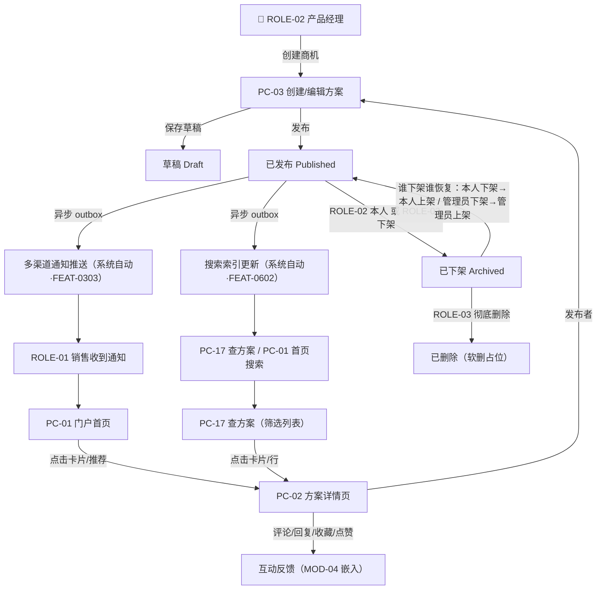

# MOD-01 商机信息管理 · 模块 PRD（v2.0 终稿）

> **模板**：B 端后台模块（b-end-module）
> **施工基准**：`决策纪要与修正基线.md`（唯一施工基准）。本文件与该基准一致；如与旧版 v1.0 PRD 冲突，以本文件为准。
> **上游数据源**：feature-matrix.md（/3）+ information-architecture.md（/3-1）+ business-process.md（/2）
> **SSOT 引用**：状态机 / SLA / 数据模型 ER / API 契约 / 枚举 / 脱敏 / 阈值 / 组织结构模型 / 降级策略，一律引用 `01_全局规约手册_v2.md`（下称「01 手册」）；权限归属引用 `00_项目总纲_v2.md` §3.2。本模块**不重复定义**上述全局规约。

---

## 文档变更记录

| 版本 | 日期 | 修改人 | 修改内容 | 影响范围 |
|-----|------|------|---------|---------|
| v1.0 | 2026-07-17 | PM | 初始版本 | MOD-01 + MOD-04 互动嵌入 |
| **v2.0** | **2026-07-18** | **PM** | 按评审决策纪要修正：①PC-01 定位澄清为门户首页、筛选列表规格迁至 PC-17（M-9）；②评论改最多 2 级 + 软删占位（D7）；③富文本统一图片走 OSS 上传 + 表格 + 代码块、库选型对齐 01 手册（技术项）；④PC-02 补 ROLE-03 下架/恢复分支消除死锁（D5a）；⑤商机不加可见范围、全员可见（D4）；⑥PC-03 关键变更强制确认改手动勾选触发 FEAT-0307（D8）；⑦一致性统一（自动保存 60s / 附件白名单 / 分页默认 / version 乐观锁）；⑧全局规约统一改为「引用 01 手册」。 | MOD-01 + MOD-04 互动嵌入 |

---

## 权限归属

> **引用基准**：角色与功能权限矩阵详见 `00_项目总纲_v2.md` §3.2（口径统一为「3 角色 × 42 功能」）。本模块**不重复定义**权限矩阵，仅落实按钮级门禁。

- 本模块涉及 **FEAT-0101~0109**（商机信息管理，9 项）、**FEAT-0401~0403**（互动反馈：评论/收藏/点赞，嵌入 PC-02）；并作为触发方涉及 **FEAT-0307**（关键变更强制确认阅读，主体规格在 MOD-03，本模块仅定义触发入口）。
- **ROLE-01 销售**：浏览 / 搜索 / 评论 / 回复 / 收藏 / 点赞（不可创建/编辑/发布商机）。
- **ROLE-02 产品经理**：创建 / 编辑 / 发布 / 下架**本人**内容 / 重新上架**本人下架**内容 / 勾选关键变更强制确认；同时具备 ROLE-01 的互动权限。
- **ROLE-03 管理员**：管理全平台内容——下架 / 恢复**管理员下架**内容 / 彻底删除 / 删除任意违规评论。
- **角色互斥（D5c）**：单人单角色；运营中心入口仅 ROLE-03 可见，本模块页面不渲染跨角色越权入口。

---

## 业务流程

### 核心业务流程

> 来源：business-process.md §A-1 产品信息发布与获取

### 状态流转

> 🛑 状态定义、状态码、允许的迁移边一律引用 **01 手册 §1.1 商机信息（Opportunity）状态机**。本表仅列出各迁移的**操作角色与门禁**，不重复定义状态语义。

| 当前状态 | 触发动作 | 操作角色 | 流转至状态 | 前置门禁 / 说明 |
|---------|---------|---------|----------|----------|
| — | 创建商机信息 | ROLE-02 | Draft | 仅 ROLE-02 |
| Draft | 保存草稿 | ROLE-02（本人） | Draft（原地） | 仅创建者本人 |
| Draft | 发布 | ROLE-02（本人） | Published | 必填项校验通过；异步触发通知 + 索引 |
| Published | 编辑后保存 | ROLE-02（本人） | Published（内容更新） | 默认不触发二次通知；勾选关键变更时触发 FEAT-0307 |
| Published | 下架 | ROLE-02（本人）**或** ROLE-03 | Archived | 记录 `archived_by` 角色，供恢复分支判定 |
| Archived | 重新上架 | **谁下架谁恢复**：`archived_by`=本人→ROLE-02 本人；`archived_by`=管理员→ROLE-03 | Published | 消除死锁（D5a）；重新触发通知 + 索引 |
| Archived | 彻底删除 | ROLE-03 | 已删除（软删 `is_deleted=true`） | 保留期与占位策略见 01 手册 §7 |

> **并发一致性**：所有写迁移（保存/发布/下架/上架/编辑）均基于 `version` 乐观锁，冲突处理引用 **01 手册 §4**（并发编辑约定）。

---

## 功能需求说明

### 功能描述

> 来源：feature-matrix.md MOD-01

商机信息管理是平台核心模块，解决 PAIN-001（信息分散）和 PAIN-003（反馈缺失）。产品经理（ROLE-02）通过 **PC-03** 创建方案（富文本 + 附件 + 分类标签），发布后经异步 outbox 自动通知订阅用户并更新搜索索引；销售人员（ROLE-01）通过 **PC-01 门户首页**（Hero 搜索、公告、快捷操作、内容推荐、我的动态）触达信息，通过 **PC-17 查方案** 进行精细筛选浏览，进入 **PC-02 方案详情页** 查看全文、下载附件，并参与评论 / 回复 / 收藏 / 点赞互动（MOD-04 嵌入）。

- **覆盖 FEAT**：FEAT-0101~0109（9 项）+ FEAT-0401~0403（3 项互动，嵌入 PC-02）+ FEAT-0307 触发入口（主体在 MOD-03）
- **覆盖页面**：PC-01（门户首页）、PC-02（方案详情页）、PC-03（创建/编辑方案）、PC-17（查方案）
- **可见性（D4）**：商机信息本期**不加可见范围**，Published 状态对全员可见；数据模型**不含** `visibility_scope` 字段。

### 非功能要求

> 遵循 **01 手册** 全局 NFR 基准（性能阈值、分页、上传阈值、自动保存周期等一律引用 01 手册 §7），以下仅列本模块特殊要求。

| 指标 | 要求 | 测量方式 |
|-----|------|---------|
| 首屏加载时间 | < 2s（P99，桌面端 ≥1366×768） | Lighthouse |
| 列表策略 | **强制分页**，默认卡片 12 / 列表 20（引用 01 手册 §7）；大列表虚拟滚动，**不存在「200 条不分页」** | 压测 |
| 富文本编辑器 | 图片粘贴/上传（走 OSS）、表格、代码块；单图阈值引用 01 手册 §7 | 功能测试 |
| 并发用户数 | 峰值并发 200 用户浏览/搜索不报错（引用 01 手册数据量级假设） | JMeter 压测 |
| 搜索一致性 | 发布→可搜为异步最终一致，SLA 引用 01 手册 §7（发布后 N 秒内可搜，N 取手册值） | 功能测试 |

---

### 页面说明：PC-01 门户首页（聚合门户工作台）

> 来源：information-architecture.md PAGE-PC-01（v2 定位澄清 M-9）
> **定位（M-9）**：PC-01 = **门户首页**，是登录后的默认落地页，承载「发现引导 + 个人动态」。**筛选列表 / 字段字典规格已迁至 PC-17 查方案**，PC-01 不再承担列表页职责。

**页面类型**：T7 门户工作台页 | **关联 FEAT**：FEAT-0107（浏览发现）、FEAT-0108（搜索）

**布局区域（各区块给出数据源 + 跳转 + 空状态）**：

| 区块 | 内容 | 数据源 | 点击跳转 | 空状态 |
|-----|------|-------|---------|--------|
| Z1 Hero 搜索区 | 全站搜索输入框（关键词）+ 热门搜索词标签 | 搜索建议接口（引用 01 手册 API 契约）；热门词取近 7 天高频查询聚合（业务库） | 回车/点击 → PC-17 查方案（携带 `keyword` 查询参数） | 无热门词时仅展示搜索框，隐藏热门词行 |
| Z2 公告横幅 | 运营公告轮播（最多 3 条，按置顶 + 发布时间） | Announcement 实体（status=Published，未过期），取自 MOD-05 公告（引用 01 手册数据模型） | 点击 → PC-25 公告详情（携带 `announcement_id`） | 无有效公告时**整块隐藏**（不占位） |
| Z3 快捷操作区 | 角色相关快捷入口卡片 | 前端按当前角色渲染：ROLE-02 显示「发布商机」→PC-03、「我的发布」；ROLE-01 显示「查方案」→PC-17、「我的收藏」；ROLE-03 额外显示「运营中心」入口 | 各卡片路由至对应页面 | 固定入口，无空状态 |
| Z4 内容推荐区 | 推荐商机卡片（默认 6~12 条） | 业务库聚合：优先「与用户部门相关分类的最新 Published 商机」，不足则补「近 7 天最热（view_count 降序）」；**推荐仅在全员可见的 Published 商机内取数**（D4） | 点击卡片 → PC-02 方案详情（携带 `opportunity_id`）；「查看更多」→ PC-17 | 平台无任何 Published 商机 → 空状态插画 +「暂无商机信息，请联系产品经理发布」 |
| Z5 我的动态区 | 当前用户相关动态：我收藏的最新更新、我评论过的方案的新回复、@我暂不纳入（见「暂不纳入」清单） | 业务库聚合当前用户维度（Interaction + Opportunity）；仅统计 `is_deleted=false` 数据 | 点击条目 → 对应 PC-02 | 用户无任何互动记录 → 空状态「还没有动态，去查方案看看吧」+ 跳 PC-17 按钮 |

> **说明**：PC-01 各区块均为**只读展示 + 跳转**，不承载筛选/分页交互。所有卡片字段（标题/摘要/类型/分类/发布人/时间/计数）复用 PC-17 字段字典的只读子集，字段类型与阈值引用 01 手册，不在此重复。

#### 字段说明：PC-01

> PC-01 无表单录入字段；展示型字段（Hero 搜索关键词、公告标题、推荐卡片、动态条目）的类型 / 校验 / 阈值一律引用 **PC-17 字段字典**（列表卡片子集）与 **01 手册**。此处仅列交互控件。

<!-- contract:frozen v2.0 -->
| 序号 | 字段名称 | 字段类型 | 必填 | 默认值 | 校验规则 | 备注 |
|-----|---------|---------|------|-------|---------|------|
| 1 | 全站搜索关键词 (keyword) | Input（Search） | 否 | 空 | 长度 ≤ 100；XSS 过滤（引用 01 手册脱敏/安全约定） | 提交跳转 PC-17 |
| 2 | 热门搜索词 (hot_keywords) | Tag[] 只读 | — | — | 近 7 天高频查询 Top N（N 取 01 手册值） | 点击填充并跳转 PC-17 |
| 3 | 公告标题 (announcement_title) | Text 只读 | — | — | 引用 Announcement 实体（01 手册数据模型） | 超长截断 + 省略号 |
| 4 | 推荐/动态卡片字段 | 复用 PC-17 只读卡片子集 | — | — | 见 PC-17 字段字典 | title/summary/type/categories/publisher/created_at/计数 |
<!-- contract:end -->

#### 操作说明：PC-01

| 操作名称 | 触发方式 | 前置条件 | 操作逻辑 | 操作反馈 |
|---------|---------|---------|---------|---------|
| 全站搜索 | onEnter / onClick 搜索按钮 | — | 路由跳转 → PC-17，URL 携带 `keyword` | 跳转后 PC-17 焦点在搜索框并回填关键词 |
| 点击热门搜索词 | onClick | — | 以该词跳转 PC-17 | 同上 |
| 点击公告横幅 | onClick | 公告 status=Published 且未过期 | 跳转 PC-25 公告详情，携带 `announcement_id` | — |
| 点击快捷操作卡片 | onClick | 按角色渲染（越权入口不渲染） | 路由至对应页面 | — |
| 点击推荐卡片 | onClick | 卡片对应商机 status=Published | 跳转 PC-02，携带 `opportunity_id` | — |
| 「查看更多推荐」 | onClick | — | 跳转 PC-17（默认排序 latest） | — |
| 点击我的动态条目 | onClick | 关联内容仍为 Published 且未软删 | 跳转 PC-02 | 内容已下架/删除 → Toast「该内容已下架或删除」并置灰不可点 |

#### 业务规则

| 规则编号 | 规则描述 |
|---------|---------|
| BR-001 | **发现范围**：PC-01 推荐/动态仅取 status=Published 且 `is_deleted=false` 的商机；草稿/已下架/已删除不出现在首页任何区块。 |
| BR-002 | **搜索入口收口**：PC-01 Hero 搜索不在本页出结果，统一跳转 PC-17 承接搜索与筛选，避免两页搜索逻辑分叉。搜索覆盖 title + summary + content 全文索引（引擎引用 01 手册技术选型）。 |
| BR-003 | **推荐冷启动**：新用户无历史互动时，Z4 推荐退化为「部门相关分类最新 + 全站近 7 天最热」；Z5 我的动态展示空状态引导。 |
| BR-001a | **公告时效**：Z2 仅展示未过期（在有效期内）且 Published 的公告，过期公告自动移除（数据由 MOD-05 维护）。 |

#### 异常与边界处理

| 场景 | 处理方式 |
|------|---------|
| 平台无任何 Published 商机 | Z4 推荐区展示空状态插画 +「暂无商机信息，请联系产品经理发布」；Z2/Z5 各自按块级空状态处理 |
| 无有效公告 | Z2 公告横幅整块隐藏，不占位 |
| 用户无互动记录 | Z5 展示「还没有动态，去查方案看看吧」+ 跳 PC-17 按钮 |
| 某区块聚合接口失败 | 该区块独立降级：展示「加载失败，点击重试」，不阻塞其它区块（引用 01 手册 §8 通用降级策略） |
| 动态/推荐指向的内容已下架或删除 | 条目置灰 + Toast 提示，点击不跳转 |

---

### 页面说明：PC-02 方案详情页

> 来源：information-architecture.md PAGE-PC-02

**页面类型**：T2 详情展示页 | **关联 FEAT**：FEAT-0109、FEAT-0105、FEAT-0106、FEAT-0401、FEAT-0402、FEAT-0403

**布局区域**：
- Z1 面包屑：查方案 > {类型} > {标题}
- Z2 主信息区：标题、类型 Tag、发布人·部门、发布时间、分类标签、浏览量/点赞/收藏/评论数，以及「编辑」/「下架」/「重新上架」/「彻底删除」按钮（按角色与状态动态渲染，见操作说明门禁）
- Z3 正文区：富文本渲染（图片/表格/代码块，渲染库对齐 01 手册富文本选型）
- Z4 附件区：附件列表（下载/预览）
- Z5 互动操作栏：👍 点赞 + ⭐ 收藏（MOD-04 嵌入）
- Z6 评论区：评论输入框 + **最多 2 级**（评论 + 回复）评论列表（MOD-04 嵌入）

**子视图**：PC-02.CONFIRM-01（下架确认）、PC-02.CONFIRM-02（重新上架确认）、PC-02.CONFIRM-03（彻底删除确认，ROLE-03）

---

#### 字段说明：PC-02

> 字段类型 / 枚举 / 上传阈值 / 脱敏一律引用 **01 手册**（ENUM-OPP-TYPE、§6 脱敏矩阵、§7 上传阈值）。发布人部门等字段的脱敏在导出场景按 01 手册处理，页面内展示完整。

<!-- contract:frozen v2.0 -->
| 序号 | 字段名称 | 字段类型 | 必填 | 默认值 | 校验规则 | 备注 |
|-----|---------|---------|------|-------|---------|------|
| 1 | 面包屑 (breadcrumb) | Breadcrumb 只读 | — | — | 动态：查方案 > {type} > {title} | 首级跳 PC-17 |
| 2 | 标题 (title) | Text 只读 | — | — | 引用 01 手册字段类型（VARCHAR 长度见手册） | — |
| 3 | 类型 (type) | Tag 只读 | — | — | ENUM-OPP-TYPE（引用 01 手册枚举） | 颜色区分 |
| 4 | 发布人 (publisher_name) | Text 只读 | — | — | 引用 01 手册字段类型 | — |
| 5 | 发布人部门 (publisher_dept) | Text 只读 | — | — | 取自 Department 实体（引用 01 手册组织模型） | — |
| 6 | 发布时间 (created_at) | Text 只读 | — | — | YYYY-MM-DD HH:mm（UTC+8） | — |
| 7 | 分类标签 (categories) | Tag[] 只读 | — | — | 引用 Category 实体树 | — |
| 8 | 浏览量 (view_count) | Text 只读 | — | 0 | 24h 内同一用户去重（落库 ViewLog，引用 01 手册数据模型） | ≥1000 显示「1k+」 |
| 9 | 点赞数 (like_count) | Text 只读 | — | 0 | 派生自 Interaction(type=like) 计数 | — |
| 10 | 收藏数 (collect_count) | Text 只读 | — | 0 | 派生自 Interaction(type=collect) 计数 | — |
| 11 | 评论数 (comment_count) | Text 只读 | — | 0 | 派生自 Interaction(type=comment/reply) 非软删计数 | — |
| 12 | 正文 (content) | RichTextViewer 只读 | — | — | 支持图片/表格/代码块渲染；渲染库对齐 01 手册富文本选型 | — |
| 13 | 附件列表 (attachments) | FileList 只读 | — | [] | 白名单与大小阈值引用 01 手册 §7 | 下载/预览 |
| 14 | 是否已点赞 (is_liked) | IconButton toggle | — | false | 当前用户维度；唯一约束见 01 手册数据模型 | — |
| 15 | 是否已收藏 (is_collected) | IconButton toggle | — | false | 当前用户维度；唯一约束见 01 手册数据模型 | — |
| 16 | 评论/回复内容 (comment_text) | TextArea | 提交时必填 | — | 长度阈值引用 01 手册 §7；非空校验；XSS 过滤（前端过滤 + 后端二次转义） | — |
| 17 | 评论列表 (comments) | List 只读 | — | — | **最多 2 级**：一级评论按 created_at DESC；回复挂于父评论下按 created_at ASC；`is_deleted=true` 显示占位「[该评论已被作者删除]」但保留其下回复 | D7：软删占位，非无限层级 |
| 18 | 父评论 ID (parent_comment_id) | Hidden | — | NULL | 一级评论为 NULL；回复指向**一级评论** ID（对回复的回复仍归并到同一父级，不产生第 3 级） | D7：最多 2 级 |
<!-- contract:end -->

#### 操作说明：PC-02

| 操作名称 | 触发方式 | 前置条件（门禁） | 操作逻辑 | 操作反馈 |
|---------|---------|---------|---------|---------|
| 面包屑「查方案」 | onClick | — | 路由跳转 → PC-17 | — |
| 「编辑」按钮 | onClick | 当前用户=publisher_id 且 status∈{Draft, Published}（仅 ROLE-02 本人） | 跳转 PC-03（编辑模式），携带 `opportunity_id` | — |
| 「下架」按钮 | onClick | **status=Published** 且（当前用户=publisher_id **或** ROLE-03） | 打开 PC-02.CONFIRM-01 | — |
| 「重新上架」按钮 | onClick | **status=Archived** 且**谁下架谁恢复**：`archived_by`=本人→publisher 本人可见；`archived_by`=管理员→仅 ROLE-03 可见（D5a 消除死锁） | 打开 PC-02.CONFIRM-02 | 无恢复权限的用户不渲染该按钮 |
| 「彻底删除」按钮 | onClick | ROLE-03，且 status∈{Draft, Published, Archived} | 打开 PC-02.CONFIRM-03 | 仅 ROLE-03 可见 |
| 附件「下载」 | onClick | — | 浏览器下载文件（走 OSS 直链，引用 01 手册 API 契约） | 3s 防重复点击 |
| 附件「预览」 | onClick | 文件类型 ∈ 可预览集（pdf/pptx/docx/xlsx/jpg/png） | 新标签页/内嵌预览器打开 | — |
| 点赞按钮 | onClick | 已登录 | toggle is_liked，`POST`/`DELETE` Interaction(type=like)，唯一约束保障幂等 | 数字 +1/-1 动画；Toast「已点赞」/「已取消」；1s 防抖 |
| 收藏按钮 | onClick | 已登录 | toggle is_collected，`POST`/`DELETE` Interaction(type=collect) | 图标高亮切换；Toast「已收藏」/「已取消」；1s 防抖 |
| 「发表评论」 | onClick | 已登录，comment_text 非空 | `POST` Interaction(type=comment, parent_comment_id=NULL)，刷新评论列表 | Toast「评论成功」；清空输入框；3s 防抖 |
| 「回复」 | onClick | 已登录 | 展开内联回复框，`POST` Interaction(type=reply, parent_comment_id=**一级评论 ID**)；若对某条回复点「回复」，parent 仍取其所属一级评论（不产生第 3 级），可选自动 @对方（本期以文本前缀实现，@mention 结构化暂不纳入） | Toast「回复成功」；3s 防抖 |
| 「删除」评论/回复 | onClick | 已登录，且（当前用户=评论作者 **或** ROLE-03） | 二次确认 → `PUT` 软删除（`is_deleted=true`）；ROLE-03 删除记为管理员操作（审计） | Toast「评论已删除」；内容替换为占位；保留其下回复；3s 防抖 |
| 「加载更多」评论 | onClick | 存在下一页一级评论 | 追加加载下一页；回复默认展示前若干条，超出折叠「查看全部 N 条回复」 | Loading 状态 |

#### 子视图：PC-02.CONFIRM-01 下架确认

| 操作名称 | 触发方式 | 前置条件 | 操作逻辑 | 操作反馈 |
|---------|---------|---------|---------|---------|
| 「确认下架」 | onClick | — | `PUT /opportunities/{id}/archive`（引用 01 手册 API 契约），status → Archived，记录 `archived_by`（本人/管理员），基于 version 乐观锁 | Toast「已下架」；页面刷新；3s 防抖 |
| 「取消」 | onClick | — | 关闭弹窗 | — |

- Confirm 标题：「确认下架」；描述：「下架后该商机信息将对所有用户不可见。 · 本人下架：可由你本人随时重新上架。 · 管理员下架：需由管理员恢复。」（文案按操作者角色动态展示对应说明）

#### 子视图：PC-02.CONFIRM-02 重新上架确认

| 操作名称 | 触发方式 | 前置条件 | 操作逻辑 | 操作反馈 |
|---------|---------|---------|---------|---------|
| 「确认上架」 | onClick | 满足「谁下架谁恢复」门禁 | `PUT /opportunities/{id}/publish`，status → Published，异步重新触发通知推送 + 索引更新 | Toast「已重新上架」；页面刷新；3s 防抖 |
| 「取消」 | onClick | — | 关闭弹窗 | — |

- Confirm 标题：「确认重新上架」；描述：「上架后将重新触发通知推送，确认内容已更新无误？」

#### 子视图：PC-02.CONFIRM-03 彻底删除确认（ROLE-03）

| 操作名称 | 触发方式 | 前置条件 | 操作逻辑 | 操作反馈 |
|---------|---------|---------|---------|---------|
| 「确认删除」 | onClick | ROLE-03 | `DELETE /opportunities/{id}`（软删 `is_deleted=true`，保留期见 01 手册 §7），写审计日志 | Toast「已删除」；跳转 PC-17；3s 防抖 |
| 「取消」 | onClick | — | 关闭弹窗 | — |

- Confirm 标题：「确认彻底删除」；描述：「删除后不可恢复（软删保留期内仅管理员可追溯），确认删除？」

#### 业务规则

| 规则编号 | 规则描述 |
|---------|---------|
| BR-004 | **浏览量去重**：同一用户 24h 内重复访问同一商机，view_count 仅计 1 次；去重落库 ViewLog（唯一键 + TTL，引用 01 手册数据模型）。 |
| BR-005 | **操作按钮门禁**：编辑仅 publisher 本人可见；下架对 publisher 本人或 ROLE-03 可见（status=Published）；重新上架按「谁下架谁恢复」渲染（D5a）；彻底删除仅 ROLE-03 可见。均按当前 status 动态渲染。 |
| BR-006 | **评论权限与层级（D7 修正）**：所有已登录用户可评论/回复；评论**最多 2 级**（评论 + 回复），对回复的回复归并至同一一级父评论下，**不产生第 3 级**；评论不可编辑；作者可软删除自己的评论/回复，ROLE-03 可软删任意违规评论；软删后展示占位「[该评论已被作者删除]」并**保留其下回复**。（废止 v1.0「无限层级嵌套」表述） |
| BR-007 | **附件约束**：附件白名单与单文件/总量大小阈值一律引用 **01 手册 §7**（白名单：pdf/doc/docx/xls/xlsx/ppt/pptx/jpg/png/zip）。 |
| BR-008a | **下架恢复不死锁（D5a）**：`archived_by` 决定恢复方——本人下架→本人恢复；管理员下架→管理员恢复。任一路径均有可达的操作入口。 |

#### 异常与边界处理

| 场景 | 处理方式 |
|------|---------|
| 商机不存在（opportunity_id 无效或已彻底删除） | 404 页面 +「商机不存在或已被删除」+ 返回按钮 |
| 已下架商机被非发布者/非管理员访问 | 提示「该内容已下架」+ 返回按钮；发布者/管理员可正常访问并见恢复入口 |
| 评论 XSS 防御 | 前端过滤 HTML 标签，后端二次转义（引用 01 手册安全约定） |
| 并发编辑/下架冲突 | 基于 version 乐观锁失败 → 提示「内容已被 {姓名} 于 {时间} 修改，请刷新后重试」（引用 01 手册 §4 并发约定） |
| 重复点赞/收藏（并发双击） | 唯一约束 `(user_id,target_type,target_id,type)` 保障幂等，计数不重复（引用 01 手册数据模型） |
| 回复目标评论已被软删 | 仍可在占位下回复，回复照常挂父级并展示 |

---

### 页面说明：PC-03 创建/编辑方案

> 来源：information-architecture.md PAGE-PC-03

**页面类型**：T6 表单录入页 | **关联 FEAT**：FEAT-0101、FEAT-0102、FEAT-0103、FEAT-0104；触发 FEAT-0307（关键变更强制确认，主体在 MOD-03）

**布局区域**：
- Z1 页面标题栏：< 返回 +「创建商机信息」/「编辑商机信息」
- Z2 基础信息区：标题、类型、分类标签（Cascader 多选）、摘要
- Z3 富文本编辑区：支持图片粘贴/上传（走 OSS）、表格、代码块（编辑器库对齐 01 手册富文本选型）
- Z4 附件上传区：拖拽/点击上传（白名单 + 阈值引用 01 手册 §7）
- Z5 底部操作栏：[保存草稿] [发布]

**子视图**：PC-03.CONFIRM-01（发布确认）

---

#### 字段说明：PC-03

> 字段类型 / 枚举 / 上传阈值一律引用 **01 手册**。VARCHAR 长度、单图/附件阈值不在此重复，取手册值。

<!-- contract:frozen v2.0 -->
| 序号 | 字段名称 | 字段类型 | 必填 | 默认值 | 校验规则 | 备注 |
|-----|---------|---------|------|-------|---------|------|
| 1 | 标题 (title) | Input | ✅ | — | 长度引用 01 手册（1~上限字符）；空值 + 长度校验 | — |
| 2 | 类型 (type) | Select | ✅ | — | ENUM-OPP-TYPE（引用 01 手册枚举） | 空值校验 |
| 3 | 分类标签 (category_ids) | Cascader 多选 | ✅ | — | 引用 Category 实体树；数量 1~5 | ≥1 且 ≤5 校验 |
| 4 | 摘要 (summary) | TextArea | 否 | — | 长度引用 01 手册 | 列表卡片预览文本 |
| 5 | 正文 (content) | RichTextEditor | ✅（发布时） | — | 支持图片粘贴/上传（走 OSS）、表格、代码块；单图阈值引用 01 手册 §7 | 发布时非空；草稿允许空 |
| 6 | 附件 (attachments) | Upload 多文件 | 否 | [] | 白名单 pdf/doc/docx/xls/xlsx/ppt/pptx/jpg/png/zip；大小阈值引用 01 手册 §7 | 走 OSS 上传 |
| 7 | 标记为关键变更 (is_critical_change) | Checkbox | 否 | ☐ 不勾选 | 仅**编辑已发布内容**时出现；勾选后触发 FEAT-0307 强制确认阅读 | D8：手动勾选，无自动判定 |
<!-- contract:end -->

#### 操作说明：PC-03

| 操作名称 | 触发方式 | 前置条件 | 操作逻辑 | 操作反馈 |
|---------|---------|---------|---------|---------|
| 「返回」 | onClick | — | 检测表单变更：有 → 弹窗「离开将丢失未保存内容」；无 → 返回来源页（PC-01/PC-02/PC-17） | — |
| 「保存草稿」 | onClick | 至少填写 title | `POST`/`PUT /opportunities`（status=Draft），基于 version 乐观锁 | Toast「草稿已保存」；3s 防抖 |
| 「发布」 | onClick | title + type + category_ids + content 均已填写 | 打开 PC-03.CONFIRM-01 | 校验失败 → 标红 + Toast「请填写必填字段」；3s 防抖 |
| 富文本图片粘贴/上传 | onPaste / onSelect | — | 自动上传至 OSS（框架 `oss-starter` 的 `ossTemplate`，预签名 URL；引用 01 手册 §5.3 / TC-05），返回 URL 插入编辑器 | 上传中 Loading 占位图 |
| 插入表格 / 代码块 | 工具栏 onClick | — | 编辑器内插入表格/代码块结构 | 即时插入 |
| 上传附件 | onChange | — | 逐文件校验大小/类型（白名单）后上传至 OSS | 进度条；校验失败 → Toast |
| 删除附件 (✕) | onClick | — | 移除附件引用 | 文件项移除 |
| 勾选「标记为关键变更」 | onChange | 编辑已发布内容时可见（D8） | 记录 is_critical_change=true；发布时触发 FEAT-0307 强制确认阅读通知 | Checkbox 勾选态 |
| 自动保存 | 定时 | 编辑模式且表单有变更 | 每 **60s** 静默触发草稿保存（引用 01 手册 §7 自动保存周期） | 静默；失败见异常处理 |

#### 子视图：PC-03.CONFIRM-01 发布确认

| 操作名称 | 触发方式 | 前置条件 | 操作逻辑 | 操作反馈 |
|---------|---------|---------|---------|---------|
| 「确认发布」 | onClick | — | `POST`/`PUT /opportunities/{id}/publish`，status → Published，异步触发通知（FEAT-0303）+ 索引（FEAT-0602）；若 is_critical_change=true 追加触发 FEAT-0307 强制确认阅读 | Toast「发布成功」；跳转 PC-02；3s 防抖 |
| 「取消」 | onClick | — | 关闭弹窗，返回编辑状态 | — |

- Confirm 标题：「确认发布」；描述：「发布后将自动通知订阅用户，确认内容无误？」
- **编辑已发布内容**时，弹窗内额外显示（D8 修正，替换 v1.0「通知已订阅用户内容已更新」文案）：
  - ☐ **标记为关键变更（强制确认阅读）**（默认不勾选）——勾选后，本次更新将向订阅用户发起**强制确认阅读**（FEAT-0307），用户需确认已阅读；不勾选则按普通编辑处理，默认不触发二次通知。
  - **无自动判定**：是否为「关键变更」完全由产品经理手动勾选决定。

#### 业务规则

| 规则编号 | 规则描述 |
|---------|---------|
| BR-009 | **草稿可见性**：草稿状态商机仅创建者本人可见可编辑。 |
| BR-010 | **发布触发异步**：发布/重新上架触发多渠道通知推送（FEAT-0303，后台执行）+ 搜索索引更新（FEAT-0602，后台执行），经 outbox 保证最终一致（引用 01 手册技术选型）。 |
| BR-011 | **编辑已发布内容**：已发布商机可直接编辑并保存，**默认不触发二次通知**；仅当手动勾选「标记为关键变更」时触发 FEAT-0307 强制确认阅读（D8）。 |
| BR-012 | **自动保存**：编辑器每 **60 秒** 自动保存草稿（引用 01 手册 §7，统一为 60s）。 |
| BR-013 | **分类标签上限**：每个商机最多关联 5 个分类标签。 |
| BR-014 | **关键变更权限（D8/M-11）**：勾选/触发权限为 **ROLE-02（发布者）**；FEAT-0307 的执行与监控为 **ROLE-03**。FEAT-0307 主体规格见 MOD-03。 |
| BR-015 | **富文本资产上传**：正文内图片、Z4 附件均走框架 `oss-starter`（`ossTemplate` 预签名 URL，TC-05），返回 URL 存储；编辑器与查看器库选型全站统一，对齐 01 手册富文本规范。 |

#### 异常与边界处理

| 场景 | 处理方式 |
|------|---------|
| 并发编辑冲突 | version 乐观锁失败 → 提示「内容已被 {姓名} 于 {时间} 修改，请刷新后重试」（引用 01 手册 §4） |
| 附件上传失败 | 文件项显示 ❌ +「上传失败，点击重试」 |
| 富文本图片上传失败 | 占位图替换为 broken-image + 重试提示 |
| 附件类型/大小不合规 | 前端拦截 + Toast（提示白名单/上限，取 01 手册 §7 值）；后端二次校验 |
| 草稿自动保存失败 | 静默失败不弹窗，底部状态栏显示「自动保存失败，请手动保存」 |
| 非 ROLE-02 访问 PC-03 | 无权限：路由守卫拦截，跳转 403 或首页（引用 00 手册权限矩阵） |

---

### 页面说明：PC-17 查方案（筛选列表页）

> 来源：information-architecture.md PAGE-PC-17 + 原型文件
> **定位（M-9）**：PC-17 = **查方案**，承接全站商机的筛选浏览与搜索。**原 v1.0 PC-01 的筛选列表字段字典迁移至本页**，本页给出完整规格。

**页面类型**：T1 筛选列表页 | **关联 FEAT**：FEAT-0107（浏览）、FEAT-0108（搜索） | **优先级**：P1

**布局区域**：
- Z0 搜索区：关键词搜索框（默认聚焦；若由 PC-01 跳转则回填 `keyword`）
- Z1 左侧分类树侧边栏：Category 实体树，点击节点直接筛选
- Z2 页面头部工具栏：分类筛选（Cascader）、类型筛选（Select）、时间范围（DateRangePicker）、排序方式（Select）、视图切换（SegmentedControl：卡片/列表）
- Z3 内容列表区：卡片/列表视图展示 Published 商机
- Z4 分页器

---

#### 字段说明：PC-17

> 展示型字段（title/summary/type/categories/publisher/created_at/计数）类型与阈值一律引用 **01 手册**；枚举引用 01 手册（ENUM-OPP-TYPE / ENUM-SORT-OPP）。

<!-- contract:frozen v2.0 -->
| 序号 | 字段名称 | 字段类型 | 必填 | 默认值 | 校验规则 | 备注 |
|-----|---------|---------|------|-------|---------|------|
| 1 | 关键词 (keyword) | Input（Search） | 否 | 空（或 PC-01 回填） | 长度 ≤ 100；XSS 过滤 | 默认聚焦 |
| 2 | 分类筛选 (category_filter) | Cascader 级联选择 | 否 | 全部 | 引用 Category 实体树 | 与分类树联动 |
| 3 | 类型筛选 (type_filter) | Select 下拉 | 否 | 全部 | ENUM-OPP-TYPE（引用 01 手册） | — |
| 4 | 时间范围筛选 (date_range) | DateRangePicker | 否 | — | 按 created_at 过滤 | — |
| 5 | 排序方式 (sort_by) | Select 下拉 | 否 | latest | ENUM-SORT-OPP：latest / hottest / most_liked（引用 01 手册） | — |
| 6 | 视图模式 (view_mode) | SegmentedControl | 否 | card | card / list | localStorage 持久化 |
| 7 | 分类树侧边栏 (category_tree) | Tree 只读 | — | 全部展开 | 引用 Category 实体树 | 点击节点筛选该分类及子分类 |
| 8 | 商机标题 (title) | Text 只读 | — | — | 引用 01 手册字段类型 | 卡片/列表主标题；命中高亮 |
| 9 | 摘要 (summary) | Text 只读 | — | — | 引用 01 手册；超出截断 + 省略号 | 卡片副文本 |
| 10 | 类型标签 (type) | Tag 只读 | — | — | ENUM-OPP-TYPE | 颜色区分 |
| 11 | 分类标签 (categories) | Tag[] 只读 | — | — | 最多显示 3 个 + N | — |
| 12 | 发布人 (publisher_name) | Text 只读 | — | — | 引用 01 手册字段类型 | — |
| 13 | 发布时间 (created_at) | Text 只读 | — | — | 相对时间 ≤ 7 天，> 7 天显示日期 | — |
| 14 | 浏览量 (view_count) | Text 只读 | — | 0 | ≥1000 显示「1k+」 | — |
| 15 | 点赞数 (like_count) | Text 只读 | — | 0 | — | — |
| 16 | 收藏数 (collect_count) | Text 只读 | — | 0 | — | — |
| 17 | 评论数 (comment_count) | Text 只读 | — | 0 | — | — |
| 18 | 每页条数 (page_size) | Select | 否 | **12（卡片）/ 20（列表）** | 12/24/48（卡片）或 10/20/50/100（列表）（引用 01 手册 §7 分页） | — |
<!-- contract:end -->

#### 操作说明：PC-17

| 操作名称 | 触发方式 | 前置条件 | 操作逻辑 | 操作反馈 |
|---------|---------|---------|---------|---------|
| 关键词搜索 | onEnter / onClick | — | 全文检索 title+summary+content（引擎引用 01 手册），page 重置为 1 | Loading → 列表刷新；命中高亮 |
| 分类树节点点击 | onClick | — | 筛选该分类及子分类下全部方案，page 重置为 1 | Loading → 列表刷新 |
| 分类/类型/时间/排序筛选 | onChange | — | 组合条件重新请求列表，page 重置为 1 | Loading → 列表刷新 |
| 视图切换 | onClick | — | 本地切换卡片/列表，localStorage 持久化 | 即时切换，无请求 |
| 点击卡片/行 | onClick | 对应商机 status=Published | 路由跳转 → PC-02，携带 `opportunity_id` | — |
| 分页切换 | onChange | — | 请求对应页（`page`/`page_size`，引用 01 手册 API 契约） | Loading → 列表刷新 |
| 每页条数切换 | onChange | — | page 重置为 1，重新请求 | Loading → 列表刷新 |

#### 业务规则

| 规则编号 | 规则描述 |
|---------|---------|
| BR-016 | **列表可见性**：仅展示 status=Published 且 `is_deleted=false` 的商机；草稿/已下架/已删除不可见（商机全员可见，无可见范围过滤，D4）。 |
| BR-017 | **搜索范围**：关键词覆盖 title + summary + content 全文索引，结果按相关度 + sort_by 排序（引擎与一致性引用 01 手册）。 |
| BR-018 | **空搜索引导**：搜索结果为空时展示空状态插画 +「换个关键词试试」+ 热门推荐。 |
| BR-019 | **强制分页**：列表一律分页（默认卡片 12 / 列表 20），大列表虚拟滚动，无「200 条不分页」（引用 01 手册 §7，修正 M-5）。 |

#### 异常与边界处理

| 场景 | 处理方式 |
|------|---------|
| 列表为空（无已发布商机） | 空状态插画 +「暂无商机信息，请联系产品经理发布」 |
| 网络异常/加载失败 | 错误提示 + 重试按钮（引用 01 手册 §8 降级） |
| 搜索无结果 | 空状态插画 +「换个关键词试试」+ 热门推荐 |
| 搜索索引尚未更新（发布后极短窗口） | 最终一致：短暂查不到属正常，SLA 引用 01 手册 §7（发布后 N 秒内可搜） |

---

## 暂不纳入本期清单（原型独有功能，随 D1 范围裁剪）

> 依据决策纪要 §三.11：以下原型出现但未纳入 v1.0 的功能在此列明，避免误开发。

| 功能 | 出现位置 | 处置 | 依据 |
|-----|---------|------|------|
| 关注（作者/分类） | PC-02 原型 | 暂不纳入，转下期 Backlog | D1 |
| 分享 / 复制为新方案 | PC-02 原型 | 暂不纳入 | D1 |
| @mention 结构化提醒 | 评论区原型 | 暂不纳入（回复仅以文本前缀体现，无结构化 @） | D1 / D7 |
| 过期横幅 / 相关推荐位（详情页） | PC-02 原型 | 暂不纳入 | D1 |
| 审核页代发布 / 代编辑 | 运营原型 | 暂不纳入 | D1 |
| 富文本无限层级评论 | v1.0 PRD | **废止**，改最多 2 级 | D7 |
| 商机可见范围（visibility_scope） | — | 本期不加，商机全员可见 | D4 |
| 用户自设截止时间 / 解决时限（仅需求侧） | — | 与本模块无关，见 MOD-02 / 01 手册 §2 | D2 |

---

## 验收标准（Acceptance Criteria）

> 覆盖 PC-01（门户首页）、PC-02（详情+互动）、PC-03（创建/编辑）、PC-17（查方案）核心路径，并落实 v2 修正项。

| AC-ID | Given | When | Then | 测试类型 |
|-------|-------|------|------|---------|
| AC-001 | 平台有 50 条已发布方案，某用户所属 A 部门 | ROLE-01 登录进入 PC-01 门户首页 | Hero 搜索/公告/快捷操作/推荐/我的动态各区块正确渲染；推荐优先展示 A 部门相关分类最新商机 | 功能测试 |
| AC-002 | PC-01 无有效公告 | 进入 PC-01 | Z2 公告横幅整块隐藏，不占位；其它区块正常 | 边界测试 |
| AC-003 | 用户在 PC-01 Hero 搜索框输入「5G」 | 回车 | 路由跳转 PC-17，关键词回填并聚焦，列表返回 title/summary/content 匹配「5G」的 Published 方案，命中高亮 | 功能测试 |
| AC-004 | 平台无任何已发布方案 | ROLE-01 进入 PC-01 | Z4 推荐区展示空状态 +「暂无商机信息，请联系产品经理发布」 | 边界测试 |
| AC-005 | 平台有 50 条已发布方案 | ROLE-01 进入 PC-17 | 默认卡片视图 12 条/页，可切换列表视图（20 条/页），可按分类树/类型/时间/排序组合筛选，分页正常 | 功能测试 |
| AC-006 | ROLE-02 登录进入 PC-03 | 填写标题+类型+分类+正文，点击发布 → 确认 | status=Published，跳转 PC-02，异步触发通知推送与索引更新 | 功能测试 |
| AC-007 | ROLE-02 编辑方案 | 不填标题直接点发布 | 标题标红 + Toast「请填写必填字段」，不触发发布 | 异常测试 |
| AC-008 | ROLE-02 编辑方案 | 仅填标题，点保存草稿 | status=Draft，Toast「草稿已保存」 | 功能测试 |
| AC-009 | ROLE-02 在 PC-03 正文粘贴一张图片 | 触发粘贴 | 图片自动上传 OSS（框架 oss-starter ossTemplate 预签名）返回 URL 并插入编辑器；可插入表格/代码块 | 功能测试 |
| AC-010 | ROLE-02 编辑**已发布**方案 | 勾选「标记为关键变更（强制确认阅读）」→ 确认发布 | 触发 FEAT-0307 强制确认阅读；未勾选则默认不触发二次通知 | 功能测试 |
| AC-011 | ROLE-02 编辑已发布方案 | **不勾选**关键变更直接保存 | 内容更新，不发起强制确认，不发二次通知 | 功能测试 |
| AC-012 | 用户进入 PC-02 | 页面加载完成 | 标题/正文（含图片/表格/代码块渲染）/附件/发布人·部门/分类等全部正确展示 | 功能测试 |
| AC-013 | 用户在 PC-02 | 点击点赞 | 点赞数 +1，按钮高亮；再次点击取消 -1；并发双击不重复计数（唯一约束） | 功能测试 |
| AC-014 | 用户在 PC-02 | 点击收藏 | 收藏数 +1，图标高亮；再次点击取消 | 功能测试 |
| AC-015 | 用户在 PC-02 | 输入评论 → 发表 | 评论列表刷新，新评论出现在顶部（一级） | 功能测试 |
| AC-016 | 某条一级评论下已有 2 条回复 | 用户点击回复 → 输入 → 提交 | 新回复挂在该一级评论下（**第 2 级**）；对回复再回复仍归并到同一一级父评论下，不产生第 3 级 | 功能测试 |
| AC-017 | 用户对自己的评论 | 点击删除 → 确认 | 软删除，内容替换「[该评论已被作者删除]」，其下回复仍保留 | 功能测试 |
| AC-018 | ROLE-03 对任意违规评论 | 点击删除 → 确认 | 软删除成功并写审计，占位展示 | 功能测试 |
| AC-019 | ROLE-02 查看自己发布的方案 | 在 PC-02 点「下架」→ 确认 | status=Archived，记录 archived_by=本人；页面按钮变为「重新上架」（本人可见） | 功能测试 |
| AC-020 | **管理员下架**了某商机 | 原发布者进入 PC-02 | 不渲染「重新上架」按钮；ROLE-03 进入可见「重新上架」并可恢复（D5a 无死锁） | 功能测试 |
| AC-021 | **发布者本人下架**了某商机 | 本人进入 PC-02 | 可见「重新上架」并可恢复；恢复后重新触发通知与索引 | 功能测试 |
| AC-022 | 非发布者/非管理员访问已下架方案 | 直接输入 URL | 提示「该内容已下架」+ 返回按钮 | 异常测试 |
| AC-023 | ROLE-03 在 PC-02 | 点「彻底删除」→ 确认 | 软删（is_deleted=true），跳 PC-17，写审计，商机不再可见 | 功能测试 |
| AC-024 | 用户在 PC-03 上传超限文件 | 上传超过 01 手册 §7 上限的文件 | 前端拦截 + Toast（提示白名单/上限值）；后端二次校验 | 边界测试 |
| AC-025 | 用户在 PC-03 编辑模式 | 60s 无手动保存且表单有变更 | 静默自动保存草稿（60s 周期，引用 01 手册） | 功能测试 |
| AC-026 | 两人同时编辑同一商机 | 后保存者点保存 | version 乐观锁冲突 → Toast「内容已被 {姓名} 于 {时间} 修改，请刷新后重试」 | 异常测试 |
| AC-027 | 同一用户 24h 内多次访问同一 PC-02 | 重复进入详情页 | view_count 仅计 1 次（ViewLog 去重） | 功能测试 |
| AC-028 | PC-17 搜索无结果 | 输入无匹配关键词 | 空状态插画 +「换个关键词试试」+ 热门推荐 | 边界测试 |

---

*文档版本：v2.0 | 渲染日期：2026-07-18 | 节点：/5 PRD（产品文档-v2.0）*
*施工基准：决策纪要与修正基线.md | SSOT 引用：01_全局规约手册_v2.md、00_项目总纲_v2.md*
*数据源：feature-matrix.md（/3）+ information-architecture.md（/3-1）+ business-process.md（/2）*
