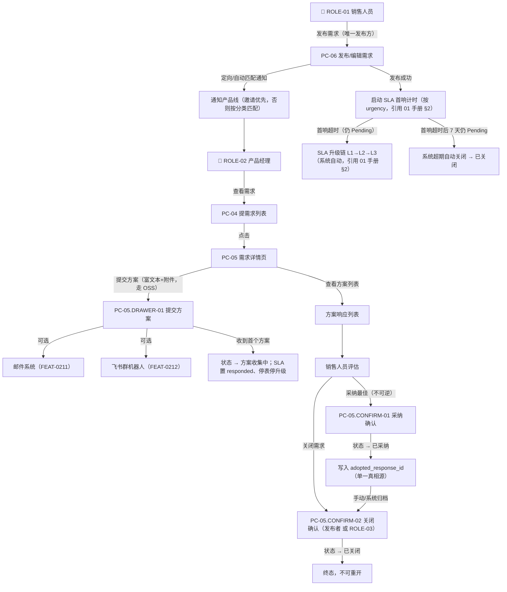

# MOD-02 商机需求与方案匹配 · 模块 PRD（v2.0 终稿）

> **模板**：B 端后台模块（b-end-module）
> **施工基准**：`决策纪要与修正基线.md`（唯一施工基准，D1~D9 + 可自动修正项）
> **上游数据源**：feature-matrix.md（FEAT-0201~0212、FEAT-0401~0403）+ information-architecture.md + business-process.md §A-3 / §B-2
> **SSOT 引用**：状态机 / SLA 单一模型 / 数据模型 ER / API 契约 / 枚举 / 脱敏 / 阈值 / 组织结构模型 / 降级，一律以 `01_全局规约手册_v2.md` 为唯一真理源。本模块只引用、不重复定义；如有出入，以 01 手册为准。
> **权限基准**：角色权限矩阵详见 `00_项目总纲_v2.md` §3.2（3 角色 × 42 功能）。

---

## 文档变更记录

| 版本 | 日期 | 修改人 | 修改内容 | 影响范围 |
|-----|------|------|---------|---------|
| v1.0 | 2026-07-17 | PM | 初始版本 | MOD-02（含 MOD-04 互动嵌入）+ FEAT-0209~0212 |
| **v2.0** | **2026-07-18** | **PM** | **按评审决策纪要 D1~D9 定稿**：① SLA 单一模型收口（删除用户自设截止时间/DatePicker，按 urgency 自动计时，倒计时仅 Pending 显示，进入 Collecting 即 responded 停表，本期只监控首响，超期自动关闭引用 01 手册）；② 可见性 BR-013 修正为"可见范围内全状态可见"+ 可见范围∩部门隔离叠加；③ 需求发布权限收口为仅 ROLE-01；④ 采纳不可逆、Adopted 单向归档 Closed、关闭补 ROLE-03 分支；⑤ 评论最多 2 级 + 软删占位；⑥ 邀请产品线依赖 ProductLine 实体；⑦ 富文本全站统一走 OSS、移除方案打分字段；⑧ 采纳单一真相源 adopted_response_id；⑨ API 路径统一 `/opportunity-requests/{id}/adopt\|close` | MOD-02 全量 |

---

## 权限归属（修正后）

> 详见 `00_项目总纲_v2.md` §3.2 权限矩阵（口径统一为"3 角色 × 42 功能"）。本模块相关权限如下（对齐 D5b / D5a / D5c）：

| 角色 | 本模块可执行操作 | 涉及 FEAT |
|------|-----------------|----------|
| **ROLE-01 销售** | **发布需求**（唯一发布方）、设置紧急程度、设置可见范围、邀请产品线、查看方案列表、采纳最佳方案、关闭自己发布的需求、评论/回复/点赞/收藏 | FEAT-0201/0202/0204/0205/0206/0209/0210/0401~0403 |
| **ROLE-02 产品经理** | 查看需求、**响应提交方案**（富文本+附件）、配置方案邮件通知、配置飞书同步、评论/回复/点赞/收藏 | FEAT-0203/0204/0211/0212/0401~0403 |
| **ROLE-03 运营/管理员** | 管理全平台需求：**关闭任意需求**（管理分支）、下架恢复（引用 D5a 与 MOD-05）；查看全部需求 | FEAT-0206（ROLE-03 分支） |

> **单人单角色（D5c）**：本平台每个账号仅归属单一角色。由此"需求发布者不可响应自己的需求"在结构上天然成立——发布者是 ROLE-01，而提交方案仅 ROLE-02 可执行，二者角色互斥，无需额外的"self-response"拦截逻辑，前端仅需按角色隐藏对应按钮即可。
> **移出下期**：FEAT-0207 相似需求检测（P2，PC-06 占位）、FEAT-0208 专家标签匹配推荐（P2，后台）本期仅保留占位/说明，不做完整实现。

---

## 业务流程

### 核心业务流程

> 来源：business-process.md §A-3 商机需求-方案匹配与采纳（按 D2/D4/D5 修正）

### 状态流转（引用 `01_全局规约手册_v2.md` §1.2 商机需求状态机）

> 🛑 状态定义、编号、约束以 01 手册 §1.2 为准。本表仅列本模块触发的合法转移，已按 M-1 补齐 `待响应→已关闭` 边、按 D2/D5 修正采纳与关闭规则。

| 当前状态 | 触发动作 | 操作角色 | 流转至状态 | 关键约束 |
|---------|---------|---------|----------|---------|
| —（新建） | 发布需求 | ROLE-01 | Pending（待响应） | 启动 SLA 首响计时（按 urgency，引用 01 手册 §2） |
| Pending | 收到首个方案响应 | ROLE-02 | Collecting（方案收集中） | SLA 置 responded、**停止倒计时与升级**（首响达成） |
| Pending | **首响超时后 7 天仍无方案** | 系统 | Closed（已关闭） | 超期自动关闭；有效期规则引用 01 手册 §2 |
| Pending / Collecting | 手动关闭 | ROLE-01（发布者）**或 ROLE-03** | Closed | ROLE-03 为管理分支（D5a）；无采纳方案时二次提示 |
| Collecting | 采纳最佳方案 | ROLE-01（发布者） | Adopted（已采纳） | 写入 `adopted_response_id`；**采纳后不可再改采纳** |
| Adopted | 手动归档 / 系统归档 | ROLE-01（发布者）/ 系统 | Closed | **Adopted 单向到 Closed**，不可回退到 Collecting |

> **说明**：
> - **本期只监控首响时限**（D2）；"解决时限"及其升级列入下期，不在状态机与页面体现。
> - 首响超时**不改变**需求状态（仍为 Pending），仅触发升级链并在列表/详情标红"已超时"；只有"首响超时后满 7 天仍为 Pending"才由系统流转为 Closed。
> - Closed 为终态，不可重开（BR-020）。

---

## 功能需求说明

### 功能描述

> 来源：feature-matrix.md MOD-02（按决策纪要修正）

商机需求与方案匹配是平台差异化核心模块，解决 PAIN-004（需求-方案匹配断裂）。**仅销售人员（ROLE-01）**通过 PC-06 发布需求（含紧急程度、可见范围、邀请产品线）；系统按"邀请优先、否则按分类自动匹配"通知对口产品线（产品经理 ROLE-02）；产品经理通过 PC-04 发现需求，在 PC-05 提交富文本方案（图片/表格走 OSS，可配置邮件通知与飞书同步）；销售人员评估后采纳最佳方案或关闭需求。全程 SLA **按 urgency 自动计时**监控**首响时限**（引用 01 手册 §2）。

**覆盖 FEAT**：FEAT-0201~0212（12 项，其中 0207/0208 为 P2 占位/后台）+ FEAT-0401~0403（3 项互动，嵌入 PC-05）
**覆盖页面**：PC-04（提需求列表）、PC-05（需求详情页）、PC-06（发布/编辑需求）

### 非功能要求

遵循 `01_全局规约手册_v2.md` 全局 NFR 基准。要点：桌面端 ≥1366×768（本期不做移动端）；列表分页默认 20/页、卡片 12/页，大列表虚拟滚动；富文本全站统一（含图片/表格/代码块，图片与附件走框架 `oss-starter`（`ossTemplate` 预签名 URL，TC-05））；写操作携带 `Idempotency-Key` 幂等；所有主业务实体带 `version` 乐观锁；附件白名单 pdf/doc/docx/xls/xlsx/ppt/pptx/jpg/png/zip。

---

### 页面说明：PC-04 提需求（需求列表）

> 来源：information-architecture.md PAGE-PC-04

**页面类型**：T1 筛选列表页 | **关联 FEAT**：FEAT-0201（入口）、FEAT-0204

**布局区域**：
- Z1 页面头部工具栏：`[+ 发布需求]` 按钮（**仅 ROLE-01 可见**，D5b）、分类筛选、紧急程度筛选、状态筛选、排序方式
- Z2 需求列表区
- Z3 分页器

#### 字段说明：PC-04

| 序号 | 字段名称 | 字段类型 | 必填 | 默认值 | 校验规则 | 备注 |
|-----|---------|---------|------|-------|---------|------|
| 1 | 分类筛选 | Cascader 级联选择 | 否 | 全部 | 引用 Category 实体树 | — |
| 2 | 紧急程度筛选 | Select 下拉 | 否 | 全部 | ENUM-URGENCY：normal / urgent / critical（引用 01 手册枚举） | — |
| 3 | 状态筛选 | Select 下拉 | 否 | 全部 | ENUM-REQ-STATUS：Pending / Collecting / Adopted / Closed | — |
| 4 | 排序方式 | Select 下拉 | 否 | latest | ENUM-SORT-REQ：latest / urgency_first / most_responses | — |
| 5 | 需求标题 | Text 只读 | — | — | VARCHAR(100) | 点击进入 PC-05 |
| 6 | 紧急程度 | Tag 只读 | — | normal | 特急红/紧急橙/普通绿；映射 P0/P1/P2 见 01 手册枚举 | — |
| 7 | 行业场景 | Text 只读 | — | — | VARCHAR(50) | — |
| 8 | 分类标签 | Tag[] 只读 | — | — | 最多显示 3 个 +N | — |
| 9 | 发布人 | Text 只读 | — | — | VARCHAR(50) | — |
| 10 | 发布人部门 | Text 只读 | — | — | 取自 Department（引用 01 手册组织模型） | — |
| 11 | 发布时间 | Text 只读 | — | — | 相对时间 ≤ 7 天，> 7 天显示日期 | — |
| 12 | 方案响应数 | Text 只读 | — | 0 | 派生 `response_count` | — |
| 13 | 浏览量 | Text 只读 | — | 0 | ≥1000 显示 "1k+"，24h 同用户去重（ViewLog） | — |
| 14 | 状态 | Tag 只读 | — | — | ENUM-REQ-STATUS，颜色区分 | — |
| 15 | SLA 状态标记 | Tag 只读 | — | — | 仅 status=Pending 且首响已超时时显示红色"已超时"；其余不展示 | 引用 01 手册 §2 |
| 16 | 每页条数 | Select | 否 | **20** | 10/20/50（列表默认 20，统一 API 契约） | — |

> **枚举**：ENUM-URGENCY / ENUM-REQ-STATUS / ENUM-SORT-REQ 的枚举值、显示名称与 P0/P1/P2 映射（critical=P0 / urgent=P1 / normal=P2，统一以 urgency 存储、priority 为展示派生）**一律引用 `01_全局规约手册_v2.md` 枚举字典**，本模块不再重复定义。

#### 操作说明：PC-04

| 操作名称 | 触发方式 | 前置条件 | 操作逻辑 | 操作反馈 |
|---------|---------|---------|---------|---------|
| "发布需求"按钮 | onClick | **当前用户角色 = ROLE-01**（否则按钮不渲染） | 路由跳转 → PC-06（新建模式） | — |
| 筛选项 | onChange | — | 重新请求列表，`page` 重置为 1 | Loading → 列表刷新 |
| 点击需求行 | onClick | 需求在当前用户可见范围内（见 BR-013） | 路由跳转 → PC-05，URL 携带 `request_id` | — |
| 分页器 | onChange | — | 请求对应页数据（`page`/`page_size`） | Loading → 列表刷新 |

#### 业务规则：PC-04

| 规则编号 | 规则描述 |
|---------|---------|
| **BR-013**（修正） | **需求可见性**：需求在**其可见范围内**对所有状态可见（含已关闭，便于复用历史方案）。列表返回结果 = `可见范围(all/dept/personnel)` ∩ `部门数据隔离`，**取交集、更严者生效**（叠加规则引用 `01_全局规约手册_v2.md` 可见性/隔离章节）。删除原"对所有已登录用户可见"表述。 |
| BR-014 | **特急置顶**：urgency=critical 的需求在默认排序（latest）下始终置顶。 |
| BR-015（修正） | **发布按钮权限**：`[+ 发布需求]` 按钮仅 ROLE-01 可见（D5b）；后端对发布接口二次鉴权，非 ROLE-01 调用返回 403。 |

#### 异常与边界处理：PC-04

| 场景 | 处理方式 |
|------|---------|
| 需求列表为空 | 空状态 + "暂无商机需求，销售人员可发布需求寻找方案" |
| 当前用户无任何可见需求 | 空状态（不泄漏可见范围外条目数量） |
| 网络异常 | 错误提示 + 重试按钮 |

---

### 页面说明：PC-05 需求详情页

> 来源：information-architecture.md PAGE-PC-05

**页面类型**：T2 详情展示页 | **关联 FEAT**：FEAT-0203、FEAT-0204、FEAT-0205、FEAT-0206、FEAT-0211、FEAT-0212、FEAT-0401~0403

**布局区域**：
- Z1 面包屑：提需求 > {标题}
- Z2 需求基本信息：标题、紧急程度 Tag、状态 Tag、**SLA 剩余时间倒计时（仅 Pending 显示）**、发布人·部门、发布时间、行业、分类标签、浏览量/点赞/收藏数、可见范围展示、已邀请产品线展示、`[关闭需求]` 按钮（**发布者或 ROLE-03 可见**）
- Z3 需求描述区：富文本渲染（图片/表格，走 OSS）
- Z4 方案响应区：`[+ 提交方案]` 按钮（**仅 ROLE-02 可见**）、方案列表（已采纳 ⭐ 置顶）+ `[采纳为最佳]` 按钮（仅发布者、仅 Collecting）
- Z5 互动操作栏：👍 点赞 + ⭐ 收藏（MOD-04 嵌入）
- Z6 评论区：评论输入框 + **最多 2 级**评论列表（评论 + 回复，软删占位）

**子视图**：PC-05.DRAWER-01（提交方案）、PC-05.CONFIRM-01（采纳确认）、PC-05.CONFIRM-02（关闭确认）

#### 字段说明：PC-05

| 序号 | 字段名称 | 字段类型 | 必填 | 默认值 | 校验规则 | 备注 |
|-----|---------|---------|------|-------|---------|------|
| 1 | 面包屑 | Breadcrumb 只读 | — | — | 提需求 > {title} | — |
| 2 | 标题 | Text 只读 | — | — | VARCHAR(100) | — |
| 3 | 紧急程度 | Tag 只读 | — | — | ENUM-URGENCY（引用 01 手册） | — |
| 4 | 状态 | Tag 只读 | — | — | ENUM-REQ-STATUS | — |
| 5 | SLA 剩余时间 | Countdown 只读 | — | — | **仅 status=Pending 显示**；未超时显示剩余倒计时，超时显示红色"已超时 Xh"；进入 Collecting/Adopted/Closed 后**不展示** | 引用 `01_全局规约手册_v2.md` §2（按 urgency 自动计时，计时起点 = created_at） |
| 6 | 发布人 | Text 只读 | — | — | VARCHAR(50) | — |
| 7 | 发布人部门 | Text 只读 | — | — | 取自 Department（引用 01 手册组织模型） | — |
| 8 | 发布时间 | Text 只读 | — | — | YYYY-MM-DD HH:mm（UTC+8） | — |
| 9 | 行业场景 | Text 只读 | — | — | VARCHAR(50) | — |
| 10 | 分类标签 | Tag[] 只读 | — | — | — | — |
| 11 | 浏览量 | Text 只读 | — | 0 | 24h 内同一用户去重（ViewLog，引用 01 手册） | — |
| 12 | 点赞数 | Text 只读 | — | 0 | 派生自 Interaction 计数 | — |
| 13 | 收藏数 | Text 只读 | — | 0 | 派生自 Interaction 计数 | — |
| 14 | 可见范围 | Text+Tag 只读 | — | all | `{type, values}`，展示为 Tag 列表 | FEAT-0209 |
| 15 | 已邀请产品线 | Tag[] 只读 | — | — | 关联 **ProductLine 实体**（引用 01 手册组织模型）；未指定时显示"系统自动匹配" | FEAT-0210 |
| 16 | 需求描述 | RichTextViewer 只读 | — | — | TEXT，图片/表格渲染（资源走 OSS） | — |
| 17 | 方案列表 | List 只读 | — | — | 按 `is_adopted DESC + created_at ASC`（采纳判定以 `OpportunityRequest.adopted_response_id` 为准） | — |
| 18 | 方案内容（每项） | RichTextViewer 只读 | — | — | TEXT，摘要截断 200 字，可展开全文（图片/表格） | — |
| 19 | 方案附件（每项） | FileList 只读 | — | — | JSON，附件走 OSS，白名单见 NFR | — |
| 20 | 响应人（每项） | Text 只读 | — | — | VARCHAR(50) | — |
| 21 | 是否已采纳（每项） | Badge 只读 | — | false | 采纳项显示 ⭐ 最佳；派生自 `adopted_response_id == response_id` | — |
| 22 | 是否已点赞 | IconButton toggle | — | false | 当前用户维度 | — |
| 23 | 是否已收藏 | IconButton toggle | — | false | 当前用户维度 | — |
| 24 | 评论内容 | TextArea | 提交时必填 | — | VARCHAR(500)，非空校验，XSS 过滤 | — |
| 25 | 评论列表 | List 只读 | — | — | **最多 2 级**（一级评论 + 二级回复）；`is_deleted=true` 显示占位"[该评论已被作者删除]"并保留子回复 | D7 |
| 26 | 父评论 ID | Hidden | — | NULL | 一级评论为 NULL；二级回复指向一级评论 `id`；**不支持对回复再回复** | D7 |

#### 操作说明：PC-05

| 操作名称 | 触发方式 | 前置条件 | 操作逻辑 | 操作反馈 |
|---------|---------|---------|---------|---------|
| 面包屑"提需求" | onClick | — | 路由跳转 → PC-04 | — |
| "关闭需求"按钮 | onClick | （当前用户 = publisher_id **或** 当前用户角色 = ROLE-03）且 status ∈ {Pending, Collecting, Adopted} | 打开 PC-05.CONFIRM-02 | — |
| "提交方案"按钮 | onClick | **当前用户角色 = ROLE-02**，status ∈ {Pending, Collecting} | 打开 PC-05.DRAWER-01 | 非 ROLE-02 不渲染 |
| "采纳为最佳"按钮 | onClick | 当前用户 = publisher_id，status = Collecting，且该需求**尚无采纳方案** | 打开 PC-05.CONFIRM-01 | 采纳后所有采纳按钮消失（不可改采纳） |
| 方案附件"下载" | onClick | — | 从 OSS 下载 | 3s 防重复 |
| 方案"展开全文" | onClick | content 超 200 字 | 展开完整富文本内容 | — |
| 点赞 | onClick | 已登录 | toggle，`POST/DELETE /interactions`(type=like, target_type=Request)；受唯一约束保证幂等 | 数字 ±1；Toast；1s 防抖 |
| 收藏 | onClick | 已登录 | toggle，`POST/DELETE /interactions`(type=collect, target_type=Request) | 图标切换；Toast；1s 防抖 |
| "发表评论" | onClick | 已登录，comment_text 非空 | `POST /interactions`(type=comment, target_type=Request, parent_comment_id=NULL) | Toast "评论成功"；清空；3s 防抖 |
| "回复" | onClick | 已登录，**仅可对一级评论回复** | 展开内联输入框 → `POST /interactions`(type=comment, parent_comment_id=一级评论 id) | Toast "回复成功"；3s 防抖 |
| "删除"评论 | onClick | 已登录，当前用户 = 评论作者 | 二次确认 → `PUT /interactions/{id}/soft-delete`（软删，保留占位与子回复） | Toast "评论已删除"；3s 防抖 |

#### 业务规则：PC-05

| 规则编号 | 规则描述 |
|---------|---------|
| BR-016（修正） | **方案提交权限**：仅 ROLE-02 可提交方案。因单人单角色（D5c），"发布者不可响应自己需求"由角色互斥天然成立，前端按角色隐藏按钮、后端按角色鉴权即可，无需额外 self-response 判断。 |
| BR-017 | **采纳权限**：仅需求发布者（publisher_id）可标记最佳方案。 |
| **BR-018**（修正） | **SLA 倒计时展示**：SLA 剩余时间**仅在 status=Pending 时显示**（按 urgency 对应首响时限实时倒计时，超时显示红色"已超时 Xh"）；一旦收到首个方案进入 Collecting，SLA 置 responded、倒计时与升级停止且不再展示。消除原 BR-018 与 BR-056 的矛盾。阈值/映射引用 `01_全局规约手册_v2.md` §2。 |
| BR-019（修正） | **方案排序**：已采纳方案（`adopted_response_id`）始终置顶显示 ⭐ 最佳，其余按提交时间正序（created_at ASC）。 |
| BR-020 | **关闭不可重开**：需求关闭后为终态 Closed，不可重新打开。 |
| BR-021 | **浏览量去重**：同一用户 24h 内重复访问去重（落 ViewLog，引用 01 手册）。 |
| **BR-056**（收口） | **首响即停**：收到首个方案 → SLA 状态置 responded，**停止倒计时与升级链**。与 BR-018 统一为同一模型，不再冲突。 |
| **BR-067**（新增） | **采纳不可逆**：采纳写入 `adopted_response_id`（单一真相源，`SolutionResponse.is_adopted` 为派生冗余、同事务更新）后不可更改采纳对象；status → Adopted，且 Adopted 只能**单向**流转到 Closed（手动/系统归档），不可回退 Collecting。 |
| **BR-068**（新增） | **关闭权限双分支**：需求关闭可由**发布者**（发布者本人的需求）或 **ROLE-03**（管理全平台需求，D5a）触发；两者共用 PC-05.CONFIRM-02，close 操作走同一 API `PUT /opportunity-requests/{id}/close`，后端按角色鉴权。 |

#### 异常与边界处理：PC-05

| 场景 | 处理方式 |
|------|---------|
| 需求不存在（request_id 无效） | 404 页面 + 返回提需求 |
| 需求不在当前用户可见范围内 | 403 / 空态提示（不泄漏内容），不进入详情 |
| 已关闭需求操作限制 | 禁止提交方案 / 采纳 / 再次关闭；仅可查看与评论 |
| 已采纳需求再次点采纳 | 采纳按钮已隐藏；后端幂等校验，重复请求返回业务错误码（已采纳） |
| 邮件/飞书发送失败 | 方案正常提交成功，Toast "方案提交成功（邮件/飞书推送失败，已记录重试队列）" |

---

### 子视图：PC-05.DRAWER-01 提交方案响应

**触发来源**：Z4 "提交方案"按钮 | **视图形态**：Drawer 抽屉（720px 右侧） | **阻断级别**：模态

#### 字段说明

| 序号 | 字段名称 | 字段类型 | 必填 | 默认值 | 校验规则 | 备注 |
|-----|---------|---------|------|-------|---------|------|
| 1 | 方案内容 (content) | RichTextEditor | ✅ | — | TEXT，非空校验 | 全站统一富文本，支持图片/表格/代码块，**图片走 OSS**（框架 `oss-starter` ossTemplate 预签名，TC-05） |
| 2 | 附件 (attachments) | Upload 多文件 | 否 | [] | 单文件 ≤ 50MB，总量 ≤ 200MB，白名单 pdf/doc/docx/xls/xlsx/ppt/pptx/jpg/png/zip | 走 OSS；阈值引用 01 手册 |
| 3 | 邮件通知对象 (email_recipients) | Checkbox.Group | 否 | ['publisher'] | 可选：publisher（需求发布者）/ responders（已响应产品线人员） | FEAT-0211。（"followers/关注者"随关注功能移出下期，本期不含） |
| 4 | 自定义邮件接收人 (custom_email_recipients) | Select tags | 否 | [] | 支持输入邮箱地址或搜索人员 | FEAT-0211 |
| 5 | 飞书机器人同步 (feishu_sync) | Switch | 否 | true | BOOLEAN | FEAT-0212 |

> **移除字段**：原方案打分相关 `score_*` 字段全部移除（打分为下期），不在本抽屉与方案实体中体现（引用决策纪要 §三.4 / §三.11）。

#### 操作说明

| 操作名称 | 触发方式 | 前置条件 | 操作逻辑 | 操作反馈 |
|---------|---------|---------|---------|---------|
| "提交方案" | onClick | content 非空 | `POST /solution-responses`（携带 Idempotency-Key）；若为首个方案则触发 Pending→Collecting 并置 SLA responded；按配置发送邮件/飞书 | Toast "方案提交成功，已发送邮件通知：{角色列表}、{自定义邮箱列表}，已同步至飞书机器人"；关闭抽屉；刷新方案列表；3s 防抖 |
| "取消" | onClick | — | 检测内容 → 有："放弃已输入内容？" [确认/取消] → 关闭；无：直接关闭 | — |

#### 业务规则

| 规则编号 | 规则描述 |
|---------|---------|
| BR-022 | **同一需求重复响应**：同一产品经理可对同一需求多次提交方案，不做去重限制。 |
| BR-065 | **邮件通知**：提交成功后，若 email_recipients 或 custom_email_recipients 非空，自动发送邮件（含方案摘要、提交人、需求链接）。通知类型 `invite`/`comment` 等枚举引用 01 手册枚举字典。 |
| BR-066 | **飞书同步**：提交成功后，若 feishu_sync=true，将方案摘要推送至默认飞书群机器人。 |

---

### 子视图：PC-05.CONFIRM-01 采纳方案确认

| 操作名称 | 触发方式 | 前置条件 | 操作逻辑 | 操作反馈 |
|---------|---------|---------|---------|---------|
| "确认采纳" | onClick | status = Collecting 且尚无采纳方案 | `PUT /opportunity-requests/{id}/adopt`（body: `response_id`，携带 Idempotency-Key）：同事务写入 `adopted_response_id` + `is_adopted`，status → Adopted，通知方案提供者（通知类型引用 01 手册枚举） | Toast "已采纳"；页面刷新；采纳按钮全部消失；3s 防抖 |
| "取消" | onClick | — | 关闭弹窗 | — |

- Confirm 标题："采纳为最佳方案"；描述："采纳后该方案将标记为最佳，需求状态变为已采纳。**采纳不可更改**。"

---

### 子视图：PC-05.CONFIRM-02 关闭需求确认

| 操作名称 | 触发方式 | 前置条件 | 操作逻辑 | 操作反馈 |
|---------|---------|---------|---------|---------|
| "确认关闭" | onClick | 当前用户 = publisher_id **或** ROLE-03；status ∈ {Pending, Collecting, Adopted} | `PUT /opportunity-requests/{id}/close`（携带 Idempotency-Key），status → Closed | Toast "需求已关闭"；页面刷新；3s 防抖 |
| "取消" | onClick | — | 关闭弹窗 | — |

- Confirm 标题："关闭需求"；描述："关闭后将无法重新打开，也无法继续接收方案响应。"
- **保留提示**：若无已采纳方案，额外提示："⚠️ 该需求尚无采纳方案，确认直接关闭？"
- ROLE-03 关闭他人需求时，追加提示："您正在以管理员身份关闭该需求。"（管理操作留痕，写审计日志）

---

### 页面说明：PC-06 发布/编辑需求

> 来源：information-architecture.md PAGE-PC-06

**页面类型**：T6 表单录入页 | **关联 FEAT**：FEAT-0201、FEAT-0202、FEAT-0207（占位）、FEAT-0209、FEAT-0210
**进入权限（D5b）**：**仅 ROLE-01** 可进入本页；非 ROLE-01 直达 URL 时返回 403 / 无权限空态。修正原型"销售和产品均可发布需求"文案与按钮门禁。

**布局区域**：
- Z1 页面标题栏：< 返回 + "发布商机需求" / "编辑商机需求"
- Z2 基础信息区：标题、紧急程度（Select）、行业场景、分类标签（Cascader 多选）
- Z2.5 可见范围卡片：Radio.Group（全部可见 / 按部门 / 按人员）+ 条件选择器
- Z2.6 邀请产品线卡片：Cascader 多选（**数据源 = ProductLine 实体**，可选，最多 10 个）
- Z3 富文本编辑区（图片/表格走 OSS）
- Z4 相似需求推荐区（FEAT-0207，P2 占位，本期只读空态）
- Z5 底部操作栏：`[发布需求]`

> **删除项（D2）**：原型/IA 中的"期望响应截止时间 DatePicker"字段**已删除**，本页**不含任何用户自设截止时间/deadline 字段**；SLA 首响时限由系统按 urgency 自动派生（引用 01 手册 §2），需求实体不引入 deadline 字段。

**子视图**：PC-06.CONFIRM-01（发布确认）

#### 字段说明：PC-06

| 序号 | 字段名称 | 字段类型 | 必填 | 默认值 | 校验规则 | 备注 |
|-----|---------|---------|------|-------|---------|------|
| 1 | 标题 (title) | Input | ✅ | — | VARCHAR(100)，1~100 字符 | — |
| 2 | 紧急程度 (urgency) | Select | ✅ | normal | ENUM-URGENCY（引用 01 手册；决定 SLA 首响时限与 P0/P1/P2 展示） | — |
| 3 | 行业场景 (industry) | Input | 否 | — | VARCHAR(50) | — |
| 4 | 分类标签 (category_ids) | Cascader 多选 | ✅ | — | 1~5 个 | 未指定邀请产品线时作为自动匹配依据 |
| 5 | 需求描述 (description) | RichTextEditor | ✅ | — | TEXT，非空校验 | 全站统一富文本，图片/表格走 OSS |
| 6 | 可见范围类型 (visibility_type) | Radio.Group | ✅ | all | all / dept / personnel | FEAT-0209 |
| 7 | 可见部门 (visible_depts) | TreeSelect 多选 | 条件必填 | — | visibility_type=dept 时必填；数据源 Department | FEAT-0209 |
| 8 | 可见人员 (visible_personnel) | Select 多选 | 条件必填 | — | visibility_type=personnel 时必填，按姓名/工号搜索 | FEAT-0209 |
| 9 | 邀请产品线 (invited_product_line_ids) | Cascader 多选 | 否 | — | 最多 10 个；**关联 ProductLine 实体**（引用 01 手册组织模型），存储为 id 列表 | FEAT-0210 |
| 10 | 相似需求 (similar_requests) | List 只读 | — | — | FEAT-0207，P2 占位，本期空态 | — |

> **无 deadline / 无 score 字段**：本表不含任何用户自设截止时间字段（D2），也不含方案打分字段（下期）。

#### 操作说明：PC-06

| 操作名称 | 触发方式 | 前置条件 | 操作逻辑 | 操作反馈 |
|---------|---------|---------|---------|---------|
| "返回" | onClick | — | 检测变更 → 有："离开将丢失内容" [确认/取消]；无：直接返回 PC-04 | — |
| "发布需求" | onClick | 当前用户 = ROLE-01；title+urgency+category_ids+description 均已填写；可见范围条件必填已满足 | 打开 PC-06.CONFIRM-01 | 校验失败 → 标红 + Toast；3s 防抖 |
| 可见范围切换 | onChange | — | all → 隐藏子选择器；dept → 展示部门 TreeSelect；personnel → 展示人员 Select | 条件必填联动 |
| 产品线选择 | onChange | — | 更新 invited_product_line_ids 状态 | 底部提示更新 |

#### 子视图：PC-06.CONFIRM-01 发布确认

| 操作名称 | 触发方式 | 前置条件 | 操作逻辑 | 操作反馈 |
|---------|---------|---------|---------|---------|
| "确认发布" | onClick | — | `POST /opportunity-requests`（携带 Idempotency-Key），status → Pending，启动 SLA 首响计时（按 urgency，引用 01 手册 §2）+ 触发通知匹配（BR-064） | Toast "需求已发布"；路由跳转 → PC-05；3s 防抖 |
| "取消" | onClick | — | 关闭弹窗 | — |

- Confirm 标题："确认发布需求"；描述："发布后将通知相关产品线，并启动 SLA 首响计时。"
- 弹窗内展示：① 可见范围摘要 ② 邀请产品线列表（有邀请显示 ProductLine 名称，无邀请显示"系统自动匹配"）
- urgency=critical 时额外红色提示："⚠️ 特急需求将触发加急通知并置顶展示。"

#### 业务规则：PC-06

| 规则编号 | 规则描述 |
|---------|---------|
| BR-023 | **需求无草稿**：商机需求不支持草稿功能，发布即生效。 |
| BR-024 | **特急加急通知**：urgency=critical 发布后触发加急通知（站内弹窗 + 飞书 @相关产品经理），并在 PC-04 置顶。通知类型引用 01 手册枚举。 |
| BR-025 | **相似需求检测**（FEAT-0207，P2 占位）：本期不实现，仅 UI 空态占位；下期异步检索已采纳需求 title+description 相似度 > 70% 的历史需求。 |
| BR-026（修正） | **发布触发 SLA**：需求发布后立即启动 SLA 首响计时器，按 urgency 对应**首响时限**倒计时（计时起点 = created_at，服务器时区 UTC+8）。阈值/映射/升级链/超期关闭规则一律引用 `01_全局规约手册_v2.md` §2。 |
| BR-063 | **可见范围默认值**：新建需求默认 all（全部可见）；切换为 dept/personnel 但未指定值时，发布校验拦截。 |
| BR-064（修正） | **邀请产品线定向通知**：`invited_product_line_ids` 非空 → 仅通知对应 ProductLine 的负责人/成员（映射引用 01 手册组织模型 ProductLineMember）；为空 → 按 category_ids 自动匹配对应产品线产品经理。 |

#### 异常与边界处理：PC-06

| 场景 | 处理方式 |
|------|---------|
| 非 ROLE-01 直达 PC-06 | 403 / 无权限空态，不渲染表单（D5b） |
| 网络异常发布失败 | Toast "发布失败，请重试" + 表单内容保留不清空 |
| 邀请产品线数据加载失败 | 该卡片降级为"系统自动匹配"，不阻塞发布 |

---

## 验收标准（Acceptance Criteria）

| AC-ID | Given | When | Then | 测试类型 |
|-------|-------|------|------|---------|
| AC-101 | ROLE-01 登录，进入 PC-06 | 填标题+紧急程度+分类+描述，默认可见范围"全部可见"，发布 → 确认 | status=Pending，跳转 PC-05，SLA 首响计时启动，按 BR-064 推送通知 | 功能 |
| AC-102（修正） | ROLE-01 在 PC-06 | 选可见范围"按部门"→"A 部门"，发布 | 需求仅对（A 部门 ∩ 部门隔离结果）内用户可见；范围外用户在 PC-04 与直达 PC-05 均不可见 | 功能 |
| AC-103 | ROLE-01 在 PC-06 | 选紧急程度"特急"，发布 | 触发加急通知 + PC-04 置顶 | 功能 |
| AC-104（修正） | ROLE-01 在 PC-06 | 邀请产品线"车规 GNSS"（ProductLine 实体），发布 | 仅车规 GNSS 产品线负责人/成员收到定向通知，未邀请产品线不收到 | 功能 |
| AC-105 | ROLE-01 在 PC-06 | 标题填空，发布 | 标题标红 + Toast "请填写必填字段" | 异常 |
| AC-106 | ROLE-02 登录，PC-05 | 提交方案 → 富文本（含图片，走 OSS）+ 附件 → 勾选邮件"发布者" → 开飞书 → 提交 | 提交成功，Toast 提示邮件已发送+飞书已同步；方案列表刷新；首方案则 status→Collecting 且 SLA 停表 | 功能 |
| AC-107 | ROLE-02 在 DRAWER-01 | 方案内容为空，提交 | 标红 + Toast | 异常 |
| AC-108 | ROLE-02 在 DRAWER-01 | 关闭飞书同步，提交 | 提交成功，不推送飞书 | 功能 |
| AC-109（修正） | 发布者进入 PC-05 | 有 3 个方案，点其一"采纳为最佳"→ 确认 | 该方案 ⭐ 最佳，status=Adopted，写 adopted_response_id，通知提供者；**其余采纳按钮消失，无法再改采纳** | 功能 |
| AC-110 | 发布者进入 PC-05 | status=Collecting，"关闭需求"→ 确认 | status=Closed，"关闭需求"按钮隐藏 | 功能 |
| AC-111 | 发布者进入 PC-05 | status=Collecting 且无采纳方案，点关闭确认 | 弹窗提示"⚠️ 该需求尚无采纳方案" | 边界 |
| AC-112 | 用户访问已关闭需求 | status=Closed | "提交方案""采纳""关闭"按钮均不展示，仅可查看与评论 | 异常 |
| AC-113（修正） | 需求 SLA 首响超时 | urgency=normal，24h 后仍无方案（Pending） | PC-05/PC-04 显示红色"已超时"，触发升级链 L1→L2→L3；**状态仍为 Pending**（不自动变更） | 功能 |
| AC-114 | 非发布者点"采纳" | PC-05 某方案行 | "采纳为最佳"按钮不可见 | 权限 |
| **AC-115**（新增，D2） | 需求进入 Collecting | 收到首个方案后查看 PC-05 | SLA 剩余时间倒计时**不再展示**，SLA 状态=responded，升级链停止 | 功能 |
| **AC-116**（新增，D2） | 需求首响超时后满 7 天仍 Pending | 系统定时任务扫描 | 系统自动将 status → Closed（超期自动关闭），规则引用 01 手册 §2 | 功能 |
| **AC-117**（新增，D5b） | ROLE-02 尝试进入 PC-06 或直调发布接口 | 直达 URL / 调 `POST /opportunity-requests` | 前端 403 空态、后端返回 403，无法发布 | 权限 |
| **AC-118**（新增，D5a） | ROLE-03 进入他人需求 PC-05 | status=Collecting，点"关闭需求"→ 确认 | 以管理员身份关闭成功，status=Closed，写审计日志 | 权限 |
| **AC-119**（新增，D7） | 用户在 PC-05 评论区 | 对二级回复再点"回复" | 不提供对回复的再回复入口（最多 2 级）；对回复的回复归并到其一级评论下 | 功能 |
| **AC-120**（新增，D7） | 评论作者删除自己评论 | 点"删除"→ 二次确认 | 该评论软删，显示"[该评论已被作者删除]"，其下二级回复仍保留可见 | 功能 |

---

## 暂不纳入 v1.0 清单（本模块，随决策纪要 D1/§三.11 裁剪）

| 项 | 处置 | 依据 |
|----|------|------|
| 用户自设"期望响应截止时间"DatePicker / deadline 字段 | **删除**（SLA 按 urgency 自动派生） | D2 |
| SLA"解决时限"及其监控/升级 | 下期（本期只监控首响） | D2 |
| 方案打分 `score_*` 字段与打分交互 | 下期（移除孤儿字段） | §三.4 / §三.11 |
| 评论 3 级及以上嵌套 / @mention | 不做（最多 2 级） | D7 |
| 方案邮件通知对象"followers/关注者" | 随关注功能移出下期 | D1 / §三.11 |
| FEAT-0207 相似需求检测（完整实现） | P2，本期仅 UI 占位 | feature-matrix P2 |
| FEAT-0208 专家标签匹配推荐 | P2，后台，本期不实现 | feature-matrix P2 |
| "复制为新方案""分享""过期横幅""邀请回答进度"等原型独有功能 | 不纳入 v1.0 | §三.11 |

---

## v1 → v2 关键变更对照（本模块）

| 项 | v1.0 | v2.0（本终稿） | 决策 |
|----|------|---------------|------|
| SLA 计时 | urgency 自动 + 用户自设截止时间并存、定义相反 | 单一模型：仅按 urgency 自动计首响，删 DatePicker/deadline | D2 |
| 倒计时展示 | Pending + Collecting 均显示（BR-018/BR-056 矛盾） | **仅 Pending 显示**；进 Collecting 即 responded 停表停升级 | D2 |
| 超期关闭 | 状态机有转移但无计时基准 | 首响超时后 7 天仍 Pending → 系统自动关闭（引用 01 手册） | D2 |
| BR-013 可见性 | "对所有已登录用户可见" | "**可见范围内**全状态可见"+ 可见范围 ∩ 部门隔离更严生效 | D4 |
| 发布权限 | 原型"销售和产品均可发布" | **仅 ROLE-01**，前后端门禁 | D5b |
| 采纳 | 未声明可否更改 | **不可逆**；adopted_response_id 单一真相源 | 状态机/§三.4 |
| Adopted 出口 | 隐含 | **单向**到 Closed（手动/系统归档） | 状态机 |
| 关闭权限 | 仅 publisher | publisher **或 ROLE-03**（管理分支） | D5a |
| 评论层级 | "无限层级" | **最多 2 级** + 软删占位 | D7 |
| 邀请产品线 | JSON 数组无实体 | 关联 **ProductLine 实体** + BR-064 定向对齐 | FEAT-0210 / D3 |
| 富文本 | PC-05 纯 TextArea / 无图片表格 | 全站统一富文本，图片/附件走 OSS | §二技术默认 |
| API 路径 | `/requests/{id}/adopt\|close` | 统一 `/opportunity-requests/{id}/adopt\|close` | §三.5 |
| 方案打分 | 含 score_* | 移除（下期） | §三.4 |

---

*文档版本：v2.0 终稿 | 日期：2026-07-18 | 施工基准：决策纪要与修正基线.md*
*引用 SSOT：01_全局规约手册_v2.md（状态机/SLA/ER/API/枚举/组织模型/阈值/脱敏/降级）*
