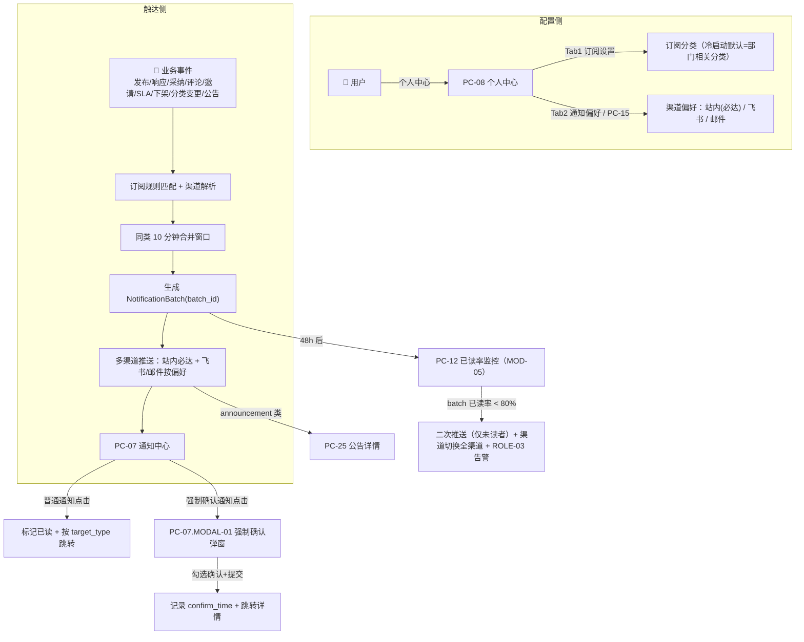

# MOD-03 通知与订阅 · 模块 PRD（v2.0 终稿）

> **模板**：B 端后台模块（b-end-module）
> **施工基准**：`决策纪要与修正基线.md`（唯一施工基准）+ `评审报告-跨岗位交叉核对.md`
> **SSOT 引用**：状态机 / 数据模型 ER / 枚举总表 / API 契约规范 / 脱敏矩阵 / 性能阈值 / 组织结构模型 / 降级策略，一律引用 `01_全局规约手册_v2.md`，本模块不重复定义，仅引用编号与取用点。
> **权限引用**：`00_项目总纲_v2.md` §3.2（3 角色 × 42 功能，唯一权限真理源）。

---

## 文档变更记录

| 版本 | 日期 | 修改人 | 修改内容 | 影响范围 |
|-----|------|------|---------|---------|
| v1.0 | 2026-07-17 | PM | 初始版本 | MOD-03 全部 FEAT |
| v2.0 | 2026-07-18 | PM | 按决策纪要 D8/D9 + 评审 M-2/M-3/M-11/M-12 重构：①冷启动默认订阅部门相关分类（修正 BR-034）+ 同类 10 分钟合并 + 站内必达；②补齐 ENUM-NOTIFY-TYPE 13 类枚举总表（触发点→target_type→跳转）；③强制确认改为 ROLE-02 手动勾选触发、ROLE-03 监控（D8）；④已读率按 NotificationBatch.batch_id 聚合、48h<80% 二次推送（仅未读者）+ 渠道切换；⑤页面重编号（PC-15 仅留通知偏好，公告发布→PC-24/MOD-05，公告详情→PC-25）；⑥保留期通知 90 天引用 01 手册 | MOD-03 全部 FEAT + 页面 |

---

## 0. 权限归属与页面重编号

### 0.1 权限归属（引用 `00_项目总纲_v2.md` §3.2）

| FEAT | 功能 | ROLE-01 销售 | ROLE-02 产品经理 | ROLE-03 运营管理员 | 说明 |
|------|------|:---:|:---:|:---:|------|
| FEAT-0301 | 配置订阅规则 | ✅ | ✅ | ✅ | 各自维护订阅分类 |
| FEAT-0302 | 选择通知渠道 | ✅ | ✅ | ✅ | 各自维护渠道偏好 |
| FEAT-0303 | 多渠道通知推送 | 🤖 | 🤖 | 🤖 | 系统后台自动分发，无前端页面 |
| FEAT-0304 | 查看通知列表 | ✅ | ✅ | ✅ | PC-07 |
| FEAT-0305 | 标记通知已读 | ✅ | ✅ | ✅ | PC-07 |
| FEAT-0306 | 已读率监控与二次推送 | — | — | ✅ | 监控入口在 PC-12（MOD-05）；本模块定义机制与触发 |
| FEAT-0307 | 强制确认阅读 | ✅ 确认 | ✅ 触发（手动勾选）+ 确认 | ✅ 监控未确认名单 | **触发权限=ROLE-02（D8）**；所有目标读者均可执行确认动作 |

> **D8 落实**：FEAT-0307 的"标记为关键变更（强制确认阅读）"由 **ROLE-02 发布者在编辑已发布内容时手动勾选**触发，**系统无自动判定**；ROLE-03 仅负责监控未确认名单并报送主管，不产生强制确认通知。

### 0.2 页面重编号（消除 H-8 一号两页；引用决策纪要 §三.1）

| 页面 ID | 页面名称 | 归属模块 | 优先级 | 本模块处理 |
|--------|---------|---------|-------|-----------|
| PC-07 | 通知中心 | MOD-03 | P0 | ✅ 本模块交付 |
| PC-08 | 个人中心 | MOD-03 | P1 | ✅ 本模块交付（订阅/偏好/收藏/发布 Tab） |
| PC-15 | **通知偏好设置** | MOD-03 | P2 | ✅ 本模块交付（PC-15 **仅保留通知偏好**） |
| ~~PC-15 公告发布~~ | 公告发布 → **PC-24** | MOD-05 | P1 | ⛔ 已拆出，见 `05_MOD-05_运营管理后台_v2.md` |
| PC-25 | **公告详情页**（用户端，原 PC-16） | MOD-03 | P1 | ✅ 本模块交付展示规格（发布/撤回在 MOD-05 PC-24） |

> 公告发布/撤回/定时/横幅推送为运营端能力，归 MOD-05 PC-24。公告的**用户端展示**（列表 + 详情）为 PC-25，随通知触达（announcement 类通知）在本模块交付。

---

## 1. 功能描述与本期范围

通知与订阅模块解决 **PAIN-002（触达无效）**、并承接 **E-2（方案发布后无人知晓）/ E-3（关键变更致合同纠纷）** 两条业务红线。用户通过 PC-08 / PC-15 配置订阅分类与通知渠道偏好；系统在内容发布 / 方案响应 / 采纳 / 评论 / 邀请 / SLA / 下架 / 分类变更 / 公告等事件发生时，按订阅规则与渠道偏好自动匹配推送；用户通过 PC-07 统一管理通知，关键变更走强制确认阅读；系统按推送批次（NotificationBatch）在 48h 后监控已读率，低于 80% 对未读者触发二次推送 + 渠道切换。

- **覆盖 FEAT**：FEAT-0301 ~ FEAT-0307（7 项）
- **覆盖页面**：PC-07（通知中心）、PC-08（个人中心）、PC-15（通知偏好设置）、PC-25（公告详情页）
- **子视图**：PC-07.MODAL-01（强制确认阅读弹窗）、PC-25.MODAL-01（公告横幅弹层，可选）

### 1.1 业务流程

### 1.2 通知状态流转（引用 `01_全局规约手册_v2.md` §1.3）

> 🛑 唯一真理点在 01 手册 §1.3 通知（Notification）状态机，本模块仅引用状态编号，严禁重复定义。

| 当前状态 | 触发动作 | 操作角色 | 流转至状态 |
|---------|---------|---------|----------|
| —（NOTIF 生成） | 系统生成通知 | 系统 | NOTIF-S1 未读（Unread） |
| NOTIF-S1 未读 | 用户点击通知行 / 强制确认提交 | 用户 | NOTIF-S2 已读（Read） |
| NOTIF-S1 未读 | "全部标记已读"（不含强制确认通知） | 用户 | NOTIF-S2 已读（Read） |

> 说明：强制确认通知（type=force_confirm）的"已读"以 `confirm_time` 写入为准，不受"全部标记已读"影响（BR-029）。

---

## 2. 通知类型枚举总表（落实 M-2；引用 `01_全局规约手册_v2.md` 枚举总表 ENUM-NOTIFY-TYPE / ENUM-NOTIFY-TARGET / ENUM-CHANNEL）

> 🛑 枚举唯一真理源在 01 手册枚举总表。本表为 MOD-03 的**取用视图**：明确每类通知的触发点、目标类型（target_type，含 SolutionResponse / Announcement）、跳转目标、接收者与默认渠道。字段值以 01 手册为准。

### 2.1 ENUM-NOTIFY-TYPE（13 类）

| # | type 代码 | 显示名 | 触发点（事件 / FEAT） | target_type | 跳转目标 | 接收者 | 默认渠道 | 强制确认 |
|---|----------|-------|---------------------|-------------|---------|-------|---------|:---:|
| 1 | publish | 发布 | 新商机信息发布（FEAT-0104） | Opportunity | PC-02 商机详情 | 订阅匹配分类的用户 | 站内(必达) + 按偏好 | 否 |
| 2 | response | 响应 | 收到方案响应（FEAT-0203） | SolutionResponse | PC-05 需求详情（锚点定位该方案） | 需求发布者（ROLE-01） | 站内(必达) + 按偏好 | 否 |
| 3 | adopt | 采纳 | 方案被采纳（FEAT-0205） | SolutionResponse | PC-05 需求详情（锚点该方案，标 ⭐ 最佳） | 被采纳方案提供者（ROLE-02） | 站内(必达) + 按偏好 | 否 |
| 4 | system | 系统 | 系统维护 / 账号 / 权限变更等系统事件 | System | 无跳转（或系统消息内联） | 目标用户 | 站内(必达) | 否 |
| 5 | comment | 评论 | 内容被评论（FEAT-0401，一级评论） | Opportunity / Request | PC-02 / PC-05（锚点该评论） | 内容发布者 | 站内(必达) + 按偏好 | 否 |
| 6 | reply | 回复 | 评论被回复（FEAT-0401，二级回复；评论最多 2 级，D7） | Opportunity / Request | PC-02 / PC-05（锚点该回复） | 被回复评论作者 | 站内(必达) + 按偏好 | 否 |
| 7 | invite | 邀请 | 邀请产品线回答（FEAT-0210，定向） | Request | PC-05 需求详情（进入即可响应） | 被邀请产品线的 ROLE-02 | 站内(必达) + 飞书(定向) | 否 |
| 8 | force_confirm | 强制确认 | 关键变更强制确认阅读（FEAT-0307，ROLE-02 手动勾选触发） | Opportunity / Request | PC-07.MODAL-01 → 确认后跳 PC-02 / PC-05 | 目标读者 | 站内(必达) + 飞书 + 邮件（全渠道，红线强制） | **是** |
| 9 | sla_remind | SLA 催办 | 运营催办（FEAT-0506，PC-13 催办按钮） | Request | PC-05 需求详情 | 对应产品线负责人 | 站内(必达) + 飞书 + 邮件 | 否 |
| 10 | sla_escalate | SLA 升级 | SLA 升级链 L1→L2→L3（FEAT-0506，系统自动） | Request | PC-05 需求详情（ROLE-03 可转 PC-13） | 各级升级收件人（L1 产品线负责人 / L2 产品管理部 / L3 管理层） | 站内(必达) + 飞书 + 邮件 | 否 |
| 11 | archive | 下架 | 内容被管理员下架（FEAT-0503，含下架原因） | Opportunity / Request | PC-02 / PC-05 | 原发布者 | 站内(必达) + 按偏好 | 否 |
| 12 | category_change | 分类变更 | 订阅分类名称变更 / 停用（FEAT-0504 + FEAT-0301） | System（携带 category_id） | 无跳转（可选跳 PC-17 按该分类查方案） | 订阅了该分类的用户 | 站内(必达) + 按偏好 | 否 |
| 13 | announcement | 公告推送 | 公告发布（PC-24，MOD-05） | Announcement | PC-25 公告详情 | 全员或公告目标范围 | 站内(必达) + 横幅（首页 Banner） | 否 |

> **跳转补充说明**：
> - target_type=SolutionResponse 时，`target_id` 为方案 ID，跳转其所属需求详情 PC-05，并锚点滚动到该方案卡片。
> - target_type=System 且携带 category_id（category_change）时，可选跳转 PC-17 查方案页并预置该分类筛选；无 target_id 的纯系统通知不跳转。
> - EX-015 通知目标已删除（target 内容不存在）时：Toast "该内容已不存在"，标记已读但不跳转。

### 2.2 ENUM-NOTIFY-TARGET（target_type，v2 扩充；引用 01 手册）

| 值 | 含义 | 跳转页面 |
|----|------|---------|
| Opportunity | 商机信息 | PC-02 |
| Request | 商机需求 | PC-05 |
| SolutionResponse | 方案响应（**v2 新增**） | PC-05（锚点方案） |
| Announcement | 公告（**v2 新增**） | PC-25 |
| System | 系统消息 | 无跳转 / 内联 |

### 2.3 ENUM-CHANNEL（推送渠道；引用 01 手册）

| 值 | 显示 | 强制性 | 默认 | 说明 |
|----|------|-------|------|------|
| inapp | 站内 | **必达，不可关闭** | 开 | 保底触达，任何通知均生成站内记录（BR-033） |
| feishu | 飞书 | 可选 | 开 | 失败站内兜底，重试 3 次后告警（引用 01 手册 §8 外部集成） |
| email | 邮件 | 可选 | 关 | 失败站内兜底（引用 01 手册 §8） |

---

## 3. 通知推送与订阅策略（落实 D9 / M-12 冷启动）

### 3.1 冷启动默认订阅（**修正 BR-034**，落实 D9）

- **新用户默认订阅其部门相关分类，而非全量推送**。用户首次登录时，系统依据其 `department_id`，通过组织结构模型（引用 `01_全局规约手册_v2.md` 组织结构章节：Department / 部门→分类映射）生成默认订阅集合。
- 默认订阅仅决定"按分类广播类"通知（publish / announcement 中按分类定向的部分 / category_change）的接收范围；**针对本人的定向通知**（response / adopt / comment / reply / invite / force_confirm / sla_remind / sla_escalate / archive）不受订阅集合限制，始终推送。
- 用户可在 PC-08 Tab1 自由增删订阅分类。
- **订阅集合为空**（用户主动清空）时：**不再全量推送内容通知**，仅接收站内必达的系统通知（system）与针对本人的定向通知，避免 500+ 用户噪声（消除 M-12 通知洪水）。

### 3.2 同类通知合并（落实 D9）

- **合并窗口 = 10 分钟**。同一接收者（user_id）+ 同一 type + 同一 target（或同一 batch）在 10 分钟内产生的多条通知，合并为一条聚合通知（如"张三等 3 人评论了《XX 方案》"）。
- 合并后仍遵循渠道规则：**站内必达**，飞书 / 邮件按用户偏好；聚合通知点击后跳转其代表的最新目标。
- force_confirm（强制确认）、sla_escalate（SLA 升级）**不参与合并**，逐条独立推送。

### 3.3 渠道解析规则

- 任一通知首先生成 **站内记录**（必达）；再按用户在 PC-08/PC-15 配置的 `channel_feishu` / `channel_email` 偏好叠加对应渠道。
- 红线类通知（force_confirm / sla_remind / sla_escalate）**强制全渠道**（站内 + 飞书 + 邮件），覆盖个人渠道偏好（红线保障优先，见 BR-072）。
- 外部渠道失败降级：飞书 / 邮件推送失败均以站内兜底，不阻断主流程（引用 `01_全局规约手册_v2.md` §8 外部系统集成与降级）。

### 3.4 已读率监控与二次推送（落实 E-2；按 NotificationBatch.batch_id 聚合）

- **批次建模**：每次业务事件的一次群发生成一个 `NotificationBatch(batch_id)`，其下的所有 Notification 记录携带同一 `batch_id`（引用 `01_全局规约手册_v2.md` 数据模型 ER：NotificationBatch、Notification.batch_id）。
- **已读率计算**：`batch 已读率 = COUNT(Notification WHERE batch_id=X AND is_read=true) / COUNT(Notification WHERE batch_id=X) × 100%`。
- **触发条件**：批次生成 **48h 后**检测；已读率 **< 80%**（阈值引用 `01_全局规约手册_v2.md` §7 通知已读率基线）时触发：
  1. **二次推送——仅面向该批次未读者**（is_read=false 的记录），不重复打扰已读者；
  2. **渠道切换**——二次推送从"用户偏好渠道"切换为 **站内 + 飞书 + 邮件全渠道**（红线场景强制全渠道，覆盖个人偏好，最大化触达）；
  3. **ROLE-03 告警**——在 PC-12 运营看板生成"触达率不足"告警（引用 MOD-05 BR-053）。
- 二次推送每批次仅执行一次（避免无限循环）；二次推送后仍未读的进入 ROLE-03 人工干预（PC-12 手动定向推送）。

---

## 4. 强制确认阅读机制（落实 D8 / M-11）

- **触发权限（D8）**：仅 **ROLE-02 发布者**在编辑已发布商机 / 需求时，**手动勾选"☐ 标记为关键变更（强制确认阅读）"** 后再发布，方生成 type=force_confirm 通知。**系统不做任何自动判定**（无"价格字段变化即强制"之类规则）。
- **接收者**：该内容的目标读者（订阅匹配用户 + 历史交互者，按发布范围）。
- **确认动作**：所有目标读者点击该通知 → 打开 PC-07.MODAL-01（模态，不可 ESC / 遮罩关闭）→ 必须勾选"我已阅读并知悉以上变更内容" → 提交，记录 `confirm_time`。
- **监控（D8）**：ROLE-03 通过运营端查看**未确认名单**（PC-12 / PC-24 关联视图），可一键报送主管；ROLE-03 不触发强制确认通知。
- **旧版本失效**：关键变更发布后，关联旧版本文档自动标记 "⚠️ 已失效" 水印（BR-032，承接 E-3）。

---

## 5. 页面说明：PC-07 通知中心

**页面类型**：T1 筛选列表页 | **访问权限**：ALL（ROLE-01/02/03） | **关联 FEAT**：FEAT-0304、FEAT-0305、FEAT-0307
**入口**：APP-SHELL TOPBAR 🔔 铃铛（点击跳转，角标清零同步）

### 5.1 布局区块

- Z1 页面头部：标题"通知中心 未读(N)" + 阅读状态筛选 + 类型筛选 + "全部标记已读"
- Z2 通知列表区（按 created_at DESC）
- Z3 分页器

### 5.2 字段说明

| 序号 | 字段名称 | 字段英文名 | 字段类型 | 必填 | 默认值 | 校验/取值 | 备注 |
|-----|---------|-----------|---------|------|-------|---------|------|
| 1 | 未读数 | unread_count | Badge | — | 0 | INT，实时同步 TOPBAR 铃铛角标 | FEAT-0304 |
| 2 | 阅读状态筛选 | read_filter | SegmentedControl | 否 | all | all / unread / read | — |
| 3 | 类型筛选 | type_filter | Select | 否 | 全部 | ENUM-NOTIFY-TYPE（13 类，见 §2.1；建议分组：内容/互动/需求响应/SLA/系统公告） | 引用 01 手册枚举总表 |
| 4 | 已读状态 | is_read | Dot 指示器 | — | 🔴未读 | BOOLEAN；🔴未读 / ⚪已读 | Notification.is_read |
| 5 | 通知类型 | type | Tag（只读） | — | — | ENUM-NOTIFY-TYPE | — |
| 6 | 通知标题 | title | Text（只读） | — | — | VARCHAR(200)，系统模板生成 | — |
| 7 | 触发人 | trigger_user | Text（只读） | 允许空 | — | VARCHAR(50)；系统通知无触发人 | 关联 User.name |
| 8 | 通知时间 | created_at | Text（只读） | — | — | 相对时间 ≤ 7 天，> 7 天显示日期 | — |
| 9 | 强制确认标记 | is_force_confirm | Badge（只读） | — | false | true 显示 `[!强制]` 标签 | type=force_confirm（FEAT-0307） |
| 10 | 目标类型 | target_type | Hidden | — | — | ENUM-NOTIFY-TARGET：Opportunity/Request/SolutionResponse/Announcement/System | 用于跳转 |
| 11 | 目标 ID | target_id | Hidden | 允许空 | — | VARCHAR；System 类可空 | 用于跳转/锚点 |
| 12 | 批次 ID | batch_id | Hidden | 允许空 | — | 关联 NotificationBatch，供已读率聚合 | 引用 01 手册数据模型 |
| 13 | 每页条数 | page_size | Select | 否 | 20 | 20/50/100（列表视图，引用 01 手册 §7 分页基线） | — |

### 5.3 操作说明

| 操作名称 | 触发方式 | 前置条件 | 操作逻辑 | 操作反馈 |
|---------|---------|---------|---------|---------|
| 筛选/类型切换 | onChange | — | 重新请求列表，page 重置为 1 | Loading → 刷新 |
| "全部标记已读" | onClick | 存在未读通知 | `PUT /notifications/read-all`，批量标记（**排除 force_confirm 类**，BR-029） | Toast "已全部标记已读"；未读数扣减（不含强制确认）；3s 防抖 |
| 点击普通通知行 | onClick | is_force_confirm=false | ①标记该通知已读（`PUT /notifications/{id}/read`）②按 target_type 跳转（见 §2.1，含 SolutionResponse→PC-05 锚点、Announcement→PC-25） | 未读数 -1；行变已读样式 |
| 点击强制确认通知行 | onClick | is_force_confirm=true | 打开 PC-07.MODAL-01（不自动标记已读） | — |
| 点击聚合通知行 | onClick | 合并通知（§3.2） | 展开明细或跳转其代表的最新目标；标记该聚合已读 | — |

### 5.4 业务规则

| 规则编号 | 规则描述 |
|---------|---------|
| BR-027 | **自动标记已读**：点击普通通知行即自动标记已读，无需额外操作。来源：FEAT-0305 |
| BR-028 | **未读角标同步**：PC-07 未读数与 TOPBAR 铃铛角标实时双向同步。来源：FEAT-0304 |
| BR-029 | **强制确认不可批量已读**：type=force_confirm 的通知不受"全部标记已读"影响，必须逐条经 MODAL 确认。来源：FEAT-0307 |
| BR-030 | **通知保留期限**：通知保留 **90 天**，超期自动归档不展示（引用 `01_全局规约手册_v2.md` §7 保留期基线）。来源：[系统标配 NFR] |
| BR-071 | **合并展示**：同类通知 10 分钟内合并为一条聚合通知展示（§3.2）；force_confirm / sla_escalate 不合并。**（v2 新增）** |

### 5.5 异常处理

| 场景 | 处理方式 |
|------|---------|
| EX-014 通知为空 | 空状态 + "暂无通知" |
| EX-015 通知目标已删除 | Toast "该内容已不存在"，标记已读但不跳转 |
| 强制确认目标已删除 | MODAL 展示归档快照（title + 变更摘要），仍可确认，确认后不跳转 |
| 列表加载超时 | 展示"网络异常，请稍后重试" + 重试按钮（引用 01 手册 §7 API 超时 10s） |

---

### 子视图：PC-07.MODAL-01 强制确认阅读弹窗

**视图形态**：Modal 模态对话框（640px） | **阻断级别**：模态（**不可点击遮罩关闭，不可 ESC**） | **关联 FEAT**：FEAT-0307

#### 字段说明

| 序号 | 字段名称 | 字段类型 | 必填 | 校验规则 | 备注 |
|-----|---------|---------|------|---------|------|
| 1 | 变更标题 | Text 只读 | — | VARCHAR(200) | — |
| 2 | 变更内容摘要 | RichTextViewer 只读 | — | TEXT（Tiptap/Quill 渲染，引用 01 手册富文本规范） | — |
| 3 | 关联内容入口 | Link 只读 | — | 指向 PC-02 / PC-05 | 确认后可跳转 |
| 4 | 确认勾选 | Checkbox | ✅ | 必须勾选才能提交 | "我已阅读并知悉以上变更内容" |

#### 操作说明

| 操作名称 | 触发方式 | 前置条件 | 操作逻辑 | 操作反馈 |
|---------|---------|---------|---------|---------|
| "确认已阅读" | onClick | checkbox=true | `PUT /notifications/{id}/force-confirm`，记录 `confirm_time` → 状态置已读 → 跳转详情 | Toast "已确认"；3s 防抖 |
| "确认已阅读"（未勾选） | onClick | checkbox=false | 按钮 disabled | — |
| 遮罩层 / ESC | — | — | 阻止关闭 | — |

#### 业务规则

| 规则编号 | 规则描述 |
|---------|---------|
| BR-031 | **强制确认审计**：确认动作记录 user_id + confirm_time，供 ROLE-03 查看未确认名单并报送主管。来源：FEAT-0307（承接 E-3） |
| BR-032 | **旧版本失效**：关键变更（如价格调整）发布后，关联旧版本文档自动标记 "⚠️ 已失效" 水印。来源：FEAT-0307 |
| BR-072 | **触发权限收口（D8）**：force_confirm 通知**仅由 ROLE-02 发布者手动勾选"标记为关键变更"触发**，系统无自动判定；ROLE-03 仅监控未确认名单，不触发。红线类通知强制全渠道推送。**（v2 新增）** |

---

## 6. 页面说明：PC-08 个人中心

**页面类型**：T2 详情展示页 | **访问权限**：ALL | **关联 FEAT**：FEAT-0301、FEAT-0302、FEAT-0402
**布局**：Z1 用户信息卡片 → Z2 Tab：[订阅设置 | 通知偏好 | 我的收藏 | 我的发布]

### 6.1 字段说明

| 序号 | 字段名称 | 字段英文名 | 字段类型 | 必填 | 默认值 | 校验/取值 | 备注 |
|-----|---------|-----------|---------|------|-------|---------|------|
| 1 | 头像/姓名/部门/工号 | — | 只读 | — | — | 姓名/工号来自 UAA、部门本地维护（PC-26），不可编辑（TC-04） | Z1；手机号如展示按 01 手册脱敏矩阵（中间 4 位掩码） |
| 2 | 角色 | role | Tag 只读 | — | — | ENUM-ROLE：sales/product_manager/admin | Z1 |
| 3 | 订阅分类 | subscribed_categories | Cascader 多选 | 否 | **冷启动=部门相关分类** | 引用 Category 实体树，无上限 | Tab1（FEAT-0301，D9） |
| 4 | 站内通知 | channel_inapp | Checkbox | — | true | **始终勾选不可取消**（强制渠道） | Tab2（FEAT-0302，BR-033） |
| 5 | 飞书通知 | channel_feishu | Checkbox | — | true | 默认开启 | Tab2 |
| 6 | 邮件通知 | channel_email | Checkbox | — | false | 默认关闭 | Tab2 |
| 7 | 收藏类型筛选 | collect_filter | SegmentedControl | 否 | opportunity | opportunity / request | Tab3 |
| 8 | 收藏列表 | collect_list | List 只读 | — | — | 按收藏时间 DESC | Tab3（FEAT-0402） |
| 9 | 发布记录列表 | publish_list | List 只读 | — | — | 按 created_at DESC | Tab4 |

> **Tab2 通知偏好**在 PC-08 内提供快捷开关（站内/飞书/邮件三渠道总开关）；**按通知类型 × 渠道的精细矩阵**在 PC-15 通知偏好设置页配置（入口：本页 [通知偏好] → PC-15）。两处共写 `User.notification_preferences`。

### 6.2 操作说明

| 操作名称 | 触发方式 | 前置条件 | 操作逻辑 | 操作反馈 |
|---------|---------|---------|---------|---------|
| Tab 切换 | onClick | — | 切换内容区，URL hash 同步 | — |
| 订阅"保存" | onClick | — | `PUT /users/me/subscriptions` | Toast "订阅设置已保存"；3s 防抖 |
| 通知偏好"保存" | onClick | — | `PUT /users/me/notification-preferences` | Toast "通知偏好已保存"；3s 防抖 |
| 进入精细配置 | onClick | — | 跳转 PC-15 通知偏好设置 | — |
| 收藏项点击 | onClick | — | 跳转 PC-02（商机）/ PC-05（需求） | — |
| "取消收藏" | onClick | — | `DELETE /interactions`（type=collect，引用 01 手册唯一约束 (user_id,target_type,target_id,type)） | Toast "已取消收藏"；1s 防抖 |
| 发布记录点击 | onClick | — | 跳转 PC-02 / PC-05 | — |

### 6.3 业务规则

| 规则编号 | 规则描述 |
|---------|---------|
| BR-033 | **站内通知强制**：站内通知渠道始终开启不可取消，确保最低触达覆盖。来源：FEAT-0302 |
| BR-034 | **冷启动默认订阅（修正，D9）**：新用户默认订阅其**部门相关分类**（据 department_id + 部门→分类映射解析，非全量推送）；用户可自由增删。**订阅为空时不再全量推送内容通知**，仅接收系统通知与针对本人的定向通知。来源：FEAT-0301（替代原"订阅为空时全推"） |
| BR-035 | **个人信息不可编辑**：姓名/工号/角色来自 UAA、部门本地维护（PC-26），仅展示。来源：FEAT-0601（TC-04：UAA 不提供部门/工号，部门本地维护） |
| BR-073 | **定向通知不受订阅约束**：response/adopt/comment/reply/invite/force_confirm/sla_* /archive 等针对本人的通知始终推送，不受订阅分类集合限制。**（v2 新增）** |

### 6.4 异常处理

| 场景 | 处理方式 |
|------|---------|
| EX-016 收藏项已删除 | 灰显 + "内容已删除"，点击不跳转 |
| EX-017 SSO 信息同步延迟 | 底部灰色提示"信息每 24h 自动同步，如有变更请联系管理员" |
| 部门→分类映射为空（新部门未维护） | 冷启动订阅集合为空，提示"请在订阅设置中选择关注分类"；仅推送定向+系统通知 |

---

## 7. 页面说明：PC-15 通知偏好设置

**页面类型**：T6 表单页 | **访问权限**：ALL | **关联 FEAT**：FEAT-0301、FEAT-0302 | **优先级**：P2
**入口**：PC-08 个人中心 → [通知偏好]
**说明**：PC-15 v2 **仅保留通知偏好设置**；原"公告发布"已拆至 MOD-05 PC-24。

### 7.1 字段说明

| 序号 | 字段名称 | 字段英文名 | 字段类型 | 必填 | 默认值 | 备注 |
|-----|---------|-----------|---------|------|-------|------|
| 1 | 通知类型 × 渠道矩阵 | preference_matrix | Switch 开关矩阵 | 否 | 见下 | 行=ENUM-NOTIFY-TYPE 分组；列=站内/飞书/邮件；**站内列强制开启不可关**（BR-033） |
| 2 | 全局免打扰时段（可选） | dnd_window | TimeRange | 否 | 关 | 免打扰时段内飞书/邮件延迟至时段结束推送；站内必达不延迟 |

**矩阵行分组建议**（对齐 §2.1）：

| 分组 | 覆盖 type | 站内 | 飞书 | 邮件 | 默认渠道 |
|------|----------|:---:|:---:|:---:|---------|
| 内容更新 | publish / archive / category_change | 强制开 | 可配 | 可配 | 站内+飞书 |
| 互动消息 | comment / reply | 强制开 | 可配 | 可配 | 站内+飞书 |
| 需求与方案 | response / adopt / invite | 强制开 | 可配 | 可配 | 站内+飞书 |
| SLA（仅相关角色可见） | sla_remind / sla_escalate | 强制开 | **锁定开**（红线） | **锁定开**（红线） | 全渠道 |
| 关键变更 | force_confirm | 强制开 | **锁定开**（红线） | **锁定开**（红线） | 全渠道 |
| 系统公告 | system / announcement | 强制开 | 可配 | 可配 | 站内+横幅 |

### 7.2 操作说明

| 操作名称 | 触发方式 | 前置条件 | 操作逻辑 | 操作反馈 |
|---------|---------|---------|---------|---------|
| 切换矩阵开关 | onChange | 非锁定项 | 本地暂存 | 即时反馈 |
| "保存" | onClick | — | `PUT /users/me/notification-preferences` | Toast "通知偏好已保存"；3s 防抖 |
| 尝试关闭站内/红线锁定项 | onClick | — | 拦截 | Tooltip "该渠道为保障触达不可关闭" |

### 7.3 业务规则

| 规则编号 | 规则描述 |
|---------|---------|
| BR-033 | （引用）站内渠道强制开启不可关。 |
| BR-072 | （引用）红线类（force_confirm / sla_*）强制全渠道，用户不可关闭飞书/邮件。 |
| BR-074 | **免打扰不适用红线与站内**：免打扰时段仅延迟非红线的飞书/邮件推送；站内必达与红线通知不受影响。**（v2 新增）** |

### 7.4 异常处理

| 场景 | 处理方式 |
|------|---------|
| 保存失败 | Toast "保存失败，请重试"；保留本地未保存状态 |

---

## 8. 页面说明：PC-25 公告详情页（用户端）

**页面类型**：T2 详情展示页 | **访问权限**：ALL | **关联 FEAT**：— （承 announcement 类通知触达） | **优先级**：P1
**原 ID**：PC-16（v2 重编号为 PC-25）
**入口**：①首页公告横幅点击；②TOPBAR/导航 [公告] 入口；③announcement 类通知点击（target_type=Announcement）
**归属说明**：公告的**发布/编辑/定时/撤回/横幅推送**属运营端 PC-24（MOD-05）；本页仅承载**用户端展示**（公告列表 + 详情）。数据实体 Announcement 引用 `01_全局规约手册_v2.md` 数据模型 ER。

### 8.1 布局区块

- Z1 公告列表（左侧或顶部）：按类型筛选 [通知 / 政策 / 活动 / 其他]，置顶公告优先
- Z2 公告详情（富文本渲染）

### 8.2 字段说明

| 序号 | 字段名称 | 字段英文名 | 字段类型 | 必填 | 默认值 | 校验/取值 | 备注 |
|-----|---------|-----------|---------|------|-------|---------|------|
| 1 | 类型筛选 | type_filter | SegmentedControl | 否 | 全部 | ENUM-ANNOUNCE-TYPE：notice/policy/activity/other（引用 01 手册枚举总表） | Z1 |
| 2 | 公告标题 | title | Text 只读 | — | — | VARCHAR(200) | Z1/Z2 |
| 3 | 公告类型 | type | Tag 只读 | — | — | ENUM-ANNOUNCE-TYPE | — |
| 4 | 置顶标记 | is_pinned | Badge 只读 | — | false | 置顶公告列表优先展示 | — |
| 5 | 发布人 | publisher | Text 只读 | — | — | 运营方（ROLE-03） | — |
| 6 | 发布时间 | published_at | Text 只读 | — | — | DATETIME | — |
| 7 | 公告正文 | content | RichTextViewer 只读 | — | — | TEXT（Tiptap/Quill 渲染，附件走 OSS） | Z2 |
| 8 | 附件列表 | attachments | List 只读 | 允许空 | — | 白名单格式（引用 01 手册 §7） | Z2 |

### 8.3 操作说明

| 操作名称 | 触发方式 | 前置条件 | 操作逻辑 | 操作反馈 |
|---------|---------|---------|---------|---------|
| 类型筛选 | onChange | — | 过滤公告列表 | Loading → 刷新 |
| 点击公告项 | onClick | — | 加载并渲染 Z2 详情；若来自 announcement 通知则同步标记该通知已读 | — |
| 附件下载 | onClick | — | 走 OSS 下载链接 | — |
| 关闭横幅 | onClick | 首页横幅 | 本次会话不再弹（localStorage 记录 announcement_id） | — |

### 8.4 业务规则

| 规则编号 | 规则描述 |
|---------|---------|
| BR-075 | **公告只读**：用户端 PC-25 对公告仅可查看，发布/撤回在 PC-24（MOD-05）。**（v2 新增）** |
| BR-076 | **横幅推送**：is_pinned 或开启横幅推送的公告在首页 Banner 展示，点击进入 PC-25；关闭后本会话不再弹。**（v2 新增）** |
| BR-077 | **通知联动已读**：由 announcement 类通知进入 PC-25 查看对应公告后，联动标记该通知已读（NOTIF-S1→NOTIF-S2）。**（v2 新增）** |

### 8.5 异常处理

| 场景 | 处理方式 |
|------|---------|
| 公告已撤回 | Toast "该公告已撤回或不存在"，返回列表 |
| 公告为空 | 空状态 + "暂无公告" |

---

## 9. 数据模型引用（引用 `01_全局规约手册_v2.md` 数据模型 ER，不重复定义）

本模块依赖的实体与关键字段（唯一真理源在 01 手册）：

| 实体 | 关键字段 | MOD-03 取用点 |
|------|---------|--------------|
| Notification | id / user_id / target_type / target_id / type / channel / title / is_read / is_force_confirm / confirm_time / **batch_id**（v2 新增，H-10）/ created_at | PC-07 列表、跳转、强制确认、已读率 |
| NotificationBatch | batch_id / event_type / trigger_ref / channel_set / recipient_count / created_at | 已读率按 batch 聚合（§3.4） |
| User.notification_preferences | channel_inapp / channel_feishu / channel_email / preference_matrix / dnd_window | PC-08 Tab2、PC-15 |
| User.subscribed_categories | 订阅分类集合（冷启动默认=部门相关分类） | PC-08 Tab1（D9） |
| Department / 部门→分类映射 | 冷启动默认订阅解析（引用 01 手册组织结构模型，D3） | §3.1 |
| Announcement | id / title / type / content / is_pinned / published_at / status | PC-25 展示 |
| Interaction（type=collect） | 唯一约束 (user_id,target_type,target_id,type) | PC-08 Tab3 收藏 |

> 通知状态机（NOTIF-S1 未读 → NOTIF-S2 已读）、ENUM-NOTIFY-TYPE / ENUM-NOTIFY-TARGET / ENUM-CHANNEL / ENUM-ANNOUNCE-TYPE、48h/80% 阈值、90 天保留期，均引用 `01_全局规约手册_v2.md`，本模块不重复定义。

---

## 10. API 契约（引用 `01_全局规约手册_v2.md` API 契约规范：复数 kebab 资源、page/page_size 分页、sort_by/order、鉴权头、统一错误体、写操作 Idempotency-Key）

| 方法 | 路径 | 说明 | 幂等 |
|------|------|------|:---:|
| GET | `/notifications` | 通知列表；query：`read_filter` / `type` / `page` / `page_size` / `sort_by` / `order` | — |
| GET | `/notifications/unread-count` | 未读数（角标同步） | — |
| PUT | `/notifications/{id}/read` | 单条标记已读 | Idempotency-Key |
| PUT | `/notifications/read-all` | 全部标记已读（排除 force_confirm） | Idempotency-Key |
| PUT | `/notifications/{id}/force-confirm` | 强制确认，写 confirm_time | Idempotency-Key |
| GET | `/users/me/subscriptions` | 获取订阅分类 | — |
| PUT | `/users/me/subscriptions` | 保存订阅分类 | Idempotency-Key |
| GET | `/users/me/notification-preferences` | 获取渠道/矩阵偏好 | — |
| PUT | `/users/me/notification-preferences` | 保存渠道/矩阵偏好 | Idempotency-Key |
| GET | `/announcements` | 公告列表（PC-25）；query：`type` / `page` / `page_size` | — |
| GET | `/announcements/{id}` | 公告详情（PC-25） | — |
| GET | `/admin/notification-batches/{batch_id}/read-rate` | 批次已读率（ROLE-03，供 PC-12 监控 / 未确认名单） | — |
| POST | `/admin/notification-batches/{batch_id}/repush` | 对未读者二次推送 + 渠道切换（ROLE-03） | Idempotency-Key |

> FEAT-0303 多渠道推送为系统后台服务（无前端页面）：订阅匹配 → 10 分钟合并窗口 → 生成 NotificationBatch → 站内必达 + 飞书/邮件按偏好分发（异步 outbox，引用 01 手册 §8 与技术默认项 RabbitMQ）。

---

## 11. 验收标准

| AC-ID | Given | When | Then | 测试类型 |
|-------|-------|------|------|---------|
| AC-201 | 用户进入 PC-07，有 5 条普通未读通知 | 点击"全部标记已读" | 5 条全部变已读，未读数归零，铃铛角标同步清零 | 功能测试 |
| AC-202 | 用户有 1 条强制确认通知（价格变更） | 点击该通知 | 弹出 PC-07.MODAL-01，不可 ESC/遮罩关闭，必须勾选确认 | 功能测试 |
| AC-203 | 用户未勾选确认 checkbox | 点击"确认已阅读" | 按钮 disabled，不可点击 | 边界测试 |
| AC-204 | 用户进入 PC-08 Tab2 | 取消飞书勾选 → 保存 | 后续非红线通知仅站内推送，不再推飞书 | 功能测试 |
| AC-205 | 用户在 Tab3 点击收藏项 | 对应商机已删除 | 灰显 + "内容已删除"，点击不跳转 | 异常测试 |
| AC-206 | 某 NotificationBatch 生成满 48h | 该批次已读率 < 80% | 仅对未读者二次推送 + 渠道切换全渠道，ROLE-03 在 PC-12 收到触达率告警 | 功能测试 |
| AC-207 | 用户订阅分类"5G 模组" | ROLE-02 发布匹配分类的商机（publish） | 用户收到通知；非订阅分类内容不推送 | 功能测试 |
| AC-208 | **新用户**（部门=华东销售）首次登录，未手动配置订阅 | 系统初始化订阅 | 默认订阅=华东销售部门相关分类（非全量），非相关分类不推送（AC 校验 D9/BR-034） | 功能测试 |
| AC-209 | 同一方案 10 分钟内被 3 人评论 | 系统推送 comment 通知 | 合并为 1 条"张三等 3 人评论"聚合通知，站内必达；飞书按偏好 | 功能测试 |
| AC-210 | ROLE-02 编辑已发布商机，**未勾选**"标记为关键变更" | 发布 | 不产生 force_confirm 通知（仅按偏好的更新通知或不通知）；系统无自动判定 | 功能测试（D8） |
| AC-211 | ROLE-02 编辑已发布商机，**手动勾选**"标记为关键变更" | 发布 | 目标读者收到 force_confirm 通知（全渠道），必须经 MODAL 确认；ROLE-03 可查看未确认名单 | 功能测试（D8） |
| AC-212 | 用户收到 response 类通知（target_type=SolutionResponse） | 点击通知 | 跳转 PC-05 需求详情并锚点定位到该方案卡片 | 功能测试（M-2） |
| AC-213 | 运营在 PC-24 发布公告（announcement 类） | 用户点击 announcement 通知 | 跳转 PC-25 公告详情，正确渲染富文本，联动标记通知已读 | 功能测试 |
| AC-214 | 用户在 PC-15 尝试关闭 force_confirm/SLA 的飞书渠道 | 点击开关 | 拦截 + Tooltip"该渠道为保障触达不可关闭"（红线全渠道 BR-072） | 边界测试 |
| AC-215 | 用户主动清空全部订阅分类 | ROLE-02 发布新商机（按分类广播） | 用户不再收到该广播内容通知，但针对本人的 response/comment 等定向通知仍送达（BR-073） | 功能测试（M-12） |

---

## 12. 暂不纳入 v1.0 清单（引用决策纪要 §三.11 范围裁剪）

| 项 | 处理 |
|----|------|
| 关注（Follow）/ @mention 通知 | 暂不纳入（原型独有，无 FEAT） |
| 通知分享 / 转发 | 暂不纳入 |
| 通知内联快捷回复 | 暂不纳入 |
| 解决时限（SLA 第二段）相关通知 | 下期（D2 本期只监控首响） |
| 专家标签匹配定向推送（FEAT-0208） | P2，下期（无 AI 规约） |
| 免打扰时段（dnd_window） | 列为 P2 增强，若排期紧张可下期（不影响核心闭环） |

---

## 13. v1 → v2 变更对照（本模块）

| 项 | v1 | v2 | 依据 |
|----|----|----|------|
| BR-034 冷启动 | 订阅为空时全量推送 | 新用户默认订阅部门相关分类；空订阅仅收系统+定向通知 | D9 / M-12 |
| 通知合并 | 无 | 同类 10 分钟合并窗口 | D9 |
| ENUM-NOTIFY-TYPE | 4 类（publish/response/adopt/system） | 13 类（补 comment/reply/invite/force_confirm/sla_remind/sla_escalate/archive/category_change/announcement），含触发点→target_type→跳转 | M-2 |
| target_type | Opportunity/Request/System | +SolutionResponse +Announcement | M-2 |
| 强制确认触发 | 权限归属矛盾、触发条件未定义 | ROLE-02 手动勾选触发、ROLE-03 监控、无自动判定 | D8 / M-11 |
| 已读率计算 | 笼统"48h<80%" | 按 NotificationBatch.batch_id 聚合；二次推送仅未读者 + 渠道切换全渠道 | H-10 / E-2 |
| 页面编号 | PC-15 = 通知偏好 + 公告发布（冲突）；PC-16 公告详情 | PC-15 仅通知偏好；公告发布→PC-24(MOD-05)；公告详情→PC-25 | H-8 / §三.1 |
| 保留期 | 90 天（模块内定义） | 90 天（引用 01 手册 §7 SSOT） | M-3 |
| 数据模型 | Notification 无 batch_id | 引用 01 手册：Notification.batch_id + NotificationBatch 实体 | H-10 |
| API 契约 | 路径零散 | 引用 01 手册统一规范（复数 kebab / 分页 / 幂等 / 错误体） | H-9 |

---

*文档版本：v2.0 | 施工基准：决策纪要与修正基线.md | 渲染日期：2026-07-18 | 节点：/5 PRD 终稿*
