# AI 辅助编程 · 认知对齐分享

### 从"会用"到"用出效果"，中间隔着什么

> 我们用两个真实项目跑完了一轮验证：一个 **0→1 全栈项目全程零手写代码**，一个**存量系统 3 天挖出长期无人发现的 P0**。
> 这 30 分钟不讲工具说明书，只讲三件事：**提效到底提在哪 · 该从哪里入手 · 为什么它会越用越强。**

---

## 今天的路线

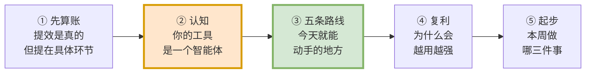

---

# 一 · 先算一笔诚实的账

## 四个数字

| **65,000+** | **0** | **30 / 30** | **3 天** |
|:---:|:---:|:---:|:---:|
| AI 产出代码行数 | 人类手写代码行数 | 产品原型页面全量还原 | 存量系统入场到修复启动 |
| 销售商机互助平台 0→1 | 同项目 · 全程 | 同项目 · 前端 | 工单系统 |

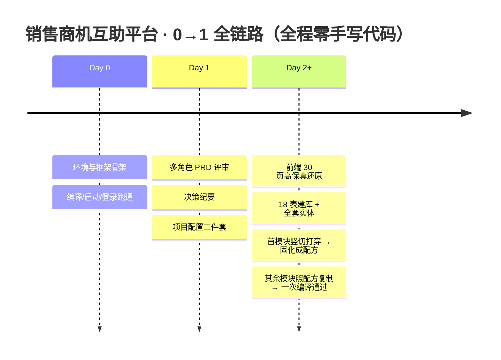

**两个项目，两种价值形态：**

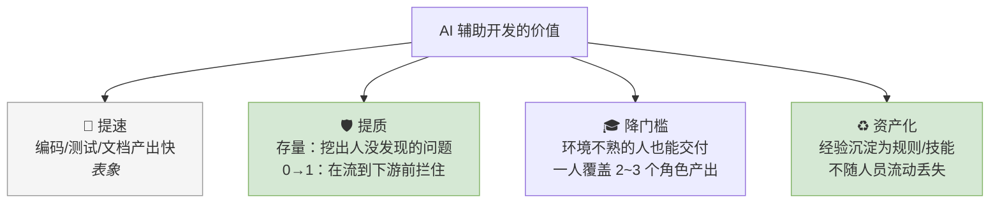

> 提速是表象；**提质和资产化才是组织级复利**。
> 实证：工单系统六角色走查挖出**长期存在、一直无人发现的 JWT 认证绕过**；商机平台五角色评审在联调**之前**抓到"方案匹配"功能前后端**都没做**的 P0——假数据写死在页面里，端点盘点看不见，**只有评审能抓到**。

## 提效提在哪，成本花在哪

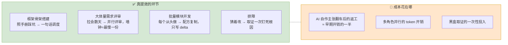

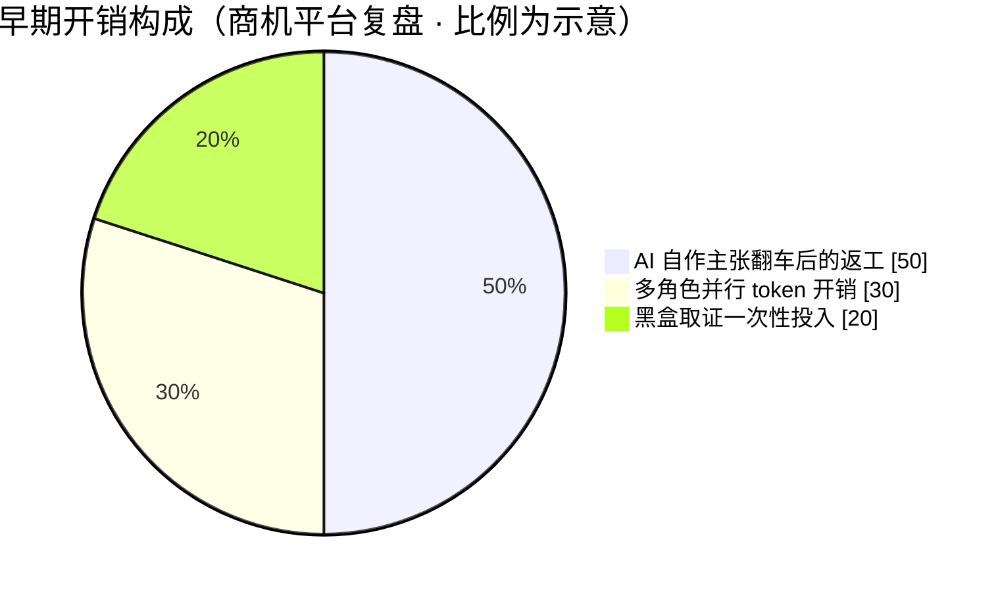

> 🔴 **注意那块最大的红色**：它不是"用 AI 的必然代价"，而是**姿势不对的代价**——
> **今天讲的全部方法，就是用来把这一半消掉的。**

## 也讲边界：这套打法不万能

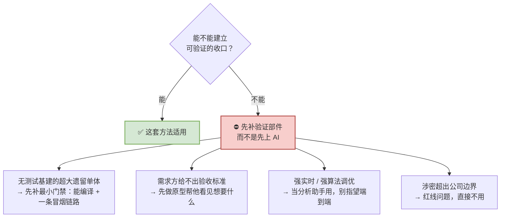

---

# 二 · 认知：你的工具是一个智能体

## 先纠正一个心智模型

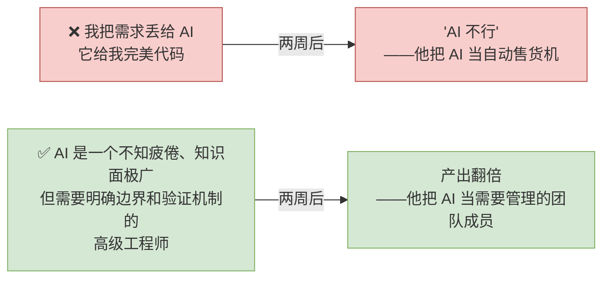

**你的工作重心变了：从"写代码" → "定义问题、把关方案、验证结果"。**

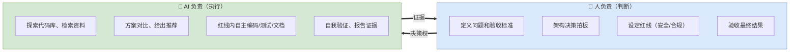

## 把"工具"拆开：它其实长这样

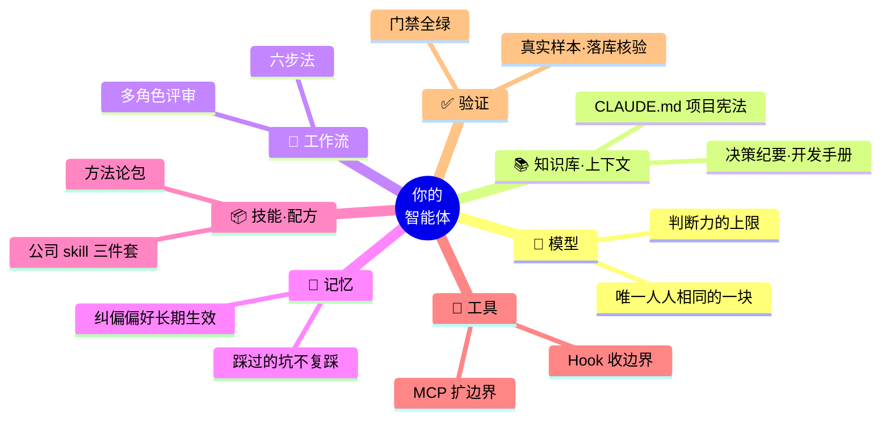

**每一块短了，都会以一种很具体的症状表现出来——请对号入座：**

| 部件 | 这块短了，你会看到 |
|---|---|
| 🧠 模型 | 评审给出一份"看起来很专业的通过" |
| 📚 知识库 | 跑偏、幻觉、按过期文档改掉你写对的代码 |
| 🔁 工作流 | 需求里没写清的地方，它猜一个实现出去 |
| 💾 记忆 | 每个新项目重新踩一遍同样的坑 |
| 📦 技能/配方 | 20 个模块，每个都从头描述一遍 |
| 🔧 工具 | 你在人肉搬运报错信息给它看 |
| ✅ 验证 | 自测全绿，真实产物是错的 |

## 同一个软件，在两个人手里不是同一个智能体

| 部件 | 开发者 A（刚装完） | 开发者 B（用了三个月） |
|---|---|---|
| 🧠 **模型** | `████████░░` **8** | `████████░░` **8** |
| 📚 知识库 | `░░░░░░░░░░` 0 | `████████░░` 8 |
| 🔁 工作流 | `█░░░░░░░░░` 1 | `████████░░` 8 |
| 💾 记忆 | `░░░░░░░░░░` 0 | `████████░░` 8 |
| 📦 技能 | `░░░░░░░░░░` 0 | `████████░░` 8 |
| 🔧 工具 | `██░░░░░░░░` 2 | `███████░░░` 7 |
| ✅ 验证 | `█░░░░░░░░░` 1 | `█████████░` 9 |

> **唯一持平的，就是"模型"那一行。**
> 模型是厂商给的、人人相同；另外六块**全部长在你自己的使用习惯和认知上**。
>
> 🎯 **说"AI 不行"的人，评价的往往是 A 那个只有七分之一的智能体。**

## 用法：木桶效应

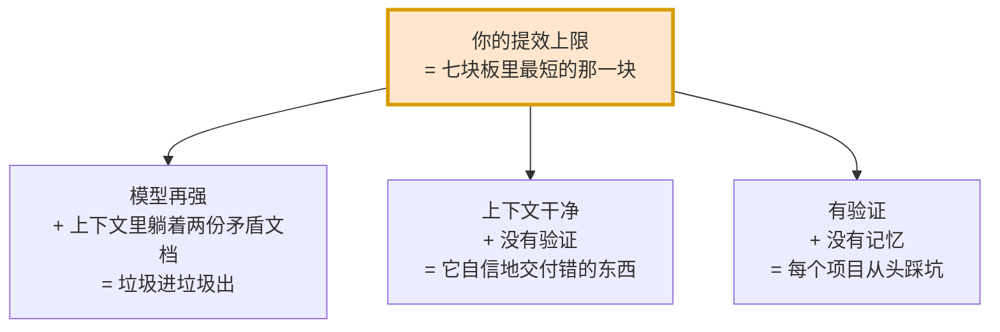

> **别再问"该用哪个模型"了——对着这七块板给自己打一遍分，最低的那块就是你下周该补的地方。**

## 为什么从"这六块"入手，效果能持续

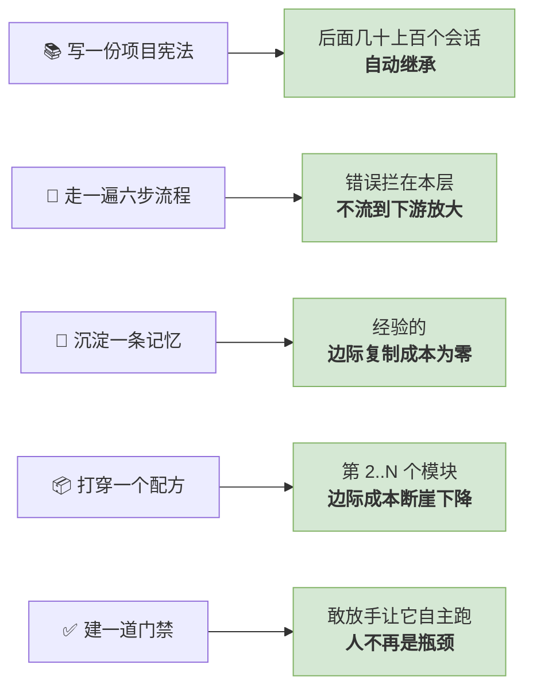

**常见疑问：等下一代模型出来，这套是不是就不用搞了？**

> 恰恰相反——**模型越强，另外六块的杠杆越长。**
> 给一个更聪明的工程师看两份互相矛盾的文档，他只会**更快、更自信地做错事**。

## 这套认知与用哪个工具无关

我们的载体是 Claude Code，但**七块板是所有 Agent 类工具的通用结构**：

| 板块 | Claude Code | Cursor / Codex / Hermes 等 |
|---|---|---|
| 📚 知识库 | `CLAUDE.md` | `AGENTS.md` / `.cursorrules` / 项目规则文件 |
| 🔁 工作流 | 计划模式 + skill | 各家的"计划模式 / Agent 模式" |
| 💾 记忆 | 记忆层插件 | 各家 memory；`docs/decisions.md` 也能替代 |
| 📦 技能/配方 | Skill、斜杠命令 | 提示词模板库、自建 prompt 片段 |
| ✅ 验证 | Hook + 门禁命令 | CI / 本地脚本（**任何工具都能做**） |

> **换工具要重学的只有快捷键；七块板、六步法、配方化、门禁文化，一行都不用改。**

---

# 三 · 五条提效路线

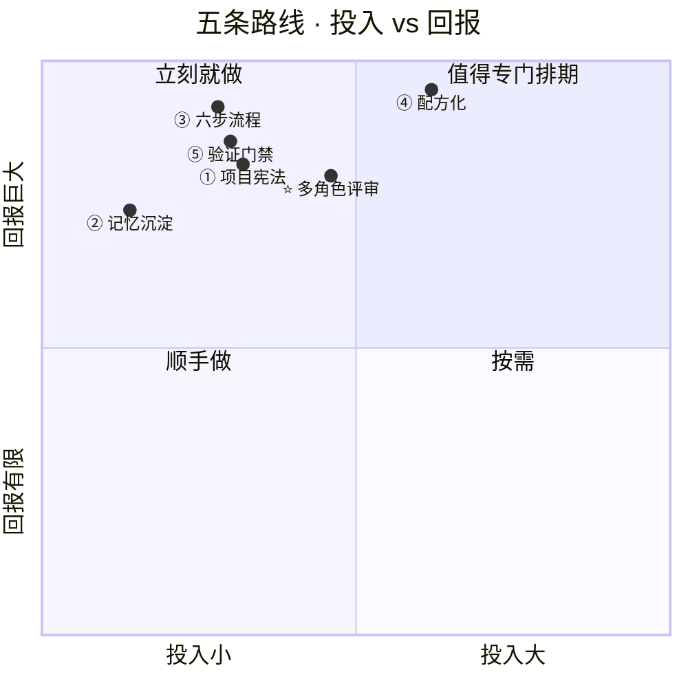

---

## 路线 ① 先给项目写一份"宪法"

**做什么**：项目根目录放一份 AI 每次会话自动读取的说明书。

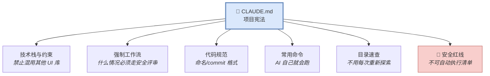

> **这是整套流程里唯一一个"投入一次、后面每个任务都在吃红利"的动作。**
> 工单系统入场当天完成配置三件套，**第 2 天就开始六角色深度走查**。

### ⚠️ 血的教训：绝对不能照搬别的项目

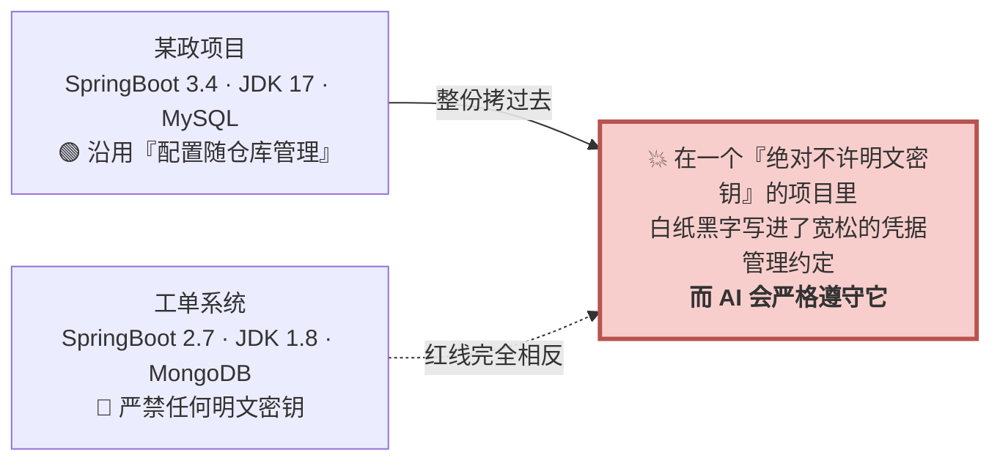

> 两个项目粗看都是"Spring Boot + Vue3"，实际 JDK 差 9 个大版本、数据库一个关系型一个文档型——**而最致命的是红线完全相反**。
> 照搬的代价不是不好用，是**把上一个项目的安全假设，静默装进一个假设完全不同的项目**。

**正确姿势：**

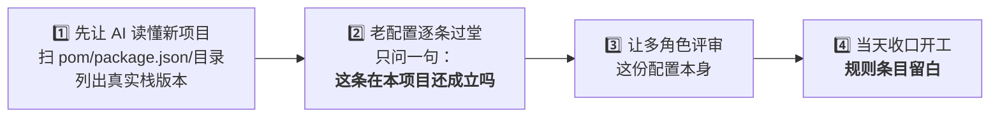

> 🔑 **继承的是方法论（流程/角色/门禁），改写的是事实（栈/路径/红线）。**
> 🔑 **CLAUDE.md 是长出来的，不是抄出来的**——别项目那些具体条目记录的是**那个项目踩过的坑**；整份搬来只会稀释 AI 的注意力，而本项目真正该防的坑一条都没写。

> 💡 **意外收益**：让 AI 读懂项目来写配置的过程，本身就是**第一次免费的代码走查**——工单系统靠这一步顺带发现了 RBAC 菜单耦合等 4 个存量问题。

---

## 路线 ② 把记忆用起来：让它记住你的坑

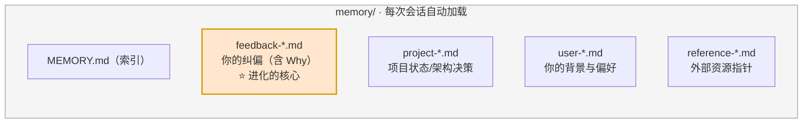

**安装（3 条命令，装完必须完全重启客户端）：**

```bash
/plugin marketplace add affaan-m/everything-claude-code   # 记忆层插件 ECC
/plugin install ecc
/reload-plugins                                            # 未立即生效时
```

> 同理可装：`obra/superpowers-marketplace`（六步法 skill）、公司三件套
> `/plugin marketplace add http://git.quectel.com/quectel-code/quectel-plugin-marketplace.git` → `code-master` / `java-coding` / `vue-coding`
> ⚠️ 插件注册表**只在进程启动时读取**——装完不重启 = 白装。

### 项目里怎么用：把黑盒坑变成资产

商机平台联调期踩到的框架坑，**全部固化成了项目记忆**：

| 踩到的坑 | 现象 | 固化后 |
|---|---|---|
| 主键 Long→String 全局转换 | 分页 `total` 变成字符串，前端运算异常 | 后续模块**零中招** |
| `NON_NULL` 丢整个 key | 字段为 null 时出参连 key 都没有 | 契约测试自动断言 |
| `LocalDateTime` 默认带 `T` | 前端显示 NaN / Invalid Date | VO 层统一声明 |
| MyBatis-Plus 对 null **静默跳过** | 单测全绿、接口 200，**库里残留旧值** | 建 DO 时就标策略 |
| 框架只读自己的数据源命名空间 | 写 `spring.datasource.*` 完全不读 | 新会话直接命中 |

> **后续会话与后续项目直接命中，不复踩。**

### 个人怎么用：纠正完，加一句"记住这一点"

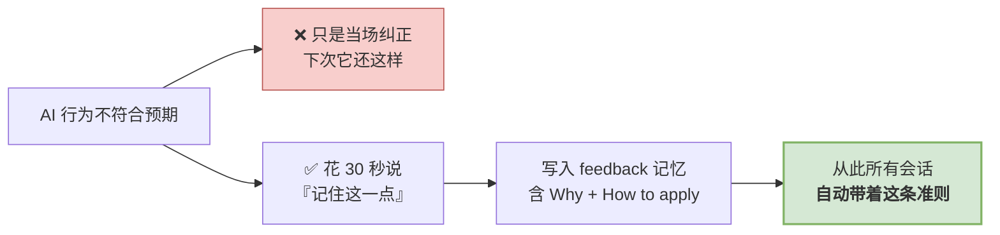

> 真实例子：我连续用多选题问卷澄清需求，被拒绝两次 → 沉淀记忆：
> *"先查证代码事实 → 文字给出 2-3 方案及利弊+推荐 → 用户文字拍板。**Why**：需要看到严谨的事实核实与利弊分析，而不是被动选择预设选项。"*
> **同一个错误不犯第二次。**

**两条治理纪律**：**写入永远人工确认**（禁止 AI 自动改写规范文件）；**错的记忆要删掉**——记忆是资产，也需要 GC，**过时信息比没有信息更有害**。

---

## 路线 ③ 需求 → 设计 → 计划 → 实施 → 验证

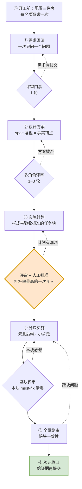

> **总纲：多角色评审不是流程中的"某一步"，而是每个阶段产物的收口门禁。**
> "零返工"不是实施得好，而是**每一层的错误都被拦在了本层**。

### 为什么要这么麻烦？看错误逃逸的成本曲线

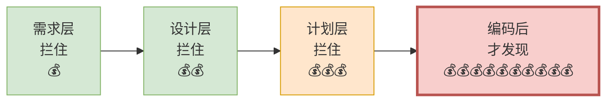

> 实证：某政项目数据中心需求 **spec 和 plan 两个阶段都评**，plan 轮抓到"403 走 HTTP-200+R.code 约定""tenantType 大小写"——
> **同一批问题若流到编码后才发现，返工成本至少放大十倍。**

### 每一步的实证战果

| 步 | 关键动作 | 我们的真实产出 |
|---|---|---|
| ① 澄清 | 让 AI **一次只问一个问题**；**每个拍板当场写回 spec** | "RESOLVED 唯一终态、发布≠完结"写入 spec §7 —— **从此没人再问第二遍** |
| ② 设计 | 落盘进版本库，成为**事实锚点** | 状态机 8 态简化方案经**五角色评审一致放行**才动手，删掉 8 个死状态、**零回归** |
| ③ 计划 | **人只审计划，不盯每行代码** | 走查问题拆成四组任务并行推进，互不阻塞 |
| ④ 实施 | 先测后码，块块可审 | 状态机用 **8×8 全矩阵穷举测试**替代抽样——**人工不可能做到的覆盖密度** |
| ⑤ 终审 | 跨块一致性、契约对齐 | 组B `READY_TO_MERGE`、组D **"终审零必修"** |
| ⑥ 收口 | 跑全量测试，**贴出证据** | **322 个单测 0 失败**；13 个任务 13 次规范化提交 |

**③ 的原子任务必须写全四要素：**

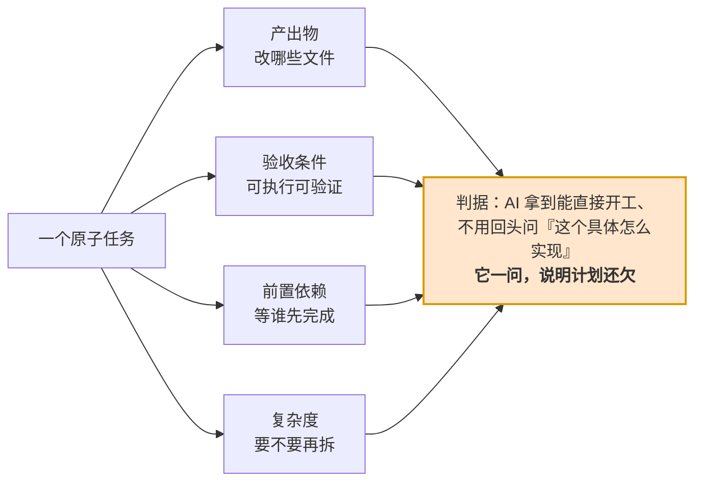

### 不是所有任务都走全流程

```mermaid
flowchart TD
    S{"这是什么任务？"}
    S -->|"新功能/重构/架构"| F1["完整六步"]
    S -->|"明确的小 bug"| F2["④→⑥<br/><i>但先让 AI 复现再修</i>"]
    S -->|"查询/解释/生成文档"| F3["直接问"]
    S -->|"鉴权/输入/存储/资金"| F4["六步 + <b>强制安全评审</b>"]
    style F4 fill:#f8cecc,stroke:#b85450
```

> 🖐️ **今天就能练的最小版本**（不需要装任何插件）：
> 下一个需求，先说一句 —— **"先别写代码，我们把方案讨论清楚，你一次只问我一个问题。"**
> 然后让它出计划、**你批准了再动手**。

---

## 路线 ④ 配方化：大批量接口/模块开发的正解

```mermaid
flowchart LR
    W["❌ 20 个模块<br/>每个都从头跟 AI 描述一遍"] --> W2["每个模块都在<br/>重新踩同一批坑"]
    style W fill:#f8cecc,stroke:#b85450
    style W2 fill:#f8cecc,stroke:#b85450
```

**✅ 正确做法，三步：**

```mermaid
flowchart TD
    S1["1️⃣ <b>竖切打穿</b><br/>挑最简单的模块，慢慢做透<br/>TDD + 联调 + 排障"]
    S1 --> P1["产出的不是 4 个接口<br/>而是一份<b>验证过的配方</b>：<br/>12 类文件怎么写 · 测试怎么分层 · 每步验收命令"]
    P1 --> S2["2️⃣ <b>横切地基</b>（Phase 0）<br/>把『接第 N 个模块时还会再做一遍』的<br/>动作，提前做一次"]
    S2 --> P2["mock 开关改模块级白名单<br/>15 个 adapter 的 total 批修<br/>分页入参抽基类<br/><b>产出 0 个接口，却让后续切换成本从『一套动作』降为『删一行』</b>"]
    P2 --> S3["3️⃣ <b>批量复制</b><br/>按同构度排序，最像的先做<br/>任务描述<b>只写 delta</b>"]
    S3 --> P3["opportunity 的 delta 只有：<br/>三态状态机 / JSON 附件列 / 代发布<br/>➡️ <b>一次编译通过</b>"]
    style S1 fill:#dae8fc,stroke:#6c8ebf
    style S2 fill:#ffe6cc,stroke:#d79b00
    style S3 fill:#d5e8d4,stroke:#82b366
    style P3 fill:#d5e8d4,stroke:#82b366,stroke-width:3px
```

**投入曲线长这样：**

| 模块 | 投入 |
|---|---|
| 第 1 个（打穿成配方） | `██████████████████████` 慢慢做 |
| 地基 Phase 0 | `██████` 一次性 |
| 第 2 个 | `████` |
| 第 3..N 个 | `███` |

> 🎯 **delta 才是需要动脑的部分；配方保证不动脑的部分不出错。**
> 🎯 **判据：凡是"接第 N 个模块时还会再做一遍"的动作，都应该提前抽成地基。**

**配套的两个取证纪律：**

```mermaid
flowchart LR
    C1["📄 类型声明"] -->|"❌ 会撒谎"| X1
    C2["📋 PRD"] -->|"❌ 会过期"| X1
    C3["🖥 页面实发 payload"] -->|"✅ 唯一可信"| X1["接口契约"]
    style C3 fill:#d5e8d4,stroke:#82b366
    style X1 fill:#dae8fc,stroke:#6c8ebf
```

> **类型文件会撒谎，页面代码不会。** 靠读实发代码抓到 4 个契约缺口：存草稿/发布共用 payload 却**没有 status 字段**（后端无从区分）、write-only 残留字段、列表页实发 `pageSize:999` 撞后端 `@Max(500)`。
> **YAGNI 靠调用方取证，不靠感觉**：grep 全项目零业务页调用的端点 → **判定不做**，各省一套竖切，并记录判定依据。

---

## 路线 ⑤ 验证：它说"完成了"不算完成

```mermaid
flowchart TD
    subgraph L["测试金字塔"]
        direction TB
        T1["单元测试 ✅ 绿"]
        T2["集成测试 ✅ 绿"]
        T3["接口返回 200 ✅ 绿"]
        T4["页面显示正常 ✅ 绿"]
    end
    L --> R["🔴 JDBC 直查数据库<br/><b>库里残留旧值</b>"]
    style R fill:#f8cecc,stroke:#b85450,stroke-width:3px
```

> **真实案例**：恢复上架要把 `archived_by` 清回 NULL，代码写了 `setArchivedBy(null)`——单测断言实体为 null 通过、接口 200、页面正常，**但库里根本没改**。根因是框架默认策略对 null 字段**静默跳过**。
>
> 🔴 **接口返回 200 不算数，落库的行才算数。**
> 这类 bug 的结构特征是：**测试金字塔每一层都绿，只有"真实操作 + 数据核验"这一层是红的。**

**落到日常的三条：**

```mermaid
flowchart LR
    V1["🧾 <b>要证据</b><br/>不接受『应该没问题』<br/>要命令输出、file:line、真实样本"]
    V2["🚦 <b>门禁即真相</b><br/>编译/类型检查/测试说了算<br/><b>『绿而无效』的假门禁零容忍</b>"]
    V3["📦 <b>企业框架当黑盒</b><br/>AI 的开源直觉经常是错的<br/>以手册/skill/取证为准，不猜"]
    style V1 fill:#dae8fc,stroke:#6c8ebf
    style V2 fill:#ffe6cc,stroke:#d79b00
    style V3 fill:#d5e8d4,stroke:#82b366
```

> **AI 提供马力，门禁提供刹车。没有刹车的车，马力越大越危险。**

---

## ⭐ 加分项：多角色评审

```mermaid
flowchart LR
    D["一份产物<br/>（需求/设计/计划/代码）"] --> R1["👔 PM 视角"] & R2["🏛 架构视角"] & R3["🎨 前端视角"] & R4["⚙️ 后端视角"] & R5["🧪 测试视角"] & R6["🔒 安全视角"]
    R1 & R2 & R3 & R4 & R5 & R6 --> M["🎯 主控当整合官<br/>交叉核对<br/><b>多方命中 = 高可信</b>"]
    style M fill:#ffe6cc,stroke:#d79b00,stroke-width:3px
```

- **墙钟时间 = 最慢的一份**，不是几份之和；**独立才有价值**。
- 评审要给标准，否则每个角色只会凭感觉挑刺 —— **完整性 / 精确性（有没有模糊表述）/ 可验证性 / 一致性 / 可追溯性**。

> **战果**：工单系统六角色走查挖出长期无人发现的 **JWT 认证绕过**；商机平台五角色评审在联调**之前**抓到一个前后端**都没做**的 P0。

---

# 四 · 复利：为什么会越用越强

> **大多数人用 AI 是"每次从零开始"；高手的环境是用得越久越强。**

```mermaid
flowchart TD
    E["一次具体经验 / 纠偏"] --> M["① 记忆<br/>会话自动加载 · AI 记得"]
    M -->|"反复适用"| R["② 规则<br/>项目宪法 · 必须遵守"]
    R -->|"跨项目通用"| S["③ 技能/配方<br/>新项目直接继承"]
    S -->|"违反代价高"| H["④ 钩子<br/>机器强制拦截"]
    style M fill:#d5e8d4,stroke:#82b366
    style R fill:#dae8fc,stroke:#6c8ebf
    style S fill:#ffe6cc,stroke:#d79b00
    style H fill:#f8cecc,stroke:#b85450
```

## ⚠️ 最容易被误读的一点：不是越往上越好

```mermaid
flowchart LR
    A["全部都升到<br/>强制拦截"] --> A2["💥 AI 被频繁打断<br/>效率断崖式下降"]
    B["全部都停在<br/>软性建议"] --> B2["💥 约束形同虚设"]
    C["✅ 梯度分层<br/>绝大多数停在 ①②（低摩擦）<br/>只有安全红线升到 ④（高摩擦）"] --> C2["🎯 既能跑得快<br/>又守得住红线"]
    style A2 fill:#f8cecc,stroke:#b85450
    style B2 fill:#f8cecc,stroke:#b85450
    style C fill:#d5e8d4,stroke:#82b366
    style C2 fill:#d5e8d4,stroke:#82b366,stroke-width:2px
```

**升到哪一级，问两个问题：**

```mermaid
flowchart TD
    Q1{"这类问题<br/>反复出现吗？"}
    Q1 -->|"偶发"| L1["停在 ① 记忆"]
    Q1 -->|"反复"| Q2{"违反的代价<br/>有多大？"}
    Q2 -->|"影响可维护性"| L2["停在 ② 规则"]
    Q2 -->|"生产事故 / 合规问题"| L4["升到 ④ 钩子"]
    style L4 fill:#f8cecc,stroke:#b85450
```

> **规则本身也要分级**：一份所有条目都写着"CRITICAL / 必须 / 严禁"的宪法等于没有优先级——模型会把注意力均摊到几十条同等紧急的规则上，**真正的红线反而被淹没**。
> **红线之所以是红线，是因为它稀少。**

## 进化的两个触发器

```mermaid
flowchart LR
    T1["🤖 AI 主动提议<br/>里程碑节点问一句<br/>『要不要沉淀』"] --> G["环境变强"]
    T2["👤 人及时纠偏<br/>不符合预期时<br/>花 30 秒说『记住这一点』"] --> G
    style G fill:#d5e8d4,stroke:#82b366,stroke-width:3px
```

## 三层复利

```mermaid
flowchart TD
    P["👤 个人<br/>记忆 → 规则 → 技能<br/><b>第 1 个项目踩的坑，第 4 个项目开工第一天全部免疫</b>"]
    P --> T["👥 团队<br/>周会 5 分钟：值得共享的沉淀 → 提 PR 进项目宪法<br/>个人技能评审后进团队仓库"]
    T --> O["🏢 组织<br/>实战反哺工具团队<br/><b>使用者暴露 skill 待加强点 → 反馈 → skill 升级 → 全员受益</b>"]
    style P fill:#dae8fc,stroke:#6c8ebf
    style T fill:#ffe6cc,stroke:#d79b00
    style O fill:#d5e8d4,stroke:#82b366,stroke-width:2px
```

> 商机平台这次实验的副产品，就是一份给公司套件团队的**实战反馈清单**（SSO 联调卡点、插件注册表 bug、starter 文档与字节码不符、脚手架残留触发假门禁）。
>
> **经验的边际复制成本为零——这是 AI 辅助开发和传统开发最大的差异之一。**
> **员工的隐性经验，第一次变成了可迁移、可继承、可审计的显性资产。**

---

# 五 · 起步

## 八条反模式（贴墙版）

| ❌ 不要 | ✅ 要 |
|---|---|
| 一句话丢需求，指望完美代码 | 需求三要素：**做什么 + 约束边界 + 验收标准** |
| 上来就让它写代码 | 先让它**读**：读懂项目 → 出方案 → 出计划 |
| 照搬别人的项目宪法 | 继承方法论，**逐条改写事实与红线** |
| 相信"已完成 / 应该没问题" | **要证据**：命令输出、file:line、真实样本、数据核验 |
| 一个会话干到底，什么都往里塞 | 一任务一会话，**结论落盘**再开新会话 |
| 20 个模块各聊一遍 | **首模块打穿成配方，其余只写 delta** |
| 当场纠正完就算了 | 顺手一句"**记住这一点**" |
| 企业框架里让 AI 凭开源直觉发挥 | **框架当黑盒**，以手册/取证为准 |

## 本周做这三件事就够了

```mermaid
flowchart LR
    D1["1️⃣ 给手上的项目<br/>写一份项目宪法<br/><i>1~2 小时</i>"] --> D2["2️⃣ 下一个需求<br/>先方案→先计划→你批准<br/><i>0 额外投入</i>"] --> D3["3️⃣ 每次纠正后<br/>加一句『记住这一点』<br/><i>30 秒</i>"]
    style D1 fill:#dae8fc,stroke:#6c8ebf,stroke-width:2px
    style D2 fill:#d5e8d4,stroke:#82b366,stroke-width:2px
    style D3 fill:#ffe6cc,stroke:#d79b00,stroke-width:2px
```

**行有余力再加：**

| # | 动作 | 适合谁 |
|---|---|---|
| 4 | 装记忆层插件 + 六步法插件 + 公司三件套（20 分钟） | 所有人 |
| 5 | 挑最简单的模块**打穿成配方**，再批量复制 | 有批量接口/模块任务的 |
| 6 | 让 AI 做一次**多角色深度走查**，产出带证据的问题清单 | 手上有存量系统的 |

> **第一次只做 1+2+3 就够了 —— 智能体是养出来的，不是一天装出来的。**

---

## 几个大家一定会问的问题

| 疑问 | 答案 |
|---|---|
| **我们不用 Claude Code，用别的工具，这套适用吗？** | 讲的是**七块板与方法论**，不是工具说明书。知识库/工作流/记忆/配方/验证在任何 Agent 工具里都有对应物，**换工具要重学的只有快捷键**。 |
| **写这些配置文档，比自己写代码还慢？** | **一次性投入、长期分摊**。配置写对，后面几十上百个会话自动继承；而早期返工本来就占开销一半——这笔投入正是用来消掉它的。 |
| **代码/数据安全吗？** | 有明确红线：涉密超边界直接不用；密钥不入库、权限分级、不可自动执行清单；记忆是纯文本进 Git，**可 diff、可审计**。 |
| **AI 写的代码质量能保证吗？** | 质量靠**机制**不靠自觉：分层验证 + 多角色评审 + 门禁全绿 + 真实样本核验。实测质量线**比纯人工更严**——六角色走查挖出的是人工长期没发现的 P0。 |
| **能省多少？** | 不给通用百分比。**省在环节、不在总量**：首模块打穿成配方后，后续模块投入降到约 1/5 且一次编译通过。请各自**用自己的基线测**。 |
| **是要取代开发吗？** | 我们的实验证明的不是"AI 能替代开发"，而是"**一般开发者 + 公司 skill + 正确姿势 = 一条人掌方向盘的高速公路**"。变的是分工：从写代码，变成**定义问题、把关方案、验证结果**。 |

---

## 带走这七句话

```mermaid
mindmap
  root((带走))
    你不是它的使用者<br/>是它的架构师
    七块板里只有模型人人相同<br/>差异不在模型在部件
    AI 提供马力<br/>门禁提供刹车<br/>人掌方向盘
    错误拦在本层不叫返工<br/>流到下游才叫成本
    首个模块慢慢打穿<br/>其余模块只写 delta
    接口返回 200 不算数<br/>落库的行才算数
    每个坑修复后固化成资产<br/>ROI 最高的一笔投入
```

> 🔜 **下周专场**：《Claude Code 提效实战分享》细致版 —— 七块板逐项展开、六步法实操、多角色评审与子代理驱动开发、Token 经济学、7+1 岗位提效地图、团队落地路线图。
