# AI 辅助编程 · 基础认知分享

> 本文不是工具说明书，只回答三个问题：**提效具体体现在哪些环节 · 应从何处入手 · 为何会随使用持续增强。**

**阅读前，建议先花 1 分钟做一件事** —— 打开你的 AI 编程工具，在下一个需求上先发送这句话：

> 「先别写代码。我们把方案讨论清楚，你**一次只问我一个问题**。方案定了再出实施计划，我批准了你再动手。」

这一句不需要安装任何插件，却是全文投入产出比最高的动作。带着它的实际效果阅读下文，理解会更具体。

---

## 内容结构

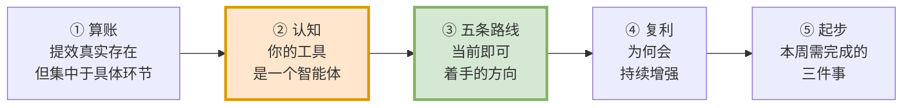

**材料来自三个真实项目**，后文所有数据与案例均出自这些项目，无外部引用：

| 项目 | 类型 | 在本文中提供的实证 |
|---|---|---|
| **销售商机互助平台** | 0→1 全栈，全程零手写代码 | 配方化、契约取证、记忆沉淀、验证门禁 |
| **工单系统** | 存量系统入场 | 项目宪法照搬导致的问题、多角色走查发现 P0 |
| **某政项目** | 存量迭代与重构 | 六步流程（spec/plan 双评审）、全量测试收口 |

---

## 一 · 先算一笔客观的账

### 四个数字

| **65,000+** | **0** | **30 / 30** | **2 天** |
|:---:|:---:|:---:|:---:|
| AI 产出代码行数 | 人类手写代码行数 | 产品原型页面全量还原 | 存量系统入场到修复启动 |
| 销售商机互助平台 0→1 | 同项目 · 全程 | 同项目 · 前端 | 工单系统 |

> ### 以上成果的总历时为 **2 天**。

**这 2 天是怎么走完的**（销售商机互助平台 · 全程零手写代码）：

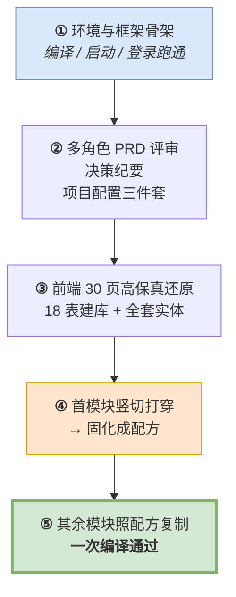

> **注意最后两步**：真正的转折点不是"AI 编码速度快"，而是**第一个模块打穿成配方之后，后续模块的成本大幅下降**。这是全文最关键的一条成本曲线，第三章路线④会展开说明。

### 三个项目，三种价值形态

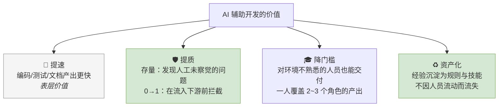

> 提速属于表层价值；**提质与资产化才构成组织级复利**。
> 实证：工单系统六角色走查发现了**长期存在、始终未被察觉的 JWT 认证绕过**；商机平台五角色评审在联调**之前**发现"方案匹配"功能前后端**均未实现**的 P0 问题——模拟数据写死在页面中，端点盘点无法识别，**只有评审能够发现**。

### 提效环节与成本构成

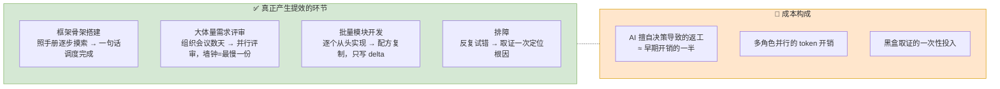

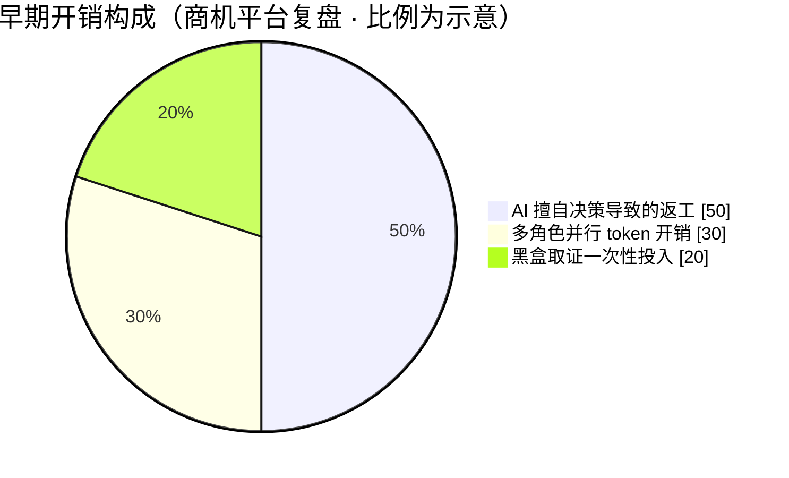

> 🔴 **注意占比达一半的"AI 擅自决策导致的返工"**：这并非使用 AI 的必然代价，而是**方法不当的代价**——
> **本文介绍的全部方法，正是用于压缩这部分开销。**

### 两个常见顾虑

先回答最常见的两个顾虑，其余问题见文末《你可能还想问》。

| 顾虑 | 回答 |
|---|---|
| **我不做 Web 全栈，从事嵌入式 / 驱动 / 平台维护 / 测试，这套方法适用吗？** | 适用，但**用法不同**。本文的方法论层（项目宪法、记忆、先方案后编码、要证据、配方化）与语言和领域无关；差别在验证手段——Web 依靠编译、测试与落库核验，嵌入式依靠静态检查、仿真与日志比对。**先在本领域建立"可验证的收口"，方法即可沿用。** 不适配的场景见第一章末《适用边界》。 |
| **代码与数据是否安全？** | 有明确红线：**涉密或超出公司使用范围的内容一律不使用**；密钥不入库、权限分级、维护"不可自动执行"清单；沉淀下来的记忆与规则以纯文本形式纳入 Git 管理，**可 diff、可审计**，并非黑盒。 |

### 适用边界

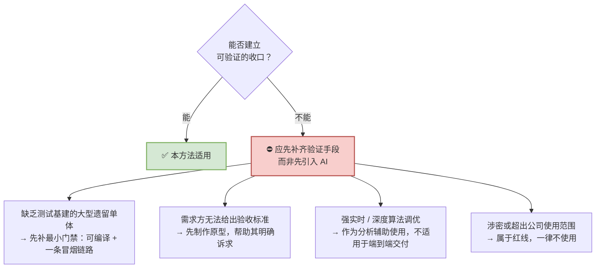

---

## 二 · 认知：你的工具是一个智能体

### 先修正一个认知偏差

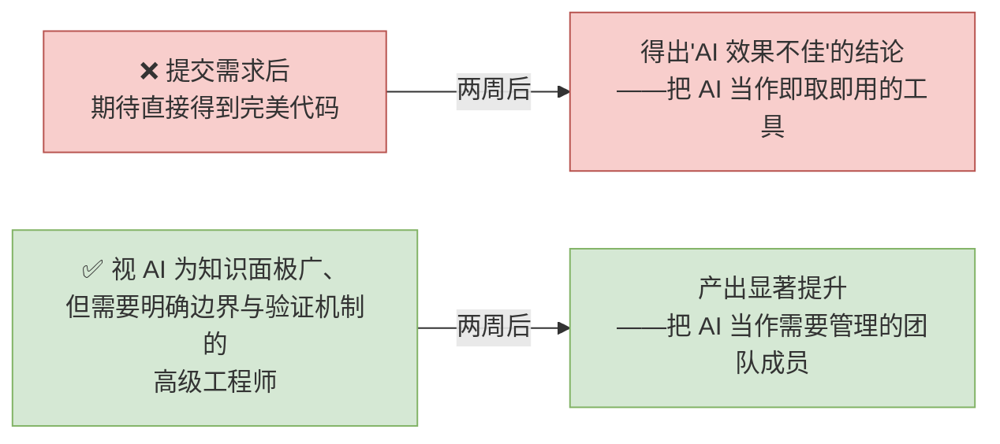

**工作重心随之变化：由"编写代码"转为"定义问题、把关方案、验证结果"。**

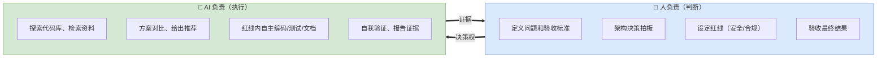

### 拆解"工具"：它由七块板组成

所安装的软件并非一个"聊天框"，而是一个**智能体（Agent）**——业界称之为 Harness（挽具），由七个部件组成：

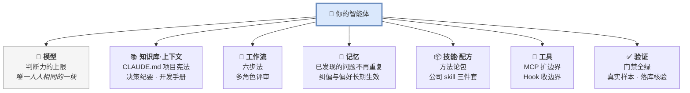

**任意一块存在短板，都会表现为具体的症状——可据此自查：**

| 部件 | 该部件存在短板时的典型表现 |
|---|---|
| 🧠 模型 | 评审输出一份"表述专业但结论无效的通过" |
| 📚 知识库 | 偏离目标、产生幻觉、依据过期文档改动原本正确的代码 |
| 🔁 工作流 | 对需求中未明确的部分自行推断并直接实现 |
| 💾 记忆 | 每个新项目重复遇到同样的问题 |
| 📦 技能/配方 | 20 个模块逐个从头描述 |
| 🔧 工具 | 需人工复制粘贴报错信息供其查看 |
| ✅ 验证 | 自测全部通过，实际产物存在错误 |

### 同一款软件，在不同使用者手中并非同一个智能体

对两位开发者的七块板评分（满分 10）：

| 部件 | 开发者 A（刚完成安装） | 开发者 B（已使用三个月） |
|:---|:---:|:---:|
| 🧠 **模型** | **8** | **8** |
| 📚 知识库 | 0 | 8 |
| 🔁 工作流 | 1 | 8 |
| 💾 记忆 | 0 | 8 |
| 📦 技能 | 0 | 8 |
| 🔧 工具 | 2 | 7 |
| ✅ 验证 | 1 | 9 |

> **唯一持平的是"模型"这一行。**
> 模型由厂商提供、人人相同；另外六块**完全取决于个人的使用习惯与认知水平**。
>
> 🎯 **认为"AI 效果不佳"时，被评价的往往是 A 这种仅具备七分之一能力的智能体。**

### 推论：木桶效应

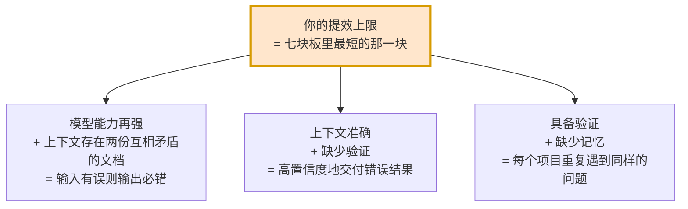

> **与其纠结模型选型，不如对照这七块板逐项自评——得分最低的一块，就是下周需要补齐的地方。**

### 为什么从"这六块"入手，效果能持续

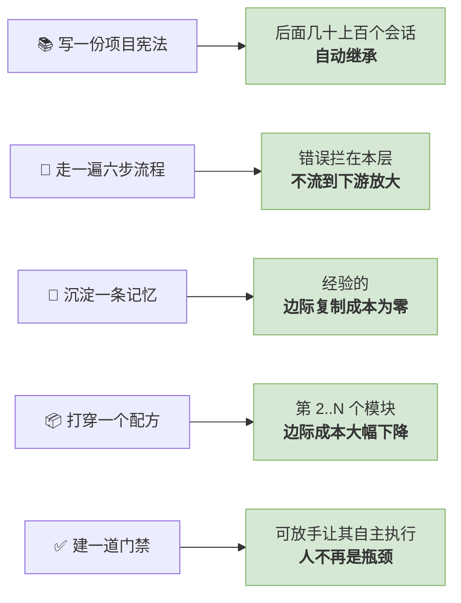

**常见疑问：下一代模型发布后，这套方法是否就不再需要？**

> 结论相反——**模型能力越强，另外六块带来的杠杆效应越明显。**
> 让一位能力更强的工程师阅读两份互相矛盾的文档，只会**更快、以更高的置信度得出错误结论**。

### 这套认知与用哪个工具无关

我们的载体是 Claude Code，但**七块板是所有 Agent 类工具的通用结构**：

| 板块 | Claude Code | Cursor / Codex / Hermes 等 |
|---|---|---|
| 📚 知识库 | `CLAUDE.md` | `AGENTS.md` / `.cursorrules` / 项目规则文件 |
| 🔁 工作流 | 计划模式 + skill | 各家的"计划模式 / Agent 模式" |
| 💾 记忆 | 记忆层插件 | 各家 memory；`docs/decisions.md` 也能替代 |
| 📦 技能/配方 | Skill、斜杠命令 | 提示词模板库、自建 prompt 片段 |
| ✅ 验证 | Hook + 门禁命令 | CI / 本地脚本（**任何工具都能做**） |

> **更换工具需要重新适应的只是操作方式；七块板、六步法、配方化与门禁机制均无需调整。**

---

## 三 · 五条提效路线

五条路线加一个加分项，按"投入 / 回报 / 实施时机"排序如下。**若时间有限，建议从回报最高、投入最小的两条入手（②和③）。**

| 路线 | 投入 | 回报 | 建议 |
|---|---|---|---|
| **② 记忆沉淀** | 极小（每次 30 秒） | 高 | 🟢 **即刻可行** |
| **③ 六步流程** | 小（调整交互方式） | 极高 | 🟢 **即刻可行** |
| **① 项目宪法** | 中（1~2 小时/项目） | 高 | 🟡 本周排期 |
| **⑤ 验证门禁** | 中 | 高 | 🟡 本周排期 |
| **⭐ 多角色评审** | 中偏大 | 高 | 🟡 用于关键产物 |
| **④ 配方化** | 大（首模块投入较大） | 极高 | 🔵 有批量模块任务时应采用 |

---

### 路线 ① 先给项目写一份"宪法"

**做什么**：项目根目录放一份 AI 每次会话自动读取的说明书。

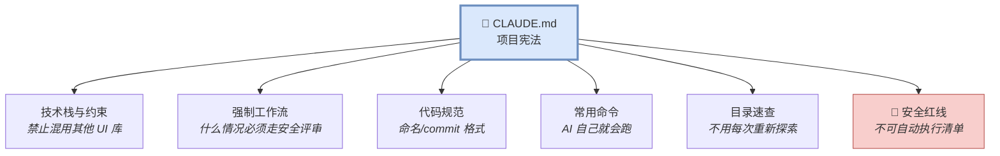

> **这是整套流程中唯一一项"一次投入、后续每个任务持续受益"的动作。**
> 工单系统入场当天完成配置三件套，**第 2 天就开始六角色深度走查**。

#### ⚠️ 重要教训：不可照搬其他项目的配置

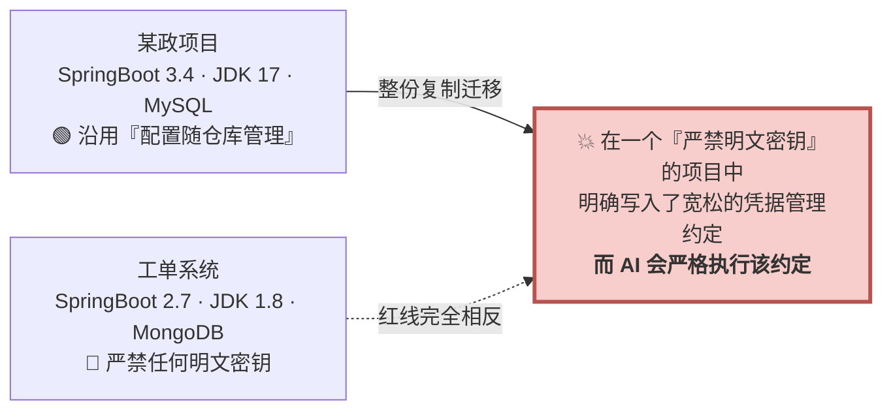

> 两个项目表面上同为"Spring Boot + Vue3"，实际 JDK 相差 9 个大版本、数据库一为关系型一为文档型——**而最关键的差异在于安全红线完全相反**。
> 照搬的代价不是不好用，而是**把上一个项目的安全假设，无声地带入一个前提完全不同的项目**。

**正确做法：**

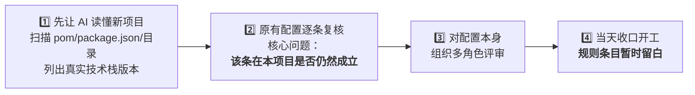

> 🔑 **继承的是方法论（流程/角色/门禁），改写的是事实（栈/路径/红线）。**
> 🔑 **CLAUDE.md 应随项目积累逐步形成，而非直接复制**——其他项目的具体条目记录的是**该项目遇到的问题**；整份迁移只会分散 AI 的注意力，而本项目真正需要防范的风险一条都未覆盖。

> 💡 **附带收益**：让 AI 读懂项目再编写配置的过程，本身即构成**一次零成本的代码走查**——工单系统正是在这一步发现了 RBAC 菜单耦合等 4 个存量问题。

---

### 路线 ② 启用记忆机制：让 AI 记住已发现的问题

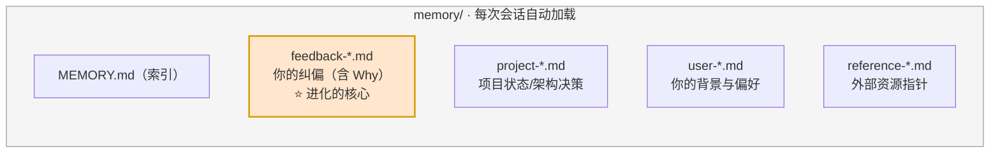

**安装（3 条命令，装完必须完全重启客户端）：**

```bash
/plugin marketplace add affaan-m/everything-claude-code   # 记忆层插件 ECC
/plugin install ecc
/reload-plugins                                            # 未立即生效时
```

> 同理可装：`obra/superpowers-marketplace`（六步法 skill）、公司三件套
> `/plugin marketplace add http://git.quectel.com/quectel-code/quectel-plugin-marketplace.git` → `code-master` / `java-coding` / `vue-coding`
> ⚠️ 插件注册表**仅在进程启动时读取**——安装后不重启客户端，插件不会生效。

#### 项目层面的用法：将黑盒问题转化为资产

商机平台联调期遇到的框架问题，**已全部固化为项目记忆**：

| 遇到的问题 | 现象 | 固化后 |
|---|---|---|
| 主键 Long→String 全局转换 | 分页 `total` 变为字符串，前端运算异常 | 后续模块**未再出现** |
| `NON_NULL` 丢失整个 key | 字段为 null 时出参中不含该 key | 契约测试自动断言 |
| `LocalDateTime` 默认带 `T` | 前端显示 NaN / Invalid Date | VO 层统一声明 |
| MyBatis-Plus 对 null **静默跳过** | 单测全部通过、接口 200，**库中仍为旧值** | 建 DO 时即标注策略 |
| 框架仅读取自有数据源命名空间 | 配置 `spring.datasource.*` 完全不生效 | 新会话直接复用该结论 |

> **后续会话与后续项目可直接复用这些结论，不再重复同类问题。**

#### 个人层面的用法：纠正后补充一句"记住这一点"

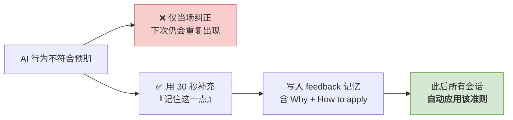

> 实例：AI 连续两次以多选题问卷方式澄清需求并被否定后，沉淀出如下记忆：
> *"先查证代码事实 → 以文字给出 2-3 个方案及利弊与推荐 → 由用户文字拍板。**Why**：需要严谨的事实核实与利弊分析，而非从预设选项中被动选择。"*
> **同类问题不再重复出现。**

**两条治理纪律**：**写入须经人工确认**（禁止 AI 自动改写规范文件）；**失效的记忆应及时删除**——记忆是资产，同样需要定期清理，**过时信息的危害大于没有信息**。

---

### 路线 ③ 需求 → 设计 → 计划 → 实施 → 验证

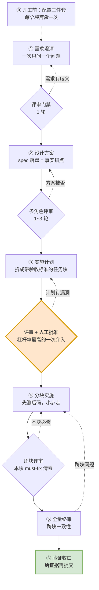

> **总纲：多角色评审不是流程中的"某一步"，而是每个阶段产物的收口门禁。**
> "零返工"并非实施环节做得好，而是**每一层的错误都被拦截在本层**。

#### 流程为何要如此细分：错误逃逸的成本曲线

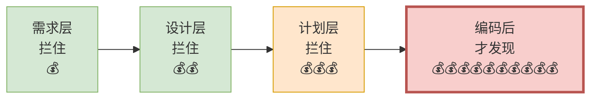

> 实证：某政项目数据中心需求在 **spec 与 plan 两个阶段均组织评审**，plan 轮发现了"403 采用 HTTP-200+R.code 约定""tenantType 大小写"等问题——
> **同一批问题若流入编码阶段后才发现，返工成本至少放大十倍。**

#### 每一步的实证结果

| 步 | 关键动作 | 真实产出 |
|---|---|---|
| ① 澄清 | 让 AI **一次只问一个问题**；**每项决策当场写回 spec** | "RESOLVED 唯一终态、发布≠完结"写入 spec §7 —— **后续无需重复确认** |
| ② 设计 | 落盘进版本库，成为**事实锚点** | 状态机 8 态简化方案经**五角色评审一致通过**后才启动，删除 8 个无效状态、**零回归** |
| ③ 计划 | **人只审查计划，不逐行审查代码** | 走查问题拆分为四组任务并行推进，互不阻塞 |
| ④ 实施 | 先测后码，逐块可审 | 状态机采用 **8×8 全矩阵穷举测试**替代抽样——**达到人工难以实现的覆盖密度** |
| ⑤ 终审 | 跨块一致性、契约对齐 | 组B `READY_TO_MERGE`、组D **终审无必修项** |
| ⑥ 收口 | 执行全量测试，**提供证据** | **322 个单测 0 失败**；13 个任务 13 次规范化提交 |

**③ 的原子任务必须写全四要素：**

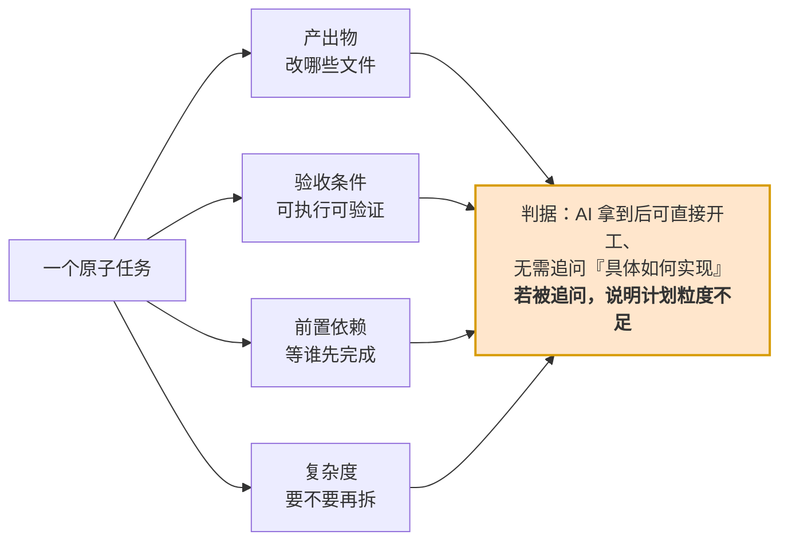

#### 不是所有任务都走全流程

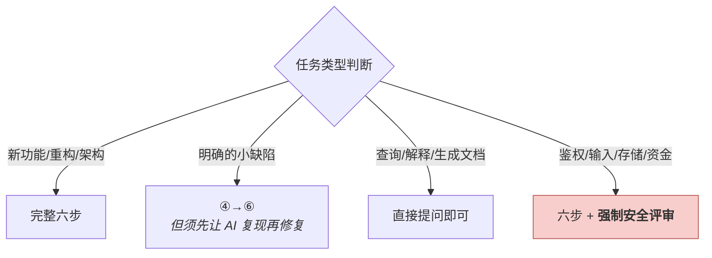

> 🖐️ **这正是本文开头给出的那句话**——无需安装任何插件，下一个需求即可实践：
> **"先别写代码，我们把方案讨论清楚，你一次只问我一个问题。"** 随后让其输出计划，**经你批准后再开始实施**。

---

### 路线 ④ 配方化：批量接口/模块开发的推荐做法

```mermaid
flowchart LR
    W["❌ 20 个模块<br/>逐个从头向 AI 描述一遍"] --> W2["每个模块都在<br/>重复同一批问题"]
    style W fill:#f8cecc,stroke:#b85450
    style W2 fill:#f8cecc,stroke:#b85450
```

**✅ 推荐做法，分三步**（"竖切"＝选取一个模块，将前端至数据库的整条链路打通；"横切"＝将所有模块共用的公共基础统一完成一次）：

```mermaid
flowchart TD
    S1["1️⃣ <b>竖切打穿</b><br/>选取最简单的模块，充分做透<br/>TDD + 联调 + 排障"]
    S1 --> P1["产出的不是 4 个接口<br/>而是一份<b>经过验证的配方</b>：<br/>12 类文件的写法 · 测试分层方式 · 每步验收命令"]
    P1 --> S2["2️⃣ <b>横切地基</b>（Phase 0）<br/>将『每接入一个模块都需重做一遍』的<br/>动作提前统一完成"]
    S2 --> P2["mock 开关改为模块级白名单<br/>15 个 adapter 的 total 批量修正<br/>分页入参抽取基类<br/><b>不产出接口，但使后续切换成本从『一整套动作』降为『删除一行』</b>"]
    P2 --> S3["3️⃣ <b>批量复制</b><br/>按同构度排序，相似度最高的先做<br/>任务描述<b>只写 delta</b>"]
    S3 --> P3["opportunity 的 delta 只有：<br/>三态状态机 / JSON 附件列 / 代发布<br/>➡️ <b>一次编译通过</b>"]
    style S1 fill:#dae8fc,stroke:#6c8ebf
    style S2 fill:#ffe6cc,stroke:#d79b00
    style S3 fill:#d5e8d4,stroke:#82b366
    style P3 fill:#d5e8d4,stroke:#82b366,stroke-width:3px
```

**投入曲线如下**（以第 1 个模块为基准）：

| 阶段 | 相对投入 |
|---|---|
| 第 1 个模块（打穿成配方） | **1.0 ×** 充分投入，不宜压缩 |
| 地基 Phase 0 | **0.3 ×** 一次性 |
| 第 2 个模块 | **0.2 ×** |
| 第 3..N 个模块 | **约 0.15 ×**，且一次编译通过 |

> 🎯 **delta 是真正需要判断的部分；配方则保证机械重复的部分不出错。**
> 🎯 **判据：凡是"每接入一个模块都需重做一遍"的动作，都应提前抽取为地基。**

**配套的两个取证纪律：**

```mermaid
flowchart LR
    C1["📄 类型声明"] -->|"❌ 可能与实际不符"| X1
    C2["📋 PRD"] -->|"❌ 可能已过期"| X1
    C3["🖥 页面实发 payload"] -->|"✅ 唯一可信来源"| X1["接口契约"]
    style C3 fill:#d5e8d4,stroke:#82b366
    style X1 fill:#dae8fc,stroke:#6c8ebf
```

> **类型文件可能与实际不符，页面实发代码不会。** 通过阅读实发代码发现 4 个契约缺口：存草稿与发布共用 payload 却**缺少 status 字段**（后端无从区分）、write-only 残留字段、列表页实发 `pageSize:999` 与后端 `@Max(500)` 冲突。
> **YAGNI 的判定依据调用方取证，而非主观判断**：检索全项目无业务页调用的端点 → **判定不做**，各节省一套竖切，并记录判定依据。

---

### 路线 ⑤ 验证：AI 报告"已完成"不等于完成

```mermaid
flowchart TD
    subgraph L["测试金字塔"]
        direction TB
        T1["单元测试 ✅ 绿"]
        T2["集成测试 ✅ 绿"]
        T3["接口返回 200 ✅ 绿"]
        T4["页面显示正常 ✅ 绿"]
    end
    L --> R["🔴 JDBC 直查数据库<br/><b>库里残留旧值</b>"]
    style R fill:#f8cecc,stroke:#b85450,stroke-width:3px
```

> **真实案例**：恢复上架需将 `archived_by` 置回 NULL，代码写为 `setArchivedBy(null)`——单测断言实体为 null 通过、接口返回 200、页面显示正常，**但数据库实际未更新**。根因是框架默认策略对 null 字段**静默跳过**。
>
> 🔴 **接口返回 200 不构成验收依据，数据真实落库才是。**
> 这类缺陷的结构特征是：**测试金字塔各层均为通过，只有"真实操作 + 数据核验"这一层不通过。**

**落到日常执行的三条：**

```mermaid
flowchart LR
    V1["🧾 <b>要求提供证据</b><br/>不接受『应该没问题』<br/>需提供命令输出、file:line、真实样本"]
    V2["🚦 <b>门禁作为判定依据</b><br/>以编译、类型检查、测试结果为准<br/><b>对『通过但无效』的失效门禁零容忍</b>"]
    V3["📦 <b>企业框架视为黑盒</b><br/>AI 基于开源经验的推断常有偏差<br/>以手册、skill 与取证为准，不作推测"]
    style V1 fill:#dae8fc,stroke:#6c8ebf
    style V2 fill:#ffe6cc,stroke:#d79b00
    style V3 fill:#d5e8d4,stroke:#82b366
```

> **AI 提供产能，门禁提供约束。缺少约束机制时，产能越高，风险越大。**

---

### ⭐ 加分项：多角色评审

```mermaid
flowchart LR
    D["一份产物<br/>（需求/设计/计划/代码）"] --> R1["👔 PM 视角"] & R2["🏛 架构视角"] & R3["🎨 前端视角"] & R4["⚙️ 后端视角"] & R5["🧪 测试视角"] & R6["🔒 安全视角"]
    R1 & R2 & R3 & R4 & R5 & R6 --> M["🎯 主控角色负责整合<br/>交叉核对<br/><b>多个角色共同指出 = 高可信度</b>"]
    style M fill:#ffe6cc,stroke:#d79b00,stroke-width:3px
```

- **墙钟时间等于耗时最长的一份**，而非各份之和；**角色间保持独立才有价值**。
- 评审须给出标准，否则各角色只能凭主观判断 —— **完整性 / 精确性（是否存在模糊表述）/ 可验证性 / 一致性 / 可追溯性**。

> **实证**：工单系统六角色走查发现了长期未被察觉的 **JWT 认证绕过**；商机平台五角色评审在联调**之前**发现了一个前后端**均未实现**的 P0 问题。

---

## 四 · 复利：为什么会越用越强

> **多数人使用 AI 时每次都从零开始；而经过持续沉淀的环境，使用越久能力越强。**

```mermaid
flowchart TD
    E["一次具体经验 / 纠偏"] --> M["① 记忆<br/>会话自动加载 · AI 记得"]
    M -->|"反复适用"| R["② 规则<br/>项目宪法 · 必须遵守"]
    R -->|"跨项目通用"| S["③ 技能/配方<br/>新项目直接继承"]
    S -->|"违反代价高"| H["④ 钩子<br/>机器强制拦截"]
    style M fill:#d5e8d4,stroke:#82b366
    style R fill:#dae8fc,stroke:#6c8ebf
    style S fill:#ffe6cc,stroke:#d79b00
    style H fill:#f8cecc,stroke:#b85450
```

### ⚠️ 最容易被误解的一点：并非层级越高越好

```mermaid
flowchart LR
    A["全部提升至<br/>强制拦截"] --> A2["💥 AI 被频繁打断<br/>效率显著下降"]
    B["全部停留在<br/>软性建议"] --> B2["💥 约束形同虚设"]
    C["✅ 梯度分层<br/>绝大多数停在 ①②（低摩擦）<br/>仅安全红线提升至 ④（高摩擦）"] --> C2["🎯 兼顾执行效率<br/>与红线约束"]
    style A2 fill:#f8cecc,stroke:#b85450
    style B2 fill:#f8cecc,stroke:#b85450
    style C fill:#d5e8d4,stroke:#82b366
    style C2 fill:#d5e8d4,stroke:#82b366,stroke-width:2px
```

**升到哪一级，问两个问题：**

```mermaid
flowchart TD
    Q1{"这类问题<br/>反复出现吗？"}
    Q1 -->|"偶发"| L1["停在 ① 记忆"]
    Q1 -->|"反复"| Q2{"违反的代价<br/>有多大？"}
    Q2 -->|"影响可维护性"| L2["停在 ② 规则"]
    Q2 -->|"生产事故 / 合规问题"| L4["升到 ④ 钩子"]
    style L4 fill:#f8cecc,stroke:#b85450
```

> **规则本身也需分级**：一份所有条目均标注"CRITICAL / 必须 / 严禁"的宪法等同于没有优先级——模型会将注意力均摊到数十条同等紧急的规则上，**真正的红线反而被淹没**。
> **红线的效力来自其稀缺性。**

### 进化的两个触发器

```mermaid
flowchart LR
    T1["🤖 AI 主动提议<br/>在里程碑节点确认<br/>『是否需要沉淀』"] --> G["环境能力提升"]
    T2["👤 人及时纠偏<br/>结果不符合预期时<br/>用 30 秒补充『记住这一点』"] --> G
    style G fill:#d5e8d4,stroke:#82b366,stroke-width:3px
```

### 三层复利

```mermaid
flowchart TD
    P["👤 个人<br/>记忆 → 规则 → 技能<br/><b>第 1 个项目遇到的问题，第 4 个项目开工首日即已规避</b>"]
    P --> T["👥 团队<br/>周会 5 分钟：值得共享的沉淀 → 提 PR 合入项目宪法<br/>个人技能经评审后进入团队仓库"]
    T --> O["🏢 组织<br/>实战经验反哺工具团队<br/><b>使用者发现 skill 待改进点 → 反馈 → skill 升级 → 全员受益</b>"]
    style P fill:#dae8fc,stroke:#6c8ebf
    style T fill:#ffe6cc,stroke:#d79b00
    style O fill:#d5e8d4,stroke:#82b366,stroke-width:2px
```

> 商机平台本次实验的副产品，是一份提交给公司套件团队的**实战反馈清单**（SSO 联调卡点、插件注册表 bug、starter 文档与字节码不符、脚手架残留触发失效门禁）。
>
> **经验的边际复制成本为零——这是 AI 辅助开发与传统开发的主要差异之一。**
> **员工的隐性经验由此转化为可迁移、可继承、可审计的显性资产。**

---

## 五 · 起步：本周的具体行动

### 三件事 + 三份产物

这三件事覆盖了投入最小、回报最高的部分。**每件事都对应一份可供他人查阅的产物**：

```mermaid
flowchart LR
    D1["1️⃣ 给手上的项目<br/>写一份项目宪法<br/><i>1~2 小时</i>"] --> D2["2️⃣ 下一个需求<br/>先方案 → 先计划 → 你批准<br/><i>0 额外投入</i>"] --> D3["3️⃣ 每次纠正后<br/>加一句『记住这一点』<br/><i>30 秒</i>"]
    style D1 fill:#dae8fc,stroke:#6c8ebf,stroke-width:2px
    style D2 fill:#d5e8d4,stroke:#82b366,stroke-width:2px
    style D3 fill:#ffe6cc,stroke:#d79b00,stroke-width:2px
```

| # | 做什么 | 完成的标志（可验收的产物） |
|---|---|---|
| 1 | 给手上的项目写一份项目宪法 | 仓库根目录有一份 `CLAUDE.md`（或对应工具的规则文件），**已提交进 Git** |
| 2 | 下一个需求走"先方案 → 先计划 → 你批准" | 有一份被你批准过的实施计划（落盘成文件或会话记录），**且实施是在批准之后开始的** |
| 3 | 每次纠正后加一句"记住这一点" | 至少沉淀出 1 条 feedback 记忆，**说得出它的 Why** |

> **首次实践完成这三件即可 —— 智能体的能力需要在使用中逐步积累，无法一次性配置完成。**

### 行有余力可继续推进

| # | 动作 | 适合谁 |
|---|---|---|
| 4 | 装记忆层插件 + 六步法插件 + 公司三件套（20 分钟） | 所有人 |
| 5 | 选取最简单的模块**打穿成配方**，再批量复制 | 有批量接口/模块任务的同事 |
| 6 | 让 AI 执行一次**多角色深度走查**，产出带证据的问题清单 | 负责存量系统的同事 |

### 八条常见反模式对照

| ❌ 不推荐 | ✅ 推荐 |
|---|---|
| 一句话提交需求，期待直接得到完美代码 | 需求三要素：**做什么 + 约束边界 + 验收标准** |
| 直接要求其编写代码 | 先让其**阅读**：读懂项目 → 输出方案 → 输出计划 |
| 照搬其他项目的项目宪法 | 继承方法论，**逐条改写事实与红线** |
| 采信"已完成 / 应该没问题" | **要求证据**：命令输出、file:line、真实样本、数据核验 |
| 单个会话承载全部任务与上下文 | 一任务一会话，**结论落盘**后再开启新会话 |
| 20 个模块逐一重新描述 | **首模块打穿成配方，其余只写 delta** |
| 当场纠正后不做沉淀 | 补充一句"**记住这一点**" |
| 在企业框架中让 AI 凭开源经验自由发挥 | **框架视为黑盒**，以手册与取证为准 |

---

## 你可能还想问

| 疑问 | 答案 |
|---|---|
| **我们不使用 Claude Code，而使用其他工具，这套方法适用吗？** | 本文讲的是**七块板与方法论**，而非工具说明书。知识库、工作流、记忆、配方、验证在任何 Agent 类工具中都有对应实现，**更换工具需要重新适应的只是操作方式**。 |
| **编写这些配置文档，是否比自己写代码更慢？** | **属于一次性投入、长期分摊**。配置准确后，后续数十至上百个会话自动继承；而早期返工本身即占总开销的一半——这笔投入正是用于消除该部分成本。 |
| **AI 编写的代码质量能否保证？** | 质量依靠**机制**而非自觉：分层验证 + 多角色评审 + 门禁全部通过 + 真实样本核验。实测质量标准**严于纯人工方式**——六角色走查发现的正是人工长期未察觉的 P0 问题。 |
| **能节省多少成本？** | 不提供通用百分比。**节省体现在具体环节，而非总量**：首模块打穿成配方后，后续模块投入降至约 1/5，且一次编译通过。建议各自**基于自身基线实测**。 |
| **是否意在取代开发人员？** | 本次实验证明的不是"AI 能够替代开发"，而是"**一般开发者 + 公司 skill + 正确方法 = 一条由人主导决策的高效开发路径**"。变化的是分工：由编写代码转为**定义问题、把关方案、验证结果**。 |
| **遇到问题或安装失败，应联系谁？** | 见文末《卡住了怎么办》。 |

---

## 术语速查

读到不认识的词回这里查，都是本文里出现过的：

| 词 | 一句话解释 |
|---|---|
| **智能体 / Agent / Harness** | 你装的那个软件的完整形态：模型 + 上下文 + 工作流 + 记忆 + 技能 + 工具 + 验证，共七块板 |
| **项目宪法 / CLAUDE.md** | 放在项目根目录、AI 每次会话自动读取的说明书（栈、规范、命令、红线） |
| **spec** | 设计方案文档，落盘进版本库后成为"事实锚点"——后续所有产出以它为准 |
| **plan** | 实施计划，把方案拆成一个个带验收标准的任务块 |
| **门禁** | 能自动判定"过 / 不过"的检查：编译、类型检查、测试、self-check 脚本 |
| **收口** | 把一个阶段的分歧和未定项全部定死、形成唯一基准，之后不再漂移 |
| **竖切** | 挑一个模块，把前端 → 接口 → 服务 → 数据库整条链路完整打通 |
| **横切 / 地基（Phase 0）** | 把每个模块都要重做一遍的公共动作，提前统一做一次 |
| **delta** | 第 N 个模块相对于配方的差异部分——只有这部分需要动脑 |
| **配方 / 样板** | 首个模块打穿后固化下来的做法清单：写哪些文件、怎么测、每步跑什么命令验收 |
| **TDD（先测后码）** | 先写验收用的测试，再写实现，测试变绿即完成 |
| **落库核验** | 不信接口返回值，直接查数据库确认数据真的写对了 |
| **多角色评审** | 让 AI 分别以 PM / 架构 / 前端 / 后端 / 测试 / 安全的视角独立评审同一份产物，再交叉核对 |

---

## 七条核心结论

| # | |
|---:|---|
| 1 | **你的角色不是它的使用者，而是它的架构师。** |
| 2 | **七块板中只有"模型"人人相同——差异不在模型，而在另外六块。** |
| 3 | **AI 提供产能，门禁提供约束，人负责决策。** |
| 4 | **错误拦截在本层不构成返工，流入下游才形成成本。** |
| 5 | **首个模块充分打穿，其余模块只写 delta。** |
| 6 | **接口返回 200 不构成验收依据，数据真实落库才是。** |
| 7 | **每个问题修复后固化为资产——这是投入产出比最高的一项工作。** |

---

## 卡住了怎么办

| 你需要 | 去哪 |
|---|---|
| 本文档 / 后续材料 | 〔待补：飞书文档链接或知识库入口〕 |
| 环境与插件安装的完整步骤 | 〔待补：《开箱姿势》文档链接〕 |
| 公司 skill 三件套的用法 | 〔待补：`code-master` / `java-coding` / `vue-coding` 文档链接〕 |
| 问题求助 / 经验交流 | 〔待补：群名或对接人〕 |
