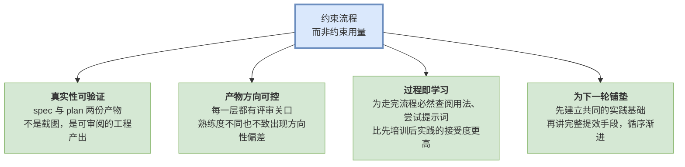
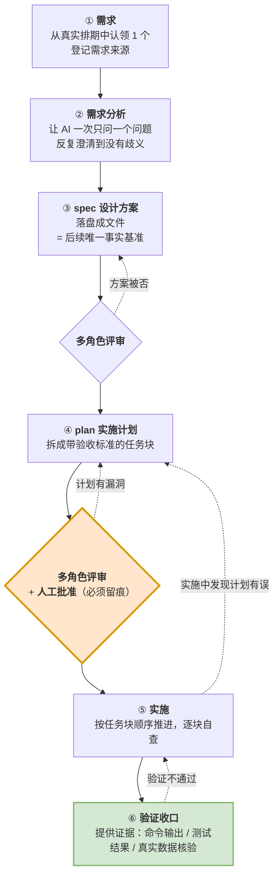
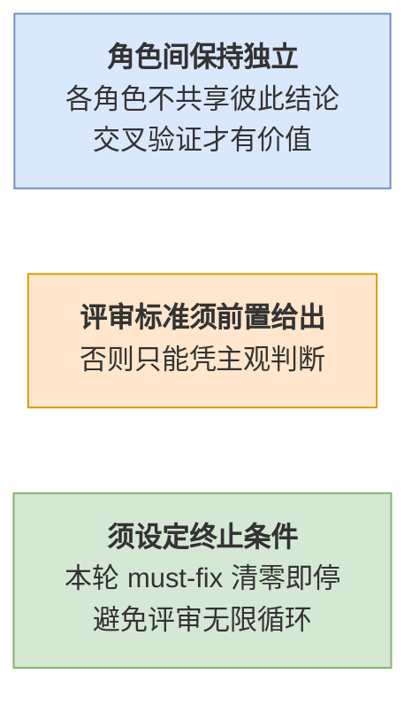
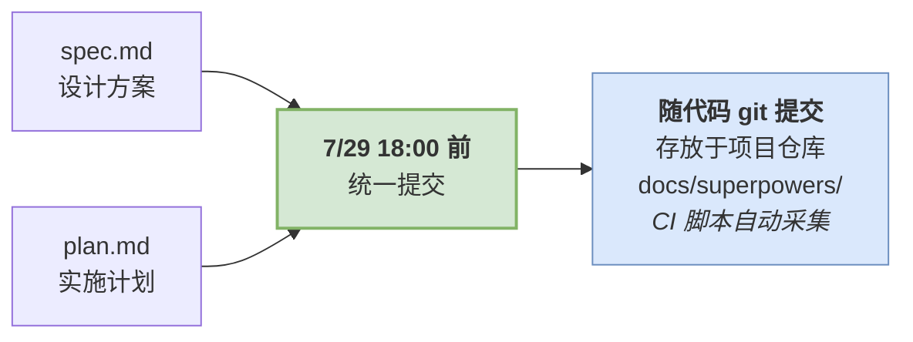
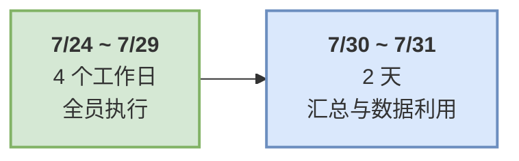

# 研发 AI 提效落地方案 · 流程先行（试行）

> **方案摘要**：本次试行不评比个人的 AI 使用水平，只统一一项动作——**用 AI 完整完成一个真实需求的开发流程，并留下可查的产物。**
>
> **需求不限大小，建议优先选小**——目的是让每个人完整体验一遍流程。流程带来的增量投入约 1~2 小时，且发生在开发者本就要做的需求上，**不新增需求、不占用交付排期**。
>
> **产物提交截止**：**2026-07-29（三）18:00** · **范围**：全体研发
>
> **完成判定**：由 CI 采集 `docs/superpowers/` 的 git 提交记录，**同一个人名下同时存在一份 spec 与其对应的 plan，即视为完成**。采集窗口为 **7/23 ~ 7/29**

---

## 一 · 为什么约束"流程"，而不是约束"用量"

要求"全员把 AI 用起来"，落地时首先需要明确判定口径，即**如何界定"已经使用"**。可选口径有三种：

| 方案 | 怎么衡量 | 评价 |
|---|---|---|
| **A. 按工具使用量** | 统计登录次数 / 会话数 / token 消耗 | ❌ **指标易被形式化满足**。少量对话或一个演示程序即可达标；使用频次与使用质量无必然关联，也无法反映业务收益 |
| **B. 按 AI 代码占比** | 统计 AI 生成代码行数占比 | ❌ **既不可测，导向上也存在偏差**。人机混写无法准确归因；且可能促使增加代码产出量，与提升质量的目标不一致 |
| **C. 按开发流程留痕** ✅ | 每人用 AI 走完一次「需求分析 → spec → plan → 实施 → 验证」，产出两份可查的产物 | ✅ 产物可审阅、执行情况可核查 |

**选 C 的四个理由：**

> **核心逻辑**：团队成员对 AI 的熟练程度差异较大，难以统一提出"使用得当"的要求；
> 而**按同一流程完成一个真实需求"是每位成员都能做到的，且完成与否可以核查**。

---

## 二 · 目标与范围

### 试行目标（7/29 前达成）

| 目标 | 达成标准 |
|---|---|
| **全员真实使用** | 每位研发**至少 1 个真实工作需求**，用 AI 按本方案流程走完整闭环。 需求大小不限，建议选小 |
| **产物齐全** | 每人提交 **2 份产物**：`spec` + `plan`。  **spec 与 plan 是完成判定的依据** |
| **过程有评审** | spec 与 plan 各经过 ≥1 轮多角色评审， 本次不采集评审过程数据，后续再规划 |

### 明确不做的事

为避免流于形式，以下几点明确排除：

- 不统计 AI 生成代码量、token 用量与使用时长
- 不要求所有需求都走全流程，**每人 1 个即可**，其余自愿
- 不要求必须选大需求，一个小改动、一个缺陷修复完全可以
- 不接受与实际工作脱节的演示性需求，须来自真实排期

### 适用范围

| 情况 | 处理 |
|---|---|
| 缺陷修复 / 小范围改动 / 小功能点 ⭐ **推荐** | 正常走完整流程，投入最小、体验最完整 |
| 新功能 / 重构 / 架构调整 | 正常走完整流程，评审轮次可视复杂度增加 |
| 涉及鉴权 / 输入校验 / 敏感数据存储 / 资金 | 正常走完整流程，且**评审必须包含安全视角** |
| 内容涉密或超出公司 AI 工具使用范围 | 禁止用 AI 处理，请另选需求参与试行 |
| 查询、解释、写文档等日常辅助 | 鼓励使用，但不计入本次达标 |

---

## 三 · 统一流程要求

### 完整流程图

## 四 · 多角色评审的执行要求

多角色评审是本流程的质量保障环节，其效果完全取决于执行方式，形式化执行不产生实际作用。三条基本要求：

**角色选取**：产品视角 · 架构视角 · 前端视角 · 后端视角 · 测试视角，按需求性质挑 4~5 个；**涉及鉴权、输入校验、敏感数据或资金的需求，安全视角必须独立agent执行**。

---

## 五 · 交付与验收

### 每人交什么

### 怎么提交，怎么采集

**开发者端不需要任何额外动作**——不填表、不上传、不单独打包。产物随代码正常 git 提交到当前项目仓库，由 CI 脚本递归扫描 `docs/superpowers/**` 自动采集。

| 项 | 规则 |
|---|---|
| **存放路径** | spec：`docs/superpowers/specs/**.md` plan：`docs/superpowers/plans/**.md` |
| **判定条件** | 同一个人名下同时存在一份 spec 与其**对应的** plan，即判定为完成 |
| **归属** | 取 commit 的 **author**（非 committer，避免 squash 合并后归属被覆盖） |
| **去重** | 同一人完成多个需求的，只计一次 |

### 汇总口径

试行期结束后由 CI 输出以下数据：

| 指标 | 口径 | 来源 |
|---|---|---|
| **覆盖率** | 完成人数 / 应参与人数。应参与人数以研发在岗名单为准，试行期内整周休假或外派人员单列说明 | 分子：CI；分母：人工提供名单 |
| **完成名单 / 未完成名单** | 按人列出，未完成的注明缺 spec、缺 plan，还是需求名未匹配上 | CI |
| **共性问题清单** | 试行中暴露的工具、流程、环境问题，来源为求助群记录与主管反馈 | 人工归纳 |

> 📌 **本次汇总只回答一个问题：有多少人按统一流程走完了一个真实需求。**
> 产物质量与 AI 使用深度不在本次范围内，待后续 code-master 的行为采集能力就绪后再作评估。

---

## 六 · 时间表

执行窗口 **4 个工作日**（7/24、7/27、7/28、7/29），之后留 2 天做汇总与数据利用：

---

## 七 · 常见问题

| 问题 | 回答 |
|---|---|
| **怎么算完成？谁来认定？** | 由 CI 自动认定：`docs/superpowers/` 下同一个人名下有一份 spec 和与之对应的 plan，即为完成，无需任何人签字或上报。注意两份文件的需求名要一致，否则配不成对。 |
| **手上没有合适的新需求怎么办？** | 不需要大需求——一个缺陷修复、一处小改动、一个小功能点都算。确实没有的，与主管商定一个技术债项。 |
| **需求已经开工了，还能参与吗？** | 可以。从当前节点补齐即可：已完成的部分在 spec 中简述现状与已定决策，剩余部分正常出 plan、评审、批准、实施、验证，不要求推倒重来。 |
| **需求太小，走这套流程会不会小题大做？** | 不会，而且推荐这样做。本次要验证的是流程能否跑通、你是否获得真实体感，小需求恰好能让你在 1~2 小时内完整走完全流程，成本最低、体验最完整。需求过大反而容易做不完，并占用排期。 |
| **我不做 Web 开发（嵌入式/测试/平台维护），这套流程适用吗？** | 适用。流程本身与语言、领域无关——差别只在"验证"环节采用什么手段（编译、静态检查、仿真、日志比对均可）。 |
| **可以使用其他 AI 编程工具吗？** | 可以。本方案约束的是**流程和产物**，不限定工具。任何 AI 编程工具都能走这套流程，但须在公司允许使用的范围内。 |
| **spec 和 plan 一定要写成文档吗？口头过一遍不行吗？** | 需要落盘。落盘的意义不在形式，而在于**给 AI 一个不会漂移的事实基准**——它是后续所有产出的锚点，也是本次达标的凭证。 |
| **首次执行是否会比自行开发耗时更长？** | 第一次会慢一些，属于学习成本。但 spec 和 plan 是一次投入、可长期复用的资产，换来的是产物方向可控。 |
| **试行期结束后呢？** | 会根据本次反馈的共性问题做一轮完整的提效培训（工具、记忆、配方化、验证门禁等），再决定流程如何常态化。 |

---
