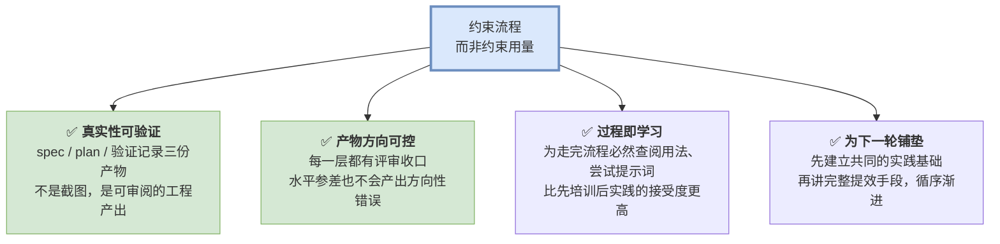
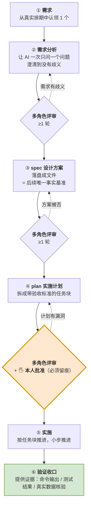
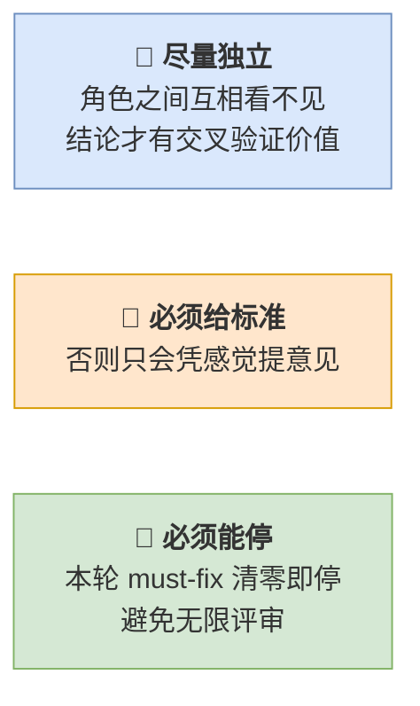
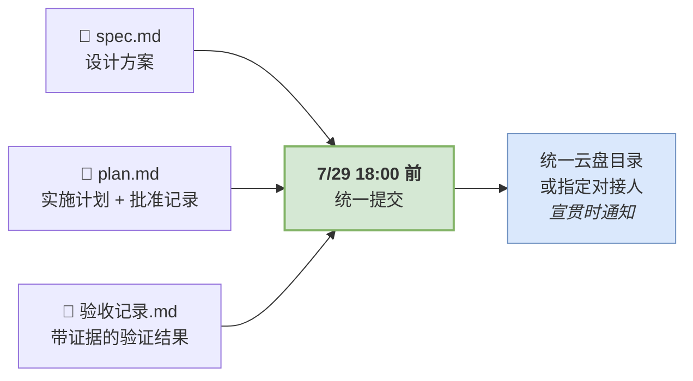
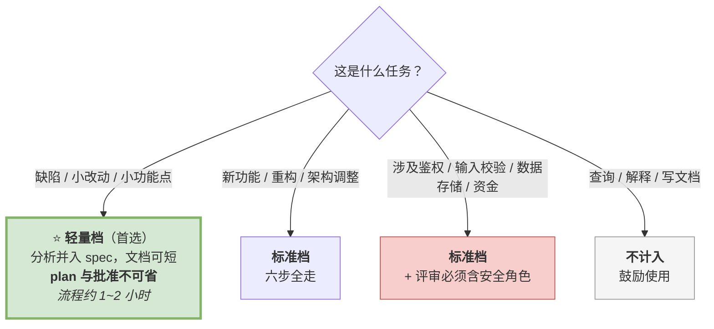

# 研发 AI 提效落地方案 · 流程先行（试行）

> **一句话**：本次不比较"谁用 AI 用得更好"，只统一一件事——**用 AI 把一个真实需求，按统一的开发流程完整走一遍，并留下产物。**
>
> **需求不限大小，建议优先选小**——目的是让每个人都完整体验一遍流程，**不额外增加工作量、不与排期冲突**。
>
> **产物提交截止**：**2026-07-29（三）18:00** · **范围**：全体研发
> **7/30 ~ 7/31 为汇总与数据利用窗口**，不再接收新提交——请于 7/29 前完成提交。

---

## 一 · 为什么约束"流程"，而不是约束"用量"

要求"全员把 AI 用起来"，落地时必须先回答一个问题：**什么叫用起来了？** 三种可选口径：

| 方案 | 怎么衡量 | 问题 |
|---|---|---|
| **A. 按工具使用量** | 统计登录次数 / 会话数 / token 消耗 | ❌ **指标易凑数**。与 AI 闲聊几句、写个 demo 即可达标；用得多 ≠ 用得对，也无法说明业务收益 |
| **B. 按 AI 代码占比** | 统计 AI 生成代码行数占比 | ❌ **既不可测也有误导**。人机混写无法准确归因；且会**激励多生成代码**，与提质方向相反 |
| **C. 按开发流程留痕** ✅ | 每人用 AI 走完一次「需求分析 → spec → plan → 实施 → 验证」，产出三份可查的产物 | ✅ **可验证**（产物在，即为真实执行）<br/>✅ **方向可控**（每层都有评审收口）<br/>✅ **过程即学习**（执行中必然查阅资料、尝试用法） |

**选 C 的四个理由：**



> **核心逻辑**：各人对 AI 的掌握程度差异较大，无法统一要求"用得好"；
> 但**"按同一流程走完一个真实需求"人人可做，且完成与否可核查**。
> 水平差异会体现在效率上，而**产物质量由流程保证**——这正是本次试行期望达成的效果。

---

## 二 · 目标与范围

### 试行目标（7/29 前达成）

| 目标 | 达成标准 |
|---|---|
| **全员真实使用** | 每位研发**至少 1 个真实工作需求**，用 AI 按本方案流程走完整闭环。<br/>**需求大小不限——建议从小，只要来自真实排期** |
| **产物齐全** | 每人提交 **3 份产物**：`spec` + `plan`（含人工批准记录）+ `验证收口记录` |
| **过程有评审** | 关键阶段**至少各 1 轮多角色评审**，评审意见与处理结果有记录 |

### 明确不做的事

为避免流于形式，以下几点**明确排除**：

- ❌ **不统计** AI 生成代码量、token 用量、使用时长
- ❌ **不要求**所有需求都走全流程——**每人 1 个即可**，其余自愿
- ❌ **不要求**必须选大需求——**一个小改动、一个缺陷修复完全可以**
- ❌ **不接受**为达标而临时编造的"演示需求"，必须是真实排期内的工作

> 🎯 **建议优先选择小需求。**
> 本次试行验证的是**流程本身能否跑通、参与者是否获得真实体感**，而非需求规模。
> 选一个 1~2 天可收口的小需求，既能完整走完六步、又不占用排期——**这是本方案推荐的做法**。
> 需求过大反而容易在试行期内无法完成，并与交付排期冲突。

### 适用范围

| 情况 | 处理 |
|---|---|
| 缺陷修复 / 小范围改动 ⭐ **推荐** | 走**轻量档**（见第三章），耗时最短 |
| 新功能 / 重构 / 架构调整 | 走**标准档**（完整流程） |
| 涉密内容超出公司 AI 使用边界 | **禁止使用**，另选需求达标 |
| 查询、解释、写文档等日常辅助 | 鼓励使用，但**不计入**本次达标 |

> ⚠️ **线上问题按现有线上处理规范执行，本方案不改变、不豁免任何线上流程要求。**
> 请从常规排期需求中认领本次试行的对象。

---

## 三 · 强制流程

### 完整流程图



> 🔑 **整条流程中投入产出比最高的环节是「plan 的人工批准」**：
> 人只审查计划，不逐行盯代码。计划审对了，实施阶段偏离的概率很低；计划未经审查即开工，返工成本会显著放大。

### 两档裁剪规则

执行窗口只有 4 个工作日，按需求规模选档。**多数人应走轻量档**：

| 档位 | 适用 | 流程要求 | 评审要求 | 预计投入 |
|---|---|---|---|---|
| **轻量档** ⭐ 默认 | 缺陷修复 / 小范围改动 / 小功能点 | 需求分析可**并入 spec**；spec 与 plan 可**各一页**；**plan 与批准不可省** | **≥1 轮**（放在 plan 前），可用弱独立版；**安全视角仍须单独执行** | 流程本身约 **1~2 小时** |
| **标准档** | 新功能 / 重构 / 涉及鉴权·数据·资金 | 六步全走，产物齐全 | spec、plan **各 ≥1 轮**，用真独立版；**安全视角单独执行** | 视需求而定 |

> **轻量档不是简化版，而是小需求下的正常形态。** 六步的价值在于"每层都有收口"，不在于文档篇幅——
> 一个小需求的 spec 可能只有半页，但只要目标、边界、验收标准三样齐全，它就是合格的 spec。

> ⚠️ **无论哪一档，两件事不可省**：**plan 必须存在**，**批准必须留痕**。
> 这两条是本次试行的底线，也是"人工把关"唯一可核查的凭证。

---

## 四 · 每一步的最低完成标准

| 步骤 | 必须产出 | 最低完成标准 | 留痕位置 |
|---|---|---|---|
| ② 需求分析 | 澄清问答记录 | 没有"待定 / 再说"一类的模糊项；每个拍板结论**写回 spec** | 会话记录或纪要 |
| ③ spec | `spec.md` | 含：目标、范围、方案、接口/数据结构、边界与不做的事、验收标准 | 提交至指定位置 |
| ④ plan | `plan.md` | 拆成任务块，**每块写全四要素**：产出物 / 验收条件 / 前置依赖 / 复杂度 | 提交至指定位置 |
| ④ 批准 | 批准记录 | 一行即可：**谁、何时、批准了哪一版 plan**；后续变更需重新批准 | `plan.md` 顶部或 PR 评论 |
| ⑤ 实施 | 代码提交 | 提交信息可追溯到 plan 的任务块 | Git |
| ⑥ 验证收口 | `验收记录.md` | **提供证据**：编译/测试命令的真实输出、关键功能的实际验证结果；不接受"应该没问题" | 提交至指定位置 |

> 🖐 **判定 plan 是否写够的标准**：AI 拿到这份 plan 能直接开工，不需回头询问"这个具体怎么实现"。
> **若它需要追问，说明计划仍有欠缺。**

---

## 五 · 多角色评审怎么做（避免流于形式）

多角色评审是本流程的质量保障环节。执行到位效果显著，流于形式则毫无意义。三条要求：



### 关于"独立"：多角色评审的前提条件

多角色评审的价值**全部来自"互相看不见"**——多个角色各自独立审查同一份产物，**被两个以上角色同时指出的问题，可信度最高**。

但大语言模型是顺着上文继续生成的。如果只发一次指令让它"以六个角色评审"，它会在同一段回答里依次输出六段：


> 典型表现：第一个角色给出"整体设计合理"的判断后，其余五个只提无关紧要的细节，**真正的分歧被抹平**。

**按档位执行**（兼顾独立性与时间成本）：

| 档位 | 怎么做 | 独立性 | 适用 |
|---|---|---|---|
| **真独立**（推荐） | 每个角色**单独新开一次会话**（或使用支持子代理的工具），彼此不共享上下文 | ✅ 完整 | 标准档 |
| **弱独立**（可接受） | 一次性输出六段，但明确要求"不要参考前面角色的结论" | ⚠️ 有折损 | 轻量档 |

> 🔴 **一条硬性要求，两档都适用**：**"安全视角"必须单独执行一次**，不得混在一次性输出中。
> 原因在于，安全问题容易在"整体看起来没问题"的判断中被忽略，而这类问题的修复代价最高。

**角色选取**（按需求性质挑 4~6 个）：产品视角 · 架构视角 · 前端视角 · 后端视角 · 测试视角 · **安全视角（单独执行）**

**评审五维度标准**（必须在提示词里给出）：

| 维度 | 问什么 |
|---|---|
| 完整性 | 有没有遗漏的场景、异常分支、边界情况 |
| 精确性 | 有没有"尽量、适当、合理"这类无法验证的模糊表述 |
| 可验证性 | 每条验收标准能不能用一条命令或一次操作判定通过 |
| 一致性 | 与已有文档/接口/命名约定是否冲突 |
| 可追溯性 | 每个设计决策能不能追到需求来源 |

> **多个角色同时指出的问题可信度最高，优先修复**；仅单个角色提出的，判断后可暂缓并记录理由。

---

## 六 · 交付与验收

### 每人交什么



**提交位置**〔**待定，宣贯前确认并同步**〕，二选一：

| 方式 | 怎么做 | 特点 |
|---|---|---|
| **A. 统一云盘目录**（推荐） | 建一个共享目录，按 `〔部门〕/〔姓名〕/〔需求名〕/` 建子文件夹，三份产物放入 | 可自助提交，汇总直观，不依赖人工转发 |
| **B. 交给对接人** | 三份产物打包发给指定对接人，由对接人统一归档 | 无需建目录，但对接人负担较重、进度不透明 |

> 📌 **无论哪种方式，命名请统一为**：`姓名-需求名-spec.md` / `-plan.md` / `-验收记录.md`，便于汇总。
> 📌 具体地址或对接人**在 7/24 宣贯时一并通知**，请勿自行选择存放位置。

### 谁来验收

| 层级 | 做什么 |
|---|---|
| **本人** | 自查三份产物齐全、批准有留痕 |
| **直属主管** | 抽查产物质量（重点看 plan 是否够细、验收记录是否有真实证据） |
| **本方案负责人** | 汇总覆盖率与共性问题，输出月度小结 |

### 汇总口径

试行期结束后汇总四个数：

| 指标 | 口径 |
|---|---|
| **覆盖率** | 完成闭环人数 / 研发总人数 |
| **产物完整率** | 三份产物齐全的人数占比 |
| **评审执行率** | plan 有明确批准记录的占比 |
| **共性问题清单** | 试行中暴露的工具、流程、环境问题（作为下一轮改进输入） |

---

## 七 · 时间表

执行窗口 **4 个工作日**（7/24、7/27、7/28、7/29），之后留 2 天做汇总与数据利用：


| 日期 | 动作 | 责任人 |
|---|---|---|
| **7/23（四）** | 方案定稿报批 | 本方案负责人 |
| **7/24（五）** | 全员宣贯（30 分钟）；**每人认领 1 个真实需求**（**建议从小**）；完成需求分析并起草 `spec` | 全员 |
| **7/27（一）** | `spec` 评审通过；产出 `plan` + 评审 + **本人批准留痕** | 全员 |
| **7/28（二）** | 分块实施 | 全员 |
| **7/29（三）** | 实施完成、验证收口；**18:00 前提交三份产物**（截止） | 全员 |
| **7/30（四）~ 7/31（五）** | 汇总覆盖率与共性问题；分析试行数据；形成下一轮改进与培训输入 | 主管 / 本方案负责人 |

> ⏱ **执行窗口只有 4 个工作日——这是建议选择小需求的原因。**
> 一个小需求走完六步约 1~2 小时，4 天时间充裕；需求过大则可能无法完成。
> ⏱ **走轻量档的同学完成即可提交，无需等到 7/29。** 提交较早的案例，汇总时更有机会被选为示范。
> ⏱ 若所选需求周期确实长于试行期：**允许只走到 plan 批准为止**，并在 7/29 前提交 `spec` + `plan`，验证记录顺延至下月初补交，**仍计入达标**——此项安排是为避免为赶进度而选择非真实需求。

---

## 八 · 风险与应对

| 风险 | 应对 |
|---|---|
| **为达标临时编造需求** | 要求需求来自真实排期，主管确认；抽查时**重点看 plan 的四要素是否具体**——编造的需求写不出真实依赖和验收条件 |
| **和现有排期冲突** | **本方案对此已作专门设计**：只要求每人 1 个需求，**且建议选小需求走轻量档**（流程本身约 1~2 小时）；周期长的需求允许走到 plan 批准即计达标 |
| **评审反复、拖慢进度** | 明确终止条件：**本轮 must-fix 清零即停**；标准档最多 3 轮，超过则由人拍板 |
| **水平差异导致有人卡住** | 附录 A 提供**可直接复制的提示词**，不依赖任何插件；设置答疑对接人与求助群 |
| **涉密与合规** | 明确红线：涉密内容超出公司边界**禁止投喂**；密钥不入文档；产物提交前自查 |
| **产物质量参差** | 试行期**先看流程是否走完**；质量问题收集进共性清单，作为下轮培训内容 |

---

## 九 · 常见问题

| 问题 | 回答 |
|---|---|
| **我手上没有合适的新需求怎么办？** | **不需要大需求**——一个缺陷修复、一处小改动、一个小功能点都算，走轻量档即可。确实没有的，与主管商定一个技术债项。 |
| **需求太小，走这套流程会不会小题大做？** | 不会，而且**推荐这样做**。本次要验证的是流程能否跑通、你是否获得真实体感，小需求恰好能让你在 1~2 小时内完整走完六步，成本最低、体验最完整。**需求过大反而容易做不完，并占用排期。** |
| **我不做 Web 开发（嵌入式/测试/平台维护），这套流程适用吗？** | 适用。流程本身与语言、领域无关——差别只在"验证"环节采用什么手段（编译、静态检查、仿真、日志比对均可）。 |
| **我们组不用 Claude Code，用别的 AI 工具行吗？** | 可以。本方案约束的是**流程和产物**，不限定工具。任何 AI 编程工具都能走这套流程。 |
| **spec 和 plan 一定要写成文档吗？口头过一遍不行吗？** | 需要落盘。落盘的意义不在形式，而在于**给 AI 一个不会漂移的事实基准**——它是后续所有产出的锚点，也是本次达标的凭证。 |
| **评审要评几轮？** | 至少 1 轮，must-fix 清零即可停止，不必追求轮数。 |
| **这会不会比我自己写还慢？** | 第一次会慢一些，属于学习成本。但 spec 和 plan 是**一次投入、可长期复用**的资产，换来的是产物方向可控。 |
| **试行期结束后呢？** | 会根据本次的共性问题做一轮完整的提效培训（工具、记忆、配方化、验证门禁等），再决定流程如何常态化。 |

---

## 附录 A · 可直接复制的提示词（无需安装任何插件）

按顺序使用，每一段发给 AI 即可。

### A1 · 需求澄清

```text
我要做一个需求：〔粘贴需求描述 / 原型 / PRD〕。
先别写任何代码。请你：
1. 阅读并理解现有项目结构和相关代码；
2. 找出需求中所有含糊、缺失、可能自相矛盾的地方；
3. 然后【一次只问我一个问题】，等我回答完再问下一个，直到没有歧义为止。
不要一次抛给我一堆问题，也不要替我做假设。
```

### A2 · 输出设计方案（spec）

```text
基于我们上面澄清的结论，输出一份设计方案 spec.md，包含：
- 目标与范围（明确写出"本次不做什么"）
- 方案设计与关键决策（每个决策写清为什么这么选）
- 接口 / 数据结构定义
- 边界情况与异常处理
- 验收标准（每条必须可执行、可判定通过或不通过）
把我们澄清过程中的每一个结论都写进去，这份文档之后是唯一基准。
```

### A3 · 多角色评审（对 spec 和 plan 各做一次）

评审需保持独立才有意义（原因见第五章）。按所在档位选择 A3-1 或 A3-2，**A3-3 安全视角两档都须单独执行**，最后用 A3-4 整合。

#### A3-1 · 真独立版（推荐，标准档）

**每个角色新开一次会话**，每次只发下面这一段，替换其中的角色名。角色之间互相看不见，结论才可信。

```text
请你以【产品视角】评审下面这份〔spec / plan〕。
只用这一个视角，不要替其他角色发言，也不要考虑"整体是否合理"。
〔粘贴 spec / plan 全文〕

按这五个维度逐条检查，每条都要指出具体位置：
1. 完整性——有没有遗漏的场景、异常分支、边界情况
2. 精确性——有没有"尽量/适当/合理"这类无法验证的模糊表述
3. 可验证性——每条验收标准能否用一条命令或一次操作判定
4. 一致性——与现有文档、接口、命名约定是否冲突
5. 可追溯性——每个决策能否追到需求来源

输出格式：每个问题一行，标注【must-fix / 建议 / 可忽略】。
没有问题的维度直接写"无"，不要凑数。
```

> 依次替换为：**架构视角 / 后端视角 / 前端视角 / 测试视角**。安全视角用 A3-3。

#### A3-2 · 弱独立版（轻量档可接受）

时间紧张时可一次性输出，但独立性会有折损——**这是折中做法，不是标准做法**。

```text
请你对下面这份〔spec / plan〕做多角色评审。
分别以：产品视角 / 架构视角 / 后端视角 / 前端视角 / 测试视角
每个角色单独成段。

【重要】写每个角色时，不要参考、不要呼应前面角色已经写过的结论，
也不要说"如前所述""同上一个角色的意见"。
每个角色都当作第一次看到这份文档，独立从头检查一遍。
即使发现和前面重复的问题，也要照常提出。

五个维度：完整性 / 精确性 / 可验证性 / 一致性 / 可追溯性
（含义见上）
输出格式：每个问题一行，标注【must-fix / 建议 / 可忽略】。
```

#### A3-3 · 安全视角（两档都须单独执行一次）

**新开一次会话**，只发这一段：

```text
请你以【安全视角】评审下面这份〔spec / plan〕，只谈安全，不谈其他。
〔粘贴 spec / plan 全文〕

重点检查：
1. 身份认证与权限校验——有没有可以绕过的路径
2. 输入校验——外部输入是否全部校验，有无注入风险
3. 敏感数据——密钥/密码/个人信息的存储、传输、日志打印
4. 越权访问——能否访问到不属于自己的数据
5. 依赖与配置——有无不安全的默认配置

请假设攻击者会主动寻找漏洞，不要假设调用方是善意的。
输出格式：每个问题一行，标注【must-fix / 建议 / 可忽略】，
并说明"如果不修，最坏会发生什么"。
```

#### A3-4 · 整合（把各角色结论汇总后发起）

```text
下面是各角色对同一份〔spec / plan〕的独立评审意见：
〔依次粘贴每个角色的评审输出〕

请你作为整合官交叉核对：
1. 找出被【两个及以上角色同时命中】的问题——这些是高可信问题，优先修；
2. 找出角色之间【互相矛盾】的意见，指出分歧点，交给我拍板；
3. 按【must-fix / 建议 / 可忽略】三档汇总成一份清单；
4. must-fix 逐条给出修改方案。
不要合并相似问题时丢掉细节，也不要为了显得整洁而降低问题等级。
```

### A4 · 输出实施计划（plan）

```text
根据评审后的 spec，输出实施计划 plan.md：
拆成一个个可独立完成的任务块，每块必须写全四要素：
- 产出物：具体改哪些文件
- 验收条件：可执行、可验证
- 前置依赖：等哪个任务块先完成
- 复杂度评估：是否需要进一步拆分
判据：这份计划要能让人拿着直接开工，不需要回头问"这个具体怎么实现"。
先不要写任何代码，等我批准这份计划。
```

### A5 · 实施

```text
计划我已批准。请按 plan.md 的任务块顺序实施，一次做一块。
每完成一块，先自查本块的验收条件是否达成，报告给我，我确认后再做下一块。
遇到 plan 里没写清的地方，停下来问我，不要自行假设。
```

### A6 · 验证收口

```text
所有任务块已完成。请做最终验证并给出【证据】，不接受"应该没问题"：
1. 跑通编译 / 类型检查 / 全量测试，贴出真实命令输出；
2. 逐条对照 spec 的验收标准，说明每条是如何验证的；
3. 对涉及数据写入的功能，确认数据真实落库/落盘（不要只看接口返回成功）；
4. 列出本次未做的事项及原因。
最后输出一份验收记录.md。
```

---

## 附录 B · 产物模板骨架

### B1 · `spec.md`

```markdown
# 〔需求名〕设计方案
## 1 目标与范围
### 1.1 目标
### 1.2 本次不做（明确排除）
## 2 方案设计
### 2.1 总体思路
### 2.2 关键决策与理由
## 3 接口与数据结构
## 4 边界与异常处理
## 5 验收标准
| # | 验收项 | 如何验证（命令/操作） |
## 6 评审记录
| 轮次 | 日期 | 参与角色 | must-fix 数 | 处理结果 |
```

### B2 · `plan.md`

```markdown
# 〔需求名〕实施计划
> **批准记录**：〔姓名〕于 〔YYYY-MM-DD〕 批准 v〔N〕
## 任务块清单
### T1 〔任务名〕
- 产出物：
- 验收条件：
- 前置依赖：
- 复杂度：
### T2 ...
## 评审记录
| 轮次 | 日期 | 参与角色 | must-fix 数 | 处理结果 |
```

### B3 · `验收记录.md`

```markdown
# 〔需求名〕验收记录
## 1 门禁执行结果（贴真实输出）
- 编译：
- 测试：
- 其他检查：
## 2 逐条验收
| # | 验收项 | 验证方式 | 结果 |
## 3 数据核验（涉及写入时必填）
## 4 未完成事项与原因
```

---

## 附录 C · 我这个任务走哪一档



> **判断不清时，选规模最小的那一项。** 本次试行的成功标准是"每个人都完整走完一遍"，而非"每个人都完成一件大事"。

---

## 附录 D · 待确认事项

发布前需要拍板：

| # | 事项 | 建议 |
|---|---|---|
| 1 | 产物统一提交位置 | 建议建一个**共享云盘目录**（按部门/姓名/需求名分子文件夹）；或指定**对接人**统一收集。二者取一，宣贯时同步给全员 |
| 2 | 宣贯时间与形式 | 待定 |
| 3 | 答疑对接人与求助群 | 需指定 |
| 4 | 汇总小结的汇报对象与时间 | 7/30 ~ 7/31 完成汇总，8 月首周汇报 |
