# Claude Code 项目提效实战分享（图文版）

> 本版在原稿基础上增加图表、截图与每章速读卡片，适合分享讲解与快速浏览；纯文字原稿见同目录《Claude-Code提效实战分享.md》。

---

## 阅读路线（先看这里）

- **只有 10 分钟**：第 0 章 →「开工路线图」→ 15.4 行动清单
- **开发者（主线）**：Part A → Part B → Part C → Part D，附录 C/D 备查
- **团队负责人 / 管理者**：第 0、1 章 → Part E → Part F
- **环境还没装好**：先按《0-1 项目提效验证 · ①开箱姿势篇》搭好环境（含内网代理、公司 skill 三件套），再回到 2.1
- **第 16 章**是上次分享后的答疑合集（插件归属与治理边界），首次阅读可跳过

## 目录

- **Part A 认知与价值**
  - 第 0 章 3 分钟看清价值：ROI 一页纸（含"诚实版提效账"）
  - 第 1 章 认知对齐：你的开发工具是一个智能体
  - 开工路线图：拿到项目的前三天
- **Part B 个人提效基本功**
  - 第 2 章 5 分钟上手 + 姿势纠错 + 企业框架黑盒纪律
  - 第 3 章 核心工作流六步法
  - 第 4 章 提效技巧库
- **Part C 岗位视角与全流程协同**
  - 第 5 章 岗位提效地图（7+1 个岗位）
  - 第 6 章 全流程不跑偏：单一事实源机制
  - 第 7 章 事实沟通：用可验证的产物说话
  - 第 8 章 Subagent 与 Agent Teams 实战
  - 第 9 章 Harness 自我进化机制：让工具越用越懂你
- **Part D 真实案例复盘**
  - 第 10 章 双主案例：商机平台（0→1）与工单系统（存量）+ 早期案例速览
- **Part E 团队协作 · 质量 · 治理**
  - 第 11 章 团队一致性机制
  - 第 12 章 质量保障
  - 第 13 章 安全合规红线
- **Part F 量化与落地**
  - 第 14 章 提效度量体系与成本测算
  - 第 15 章 落地路线图
  - 第 16 章 边界与答疑：原生 / 插件 / 自建内容
- **附录** 命令速查 / 反模式清单 / 岗位提示词模板

---

# Part A 认知与价值

## 第 0 章 3 分钟看清价值：ROI 一页纸

> 📌 **本章一句话**：提效是真的，账要算诚实——提在具体环节，成本也花在具体环节。

### 0.1 三个真实数据点（全部来自我们自己的项目，按时间倒序，只列可核实的绝对事实）

**先记住四个数字：**

| **65,000+** | **0** | **30 / 30** | **3 天** |
|:---:|:---:|:---:|:---:|
| AI 产出代码行数<br/>（商机平台 0→1） | 人类手写代码行数<br/>（商机平台全程） | 产品原型页面全量还原<br/>（商机平台前端） | 存量系统从入场到修复启动<br/>（工单系统） |

| 项目 | 类型 | 实际成果 | 备注 |
|---|---|---|---|
| **销售商机互助平台**（2026-07，最新） | 0→1 全栈全链路（公司框架） | **全程零手写代码**：一名对公司开发环境不熟悉的开发者，凭公司 skill 三件套 + 一份 PRD（30 页原型 / 42 个功能点），AI 产出约 **6.5 万行代码 + 1.9 万行文档**——框架骨架 → 需求评审 → 项目配置 → 前端 30 页高保真还原 → 18 表建库 → 接口开发与联调，**全链路无断档** | 首模块打穿成配方后，第二个模块照配方复制**一次编译通过**；全程实战记录（含截图）见飞书《0-1项目验证》 |
| **工单系统**（存量项目） | 存量提效 | **入场第 1 天完成项目配置；第 2 天六角色深度走查产出带证据的漏洞文档**（挖出 3 个 P0 安全红线 + 多个 P1，其中 JWT 认证绕过属长期存在、一直无人发现）；随后分组并行修复：状态机改造 **322 个单测 0 失败**，组B **11 任务一天闭环** | 传统模式下，全面业务审计需外部审计或数周专项 |
| **思政项目**（上海长宁，已上线） | 0→1 三端 + 技术栈整体迁移 | 一人交付 Web 管理端 + H5 + Java 后端三端；后端整栈换语言（Node→Java）**设计文档当天成文并驱动迁移**：8 个业务模块迁移期**两端并行、API 路由 100% 一致，前端零改动** | 跨语言重写传统预估 1.5~2 人月且必然出现接口漂移；迁移动机正是"统一到公司 Java 技术栈" |

> 更早的 NCM 音频转换器（8 块 SDD 当日交付）、web-tool 平台（契约先行两天 3 个 PR 零返工）见 10.3 案例速览。

### 0.2 价值不只是"写代码快"

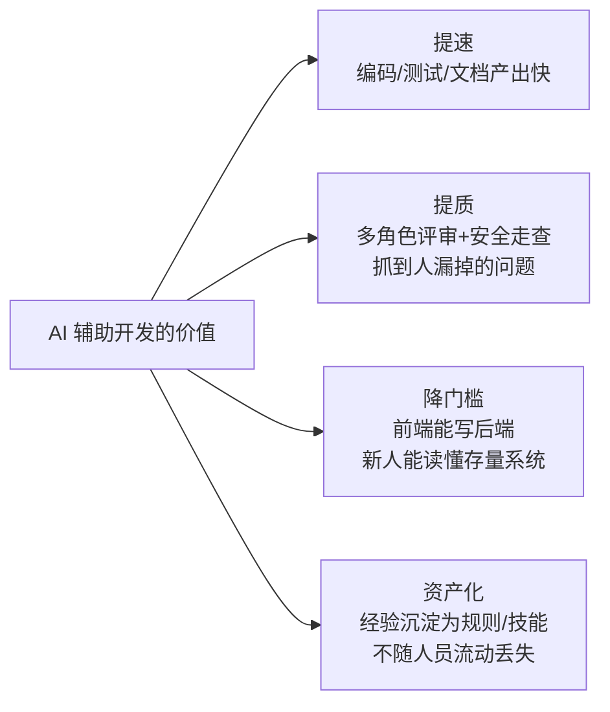

- **提速**是表象；**提质**和**资产化**（经验写进 CLAUDE.md/Skill，新人第一天就继承团队最佳实践）才是组织级复利。
- **提质有两种形态**：存量项目里是"挖出人没发现的问题"（工单系统六角色走查挖出 JWT 伪造漏洞）；0→1 项目里是"在流到下游之前拦住问题"——商机平台五角色评审在联调前抓到**方案匹配闭环前后端双缺**的 P0（页面级 mock 没有 api 文件、没进 68 端点盘点，只有评审能抓到）；思政项目一轮安全加固冲刺清零四类问题、测试从 0 补到 37 个用例。
- **降门槛**改变人才结构：商机平台的实验设定就是证明——一名对公司开发环境不熟悉的开发者，零手写代码完成 0→1 全栈交付；思政项目一人交付三端。**一个熟练使用者可以覆盖过去 2~3 个角色的产出**（见第 10 章案例）。

### 0.3 提效在哪里，成本花在哪里（诚实版）

> 别用"总体快了 N 倍"这种没法核实的说法。下面两笔账来自商机平台 0→1 全程实测：提效提在具体环节，成本也花在具体环节。

**真提效的环节：**

| 环节 | 传统方式 | AI 方式 |
|---|---|---|
| 框架骨架搭建 | 照手册逐步操作、踩版本坑 | 一句话开场，skill 调度自动完成，AI 自修编译/启动问题 |
| 大体量 PRD 评审 | 拉会多岗位评审、数天 | 多角色 agent 并行独立评审 + 交叉核对，**墙钟时间 = 最慢的一份** |
| 大批量文档/代码生成 | 逐份手写 | 并行 subagent + 决策纪要锁口径，产出后一致性校验兜底 |
| 批量模块开发 | 每个模块从头做 | **首模块打穿成配方，后续模块只写 delta，边际成本断崖式下降** |
| 排障 | 凭经验猜、改一版试一版 | 最小复现 / 反编译 / 实发代码取证，一次钉死根因 |

**成本花在哪（同样诚实）：**

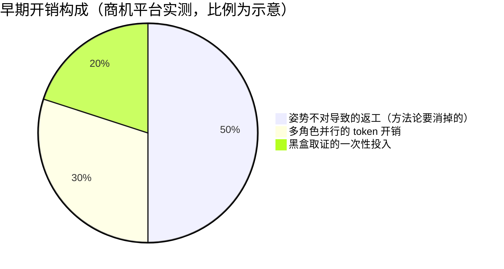

1. **AI 自作主张翻车后的返工**——前期姿势不对时最贵，约占早期开销的一半。**这正是本文档整套方法论要消掉的**（2.4 黑盒纪律 / 第 3 章门禁）；
2. **多角色 subagent 的并行 token 开销**——用"只喂最小上下文 + 知道何时停止评审"控制（3.4 / 4.10）；
3. **黑盒取证的一次性投入**——反编译、最小复现：查一次比错三版便宜。

> 一句话总结：**AI 提供马力，skill 与门禁提供刹车和护栏，人掌方向盘。**

### 0.4 关于投入产出的四个问题

| 问题 | 答案在 | 一句话结论 |
|---|---|---|
| 到底能省多少？ | 0.3 + 第 14 章 | 先看 0.3 的诚实账（提在哪/花在哪）；别信通用百分比，用自己的度量体系跑 1 个月试点拿真数据 |
| 怎么推广不翻车？ | 第 15 章 | 试点→规范→规模化三阶段，每阶段有明确门禁 |
| 代码/数据安全吗？ | 第 13 章 | 有明确红线机制（密钥、权限模式、审计），且已在工单系统验证 |
| 质量会不会下滑？ | 第 11/12 章 | 一致性靠机制（共享配置+门禁）不靠自觉，质量线反而比纯人工更严 |

---

## 第 1 章 认知对齐：AI 辅助开发是人机协作，你的工具是一个智能体

> 📌 **本章一句话**：你用的不是工具，是智能体——只有模型人人相同，其余六块部件决定你的提效。

### 1.1 一个必须先纠正的心智模型

> ❌ 错误期待："我把需求丢给 AI，它给我完美代码。"
> ✅ 正确模型："AI 是一个**不知疲倦、知识面极广、但需要明确边界和验证机制的高级工程师**。我的工作从『写代码』变成『定义问题、把关方案、验证结果』。"

两者差别决定了成败：抱错误期待的人用两周就会说"AI 不行"，因为他把 AI 当成自动售货机；建立正确模型的人产出翻倍，因为他把 AI 当成需要管理的团队成员。

### 1.2 人机分工的黄金分界线

| 人负责（判断） | AI 负责（执行） |
|---|---|
| 定义问题和验收标准 | 探索代码库、检索资料 |
| 架构决策拍板 | 方案对比分析、给出推荐 |
| 审查关键代码 | 编写代码、测试、文档 |
| 设定红线（安全/合规） | 在红线内自主执行 |
| 验收最终结果 | 自我验证、跑测试、报告证据 |

**核心原则：决策权始终在人，执行权大胆放给 AI，验证机制兜底。**

### 1.3 提效的本质：压缩"等待"和"返工"

传统开发中真正写代码的时间占比其实不高，大量时间花在：读懂旧代码、查资料、写样板代码、联调返工、写文档、开对齐会。Claude Code 压缩的正是这些"非创造性时间"——在我们的案例里：读懂存量系统从数周专项变成 2 天走查（工单系统）、批量模块开发从"每个从头做"变成"照配方复制一次编译通过"（商机平台）、日报从每天 15 分钟变 1 分钟（思政）。具体倍数因场景差异很大，所以第 14 章坚持"用自己的基线测"而不引用通用百分比；但方向是确定的：体感提效远超"代码补全工具"。

### 1.4 开发工具的本质：它是一个智能体，而且每个人的都不一样

这是全文档最重要的一次认知对齐：**你的角色不是"AI 的使用者"，是"这个智能体的架构师"。**

把 Claude Code 这类工具拆开，大致是七个要素（这是我的拆法，不是标准定义；讲台口径可以简化成六个部件：**模型 / 工具 / 记忆 / 技能 / 知识库 / 工作流**——"知识库"对应下表的"上下文"，"工作流"对应"指令 + 循环"）。每一块短了，都会以一种很具体的症状表现出来：

| 要素 | 它决定什么 | 这块短了，你会看到 | 怎么补 |
|---|---|---|---|
| **模型** | 判断力的上限 | 评审给出一份"看起来很专业的通过" | 判断类上顶配、机械类降档（8.5） |
| **上下文** | 它基于**什么事实**推理 | 跑偏、幻觉、按过期 spec 改掉你写对的代码 | 一任务一会话、结论落盘、单一事实源（4.3 / 第 6 章） |
| **指令** | 目标与边界 | spec 里没写清的地方，它猜一个实现出去 | 精确化 spec、可验收标准、红线分级（第 3 章 / 9.1） |
| **工具** | 它**能对世界做什么** | 你在人肉搬运报错信息给它看 | MCP 扩边界、Hook 收边界（4.6 / 4.7） |
| **循环** | 自主到什么程度 | **人成了瓶颈**——你在给 AI 当测试员和审查员 | SDD、Agent Teams、无头模式（第 8 章 / 4.11） |
| **记忆** | 边际成本是否**递减** | 每个新项目重新踩一遍同样的坑 | 记忆 → 规则 → 技能 → 钩子（第 9 章） |
| **验证** | 质量地板，以及你敢不敢放手 | 自测全绿、真实文件乱码 | 要证据、真实样本、分层验证（第 12 章） |

**这张表解释了本章开头那个问题**——为什么同一个工具，有人两周就说"AI 不行"，有人产出翻倍？答案不玄：**放弃的人只拿到了"模型"这一块，剩下六块一块都没搭。** 他不是不会用 AI，他是在用一个只有七分之一的智能体。

**把拆解再往前推一步，就是本节真正想说的结论：**

> 🎯 **七块板里，只有"模型"是 Anthropic 给的、人人相同。另外六块——工具、记忆、技能、知识库、工作流、验证——全部长在你自己的使用习惯和认知上。**
> **所以"开发工具"根本不是标准品：每个人手里的，都是一个独特的智能体。**

同一个 Claude Code，装在两个人的电脑上，是两个完全不同的智能体：

| 部件 | 开发者 A（刚装完） | 开发者 B（用了三个月） |
|---|---|---|
| 模型 | Claude（相同） | Claude（相同） |
| 工具 | 默认工具集 | + Playwright MCP、内部平台接口、双层 Hook 护栏（4.6/4.7） |
| 记忆 | 空 | 几个项目的踩坑记录、个人纠偏偏好（第 9 章） |
| 技能 | 无 | 公司 skill 三件套 + superpowers + 自己沉淀的方法论包（3.2/4.5） |
| 知识库 | 无 | CLAUDE.md 项目宪法、决策纪要、公司开发手册（4.1/第 6 章） |
| 工作流 | 一问一答 | 六步法、多角色评审、SDD 流水线（第 3/8 章） |
| 验证 | 信 AI 的一句"完成了" | 门禁全绿 + 真实样本 + 落库核验（第 12 章） |

把两人的七块板逐项打分，差距一目了然——**唯一持平的就是"模型"那一根**：

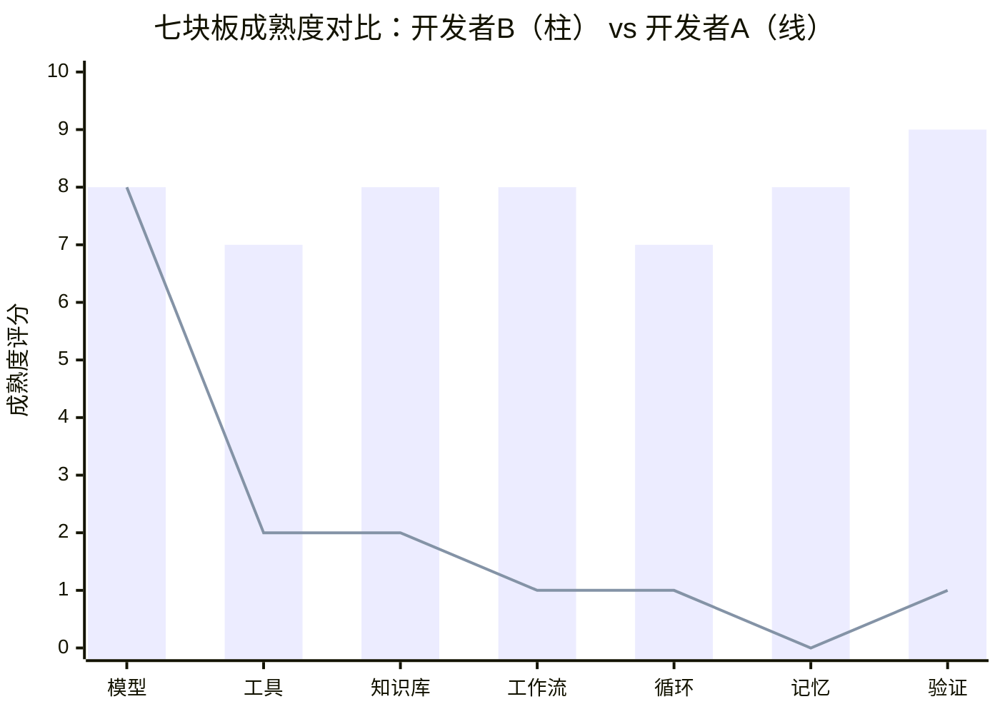

A 和 B 用的是同一个软件，但**不是同一个智能体**。B 的智能体长在他的习惯和认知上：记忆记的是他的纠偏，技能沉淀的是他的方法论，工作流固化的是他的节奏。说"AI 不行"的人，评价的往往是 A 那个只有七分之一的智能体。

**三条推论，也是后面所有章节的总纲：**

1. **提效差异的来源不在模型，在部件。** 提效不是等模型变强，是把另外六块补齐——这也是为什么本文档 90% 的篇幅在讲上下文、指令、记忆、验证，而几乎不讲"怎么写提示词让模型更聪明"。
2. **智能体是养出来的，不是装出来的。** 抄别人的配置只是拿到初始存档：⓪步"继承骨架、改写事实"（3.1）是起点，第 9 章"自我进化"是养成路径。常见疑问"等下一代模型出来这套是不是就不用搞了？"——恰恰相反，**模型越强，另外六块的杠杆越长**：给一个更聪明的工程师看两份互相矛盾的文档，他只会更快、更自信地做错事。
3. **个人独特智能体 + 团队共享层，是双层结构。** CLAUDE.md、门禁、契约进仓库，是团队共享部件；记忆、个人技能、使用习惯，是个人部件。第 11 章的一致性机制管的是共享层，不抹杀个人层。

**这也是"Harness"的定义**：除模型之外的那六块板的总和，就是你搭的那套架子——第 9 章"Harness 自我进化"讲的就是**让这套架子越用越强**。

**最后是这一节真正的用法——木桶效应：**

> **你的提效上限 = 七块板里最短的那一块。**

模型再强，上下文里躺着两份互相矛盾的文档 → 垃圾进垃圾出（6.4）；上下文干净但没有验证 → 它自信地交付错的东西（商机平台 mock 双重转换教训，12 章）；有验证但没有记忆 → 每个项目从头踩坑（第 9 章）。

**所以别再问"该用哪个模型"了——对着这七块板给自己团队打一遍分，最低的那块就是你下周该补的地方。** 后面 14 章，本质上就是这六块板的展开。

**这个命题不是思辨，是刚做完的实验（商机平台，10.1）**：一名对公司开发环境不熟悉的开发者，用"个人部件（自己的使用经验与工作流）+ 团队共享部件（公司 skill 三件套 + 门禁 + 开发手册）"，零手写代码完成了 6.5 万行的 0→1 全栈项目。**部件是可继承、可迁移、可组合的——这正是智能体观的直接推论，也是提效能被复制的原因。**

---

## 开工路线图：拿到项目的前三天（全文档主线速查）

后面 16 章讲的所有方法，落到"拿到一个项目"就是下面两条线。先看这一页，再按需跳读。

**新项目（0→1）——商机平台实测路线：**

| 天 | 做什么 | 对应章节 |
|---|---|---|
| Day 0 | 环境与骨架：装好套件，skill 一句话拉起前后端框架，编译/启动/登录跑通 | 2.1 + 《0-1 验证 ①开箱姿势篇》 |
| Day 1 | 需求基线：多角色 PRD 评审 → 决策纪要 → 产品文档终稿（唯一施工基准） | 3.3① / 5.2 / 第 6 章 |
| Day 1 | 项目配置：CLAUDE.md / AGENTS.md / MEMORY.md 三件套，配置本身过一轮评审 | 3.1 / 4.1 |
| Day 2+ | 六步法进入实施：设计 → 计划 → 分块实施（首模块打穿成配方，后续模块照配方复制）→ 验证收口 | 第 3 章 / 8.3 |

**存量项目——工单系统实测路线：**

| 天 | 做什么 | 对应章节 |
|---|---|---|
| Day 1 | 入场三板斧：CLAUDE.md（按本项目栈和安全姿态改写，不照搬）+ AGENTS.md + MEMORY.md | 3.1 / 10.2 |
| Day 2 | 六角色深度业务走查：产出带 file:line 证据的问题文档 | 8.2 / 7.2 |
| Day 3+ | 按走查结论分组并行修复：SDD + 逐任务评审 + 终审门禁 | 8.3 / 第 12 章 |

> 两条线的共同点：**第一天都不写业务代码**——先让 AI 建立对项目的正确认知（同时补齐你这个智能体的"知识库"部件），再谈产出。

---

# Part B 个人提效基本功

## 第 2 章 5 分钟上手 + 常见姿势纠错

> 📌 **本章一句话**：五分钟能上手，但纠正八个姿势、守住企业框架黑盒纪律，才算真的会用。

### 2.1 最小上手路径

```bash
# 1. 安装（Node 18+）
npm install -g @anthropic-ai/claude-code
# 或免 Node 原生安装（Windows PowerShell）：irm https://claude.ai/install.ps1 | iex

# 2. 进入你的项目目录，启动
cd your-project
claude

# 3. 第一件事：让它初始化项目认知（生成 CLAUDE.md）
> /init

# 4. 第一个任务：从"读"开始，不要从"写"开始
> 帮我梳理这个项目的整体架构，模块之间的依赖关系，用图表示
```

> 💡 **为什么第一个任务是"读"**：先让 AI 展示它对项目的理解，你能立刻判断它的靠谱程度，同时它生成的架构图/文档本身就是有用产出。

> 🧩 **不习惯终端？** VS Code / JetBrains 官方插件提供同样的能力，diff 直接在编辑器里审、文件改动实时可见。习惯 IDE 的同事从插件入门，推广阻力小一半——能力和 CLI 完全一致，本文档所有方法通用。

> 🏢 **公司环境的完整搭建**（内网代理配置、Quectel-code skill 三件套、superpowers 等插件安装、账号申请），照《0-1 项目提效验证 · ①开箱姿势篇》操作——那是一份实测过的"没有弯路版"指南，本文不再重复。

### 2.2 会用但不深？八个姿势纠错

这是针对"普遍会用但不深"团队的核心章节。对照自查：

| # | ❌ 常见错误姿势 | ✅ 正确姿势 | 为什么 |
|---|---|---|---|
| 1 | 一句话需求直接开干："帮我加个导出功能" | 先澄清再动手：让 AI 复述需求、列出它的假设和方案，确认后再实施 | 模糊输入 = 大概率返工。第 3 章六步法解决 |
| 2 | 从不用计划模式，AI 边想边改文件 | 复杂任务先 **Plan Mode**（Shift+Tab 切换）：只读分析产出计划，批准后才动代码 | 计划批准制把返工消灭在动手前 |
| 3 | 一个会话从早聊到晚，上下文混满杂讯 | 一个任务一个会话；换任务 `/clear`；上下文快满用 `/compact` | 上下文污染是输出质量下降的头号原因 |
| 4 | 项目没有 CLAUDE.md，每次都重新交代背景 | `/init` 生成后**持续维护** CLAUDE.md：技术栈、规范、红线、常用命令 | 这是 AI 的"入职手册"，一次投入长期受益 |
| 5 | AI 说"完成了"就直接信 | 要求它**跑测试/构建给出证据**再收货："跑一下测试，把输出贴出来" | "声称完成"和"验证完成"是两回事 |
| 6 | 大任务一口气丢过去："把整个模块重构了" | 拆成可验证的小步：每步有明确产出和验收标准 | 小步快跑，错了损失也小 |
| 7 | AI 跑偏了就干等它结束 | 立刻 **Esc 打断**，纠正方向再继续；错得离谱直接回退重来 | 打断不是不礼貌，是止损 |
| 8 | 只把它当"代码生成器" | 让它读代码、查 bug、写测试、评审方案、生成文档、做数据分析 | 写代码只是它能力的 30% |

### 2.3 一个立竿见影的习惯：需求描述三要素

每次给任务带上这三样，输出质量立刻上一个台阶：

```
【目标】要做什么 + 为什么（业务背景一句话）
【边界】技术栈约束 / 不要动哪些文件 / 遵循哪个现有模式（给个参照文件路径）
【验收】怎么算做完（测试通过？某个页面能跑通？性能指标？）
```

### 2.4 企业框架项目的第一纪律：把框架当黑盒

前三节是通用姿势；如果你的项目用公司框架（Quectel-code / QMonoX 等），还有一条排在所有技巧前面的纪律——**商机平台 0→1 实测中，早期返工的约一半来自违反它**：

> **企业框架当黑盒：一切以公司 skill、门禁和权威文档为准，禁止 AI 用"开源直觉"自由发挥。**

为什么必须如此——三个实测教训（均出自商机平台）：

1. **开源直觉在企业框架里经常是错的。** 曾按通用 Vue 项目的直觉修改 env 配置想做"本地账密登录页"——恰好碰了框架的禁改项，直接导致全部请求 404、应用白屏。事后确认：框架 env 有白名单，只允许改一个变量；而框架登录本来就是生产级企业 SSO，根本不需要自建。
2. **框架约定拿证据说话，不猜。** 文档说 starter 配了乐观锁，反编译字节码发现只有分页拦截器——乐观锁需要业务侧自补。**文档和直觉都可能骗你，字节码不会。**
3. **门禁即真相，且假门禁零容忍。** self-check / typecheck / 编译 / 落库核验说了算，AI 说"应该没问题"不算数。更进一步：**门禁本身也要审计**——商机平台配置评审揪出过两个"绿而无效"的假门禁。假绿比红更危险，因为它让你停止怀疑。

操作要领：**入场先跑 skill 的初始化步骤**，把权威规范拉到本地缓存（不拉就没有权威文档、只能靠开源知识瞎猜——这正是要消灭的）；把"框架黑盒、env 白名单、禁自由发挥"写进项目 CLAUDE.md 红线；skill 与自己的判断冲突时，先问框架团队，不回复则严格按 skill 执行。

---

## 第 3 章 核心工作流六步法

这是我在四个项目中验证过的标准流程，已写入各项目 CLAUDE.md 成为强制规范。

> **先立一个总纲：多角色评审不是流程中的"某一步"，而是每个阶段产物的收口门禁。** 需求、设计、计划、代码——每个阶段产出后都要过 1~3 轮多角色评审才能进入下一阶段。"零返工"不是实施得好，而是**每一层的错误都被拦在了本层**，没有机会流到下游放大。

**先划范围：不是所有任务都走全流程。**

| 任务类型 | 流程 |
|---|---|
| 新功能 / 重构 / 涉及架构 | 完整六步 |
| 明确的小 bug 修复 | ④→⑥（但先让 AI 复现 bug 再修） |
| 查询/解释/生成文档 | 直接问 |
| 涉及鉴权/输入/存储/资金 | 六步 + 强制安全评审（第 13 章） |

**渐进采纳路径**（给"会用但不深"的同事）：第一周只练 2.2 纠错表 + 2.3 需求三要素 + 计划模式——这三样不需要装任何插件；从第一个新功能开始上六步法；多角色评审和 SDD（第 8 章）放到第二阶段。**不要第一天就试图复刻全套——智能体是养出来的（1.4）。**

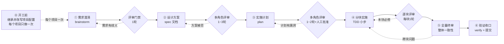

### 3.1 第 ⓪ 步：开工前继承并改写项目配置（每个项目只做一次）

**六步法是每个任务跑一遍，⓪ 是每个项目跑一遍。** 拿到一个项目——不管是新立项还是接手存量——第一件事不是写需求，而是**把一个相似项目的 `CLAUDE.md` / `AGENTS.md` / `MEMORY.md` / `settings.json` 搬过来，然后逐条改写成本项目的版本**。

**这一步值得花时间，甚至花掉大半天。** 它是整套流程里唯一一个"投入一次、后面每个任务都在吃红利"的动作：配置写对了，后面几十上百个会话自动继承正确的栈约束、流程和红线，不需要你每次重复交代；写错了，错误会被同样忠实地复制到每一个会话。

**但绝对不能照搬。** 这不是危言耸听——看我们自己两个项目的对照：

| | 思政项目 | 工单系统 |
|---|---|---|
| 后端 | Spring Boot **3.4** + JDK **17** + MyBatis-Plus + **MySQL** | Spring Boot **2.7.18** + JDK **1.8** + **MongoDB** |
| 前端 | Vue3 + **Pinia** + **Ant Design Vue** + **pnpm** | Vue3 + **Element Plus** + **npm**（**无 Pinia**） |
| 鉴权 | SSO Token + 远程 user 服务 | **自建 JWT** |
| i18n | 无强制要求 | **强制中英双语** |
| 🔴 安全红线 | 内网私有仓库，经评估沿用"配置随仓库管理"的历史约定 | **严禁任何明文密钥**，凭据 AES-GCM 加密入库 |

两个项目粗看都是"Spring Boot + Vue3"，实际上 JDK 差了 9 个大版本、数据库一个关系型一个文档型、UI 库和包管理器全不同——**而最后一行是致命的：红线完全相反**。如果把思政的 CLAUDE.md 整个拷进工单系统，你就在一个"绝对不许出现明文密钥"的项目里，白纸黑字写进了另一个项目宽松的凭据管理约定——而且 AI 会**严格遵守**这条规则。配置照搬的代价不是不好用，是**把上一个项目的安全假设，静默地装进了一个假设完全不同的项目**。

**改写的正确姿势**（工单系统 2026-07-14 的真实做法）：

1. **先让 AI 读懂新项目**，再改配置——不要凭印象写。让它扫一遍 `pom.xml`/`package.json`/目录结构/启动类，把真实的栈版本列出来。
2. **拿老项目的配置逐条过堂**，每条只问一个问题：**"这条在本项目还成立吗？"** 成立就留、不成立就改、拿不准就标记待定。红线条款尤其要一条条确认，不许默认继承。
3. **让多角色评审这份配置**——把配置本身当产物评一轮。
4. **当天收口即可开工**：工单系统 2026-07-14 入场当天完成 CLAUDE.md（项目宪法）+ AGENTS.md（6 角色分工）+ MEMORY.md（长期记忆）三件套，**第 2 天就能开始六角色深度业务走查**。

**一个意外收益**：第 3 步"多角色评审配置"的过程中，顺带发现了 **RBAC 菜单耦合等 4 个存量问题**——因为要写对配置，AI 必须先读懂这个项目，而**读懂的过程本身就是第一次免费的代码走查**。这也是为什么这一步值得慢慢做：你以为在配环境，其实已经在审代码了。

> 一句话总结：**继承的是方法论，改写的是事实。** 老项目的六步流程、角色分工表、评审门禁——这些是通用的，尽管抄；技术栈、路径、红线、安全姿态——这些是本项目的事实，必须一条条重新确认。

**还有一层容易搞反：继承骨架，但规则条目要从本项目自己的失误里长出来。** ⓪ 步搬的是流程、角色、门禁这套骨架，**不是一份完备的规则手册**。老项目 CLAUDE.md 里那些具体条目（"禁止 Options API"、"高写日志表用 BIGINT 自增主键"）是从那个项目的真实失误里长出来的——它们记录的是**那个项目踩过的坑**。整份搬过来，等于把别人的失误史当成自己的规则：条目一多，AI 的注意力被稀释，而本项目真正该防的坑一条都没写。

正确的节奏是：**⓪ 步把骨架和已确认的事实写进去就收口开工，规则条目留白**；之后每遇到一次 AI 在本项目上的典型失误，就沉淀一条精确规则（第 9 章"自我进化"讲的就是这条长大的路径）。**CLAUDE.md 是长出来的，不是抄出来的。**

### 3.2 六步法靠什么跑起来：superpowers 插件

**这套流程不是靠自觉喊口号，而是每一步都有一个 skill 兜底。** 我用的是社区插件 **superpowers**（GitHub：`obra/superpowers-marketplace`，本机版本 6.1.1），它把"先想清楚再动手"做成了强制流程——你不批准设计，它就不写代码。

| 六步 | 实际调用 | 它强制你做的事 |
|---|---|---|
| ① 需求澄清 | `superpowers:brainstorming` | 一次只问一个问题，问到设计成形；**不给设计、不批准，不许进下一步** |
| ② 设计 spec | 同上产出落盘 → `docs/superpowers/specs/YYYY-MM-DD-*-design.md` | 设计进版本库，成为后续一切的事实锚点 |
| ③ 实施计划 | `superpowers:writing-plans` → `docs/superpowers/plans/` → **EnterPlanMode 等人批准** | 计划落盘 + 人工门禁，杠杆率最高的一次介入 |
| ④ 分块实施 | `superpowers:test-driven-development`、`subagent-driven-development`（SDD） | 先测后码、块块可审 |
| ⑤/⑥ 验证收口 | `superpowers:verification-before-completion` | 完成前强制自检、**必须给证据**，不许说"应该没问题" |
| 涉敏时（输入/鉴权/接口/存储） | `security-review` 强制介入 | 安全不靠自觉 |
| 出问题时 | `superpowers:systematic-debugging` | 先复现再修，不许猜 |

**关键做法：把它写进 CLAUDE.md 变成项目宪法。** 思政项目的 CLAUDE.md 里这六步是"不可违背"条款——新会话、新同事、新代理进来自动继承，不需要有人在旁边盯。插件只是提供了 skill，**真正让它生效的是你把它固化成项目规则**（见第 9 章"自我进化"四级阶梯）。

> 💡 插件装完还有一批用得上的 skill：`dispatching-parallel-agents`（并行分派）、`requesting-code-review` / `receiving-code-review`（评审收发）、`using-git-worktrees`（隔离工作区）、`writing-skills`（写你自己的 skill）、`executing-plans`、`finishing-a-development-branch`。

### 3.3 各步骤要点与真实产出示例

> 下面用**同一个项目（工单系统）从头走到尾**，这样六步之间的衔接看得见——而不是六个互不相干的片段。

**① 需求澄清（Brainstorm）+ 评审门禁** — 让 AI 一次只问一个问题，把模糊需求磨成明确规格；收口时让 AI 以开发/测试视角把需求"挑一遍刺"（歧义、缺失异常流、边界未定义）再冻结。**每个拍板的决策当场写回 spec**，否则同一个问题会被反复问。
> 工单系统实例：走查判定"状态机是半成品"之后，澄清阶段的核心争议是"工单发布上线了到底算不算完结"。PM 拍板 **"RESOLVED 唯一终态、发布≠完结"**，当场写入 spec §7 决策记录并附 Architect 通知清单——从此没人再问第二遍。

**② 设计方案（Spec）+ 多角色评审 1~3 轮** — 产出设计文档存入 `docs/superpowers/specs/`，包含架构、数据流、错误处理、测试策略；随后多角色（PM/架构/前后端/测试，涉敏加安全）评审，**每轮修完 must-fix 再评下一轮，直到各角色一致放行才定稿**。设计文档是后续一切环节的"事实锚点"。
> 工单系统实例：状态机 8 态简化方案经**五角色评审一致放行**才动手，最终删掉 8 个死状态、零回归；组D 运营能力的 spec 经**两轮四角色评审**才定稿。

**③ 实施计划（Plan）+ 多角色评审 + 人工批准** — 计划拆成带验收标准的任务块，先过一轮多角色评审（重点：任务边界、依赖顺序、验收标准是否可执行），再交人批准。**人只需要审计划，不需要盯每行代码**——这是杠杆率最高的一次人工介入。
>
> **每个原子任务写全四要素**：**产出物**（改哪些文件/交付什么）、**验收条件**（怎样算完成，可执行可验证）、**前置依赖**（等谁先完成）、**复杂度评估**（决定要不要再拆）。判据很简单：**AI 拿到这个任务能直接开工、不用回头问"这个具体怎么实现"，四要素就写够了**；它一问，说明计划还欠。
> 工单系统实例：走查文档里的问题清单被拆成**四组带验收标准的任务**——状态机简化 / 组B 越权与配额 11 任务 / 组C 前端 i18n 与可达性 13 任务 / 组D 运营能力 9 任务；分组方案经人工批准后四组并行推进，互不阻塞。
> 计划阶段评审的价值，思政项目的对照更直观：数据中心需求 **spec 和 plan 双阶段都评**，plan 轮抓到"403 走 HTTP-200+R.code 约定""tenantType 大小写"——**同一批问题若流到编码后才发现，返工成本至少放大十倍**。

**④ 分块实施（TDD 小步）+ 逐块评审** — 每块先写测试再实现，块与块之间可独立验证；每块完成即评审（SDD 模式：实现代理+评审代理接力，见第 8 章），本块 must-fix 清零才进下一块。
> 工单系统实例：组B 11 个任务走 **SDD 双车道**（两条流水线并行，实现代理与评审代理接力），逐任务评审；状态机改造用 **8×8 全矩阵穷举测试**替代抽样覆盖——这是人工不可能做到的覆盖密度。

**⑤ 全量终审** — 所有块完成后做一次整体多角色评审：跨块一致性、契约对齐、遗漏项（逐块评审只看局部，终审看全局）。
> 工单系统实例：组B 终审结论 **READY_TO_MERGE**；组D **"终审零必修"**。

**⑥ 验证收口** — 跑全量测试/构建/类型检查，贴出证据，人工验收后提交。提交信息规范化（`type(scope): 中文描述`）。
> 工单系统实例：状态机改造后 **322 个单测 0 失败**；组C 13 个任务 13 次提交，提交信息全部中文规范化。

> 💬 **贯穿六步的一个习惯：AI 回你术语，就让它说人话。**
> 走查和评审的产出天然术语密集——"Hermes baseUrl 存在 SSRF"、"Archery 幂等 marker 跨工单污染"、"JWT 弱默认密钥"。**看到不熟的术语不要跳过，让它按四个问题重讲一遍**：
> **① 这是什么 → ② 为什么会出现 → ③ 业界通常怎么解 → ④ 我们现在采用的是哪个方案、为什么选它**
> 三个好处：**你能真正判断结论对不对**，而不是被术语唬住照单全收；**这四段话可以直接贴进走查文档和汇报材料**，PM、业务方、老板都看得懂，不用你再翻译一遍；**它讲不清楚的地方，往往就是它自己没想清楚的地方**——这是一个免费的"结论可信度探针"。

### 3.4 评审节拍：几轮才够，什么时候停

| 阶段 | 典型轮数 | 收口标准 |
|---|---|---|
| 需求澄清 | 1 轮 | 无歧义、异常流和边界已定义 |
| 设计 spec | 1~3 轮 | must-fix 清零，各角色一致放行 |
| 实施计划 | 1~2 轮 | 任务边界清晰、验收标准可执行，人工批准 |
| 每个任务块 | 1 轮 | 本块 must-fix 清零 |
| 全量终审 | 1 轮 | READY_TO_MERGE 结论 |

**按什么标准评？五个维度。** 光说"多角色评审"是不够的——不给标准，每个角色只会凭感觉挑刺。每份产物按这五性过一遍：

| 维度 | 问什么 |
|---|---|
| **完整性** | 该覆盖的场景/异常流/边界，有没有漏 |
| **精确性** | **有没有模糊表述** |
| **可验证性** | 每条要求能不能被测试或人工核实 |
| **一致性** | 与上游 spec、既有契约、其他模块有没有冲突 |
| **可追溯性** | 每个结论能不能追到出处（file:line、需求条目、决策记录） |

其中**精确性是含金量最高的一条**：禁止"优化性能""提升体验"这类表述，必须量化成可验收的指标——**"单次查询 ≤10 万条、P95 < 500ms"**。原因在第 3 章开头那句总纲的反面：**spec 里模糊一处，AI 不会回头问你，它会直接猜一个实现出去**——设计文档每模糊一处，就在代码里多一处等着返工的 bug。这条和第 7 章"事实沟通"是同一个信仰：**观点会扯皮，事实不会**。

> 💡 这套五性标准借鉴自公司内数智基座团队的《AI 编程时代软件工程》落地方案——不同业务线、不同技术栈，得出的评审标准高度一致。

**停止规则**：一轮评审只剩建议项（没有 must-fix）就停，**不要为评而评**——评审轮数的边际收益递减很快，3 轮还收不了口说明上游（需求/设计）有问题，该回退而不是继续评。

**拿不准要不要再评一轮？直接问它。** 到了第 2、第 3 轮，与其凭感觉决定，不如把判断交给最了解现场的人——AI 自己知道上一轮改了什么、哪些角度还没覆盖过：

> **提示词**：`从投入产出看，还值得再审一轮吗？请给出理由：上一轮的 must-fix 是否已全部消化？还有哪些角度/风险没有覆盖过？如果再审一轮，预期能发现什么级别的问题？`

关键是**要它给理由，不要只要"需要/不需要"三个字**——只要结论它容易顺着你的期待答，要理由才能看出它是真发现了未覆盖的风险，还是在凑数。这一问本身只花几百 token，却能挡掉一整轮无效评审（一轮多角色评审是几万 token 起步）。**省 token 和提质量在这里是同一件事**：把评审轮次花在真有未覆盖风险的地方，而不是均匀撒。

**成本直觉**：一轮多角色评审 = 几分钟 + 少量 token；一个流到下游的设计错误 = 数小时到数天返工。这是整套方法论中投入产出比最高的机制。

**"零返工"的真相是层层拦截**——每一层门禁都在拦掉本该流到下游放大的缺陷（案例均为实测）：

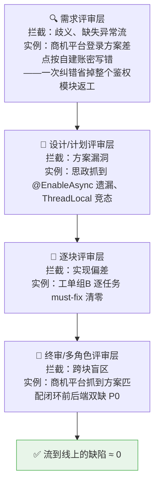

---

## 第 4 章 提效技巧库

按投入产出比排序，前三项是"必装"，后面按需采用。

### 4.1 CLAUDE.md：给 AI 的入职手册（★★★★★）

项目根目录的 CLAUDE.md 每次会话自动加载。我们四个项目的实践结构：

```markdown
# 项目名
## 技术栈与约束     ← Vue3+TS strict / SpringBoot2.7+JDK8，禁止混用其他 UI 库
## 强制工作流       ← 六步法 + 什么情况必须走安全评审
## 代码规范         ← 命名/格式/commit 规范（type(scope): 中文描述）
## 常用命令         ← 构建/测试/启动，AI 自己就会跑
## 目录速查         ← 关键路径，AI 不用每次重新探索
## 安全红线         ← 不可自动执行的操作清单
```

> ⚠️ 关键教训：**不同项目红线可能完全相反**。思政项目（内网私有仓库）经评估沿用配置随仓库管理的约定；工单系统严禁任何明文密钥、必须 AES-GCM 加密入库。CLAUDE.md 按项目写死，AI 就不会拿 A 项目的习惯祸害 B 项目。

### 4.2 计划模式 Plan Mode（★★★★★）🎬 现场演示点

Shift+Tab 进入。AI 只读分析、产出计划，**你批准前它一个文件都不会改**。所有超过半小时的任务都应该从计划模式开始。

**配套旋钮——按难度要求思考深度**：难题（并发 bug、架构权衡、疑难排查）在提示词里明确要求"深入思考这个问题"，AI 会投入更多推理再动手；简单任务不必——这是一个"用时间换质量"的显式旋钮，该拧就拧。

### 4.3 上下文管理（★★★★★)

- 一个任务一个会话，`/clear` 是最常用的命令
- 长会话用 `/compact` 主动压缩，别等它自动截断
- 大项目让 AI 把阶段结论写进文档（`docs/` 或记忆），下个会话读文档而不是重新探索

**上下文到底是怎么进来的？—— 按需检索模型 + 三层排除机制**

很多人以为 Claude Code 会"把整个项目读进上下文"，然后到处找"排除清单"配置。真相是它**不索引仓库，一切按需检索**——上下文里只有它主动搜到/读到的内容：

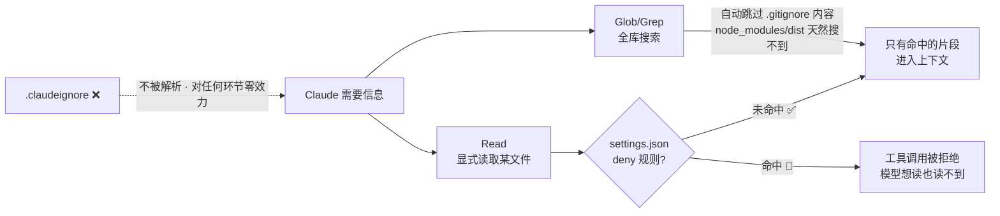

三层机制各管一段，**别指望错的那层**：

| 机制 | 作用层 | 效力 | 正确用途 |
|---|---|---|---|
| `.gitignore` | 搜索层：Glob/Grep 自动跳过 | 软排除——搜不到，但仍可显式读 | **省上下文**：依赖/构建产物/lock 文件不进搜索结果（多数项目天然已满足，零配置） |
| `settings.json` `permissions.deny` | 工具调用层：Read 直接被拒 | **硬禁止**——显式读也读不到 | **防泄露**：密钥/凭据/证书，如 `"Read(./.env*)"`、`"Read(./secrets/**)"` |
| `.claudeignore` | ——（根本不被解析） | **零效力** | 没有用途。见到就删，防止后人误以为有防护 |

快问快答（分享现场高频疑问）：

| 疑问 | 答案 |
|---|---|
| 启动时会把整个项目读进上下文吗？ | 不会。只自动加载 CLAUDE.md/记忆等少数文件，其余全部按需检索 |
| 没配任何排除，node_modules 会不会污染上下文？ | 不会被搜索命中（`.gitignore` 已排除）；但 Claude 排查第三方库行为时可**显式读**具体文件——这通常是合理行为，无需禁止 |
| `.env` 写进了 `.claudeignore`，安全吗？ | **不安全，照样能被读出来**（官方 issue #36163 实测）。必须用 deny 规则，在工具调用层拦截 |

> ⚠️ **纠错一个流传极广的错误说法**：网上（甚至 AI 自己）常推荐建 `.claudeignore` 文件——**它不是官方机制，实测拦不住文件读取**。它给你的只是"已经排除了"的错觉，比没有更危险。我们早期项目也建过，本文档已统一纠正——别把它写进你的团队规范。

### 4.4 斜杠命令：把重复操作固化（★★★★）🎬 现场演示点

`.claude/commands/` 下放一个 Markdown 文件，就成了团队共享的斜杠命令。**最值得第一个做的就是日报/周报**——它是全场复现门槛最低、受益人最多的一个案例。

```markdown
<!-- .claude/commands/daily-report.md -->
扫描本项目今日 git 提交记录，按模块归类生成工作日报，
格式：【项目】学校AI Box【内容】...【进度】...
经我确认后调用上报接口提交。
```

思政项目里这条命令的真实效果：**每天 15 分钟写日报 → 1 分钟确认**。周报同理，把"今日"改成"本周"即可；月报、迭代总结都是同一个模子。

**为什么它有效——因为它打的不是"写"，是"回忆"。** 日报真正的耗时从来不是敲字，而是"我今天到底干了啥来着"：翻聊天记录、翻分支、翻 PR，想半天挤出三行，还经常漏掉最花时间的那件事。**而 git 提交记录本来就是你这一天最准确、最完整的工作日志**——只是从来没人愿意人肉去翻它、归类它、翻译成人话。AI 把这件事从"回忆"变成了"扫描"。

**这一条就足够让订阅费回本。** 每天省 14 分钟 × 每月约 20 个工作日 ≈ **每月 4.7 小时，接近一整个工作日**——而第 14 章的回本门槛是"每月每人省半天以上即为正收益"。**只靠日报这一项，就已经越过回本线了**，后面所有的提效都是净赚。这也是为什么它适合当团队推广的第一站：**没有争议、没有风险、当天见效**。

三个设计要点，照抄时别丢：

| 要点 | 为什么 |
|---|---|
| **必须人工确认后才上报** | 上报是对外动作，一旦发出无法撤回。红线：自动审批类动作永远人按最后一个按钮（第 13 章） |
| **命令进 `.claude/commands/` 随仓库分发** | 它就不再是"leon 的个人技巧"，而是全组 clone 即得的团队资产（第 11 章） |
| **把口径固定写进命令里** | 项目名、格式模板、上报接口、扫描范围写死在命令中，AI 每次不用再问、你每次不用再教 |

> 🚀 **进阶**：这条命令还能再往前一步——挂到 CI 上定时跑，扫 git 自动生成周报草稿（见 4.11 无头模式）。但**上报动作仍然建议留人确认**，别让机器替你对外发言。

### 4.5 Skills：可复用的方法论包（★★★★）

比斜杠命令更重的复用单元：一个 SKILL.md 装下完整方法论（何时用、步骤、检查清单、经验教训）。我的 `solo-fullstack-project` skill 332 行，从项目分期、技术选型到部署清单，新项目直接继承全部历史经验（详见第 9 章"自我进化"）。

### 4.6 MCP：接入外部系统（★★★☆）

MCP（Model Context Protocol）让 Claude Code 直接操作外部系统：GitHub PR、数据库查询、浏览器自动化（Playwright/Chrome DevTools）、内部平台 API。
> 实用例：接 Playwright 后，"打开本地页面 → 截图 → 检查控制台报错 → 自己修" 全程无需人搬运报错信息。

### 4.7 Hooks：强制性护栏（★★★☆）

在工具调用前后插入检查脚本：提交前强制跑 lint、拦截危险命令、格式化落盘文件。与 CLAUDE.md 的区别：**CLAUDE.md 是"请遵守"，Hook 是"违反就拦截"**。团队治理靠 Hook 不靠自觉（第 11 章展开）。

**双层防线：AI 侧软提醒 + Git 侧硬阻断。** 这两层的定位完全不同，混在一起是新手最常见的错误：

| 层 | 时机 | 姿态 | 典型动作 |
|---|---|---|---|
| **AI 侧 Hook** | AI 编辑文件之后 | **软提醒，不打断** | 改完 `.java` 提示跑 `mvn compile`；改完前端提示跑 `npm run lint:check` |
| **Git 侧 Hook** | 提交时 | **硬阻断** | `pre-commit`：敏感信息扫描（密钥/私钥/密码/身份证号）+ 调试残留检测（`System.out` / `console.log`）；`commit-msg`：提交信息格式校验 |
| **Git 侧 Hook** | 推送时 | **硬阻断** | `pre-push`：编译检查（`mvn compile` / `tsc --noEmit`）+ 禁止直推 `main`/`master` |

**为什么必须分两层**：AI 编辑阶段全用硬阻断，AI 会被频繁打断、开发节奏碎掉；全用软提醒，等于没有防线。**编辑时提醒、提交时拦截**——摩擦成本花在最后一道关口，前面保持顺畅。

> ⚠️ **按角色分档安装**：研发装全量检查，非研发（PM/产品/测试）只装安全扫描那几条。否则一个 PM 改完 PRD 想提交，被 `pre-push` 的编译检查拦下来——他不会修编译，他只会觉得"这套 AI 玩意儿真麻烦"然后再也不用了。第 5 章我们让非开发岗也进仓库用 AI，这个洞就必须堵上。

> 💡 双层防线的结构借鉴自公司内数智基座团队的落地方案，具体条目按本项目栈调整（**这本身就是 ⓪ 步"继承骨架、改写事实"的一次实践**）。

### 4.8 并行开发：git worktree + 多会话（★★★☆）

互不依赖的任务开多个终端并行推进，配合 git worktree 每个会话独立工作副本，互不踩踏：

```bash
git worktree add ../proj-feat-a feature/a   # 会话1在这里做功能A
git worktree add ../proj-fix-b  hotfix/b    # 会话2在这里修bug B
```

> 实例：工单系统组B/组C/组D 三组任务并行推进，互不阻塞（第 10 章）。

### 4.9 无人值守模式（★★★，慎用需授权）

明确授权范围后让 AI 长时间自主推进（自动选型、自动装依赖），保留硬红线（不 push、不删库、不碰生产）。适合：夜间跑长任务、批量迁移、大规模重构。
> 实例：baseProject 授权无人值守后，整个转型实施"设计当天定稿、当天交付"。**前提是红线写清楚 + 事后全量验证**，不是裸奔。商机平台的多路后台子代理并行打磨是它的近期变体：授权范围收窄到"各自模块的文件"，门禁中心化兜底（见 8.3）。

### 4.10 Token 经济学：省钱与提质的双赢技巧（★★★★）

> 核心洞察：**省 token 和提质量在多数情况下是同一件事**——浪费 token 的头号来源（上下文污染、重复探索、失败历史堆积）恰恰也是质量下降的头号来源。省 token 的最高境界不是抠着用，而是**让每个 token 都只为"新信息"付费**。

**① 上下文卫生（省得最多）**

| 妙招 | 为什么省 | 为什么不降质 |
|---|---|---|
| 一任务一会话，`/clear` 常用 | 每轮请求都重新携带全部历史，长会话每问一句都在为旧内容付费 | 旧任务杂讯本来就在拉低新任务质量 |
| 自然节点主动 `/compact` | 历史变摘要 | 任务收口时压缩，关键结论保留；等自动截断反而可能丢关键信息 |
| deny 规则排除 dist/lock/大 JSON（见 4.3） | 无关大文件不进上下文 | 这些文件本来就不该参与推理 |
| 别粘贴大段日志，让 AI 自己 Grep 精准读 | 粘贴=全文进上下文；检索=只有命中的几十行 | AI 自己检索往往更完整更相关 |
| 文本类内容贴文字不贴截图 | 同样一段报错：截图 ~1000+ token，文字 ~200 token（图片按缩放后像素计费：≈宽×高÷750，单张封顶约 1600） | 文字可被 Grep/引用/diff，截图不能 |
| 该用图时裁剪再发，用完 `/clear` | 只截相关区域（报错弹窗而非全屏），像素面积小 token 按比例降；图片留在历史里每轮重发 | UI/设计稿/图表该用图就用图——1600 token 换一张设计稿是划算的，视觉信息文字无法替代 |

**② 记忆外化成文件（一次投入，永久免费）**

对话是易失内存（每次都要付费重载），文件是硬盘（写一次读无数次）。凡是会被第二次用到的结论，都应该落盘：
- CLAUDE.md 的"目录速查"：项目探索一次烧几万 token，落盘后每个新会话零成本继承
- 阶段结论写进 `docs/`：300 行 spec = 上个会话几十万 token 推理成果的免费复用
- MEMORY.md：踩过的坑不用付费再踩一遍

**③ 子代理隔离**：大范围探索派子代理，垃圾细节用完即弃，主会话（最贵的资产）只收结论——同时是省钱手段和提质手段。反面：小事别开子代理，启动开销反而更贵。

**④ 一次说清 vs 挤牙膏**：需求三要素一次给全（挤牙膏式往返每轮都为全部历史重复付费，且模糊期的错误尝试永久留在上下文）；给参照文件路径省全库搜索；明确"只改哪几个文件"防大范围读写。

**⑤ 止损比修补便宜**：跑偏立刻 Esc（错误产出+纠正+重来三份都计费且污染后续）；改砸了用 `/rewind` 检查点一键回退文件状态（比 git 回退更轻，Claude Code 内置）；错得离谱就 git 回退 + `/clear` 带一句教训重开——比同会话"对话式修补"便宜且质量高，修补会话里 AI 始终带着失败历史的惯性。

**⑥ 机制层**：机械性任务（批量格式化、i18n 补键）可显式用小模型，核心设计/评审用大模型——**省要省得明白，不接受静默降级**（与第 8 章"派 agent 显式指定模型"同一原则的两面）；同一任务集中连续推进可命中提示缓存，比零碎聊一天便宜。

### 4.11 CI/CD 无头集成：人不在场也在提效（★★★★）

前面所有技巧都是"人开会话"的交互模式；提效的下一站是**把 AI 挂进流水线**——`claude -p "任务"` 无头模式可以在任何脚本/CI 环境里调用：

| 场景 | 做法 | 收益 |
|---|---|---|
| **PR 自动评审** | CI 里跑无头评审（或装官方 GitHub App，PR 中 @claude 直接指派任务） | 每个 PR 先过 AI 初审（bug/安全/规范），人只终审 AI 标注的重点——评审等待时间大幅压缩 |
| **夜间定时走查** | 定时任务每晚跑一轮安全走查/依赖审计，报告落文件 | 早上上班看报告，第 13 章"AI 安全走查入流程"零人力成本落地 |
| **Issue 自动分诊** | 新 issue 触发：自动复现、定位嫌疑代码、打标签、评估影响面 | 分诊从"轮值半天"变成"看 AI 结论 5 分钟" |
| **文档/日报流水线** | 定时扫 git 生成周报、变更日志、API 文档同步 | /daily-report 的全自动版 |

**落地要点**：CI 中的 AI 权限要**最小化**（只读+产出报告，不自动改码合并）；产出物统一落到固定路径供人复核；先从"评审建议"类零风险场景起步，跑稳了再扩权。计费上有两条路：`claude setup-token` 生成长期令牌复用现有订阅额度（与交互用量共享限额），或走 API Key 按量计费——试点期实测用量再定。这条线的 ROI 很直观——**同一套工具链，产出时间从 8 小时/天变成 24 小时/天**。

---

# Part C 岗位视角与全流程协同

## 第 5 章 岗位提效地图（7+1 个岗位）

> 本章目的：让每个岗位的人都找到"跟我有关"的第一个切入点。每个岗位给出：高频场景 → 实操示例 → 提效亮点。

### 5.1 项目经理（PM）

| 高频场景 | 怎么用 |
|---|---|
| 排期推演 | 把需求列表丢给 AI：按依赖关系排出关键路径，标出风险项和缓冲建议 |
| 进度事实核查 | AI 直接读 git 提交/PR 状态汇总真实进度，**不再靠口头汇报**："统计本周 feature/xxx 分支的提交，按模块归类，对照计划标出偏差" |
| 会议纪要→行动项 | 粘贴会议记录，产出带负责人和截止日期的行动项表格 |
| 周报/日报自动化 | `/daily-report` 类命令扫 git 记录自动生成（思政项目实例） |
| 风险清单 | "读一遍当前项目 TODO/FIXME 和未合并分支，给我一份技术风险清单" |

**提效亮点**：PM 的信息来源从"问人"变成"问代码库"——进度、风险、变更都以仓库事实为准，沟通成本和信息失真双降。

### 5.2 产品经理

| 高频场景 | 怎么用 |
|---|---|
| PRD 撰写与自查 | 用 brainstorm 模式让 AI 一次一个问题地磨需求，产出结构化 PRD；再让它以"开发视角"挑 PRD 的歧义和遗漏 |
| 竞品分析 | 结合联网检索做竞品功能矩阵对比 |
| 需求→可交互 Demo | 描述交互逻辑，AI 直接生成可点击的 HTML 原型（比文字描述高效一个量级） |
| 存量功能盘点 | "读代码告诉我：当前系统实际支持哪些工单状态流转？" —— 以代码为准，不靠过时文档 |
| 决策留痕 | 每个产品决策让 AI 记录进 spec（工单系统实例：PM 拍板"RESOLVED 唯一终态、发布≠完结"直接写入 spec §7，后续开发不再反复问） |

**提效亮点**：商机平台 42 个 FEAT 的 PRD 四角色交叉评审——独立评审 → 交叉核对 → 用户拍板 D1~D9 决策纪要 → v2.0 终稿成为唯一施工基准。关键纠错一例：登录方案差点按"自建账密"写错，调研证实框架默认就是企业 SSO——**评审阶段一次纠错，省掉整个鉴权模块的返工**。次选技巧：UI 选型"用看的不用猜的"，让 AI 生成多套自包含 HTML 样张供干系人直接挑。

### 5.3 架构师

| 高频场景 | 怎么用 |
|---|---|
| 方案对比推演 | "给出 3 种方案，从性能/复杂度/迁移成本/团队熟悉度四维对比，给推荐" |
| 架构图与文档 | 从代码反向生成 Mermaid 架构图、依赖图，架构文档不再过时 |
| 技术债扫描 | 定期让 AI 全库扫描：过大文件、循环依赖、重复实现、危险模式 |
| ADR 决策记录 | 每个架构决策生成 ADR 存档，含背景/选项/理由——半年后没人说不清"当初为什么这么设计" |
| 技术栈迁移 | 思政项目 NestJS→Spring Boot 整体迁移：设计文档先行、双端并行、API 100% 对齐 |
| 契约守门 | API 契约变更时自动通知各端（工单系统实践："知会 Architect：4 项契约变化"是每个任务组的固定收尾动作） |

**提效亮点**：**契约收口，建库前扫雷**（商机平台）：建库前把枚举、字段归属、SSOT 冲突一次性收口——25 个文件由 5+3 路子代理并行修正、共享文件片段回传中心化合并；18 表 DDL + 种子数据 + 全套实体经架构师+后端双角色评审后 `mvn compile` 绿。契约先定死再动手，前后端联调**零返工**（更早的 web-tool `api-contract-v1.md` 同理）。

### 5.4 前端工程师

| 高频场景 | 怎么用 |
|---|---|
| 设计稿→组件 | 截图/描述→组件代码，遵循项目现有组件模式（CLAUDE.md 指定参照文件） |
| 原型高保真还原 | 商机平台 30 页原型全量还原：先并行审计缺口 → 夯地基（dict 契约 + 共享组件 + 样板页）→ 8 路并行镜像样板 → 中心化门禁；教训：**不盯原型比对，AI 默认容易退化成"表格+表单"** |
| Mock 与切真 | mock 按"接口白名单 / 数据保留 / 页面碎片清剿"三层有序退场（商机平台 20 个模块实测）；教训：**mock 有第三层——页面级 mock 没有 api 文件，端点盘点会漏** |
| i18n | 双语键值批量生成与遗漏扫描（工单系统组C：4 个配置页约 155 组键一天补齐；教训：cherry-pick 单 locale 会静默丢键） |
| E2E/组件测试 | 让 AI 按用户行为路径写测试，接 Playwright MCP 自己跑自己修 |

### 5.5 后端工程师

| 高频场景 | 怎么用 |
|---|---|
| 接口开发全套 | 设计→实现→单测→API 文档一体产出，文档与代码同步生成不漂移 |
| DB 变更评审 | DDL/索引让 AI 评审：锁表风险、索引命中、回滚方案（实测教训：WHERE 里 `DATE(col)` 杀索引，必须裸列范围比较） |
| 存量代码考古 | "梳理这个 500 行 Service 的调用链和副作用，画时序图" |
| 并发与事务 | 乐观锁/幂等/竞态专项审查（工单系统实例：@Version 乐观锁补齐、Archery 幂等 marker 从 8 位截断改 24 位全量——8 位截断=秒级时间戳，会跨工单污染） |
| 框架约定取证 | 拿不准框架行为时反编译字节码 / 最小复现定论（商机平台：文档称 starter 配了乐观锁，字节码里只有分页拦截器——乐观锁需业务侧自补） |
| 批量接口开发 | 首模块竖切打穿沉淀成配方（12 类文件清单），后续模块照配方复制（商机平台：第二个模块**一次编译通过**；74+ 端点、离线 272 测试全绿收口） |
| 日志与可观测 | 高写日志表设计模式：BIGINT 自增主键+异步落盘+ThreadLocal 快照要在异步跳变前取（思政项目沉淀进 skill 的教训） |

### 5.6 测试工程师

| 高频场景 | 怎么用 |
|---|---|
| 需求→用例矩阵 | PRD 丢给 AI 产出测试用例矩阵（等价类/边界/异常流），人工补业务盲区 |
| 自动化脚本 | 用例→可执行脚本（单测/接口/E2E），维护成本大幅下降 |
| 缺陷复现 | 把 bug 描述给 AI：先写"复现该 bug 的失败测试"，修复后测试转绿=修复证明+永久回归防线 |
| 穷举校验 | 状态机 8×8 全矩阵穷举测试（工单系统实测：从抽样测试升级为穷举，人工不可能做到） |
| 测试有效性审计 | "检查这批测试是不是真的在测行为，有没有只测了 mock 的假测试" |

**提效亮点**：测试角色从"写用例的人"升级为"定义质量标准、审计 AI 产出的人"，覆盖率和深度都不降反升。

### 5.7 安全工程师

| 高频场景 | 怎么用 |
|---|---|
| 全库安全扫描 | OWASP 视角全库走查：注入/XSS/SSRF/越权/密钥硬编码 |
| 真实战绩 | 工单系统六角色走查一次性挖出：**JWT 弱默认密钥可离线伪造 admin 令牌**（完全认证绕过）、**Hermes baseUrl 用户可控→SSRF+API Key 外泄**、**幂等 marker 跨工单污染**——三个 P0 都是长期存在但人工没发现的 |
| 依赖审计 | 死依赖清理+供应链风险面收敛（工单系统实测：`@ai-sdk/vue` 等零引用依赖清除） |
| 修复验证闭环 | 每个安全修复配攻击视角测试用例，修复必须让攻击用例失败 |
| 安全规范固化 | 把安全红线写进 CLAUDE.md + Hook 强制拦截（凭据 AES-GCM、失败原因脱敏、SQL 审核绝不自动执行） |

### 5.8 全栈工程师 / 独立交付者

全栈是 AI 辅助开发的最大受益者——过去"一个人干不过来"的宽度问题被直接解决。四个真实项目就是证据（第 10 章）。核心心法：
1. **架构分期**：数据层→后端通用层→鉴权→业务→前端，返工最少（skill 沉淀结论）
2. **安全前置**：后端跑通立即加固，不留到最后
3. **每个阶段一个可验收里程碑**（PR 粒度）
4. 把跨栈知识缺口交给 AI 补（前端出身写 Spring Boot，靠 AI + 评审门禁保证质量）

---

## 第 6 章 全流程不跑偏：单一事实源机制

> 📌 **本章一句话**：文档链是唯一事实源，变更成组同步——否则文档会从护栏悄悄退化成让 AI 跑偏的噪声源。

### 6.1 问题：传统流程的"传话失真"

需求→设计→开发→测试→验收，每个环节都在"翻译"上个环节的输出，每次翻译都在失真。传统解法是开会对齐——低效且结论不留痕。

### 6.2 解法：文档链 = 单一事实源（Single Source of Truth）

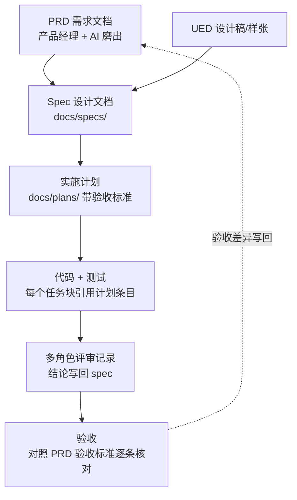

**机制要点**：

1. **每环节产物都是版本化文档**，进 git 仓库（`docs/specs/`、`docs/plans/`），不散落在聊天记录/群消息里
2. **下游只认上游文档**：开发照 spec 写，测试照 spec+PRD 出用例，验收照 PRD 验收标准——谁都不凭记忆干活
3. **变更走文档**：需求变了先改 PRD/spec 再改代码，AI 可以自动 diff 出"这次需求变更影响哪些已实现模块"
4. **决策写回上游**：评审/开发中的每个决策补录进 spec（工单系统实例：PM 拍板"发布≠完结"直接修订 spec §7 决策记录，并附 Architect 通知清单）

### 6.3 每个环节的"防跑偏门禁"

| 环节交接 | 门禁动作 | 谁执行 |
|---|---|---|
| PRD → 设计 | AI 以开发视角挑 PRD 歧义，产品澄清后冻结 v1 | 产品 + AI |
| 设计 → 计划 | 多角色评审 spec（架构/前后端/测试视角） | 架构师主持 |
| 计划 → 编码 | 人工批准计划（Plan Mode） | 技术负责人 |
| 编码 → 合并 | 测试全绿 + 代码评审 + （涉敏）安全评审 | CI + 评审者 |
| 合并 → 验收 | 对照 PRD 验收标准逐条核对，AI 生成验收报告 | 测试 + 产品 |

> 实测效果：商机平台的"决策纪要 = 唯一基准"是这套机制在多代理场景的压力测试——8 路子代理并行铺开 30 个页面，全靠决策纪要锁口径才没有漂移；思政项目 spec+plan 双阶段评审**每一轮都抓到会导致返工的真问题**；工单系统每个任务组固定"知会 Architect 契约变化"收尾，跨端契约从未失配。

### 6.4 需求变更与逻辑漂移：必须全局统一，不能只改一处

单一事实源不是建完就一劳永逸的——**它会漂移**。而漂移的那一刻，前面所有的文档投资就开始变成负资产。

**为什么这件事对 AI 协作格外致命：AI 不会怀疑你的文档。**

一个人看到 spec 写 A、代码做 B，会皱眉说"这不对啊，我问一下"。**AI 看到的是两条同样白纸黑字的规范——它没有任何理由认为其中一份是过期的。** 于是它会做三件事里的一件，而且都很糟：挑一个（可能正好挑中过期的那份）、把两个混着实现（产出一个谁都没设计过的四不像）、或者按旧 spec"修正"你新写的正确代码——**它以为自己在帮你消除不一致**。最坏的是：这三件事它都不会告诉你它做了。

**不一致的三个来源，都很日常：**

| 来源 | 典型场景 | 漏改的地方 |
|---|---|---|
| **需求变更** | 产品说"这个规则改一下" | 改了 PRD，忘了 spec、plan、已实现的代码、已写的测试 |
| **实现漂移** | 编码时发现设计方案行不通，就地换了实现 | 改了代码，spec 还停在原方案 |
| **口头决策** | 评审时拍板"这个字段就用大写" | 只在对话里说了，任何文档都没留下 |

**铁律：变更是一次成组的改动，不是改一处。** 改需求 = 一次性同步 PRD → spec → plan → 代码 → 测试 → 决策记录，**要么全改，要么先别改**。只改代码不回写 spec，你省下的 5 分钟，会在下一个会话里以"AI 按旧 spec 把你的代码改回去"的形式还给你。

**发现不一致时，按这个顺序处理：**

1. **先定权威源**——哪个是对的？是新需求对、还是代码里的实现对？**先把这个问题问清楚再动手**，不要一边改一边想。
2. **让 AI 扫出全部受影响处**——不要凭记忆改。变更的辐射范围通常比你以为的大：
   > `需求变更：<描述>。请全库扫描并列出所有与新逻辑冲突的位置——包括 PRD/spec/plan 文档、实现代码、测试用例、注释、决策记录。只列清单和 file:line，先不要改。`
3. **一次性对齐全部**——按清单逐条改，改完再让它复扫一遍确认清零。
4. **补一条决策记录**：**为什么变、什么时候变的、原方案为什么不行**。这条最容易被跳过，也最值钱——半年后有人（或某个新会话）问"这里为什么这么设计"，它就是唯一的答案。

**一个配套原则：权威源只有一份，其他地方只引用、不复制。** 同一条规则在 spec 里写一遍、CLAUDE.md 里抄一遍、注释里再抄一遍——**这三份将来必然失同步，只是时间问题**。让下游指向上游（"鉴权规则见 spec §4"），而不是把内容拷过去。**复制的那一刻，你就欠下了一笔一致性债务。**

> 💡 一致性维护是单一事实源这套机制的**月供**。不交这个月供，文档链会从"防跑偏的护栏"退化成"让 AI 跑偏的噪声源"——而且退化是悄无声息的，等你发现时，已经不知道该信哪份了。

---

## 第 7 章 事实沟通：用可验证的产物说话

> 📌 **本章一句话**：观点会扯皮，事实不会——凡汇报带证据，凡断言必取证。

### 7.1 核心理念

> **观点会扯皮，事实不会。** Claude Code 让"拿出事实"的成本降到接近零，于是大量协商式会议可以被"可验证产物"替代。

| 传统沟通 | 事实沟通（AI 产出） | 效果 |
|---|---|---|
| "我做得差不多了" | git diff + 测试报告："37 个用例全绿，剩 2 项待 Docker 环境复跑" | 进度不再靠形容词 |
| "这个改动应该没影响别的" | AI 全库引用分析："该函数被 6 处调用，其中 2 处受影响，已加回归测试" | 影响面有清单 |
| "线上问题可能是配置引起的" | AI 走查报告：file:line 级证据 + 复现路径 + 修复方案 | 归因有证据 |
| "这个方案更好" | 多方案对比表：性能/成本/迁移风险量化对比 | 决策有依据 |
| 口头需求确认 | spec 文档 diff：本次变更新增/修改条目高亮 | 变更有痕迹 |

### 7.2 实战范例：带证据的走查文档

工单系统 `business-logic-walkthrough` 文档格式（六角色走查产物），可直接作为团队模板：

```markdown
## [P0] JWT 弱默认密钥可伪造 admin 令牌
- 证据：auth/JwtService.java:26 使用默认值 `ticket-platform-local-secret`，
  且全部 *.yml/环境变量 零注入（已逐一核实）
- 影响：任何人可离线签发 admin 令牌，完全认证绕过
- 复现：<离线签发步骤>
- 修复建议：强制外部注入随机密钥，启动时校验非空且 ≥32 字节
- 状态：未修复
```

每条有 **证据（file:line）→ 影响 → 复现 → 建议 → 状态**，任何人 5 分钟能核实。这份文档同时服务了：开发（修复输入）、测试（用例输入）、PM（排期输入）、高层（风险汇报输入）——**一份事实，四方共用，零翻译损耗**。

### 7.3 跨岗位事实沟通的四个习惯

1. **汇报带证据**：任何"完成了"必须附测试输出/截图/构建日志
2. **争议先核事实**：两人对系统行为理解不一致时，先让 AI 读代码给出"实际行为"再讨论"应该行为"（实测：一个疑似权限 bug 排查后是误报，但排查过程反而挖出真问题——菜单可见性与接口鉴权耦合）
3. **决策必留痕**：口头拍板 30 秒内让 AI 补录进 spec/ADR
4. **凡断言必取证**（商机平台沉淀）：技术方案查框架真实能力（必要时反编译）、接口契约抄页面实发 payload、任务定义从会话记录里抠原话——**断言的可信度 = 证据的可信度**

---

## 第 8 章 Subagent 与 Agent Teams 实战

> 这是从"一个 AI 助手"升级到"一支 AI 团队"的分水岭，也是本次分享的进阶重点。

### 8.1 Subagent（子代理）：任务级分身

主会话可以派出子代理去执行独立子任务，子代理有**独立上下文**，干完把结论带回来。

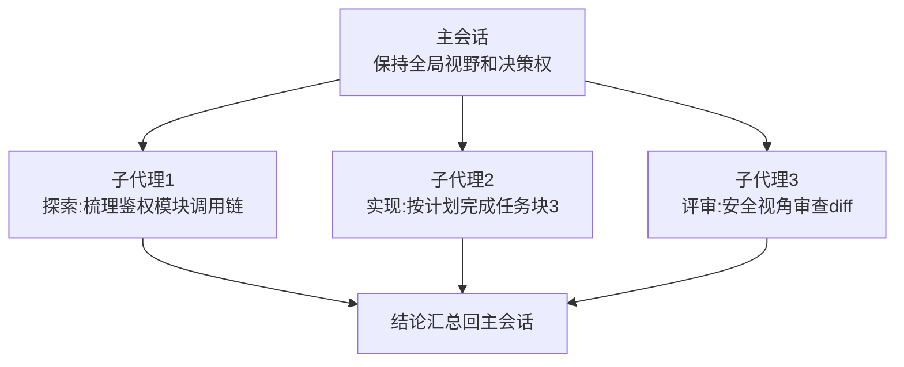

**什么任务该拆给子代理**：

| 适合 ✅ | 不适合 ❌ |
|---|---|
| 大范围代码探索（读 50 个文件，只要结论） | 需要频繁人工确认的任务 |
| 独立任务块的实现（有明确验收标准） | 与主线强耦合、边界模糊的改动 |
| 多视角评审（每个评审员一个子代理） | 三两下就能完成的小事（开销不划算） |
| 并行批量作业（迁移 N 个模块） | |

**关键收益：上下文隔离**。子代理读 50 个文件的垃圾细节不会污染主会话——主会话只拿到干净结论，能持续保持高质量判断。

> ⚠️ 实践约定（工单系统沉淀）：派子代理时**必须显式指定模型**——子代理不继承主会话的模型，不指定就是静默降级。怎么按角色分档配、省在哪不能省在哪，见 8.5。

### 8.2 多角色评审：子代理的最高性价比用法 🎬 现场演示点

让多个子代理分别戴上不同帽子审同一份产物：

```
> 用 5 个子代理分别以 PM/架构师/前端/后端/测试 的视角评审 docs/specs/xxx.md，
  各自输出：CONFIRMED 问题（有证据）/ 建议 / 放行结论。汇总后给我终审意见。
```

真实战绩回顾：
- 商机平台五角色评审 → 联调前抓到"方案匹配闭环前后端双缺"的 P0：页面级 mock 没有 api 文件、没进 68 端点盘点，**任何静态盘点都漏、只有评审能抓到**
- 工单系统六角色业务走查 → 挖出 3 个 P0 安全漏洞
- 工单系统状态机简化 → 五角色评审一致放行才实施，删掉 8 个死状态零回归
- 思政项目 spec+plan 双阶段多角色评审 → 每轮抓到真 blocker

**为什么有效**：单一视角有盲区，角色提示词强制切换关注面；多个独立上下文互不干扰，相当于真开了一场评审会，但成本是几分钟。

### 8.3 SDD：子代理驱动开发（Subagent-Driven Development）

把六步法的"实施"环节升级为流水线：**每个任务块 = 实现子代理 + 评审子代理接力**，主会话只做调度和终审。


**大批量同构任务再进一步：「样板 → 镜像」打法**（商机平台 30 页前端与 74+ 端点后端均用此法）：

1. **主会话先把 1 个模块打穿全流程门禁**，沉淀成样板：做对的范式 + 公共约束写成一份 SSOT 文档
2. **N 路并行子代理镜像样板**，各自只改自己模块的文件（按文件互斥切分，绝不并行改共享文件）
3. **共享资源中心化**：locale 等共享文件由子代理把片段当文本返回，主会话统一合并
4. **中心化门禁收口**：全部产出后统一跑 typecheck / self-check / 编译，再派专职修复子代理清偏差

> ⚠️ 两条铁律：**子代理只写码、不跑门禁**（门禁中心化，防各自为政的"局部绿"）；**共享文件绝不并行改**（片段回传合并，防覆盖冲突）。

真实数据：
- 商机平台前端高保真还原：8 路并行镜像样板，30 页三门禁全绿；后端 10 路并行写码 + 中心化门禁，74+ 端点、离线 272 测试 + 真库集成 20 全绿
- 工单系统组B：11 任务 SDD 双车道（两条流水线并行）+ 逐任务评审 + 终审 READY_TO_MERGE，一天闭环；组D：9 任务 SDD 全闭环，"终审零必修"
- 更早：NCM 转换器 8 块 SDD 当日交付，36 单测全绿

### 8.4 Agent Teams：会话级团队协作

Subagent 是"派活出去、拿结论回来"；**Agent Teams 是多个平级 agent 长期共存、互相通信、各守一摊**。适合更大颗粒的并行：

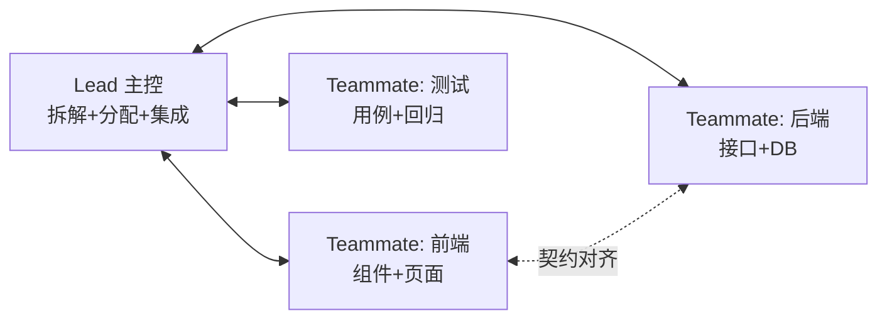

**Subagent vs Agent Teams 怎么选**：

| 维度 | Subagent | Agent Teams |
|---|---|---|
| 生命周期 | 单任务，用完即回收 | 长期存活，跨任务协作 |
| 通信 | 只向主会话汇报 | 队员间可直接互通 |
| 适用 | 探索/评审/独立任务块 | 前后端并行开发、大型专项 |
| 成本 | 低~中 | 高（多个完整会话） |
| 配套 | 计划批准+终审 | 必须有契约文档+集成门禁 |

**Agent Teams 实践要点**（工单系统经验）：
1. 每个 teammate 显式指定模型，不接受静默降级
2. 分工按**边界清晰的模块**切，不按"前半段后半段"切
3. 契约文档（API contract）是队员间的宪法，改契约必须走 Lead
4. AGENTS.md 定义角色分工表（思政/工单系统均建立 6 角色分工），角色职责、交接物、通知义务写清楚

### 8.5 给每个代理配对模型：兼顾 token 与效果

多代理真正的成本旋钮不在"派几个"，而在**"每个派谁去"**。同一份活，配错模型要么烧钱、要么烧掉质量。

**先说必须知道的默认行为：子代理和 teammate 不继承主会话的模型。** 你在主会话用着顶配，派出去的代理**不指定就可能落到别的档位**——这是**静默降级**：不报错、不提示，你以为一场 Opus 级的安全评审，实际拿到的是另一个档次的结论。工单系统的约定就是这么来的：**Agent Teams / subagent 一律显式指定模型**。

**但"一律配最贵的"同样是浪费。** 一个子代理读 50 个文件梳理调用链，钱花在了"读"上——而读不需要顶级判断力。按任务性质分档才是正解：

| 代理干的活 | 配什么 | 为什么 |
|---|---|---|
| **判断类**：终审、安全评审、架构评审、方案取舍 | **最强档**（Opus / Fable） | 这里买的就是判断力，降档等于放弃这次评审的意义 |
| **实现类**：按已批准的计划写代码 + 测试 | **中档**（Sonnet） | 计划已经把判断做完了，代理只需忠实执行 |
| **检索/机械类**：找文件、梳理调用链、批量改名、汇总结论 | **轻量档**（Haiku） | 要的是覆盖面和速度，不是深度推理 |

参考量级（官方 API 价目，每百万 token 输入/输出，**截至 2026-07**；Sonnet 5 至 2026-08-31 有 $2/$10 的首发优惠价）：**Fable 5 $10/$50 · Opus 4.8 $5/$25 · Sonnet 5 $3/$15 · Haiku 4.5 $1/$5**。也就是说**同样的输出量，Haiku 比 Opus 便宜约 5 倍、比 Fable 便宜 10 倍**。订阅制下你付的不是账单而是额度，但额度消耗的速率差是同一个比例——**六角色评审全上顶配和"两个判断角色上顶配、四个检索角色用轻量档"，跑一天的额度差得非常明显**（计费两条路见 4.11）。

**第二个旋钮：推理力度（effort）。** 除了换模型，还能调同一个模型想多深（`low` / `medium` / `high` / `xhigh` / `max`）。机械型子代理开 `low` 就够——**它少想、少绕、少输出，省的是纯浪费的那部分**；终审和难题留给 `high` 以上。

**配在哪：写进 `.claude/agents/*.md` 的 frontmatter**（模型和推理力度都可以固定在角色定义里），随仓库进版本库——**全团队派出的"安全评审员"就都是同一个档位的安全评审员**，不靠每个人记得手动指定（第 11 章"一致性靠机制不靠自觉"）。

> 🔴 **一条铁律：省 token 可以省在"手"上，绝不能省在"眼"上。**
> 实现代理降档，最坏结果是代码写得笨，评审会拦下来；**评审代理降档，最坏结果是它给你一份看起来很专业的"通过"**——你不但没得到评审，还得到了一个虚假的安全感。**假评审比不评审更危险**，因为它让你停止了怀疑。

### 8.6 多代理的反模式（什么时候别用）

| 反模式 | 后果 | 正确做法 |
|---|---|---|
| 小任务也开团队 | token 成本数倍，收益为零 | 单会话直接干 |
| 无契约并行开发 | 集成时对不上，返工超过节省 | 契约先行再并行 |
| 层层转包无终审 | 错误在代理链中放大 | 主会话必须终审+全量验证 |
| 用多代理掩盖模糊需求 | N 个代理各自理解各自跑偏 | 需求先澄清，再谈并行 |

---

## 第 9 章 Harness 自我进化机制：让工具越用越懂你

> 大多数人用 AI 工具是"每次从零开始"；高手的环境是**用得越久越强**。这就是自我进化机制——把每一次纠偏、每一个教训固化为环境资产。本章全部机制均已在我的四个项目中实际运行。

### 9.1 四级固化阶梯

经验按"重要性和强制程度"逐级升格：

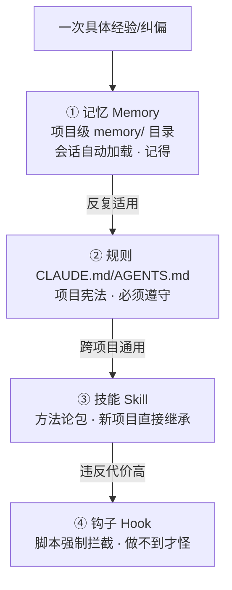

| 层级 | 载体 | 性质 | 真实例子 |
|---|---|---|---|
| ① 记忆 | `memory/*.md` + MEMORY.md 索引 | 软性——AI 记得并参考 | "无人值守授权范围"、"commit 用中文"、"派 agent 显式指定模型" |
| ② 规则 | CLAUDE.md / AGENTS.md | 硬性约定——每次会话必守 | 六步强制工作流、安全红线、技术栈禁令 |
| ③ 技能 | `~/.claude/skills/*/SKILL.md` | 可复用方法论——跨项目继承 | solo-fullstack-project（332 行，含 Lessons Learned 演进章节） |
| ④ 钩子 | `.claude/settings.json` hooks | 机器强制——违反即拦截 | 提交前强制 lint、危险命令拦截 |

**关键：不是所有经验都该往上爬——先软后硬，能停就停。**

这个阶梯最容易被误读成"越往上越好，都升到 Hook 最保险"。恰恰相反：

> **如果所有约束都是强制拦截，AI 会被频繁打断，开发效率断崖式下降；如果所有约束都是软性建议，约束就形同虚设。**

正确的做法是**梯度分层**：**绝大多数约束停在 ①②（低摩擦运行），只有安全红线才升到 ④（高摩擦强制）**。判断该升到哪一级，问两个问题：

| 问题 | 决定 |
|---|---|
| 这类问题**反复出现**吗？ | 偶发 → 停在 ① 记忆；反复 → 升 ② 规则 |
| 违反的**代价**有多大？ | 影响可维护性 → 停在 ② 规则（软红线，建议遵循）<br/>导致生产事故或合规问题 → 升 ④ Hook（硬红线，必须拦截） |

所以规则本身也要**分级标注**：哪些是"硬红线"（违反即事故），哪些是"软建议"（违反只是不优雅）——**让 AI 能区分优先级**。一份所有条目都标着"CRITICAL / 必须 / 严禁"的 CLAUDE.md，等于没有优先级：模型会把注意力均摊到几十条同等紧急的规则上，真正的红线反而被淹没。**红线之所以是红线，是因为它稀少。**

> 另外：**每次升级都要人工确认，禁止 AI 自动改写规范文件**——否则规则会在你不知情的情况下漂移，这比没有规则更危险。

### 9.2 记忆系统怎么运转

> ℹ️ **先说归属，避免误解**：本节这套 `memory/` 目录结构与"会话自动加载"机制由**开源插件 ECC** 提供，**不是 Claude Code 原生功能**（原生记忆只有 CLAUDE.md）——归属细节与治理答疑见第 16 章。本节讲的是我们怎么用它。

每个项目有独立记忆目录，记忆分四类：

```
memory/
├── MEMORY.md                        ← 索引，每次会话自动加载
├── project-xxx.md                   ← project: 项目状态/架构决策/待办
├── feedback-xxx.md                  ← feedback: 用户纠偏(含 Why + How to apply)
├── user-xxx.md                      ← user: 用户背景与偏好
└── reference-xxx.md                 ← reference: 外部资源指针
```

**feedback 记忆是进化的核心**。真实例子（思政项目）：

> 我连续用多选题问卷方式澄清需求，被用户拒绝两次。沉淀记忆：
> *"复杂设计澄清：先查证代码事实 → 文字给出 2-3 方案及利弊+推荐 → 用户文字拍板。仅在选项清晰互斥时才用选择题。**Why**: 用户需要看到严谨的事实核实与利弊分析，而不是被动选择预设选项。"*
>
> 从此以后所有会话自动带着这条行为准则——**同一个错误不犯第二次**。

### 9.3 Skill 演进：方法论的复利

`solo-fullstack-project` skill 的演进规则（写在 skill 内部）：

```markdown
## Skill Evolution
本 skill 随真实项目经验进化。触发时机：
- 新业务模块完成 / 重大 bug 解决 / 部署上线
- 性能优化 / 安全修复 / 流程改进
触发时 AI 主动询问："本次经验是否需要更新到 skill？"
```

已沉淀的教训举例（每条都来自真实踩坑）：
- 开发顺序：数据层→后端通用→鉴权→业务→前端，返工最少
- API key 永不进前端，内部项目也走后端代理
- "访问量"语义必须让业务方签字（API 调用数 ≈ 页面浏览量 × 10，报表时点炸雷）
- 高写日志表：自增主键+异步落盘+ThreadLocal 快照在异步跳变前取

**复利效应**：第 1 个项目踩的坑，第 4 个项目开工第一天就全部免疫。这是 AI 辅助开发和传统开发最大的差异之一——**经验的边际复制成本为零**。

### 9.4 进化的两个触发器（关键！不进化的环境会退化）

1. **AI 主动提议**：在里程碑节点（模块完成/踩坑/上线）主动问"要不要沉淀"
2. **人及时纠偏**：AI 行为不符合预期时，别只是当场纠正——花 30 秒说"记住这一点"，让它写入 feedback 记忆

配套纪律：**错误的记忆要删除**。记忆是资产也需要 GC，过时信息比没有信息更有害。

### 9.5 团队级进化（个人资产 → 团队资产）

| 个人级 | 团队级升格方式 |
|---|---|
| 个人 memory | 周会 5 分钟：值得共享的沉淀 → 提 PR 进项目 CLAUDE.md |
| 个人 skill | 评审后放入团队 skill 仓库，全员安装 |
| 个人纠偏 | 高频纠偏 → 固化为团队 Hook，机器强制 |

**还有一层：组织级进化——用实战反哺工具团队。** 商机平台 0→1 实验的副产品，是一份给公司套件团队的实战反馈清单（SSO 联调卡点、插件注册表 bug、starter 文档与字节码不符、脚手架残留触发假门禁）。这个环是：使用者实战暴露 skill 待加强点 → 反馈工具团队 → skill 升级 → 全员受益。**个人进化让你自己的智能体变强，这个环让所有人的"共享部件"变强（1.4 推论三）。**

> 换电脑实证：Mac→Windows 迁移时，skills + memory 全部随身迁移，四个项目的经验资产零丢失。**员工的隐性经验变成了可迁移、可继承、可审计的显性资产**——这一点的组织意义不亚于提效本身。

### 9.6 环境即资产：换设备只需带走一个文件夹

自我进化机制的全部成果都存在用户主目录的 `~/.claude/` 文件夹里——**换电脑/重装系统，拷走这一个文件夹，整个"进化后的环境"就跟着走**：

```
~/.claude/
├── projects/<各项目>/          ← 每个项目的会话历史 + memory/ 长期记忆
├── skills/                     ← 个人技能包（方法论资产）
├── commands/                   ← 个人斜杠命令
├── settings.json               ← 权限/Hooks/偏好配置
└── plugins/                    ← 已装插件
```

**真实案例就是本文档自己**：Mac→Windows 换机后，从旧 `.claude` 文件夹里完整恢复了思政/baseProject/web-tool 三个项目的全部项目记忆、踩坑教训和 skill——本文档第 10 章的案例数据全部来自这次恢复。

**三个实操注意点**：
1. **项目记忆按"项目路径"归档**：新机器上项目路径变了（如 `/Users/x/proj` → `D:\proj`），旧记忆不会自动加载——把旧项目的 `memory/` 内容汇总导入新路径对应目录，或让 Claude 帮你做一次迁移整理（一句话的事）
2. **凭据文件当密钥对待**：文件夹里含登录凭据/OAuth token，拷贝传输走安全通道，不要发聊天工具/网盘明文
3. **可以瘦身**：`cache/`、`debug/`、`file-history/` 等目录是临时产物，迁移时可跳过；真正的资产是 projects/*/memory、skills、commands、settings

> 团队视角的延伸：个人资产在 `~/.claude/`，**团队资产在各项目仓库的 CLAUDE.md + `.claude/` 目录里**（随 git 走，天然多机同步）。两层资产都不会因换设备、换人而丢失——这就是"经验资产化"的完整闭环。

---

# Part D 真实案例复盘

## 第 10 章 双主案例：商机平台（0→1）与工单系统（存量）

> 两个最新项目各讲透一条线：**商机平台**回答"拿到一份 PRD，AI 能从零做到联调吗"；**工单系统**回答"接手一个跑了很久的系统，AI 能干什么"。更早的三个项目压缩为速览（10.3）。

### 10.1 主案例一：销售商机互助平台（0→1 全链路 · 公司框架 · 2026-07）

**实验设定（刻意苛刻）**：一名对公司开发环境**不特别熟悉**、对目标项目**了解较少**的开发者，手里只有——公司 AI Skill 三件套（code-master / vue-coding / java-coding）+ 开发手册 + 一份 PRD（30 页原型 + 42 个功能点）+ Claude Code。**约束：全程不写一行手工代码，一切由 AI 执行，人只做决策与把关。**

**七阶段全链路与交付物**：

| 阶段 | 关键交付物 | 验收方式 |
|---|---|---|
| 环境与框架骨架 | 可编译可启动的前后端骨架（QMonoX + Spring Boot 2.7，SSO 登录可用） | mvn compile / spring-boot:run / self-check |
| 需求分析评审 | 多角色交叉评审报告 + D1~D9 决策纪要 + 42 FEAT 产品文档终稿 | 专职校验 agent + 人拍板 |
| AI 项目化配置 | CLAUDE / AGENTS / MEMORY 三件套（6 角色评审后修复，揪出两个假门禁） | 逐条断言对源码核验 |
| 前端完整呈现 | 30 页原型全量高保真还原（多路后台 agent 并行打磨） | self-check 0/0 + typecheck 绿 + 人工走查 |
| 验证与纠偏 | 黑盒缺陷修复（mock 双重转换）+ 需求还原度评审 | 最小复现钉根因 + 对基线多角色核对 |
| 数据库 0→1 | 契约收口（枚举/SSOT/PRD 修正）+ 18 表 DDL + 种子数据 + 全套实体 | 双角色评审 + mvn compile 绿 |
| 接口开发与联调 | 首模块竖切 12 步配方 + 真实 SSO 打穿 + 模块级 mock 三层退场 | 离线测试 / 真库集成 / 前端门禁 / 浏览器实测 / JDBC 核库五关 |

**四个里程碑的真实截图**（全程记录见飞书《0-1项目验证》）：


*里程碑一：前后端框架骨架完成，编译 / 启动 / SSO 登录跑通*

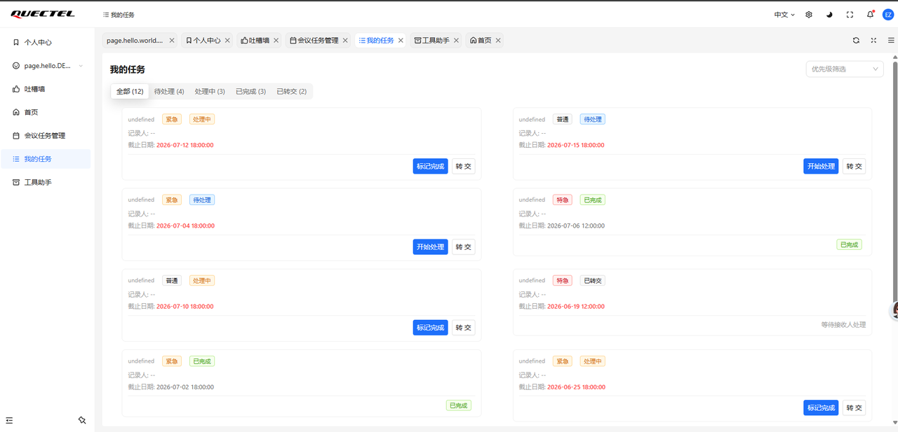
*里程碑二：30 页产品原型在前端全量高保真还原*

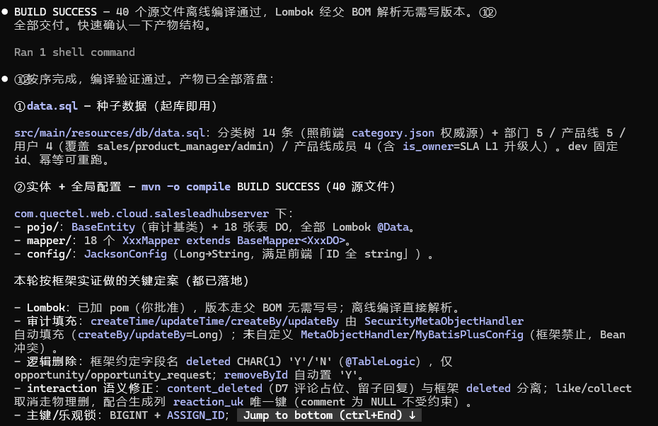
*里程碑三：18 表 DDL + 种子数据 + 实体全套生成，双角色评审收口*

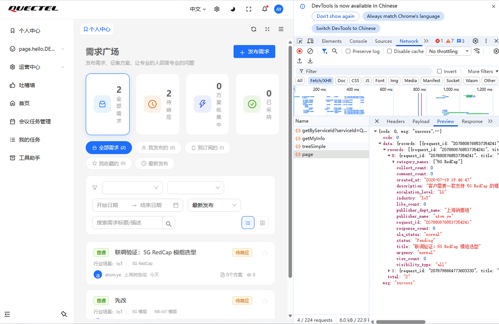
*里程碑四：首模块竖切联调打穿，真数据在前后端之间流动*

**数字成果**：AI 产出约 **6.5 万行代码 + 1.9 万行文档**（30 页原型全量还原；74+ 端点 24 个 Controller；离线 272 测试 + 真库集成 20 全绿），构成如下：

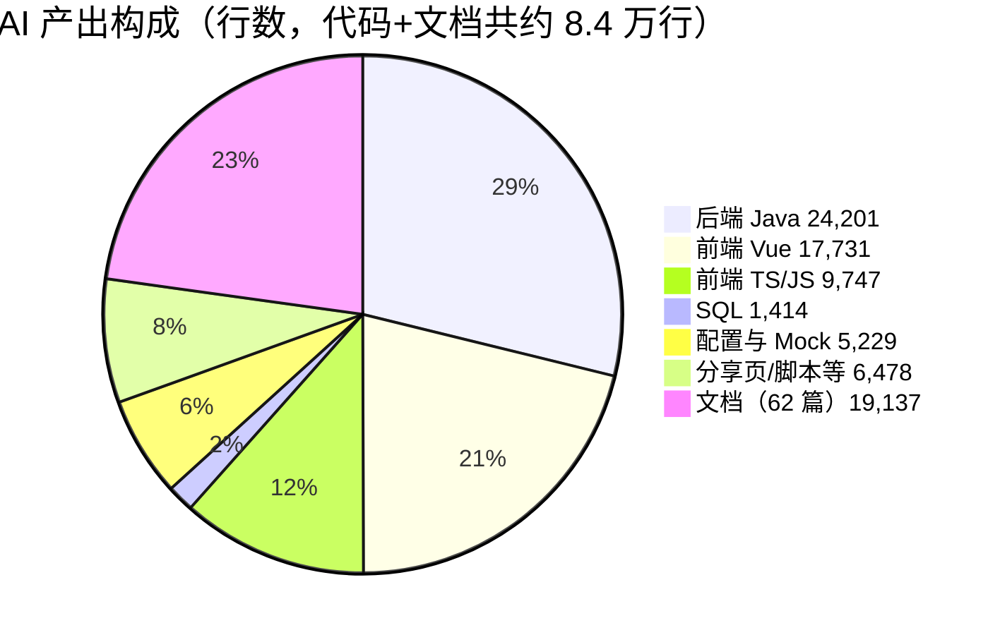

**配方化的边际成本断崖**——"越用越快"最直观的一张图：

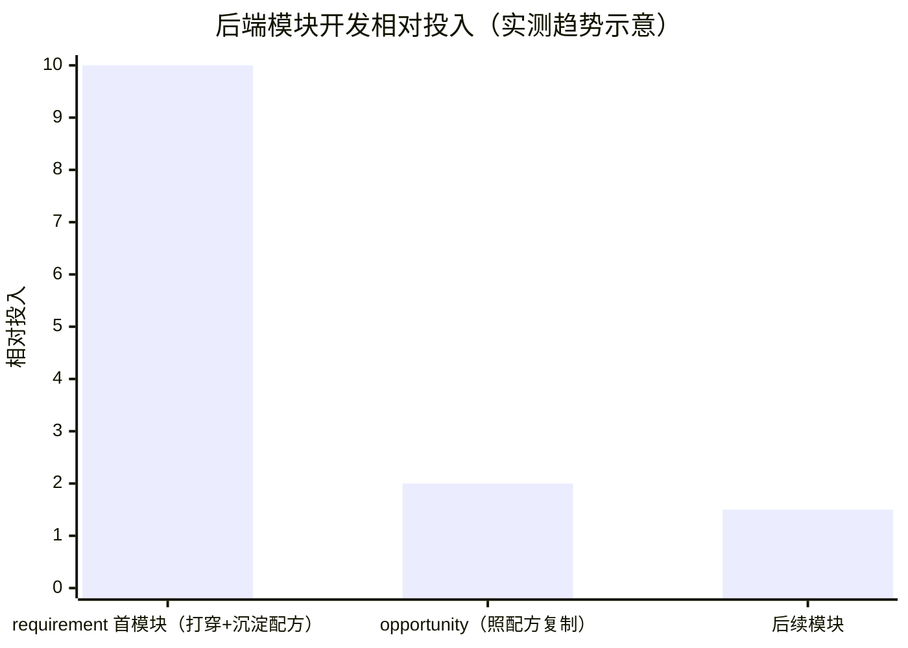

> requirement 模块慢慢打穿、沉淀成 12 类文件的竖切配方；opportunity 照配方复制**一次编译通过**。首模块的投入不是成本，是买断后续所有模块的"配方费"。

**可讲的经验**：
- **黑盒纪律是 0→1 成败的分水岭**（2.4）：早期返工的约一半来自 AI 用开源直觉碰框架禁区；纪律立住之后返工断崖式下降
- **配方化 = 边际成本断崖**：requirement 首模块慢慢打穿，沉淀成 12 类文件的竖切配方；opportunity 照配方复制**一次编译通过**——这就是"为什么越用越快"的直观答案
- **决策纪要 = 并行不漂移的根**：8 路子代理并行铺开全靠它锁口径（第 6 章）
- **评审抓到 mock 藏不住的洞**：五角色评审揪出"方案匹配闭环前后端双缺"的 P0——页面级 mock 没有 api 文件、没进端点盘点，只有评审能抓到
- **"200 不算数，落库的行才算数"**：单测全绿库仍可能是错的，JDBC 核库与门禁绿同权重（第 12 章）
- 全程实战记录（含截图）见飞书《0-1项目验证》；方法论已沉淀为《0-1 项目提效验证》系列 8 篇，照着做即可复用

### 10.2 主案例二：工单系统（存量项目提效——对多数团队最有参考价值）

> 多数同事日常面对的是存量系统。这个案例回答："接手一个跑了很久的系统，AI 能干什么？"

**背景**：P0 问题工单平台（Spring Boot 2.7 + JDK8 + MongoDB + Vue3/Element Plus），接手时已有大量存量代码。

**三天时间线**：

| 天 | 动作 | 产出 |
|---|---|---|
| Day 1 | **入场三板斧**：建 CLAUDE.md（按本项目栈和安全姿态改写，与思政完全不同）+ AGENTS.md（6 角色）+ MEMORY.md，外加敏感/大文件排除规则 | AI 完成项目认知；顺带发现 4 个存量问题 |
| Day 2 | **六角色深度业务走查**（产品/架构/前端/后端/测试/安全各一个视角） | 带 file:line 证据的走查文档：3 个 P0（JWT 可伪造 admin、SSRF+密钥外泄、幂等 marker 跨工单污染）+ 一批 P1 |
| Day 3+ | **分组并行修复**：状态机 8 态简化（五角色评审后实施，322 单测 0 失败）；组B 越权+配额 11 任务 SDD 一天闭环；组C 前端 i18n 13 任务 13 提交；组D 运营能力 9 任务"终审零必修" | 3 个 P0 修掉 2 个，4 组任务并行推进 |

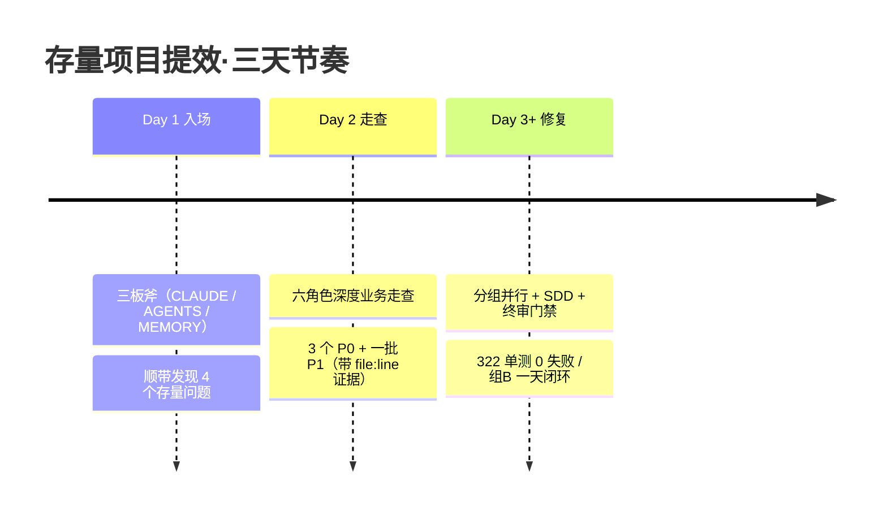

**可讲的经验**：
- 存量项目第一步永远是**建立 AI 的项目认知**（三板斧），当天完成当天开工
- **AI 审计的深度是人工不可及的**：JWT 弱密钥漏洞长期存在，六角色走查一次挖出——并且逐一核实了"所有 yml/环境变量确实零注入"这种人工不会去穷举的证据链
- 组间并行（B/C/D 互不阻塞）展示了多代理协作的现实收益
- 诚实汇报文化：文档里明确记着"JWT 弱默认密钥仍未修"、"集成测试待 Docker 复跑"——**AI 时代的工程诚信是刻意设计出来的**（第 12 章）

### 10.3 更多案例速览（早期项目）

| 项目 | 一句话战绩 | 独有看点 |
|---|---|---|
| **思政项目**（已上线） | 一人交付 Web+H5+Java 三端；NestJS→Spring Boot 整栈迁移，双端并行、API 100% 一致、前端零改动；spec+plan 双阶段评审抓到 @EnableAsync 遗漏、ThreadLocal 竞态等真 blocker | 技术栈整体迁移方法论；安全加固冲刺一轮清零四类问题（35 处 any 消除、37 个测试补齐）；/daily-report 日报自动化的发源地 |
| **baseProject**（NCM 转换器） | 设计当天定稿、8 块 SDD 当日交付、36 单测全绿；Day 3 扩展成通用转换器（47 个 SEO 落地页、覆盖率 ≥87%） | 无人值守模式的正确打开方式（显式授权+硬红线+事后全量验证）；真实样本验证教训：自造夹具全绿、真实文件乱码，换 80 个真实样本才收口 |
| **web-tool 工具平台** | 两天合并 3 个 PR（131→294 测试）；已有项目资产像积木一样拼成新平台 | 契约先行（`api-contract-v1.md` 先定死，端到端实测零返工）；分阶段交付，每 PR 一个可验收里程碑 |

### 10.4 五案例横向总结

| | 商机平台 | 工单系统 | 思政 | baseProject | web-tool |
|---|---|---|---|---|---|
| 类型 | 0→1 全链路（企业框架） | 存量提效 | 0→1 + 迁移 | 分支产品线 | 资产组合 |
| 核心方法 | 黑盒纪律+门禁+配方化 | 走查+分组并行 | 六步法+多角色评审 | 无人值守+SDD | 契约驱动+分阶段 |
| 标志性数据 | 6.5 万行零手写 / 配方复制一次编译通过 | 3 天走查+修复、3 组并行 | 35 any 清零 / 迁移前端零改动 | 设计当天→交付当天 | 两天 3 PR / 零返工 |
| 最大启示 | 姿势即成败 | 认知即入场券 | 流程即质量 | 授权即速度 | 契约即并行 |

---

# Part E 团队协作 · 质量 · 治理

## 第 11 章 团队一致性机制

> **一致性靠机制，不靠自觉。** 十个人各自用 AI，没有机制就是十种风格、十套流程、十个风险面。

### 11.1 三层共享配置（随仓库分发，clone 即继承）

```
项目仓库/
├── CLAUDE.md                 ← 项目宪法：技术栈/工作流/规范/红线（进版本库）
├── AGENTS.md                 ← 角色分工表：谁负责什么、交接物、通知义务
└── .claude/
    ├── settings.json         ← 团队级权限与 Hooks（进版本库），含敏感/大文件 deny 排除规则
    ├── commands/*.md         ← 团队共享斜杠命令（/daily-report、/review-api...）
    └── skills/               ← 项目级技能包
```

**效果**：新成员 `git clone` 后启动 Claude Code，**自动继承**团队的全部规范、流程、红线和工具——AI 时代的新人培养从数周变成半天。

### 11.2 CLAUDE.md 团队维护规约

1. CLAUDE.md 变更**走 PR 评审**，和代码同等待遇（它就是"给 AI 的代码"）
2. 每个"AI 干了蠢事"的案例 → 反思是否该补一条规则
3. 定期瘦身：过时规则删除，太长的下沉到子文档
4. **各项目独立成文，禁止跨项目复制粘贴**（真实教训：思政项目与工单系统的凭据管理红线完全相反，抄错红线就是事故）

### 11.3 一致性检查的自动化（Hook + CI）

| 层 | 机制 | 例子 |
|---|---|---|
| 会话内 | Hook 拦截 | AI 侧编辑后软提醒、Git 侧提交时硬阻断（双层防线见 4.7） |
| 仓库级 | CI 门禁 | 测试全绿+类型零错才能合并（web-tool 每个 PR 实测标准） |
| 评审级 | 固定评审流 | 涉敏改动强制安全评审；契约变更强制知会架构师 |

**门禁按角色分档安装**：研发装全量（安全扫描 + 格式 + 编译 + 分支保护），非研发（PM/产品）只装安全扫描。第 5 章我们请非开发岗也进仓库用 AI，如果他们改份 PRD 就被编译检查拦住，第二天就不会再来了——**门禁是用来拦风险的，不是用来拦人的**。

### 11.4 团队节拍建议

- **周会 +5 分钟**："本周 AI 协作的最佳实践/踩坑" → 值得固化的提 PR 进 CLAUDE.md
- **提示词/命令库共建**：好用的斜杠命令直接进 `.claude/commands/` 共享
- **结对启动**：新手前两周与熟练者结对使用，纠正姿势的效率最高

## 第 12 章 质量保障

> 📌 **本章一句话**：质量 = 验收标准 × 自动化验证 × 分层评审 × 诚实汇报——四个都是机制，没有一个依赖"AI 足够聪明"。

### 12.1 AI 时代的质量公式

> 质量 = 明确的验收标准 × 自动化验证 × 分层评审 × 诚实汇报

四个都是机制，没有一个依赖"AI 足够聪明"。

### 12.2 TDD 是 AI 协作的最佳拍档

先让 AI 写失败测试（人审测试是否真的表达需求）→ 再让 AI 实现到测试转绿。测试即规格：**审 10 个测试用例比审 500 行实现快得多，而且审的是"行为"而不是"写法"**。
> 实测：NCM 转换器 8 块全程 TDD；工单系统状态机简化用 8×8 穷举矩阵测试替代抽样。

### 12.3 分层验证金字塔

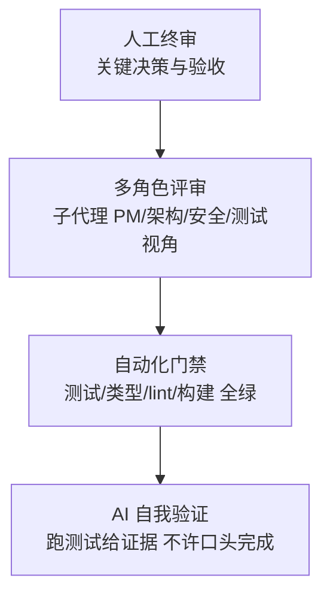

自下而上成本递增、频率递减：AI 每步自验 → 每任务块过门禁 → 每 PR 多角色评审 → 人只终审。

### 12.4 防 AI 特有风险的三道防线

| AI 特有风险 | 防线 | 真实案例 |
|---|---|---|
| **自洽但脱离现实的验证**（门禁全绿 ≠ 数据真的对） | 关键路径强制真实样本/真实链路验证；**"200 不算数，落库的行才算数"——JDBC 核库与门禁绿同权重** | 商机平台 mock 双重转换坑：三门禁全绿但页面图表全空，最小复现才钉死根因；更早的 NCM 格式坑：自造夹具全绿、真实文件乱码，换 80 个真实样本才收口 |
| **声称完成但没做**（幻觉式汇报） | 验证前置："跑给我看"文化 + Hook 强制 | 工单系统所有任务组以"322 单测 0 失败"这类可复核证据收口 |
| **顺手改了不该改的**（范围蔓延） | Plan Mode 限定范围 + diff 审查 + git 及时提交做还原点 | 六步法第③步计划批准即范围冻结 |

### 12.5 诚实汇报是设计出来的

要求 AI 汇报格式固定为三栏：**已完成（附证据）/ 未完成（原因）/ 风险与待办**。
> 工单系统实践示范："本地门全绿（单元 24/24+前端 276/276）；**待办**：Docker 全量集成测试复跑、手动提交、知会 Architect。" —— 未尽事项永远显式列出，不允许"差不多都好了"。

## 第 13 章 安全合规红线

> 📌 **本章一句话**：红线清单 + 人按最后一个按钮；配合机制，AI 对安全是净增益。

### 13.1 数据边界

| 数据类型 | 策略 |
|---|---|
| 一般业务代码 | 允许用于 AI 辅助开发 |
| 密钥/凭据/证书 | **绝不进上下文**：settings.json deny 规则排除（`Read(./.env*)` 等）+ 环境变量注入 + Hook 拦截含密钥文件读取 |
| 客户数据/生产数据 | 禁止投喂；调试用脱敏样本 |
| 未公开商业信息 | 按公司密级政策单独评估 |

企业落地可选：企业级 API 合同（数据不用于训练）、专有云/网关部署、审计日志全量留存。

### 13.2 权限分级（Claude Code 内置机制）

| 模式 | 行为 | 适用 |
|---|---|---|
| 默认（逐项确认） | 每个写操作/命令需人工批准 | 新手、敏感项目 |
| 项目级白名单 | settings.json 允许常用安全命令 | 团队标准配置（进版本库统一） |
| 无人值守 | 大范围自主执行 | 显式授权+红线保留+事后全量验证（见 4.9） |

### 13.3 不可自动执行清单（我们四个项目的公约数）

```
❌ git push / 强制回退 / 批量删除
❌ 生产环境任何操作（部署/DB 变更/配置修改）
❌ 对外发布（发消息/发邮件/开票据）
❌ 自动审批类动作（工单系统铁律：Archery SQL 审核绝不自动审批执行，AI 全程只建议）
✅ 以上全部 = AI 准备好一切 + 人按下最后一个按钮
```

### 13.4 AI 是安全的净增益

担心 AI 引入安全风险是对的，但账要算全：工单系统的 JWT 认证绕过、SSRF 密钥外泄都是**长期存在、一直没被发现的存量漏洞，AI 走查一次挖出**。配合红线机制，AI 对安全是显著净增益。建议把"AI 安全走查"纳入固定研发流程（每次大版本前跑一轮六角色走查）。

---

# Part F 量化与落地

## 第 14 章 提效度量体系与成本测算

> 📌 **本章一句话**：别用感觉，用基线对比；每月每人省半天以上即回本——日报自动化一项就够了。

### 14.1 度量原则：别用感觉，用基线对比

试点前先测 2~4 周基线，再对比。推荐指标（速度/质量两维**对齐 DORA 四指标**——业界研发效能度量的事实标准，Google 每年发布行业基准线可直接对标）：

| 维度 | 指标 | 对齐行业标准 | 采集方式 |
|---|---|---|---|
| 速度 | 需求交付周期（需求确认→合并）、部署频率、评审等待时长 | DORA：变更前置时间 / 部署频率 | 项目管理工具/git |
| 质量 | 变更失败率（上线后需修复的变更占比）、缺陷密度、返工率、测试覆盖率 | DORA：变更失败率 / 故障恢复时长（MTTR） | CI/缺陷系统 |
| 深度 | 安全漏洞发现数、技术债清理量 | — | 走查文档/扫描报告 |
| 资产 | CLAUDE.md/skill/命令的沉淀数量与复用次数 | — | 仓库统计 |
| 体验 | 开发者满意度（NPS）、"愿意回到没有 AI 的工作方式吗" | SPACE 框架的 S（满意度）维度 | 匿名问卷 |

> 🔧 **采集自动化**：Claude Code 原生支持 OpenTelemetry 指标导出——使用量、成本、会话数可直接接入公司现有监控体系（Grafana 等），使用侧数据零人工统计；DORA 指标从 CI/CD 与 git 记录自动计算。**度量本身不允许增加开发者负担**，否则数据一定失真。

> ⚠️ 反指标警告：**不要考核"AI 生成代码占比"或"AI 使用时长"**——会催生为用而用；也不要用代码行数（AI 时代更没意义了）。

### 14.2 成本测算模型

```
月成本 = 席位订阅费 × 人数 + 超额 token 费用（重度多代理场景）
月收益 = Σ(节省工时 × 人力成本) + 避免的缺陷成本 + 提前交付的业务价值
```

经验法则：一个研发人员月成本数万元，订阅费约为其 1%~3%。**只要每月为每人节省半天以上，即为正收益**——从我们的案例看（日报自动化每天节省 14 分钟一项就够了），这个门槛非常容易越过。真实的争议从来不是"值不值"，而是"如何让不熟练的人也达到熟练者的收益水平"——这正是本次分享和第 15 章路线图要解决的。

### 14.3 月度汇报模板（一页纸）

```
本月 AI 协作月报
├─ 覆盖：活跃使用 X/Y 人，深度使用（用到计划模式/多代理）Z 人
├─ 速度：需求平均交付周期 从 A 天 → B 天（环比 -N%）
├─ 质量：缺陷密度环比 ±N%；AI 走查发现并修复安全问题 N 个
├─ 资产：新增团队规则 N 条 / 共享命令 N 个 / skill 更新 N 次
└─ 下月：<瓶颈与改进动作>
```

## 第 15 章 落地路线图

> 📌 **本章一句话**：试点→规范化→规模化，每阶段有门禁；可复制的是姿势，不是天赋。

### 15.1 三阶段推进

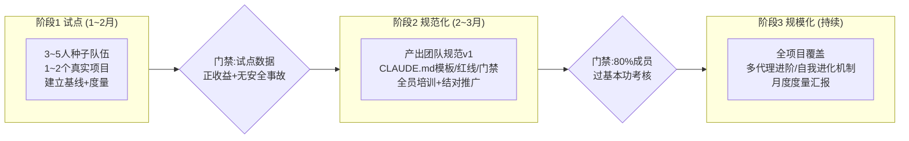

**阶段 1 试点**：挑选标准——自愿+骨干+真实项目（不要拿玩具项目试点，数据没说服力）。种子队员即未来各团队的"AI 教练"。

**阶段 2 规范化**：把试点沉淀为《团队 AI 协作规范 v1》（CLAUDE.md 模板、红线清单、门禁标准、本文档附录的命令库）；全员培训用"1 天课程 + 2 周结对"模式；出口考核用**附录 D 基本功清单**（10 项实操，结对演示 8/10 通过）。

**阶段 3 规模化**：新项目默认带 AI 配置脚手架；把"AI 安全走查"纳入版本发布流程；月度度量汇报驱动持续改进。

### 15.2 角色分工

| 角色 | 职责 |
|---|---|
| 高层发起人（CTO） | 定调、给试点授权、看月度数据 |
| AI 效能负责人（1 人，可兼任） | 规范维护、工具配置、度量汇报 |
| 各团队 AI 教练（种子队员） | 结对辅导、收集反馈、案例沉淀 |
| 安全负责人 | 红线制定、数据边界审计 |

### 15.3 常见阻力与应对

| 阻力 | 心声 | 应对 |
|---|---|---|
| "AI 写的代码我不放心" | 质量担忧 | 展示门禁机制（第 12 章）：AI 代码过的关卡比人写的更多；用工单系统安全走查实战反转认知 |
| "我自己写更快" | 熟练者的真实感受（前两周） | 承认学习曲线；结对让他看到熟练者的真实速度；从"读代码/写测试/查资料"等无争议场景切入 |
| "那是你厉害，一般人用不起来" | 能力怀疑 | 商机平台实验专门验证了这一点：一名不熟悉公司环境的开发者，凭公司 skill + 正确姿势零手写完成 0→1 全栈项目（10.1）——**可复制的是姿势，不是天赋** |
| "会不会替代我" | 职业焦虑 | 讲清楚人机分工（1.2 节）：决策、审查、验收的价值更高了 |
| "又来一个新工具，过阵子就凉" | 变革疲劳 | 试点数据说话；把工具收益直接兑现到个人（少加班、少写重复代码） |
| "太贵了" | 成本顾虑 | 14.2 成本模型：订阅费 ≈ 人力成本 1~3%，半天/月即回本 |

### 15.4 第一周就能做的五件事（行动清单）

- [ ] 每人：在自己项目跑 `/init` 生成 CLAUDE.md，补齐技术栈/规范/红线三节
- [ ] 每人：用"计划模式"完成一个真实任务，体验批准制
- [ ] 团队：建 `.claude/commands/` 放入第一个共享命令——**建议就从 `/daily-report` 开始**（4.4）：零风险、当天见效、每人每月省近一个工作日，单这一项就越过回本线
- [ ] 团队：定出本团队"不可自动执行清单"（抄 13.3 改）
- [ ] 负责人：选定试点项目和种子队员，测基线数据

---

## 第 16 章 边界与答疑：原生 / 插件 / 自建内容

> 本章是上次分享后的答疑合集，**首次阅读可跳过**；关心插件归属、治理与审计边界的同事再读。核心只有一条主线：**把三样东西分清楚——① Claude Code 平台原生自带的；② 安装的开源 harness 插件（本环境是 ECC）提供的规范；③ 我们自己填充的内容**。避免把插件能力误当平台功能，也避免把"内容"和"规范"混为一谈。

### 16.1 一张表分清"原生 / 插件 / 自建内容"

**先厘清一个常见误解**：文档里的 `memory/` 记忆系统，**既不是 Claude Code 原生，也不是我们手写的一套脚本**——它由**已安装的开源插件 ECC**（`ecc@ecc`，在 `~/.claude/settings.json` 里启用）提供规范，我们只填充了内容。三方归属如下：

| 文档里的东西 | 它是什么 | 来源 |
|---|---|---|
| `CLAUDE.md` / `AGENTS.md`（项目宪法、角色分工） | 会话自动加载的 Markdown 指令 | **① 平台原生**（Claude Code） |
| `/init`、计划模式、Subagent、`.claude/commands/` 斜杠命令、`.claude/agents/*.md` | 平台内置能力 | **① 平台原生**（Claude Code） |
| `memory/` 目录 + `MEMORY.md` 索引 + 四类记忆（user/feedback/project/reference）这套**规范**（一事一文件、frontmatter、会话自动注入） | 在原生之上加的一层记忆层规范；由 ECC 的 `knowledge-ops` 定义、ECC harness 自动注入/加载 | **② 开源插件 ECC** |
| `memory/` 下那些**具体记忆文件**的内容 + `MEMORY.md` 索引条目 | 真正沉淀下来的经验事实（多经 ECC 的 `/learn` 命令写入） | **③ 我们自建内容**（人 + AI 产出） |
| Skill 的 `Skill Evolution` 自进化小节 | 写在**某个** skill 内部的规则，非平台对全体 skill 的功能 | **③ 我们自建内容**（写在自己的 skill 里） |
| Hook 强制拦截（`settings.json` hooks / ecc hookify） | 平台/插件提供钩子机制，拦什么由我们写 | **①/② 机制 + ③ 我们写规则** |

**一句话**：第 9 章"四级固化阶梯"里，②规则、④钩子的**载体**来自平台/插件；①记忆的**结构化规范来自 ECC 插件**、**内容才是我们产出的**；③技能的自进化约定是我们写在自己 skill 里的。**记忆系统之所以能进 Git、可评审、可迁移，不是因为我们私搓了脚本，而是因为 ECC 选择用纯文本 Markdown 做载体——规范随插件升级，内容归我们所有。**

### 16.2 记忆系统：ECC 插件提供的规范，非原生、非私搓

`memory/`+`MEMORY.md` **不是 Claude Code 原生记忆**——平台原生的记忆只有 `CLAUDE.md`（项目级 + 用户级，配合 `@import`、`#` 快捷追加、`/memory` 命令），没有分类、没有索引；本环境甚至没有用户级 `~/.claude/CLAUDE.md`。**它也不是我们手写的一套约定**——这套"一事一文件 + 四分类 + 索引 + 会话自动加载"的规范由**开源插件 ECC** 在原生 `CLAUDE.md` 之上提供（ECC 的 `knowledge-ops` skill 里明确定义了这个"记忆层"）。**我们贡献的是内容，不是规范。**

这一点对治理很关键：它是**开源 harness 的一部分，随插件升级、可审计**，不是团队私搓的一次性脚本——领导若追问"谁维护、能不能审计"，这就是答案。

和另一个开源插件 **claude-mem**（GitHub 高星持久记忆插件）相比，是两种记忆哲学：

| 维度 | ECC 记忆层（本文档所用） | claude-mem |
|---|---|---|
| 采集 | **人工策展**：AI 在触发点提议、人确认后写一条 | **全自动**：Hook 抓取整个会话每一步 |
| 加工 | 一条一个确定事实，人可读 | AI 把 transcript 压成 typed observation |
| 存储 | 纯 Markdown，进 Git，可 diff/审计 | SQLite + 向量库，后台 worker，MCP 检索 |
| 治理 | 少而精，错的删掉（GC） | 多而全，"记录一切" |

概括：**claude-mem 是"录下全部再检索"（捕获导向、黑盒 DB）；ECC 记忆层是"只沉淀少数确定的真理"（策展导向、白盒可审计）。** 前者省人力，后者上下文开销小、适合团队沉淀可评审的经验资产。两者都是开源插件，不冲突、可并存。

### 16.3 记忆由谁写入？——AI 执行、人把关，非后台守护进程

把"加载"和"写入"分开看：

- **加载 = 自动**（ECC harness 在会话开始注入 `MEMORY.md` 索引）
- **写入 = Claude 本体用工具写（多经 ECC 的 `/learn` 命令），受两个触发器闸门，默认人工确认**——**都是当场触发，不存在后台守护进程偷偷抽取**（这点恰与 claude-mem 的 Hook 全自动抓取相反）

两个触发器（见 9.4）：① AI 在里程碑节点主动提议"要不要沉淀"；② 人当场纠偏时说一句"记住这一点"→ 写入 feedback 记忆。**注意：ECC 虽是插件，但它不在后台默默改你的记忆文件——每一条写入都由当次会话触发、可见、可确认。**

### 16.4 "Skill 自进化"= 特定 Skill + 永远人工确认

两个必须澄清的边界：

1. **是特定 Skill，不是全体**。自进化能力是**写在 `solo-fullstack-project` 这一个 skill 内部的 `Skill Evolution` 小节**，不是平台对所有 skill 生效的功能。没写这段的 skill 不会进化。
2. **永远人工确认，禁止 AI 自动改写**（9.1 铁律）。AI 只在触发点**提议**"本次经验是否更新到 skill？"，改不改、怎么改由人拍板。

**没有任何 skill 会在你不知情时被自动改写；"自进化"指的是"AI 提醒你该沉淀了"，落笔永远是人。**

### 16.5 三重隔离：防串扰、防泄露、防错误沉淀

**防跨项目串扰——结构上默认隔离。** 记忆按**项目路径**归档在 `~/.claude/projects/<路径编码>/memory/`，不同项目是物理上不同的目录，自动加载只拉当前项目。"项目状态/架构决策"天然不跨项目。真正的串扰风险只在**故意共享的两层**：user 类偏好（设计上跨项目）和全局 Skill——后者正是下面要防的。

**防敏感信息泄露——三道纪律。**
1. **绝不把密钥写进记忆**：`reference` 类只放**指针**（路径/链接/票号），不放密钥本身
2. **凭据文件当密钥对待**：`~/.claude` 含 OAuth token，迁移走安全通道，不发网盘/聊天明文
3. **排除用官方机制**：敏感/大文件用 `settings.json` 的 `permissions.deny`，**不是 `.claudeignore`（该文件无效）**

**防个人偏好/项目约束被误沉淀为团队 Skill——三个闸（对应四级阶梯）：**

| 闸 | 做法 |
|---|---|
| ① 分类即过滤 | 写入选 type：user/feedback/project 天然留项目级 `memory/`；只有判定"跨项目通用"才允许升 Skill |
| ② 泛化测试（升级要脱敏） | ❌"本项目 PV=API调用数×10"（项目专属常量，永不进 Skill）✅"'访问量'语义必须业务方签字"（通用教训，可进 Skill）。**能进 Skill 的是脱去项目细节的方法论，不是带具体数字的原始事实** |
| ③ 人工评审 + 先软后硬 | 个人 skill"评审后"才进团队仓库（走 PR review）；绝大多数经验停在 ①记忆/②规则，只有多项目反复验证过通用性才升 Skill。加上"禁止自动改写"，个人一时偏好不可能自己爬到团队 Skill |

### 16.6 Agent Team 到底怎么落地（完整解剖）

先厘清和 Subagent 的分界：**Subagent** = 派活出去、拿结论回来，单任务、用完即回收、只向主会话汇报；**Agent Team** = 多个平级 agent 长期共存、各守一摊、队员间可直接通信，适合更大颗粒并行（如前后端同时开发）。

一次 Agent Team 的完整解剖（工单系统实战）：

1. **角色定义写进 `AGENTS.md`**（团队宪法）——工单系统建 6 角色（产品/架构/前端/后端/测试/安全），每角色写清职责、交接物、通知义务，新代理进来自动继承
2. **Lead 按"边界清晰的模块"拆解**——不按"前半段/后半段"切，切错边界是集成灾难头号原因
3. **每个 teammate 显式配模型 + effort**——不指定就静默降级；分档原则与配置位置见 8.5，此处不重复
4. **契约文档（API contract）= 队员间宪法**——改契约必须走 Lead，队员不能私自变更接口
5. **通信规则**——队员就契约细节可直接互通，结构性变更全部路由回 Lead
6. **集成门禁**——Lead 集成 + 终审 + 全量测试通过才允许合并，杜绝"层层转包无终审"

**真实证据**：组B 11 任务 SDD 双车道并行 + 逐任务评审 + 终审 READY_TO_MERGE 一天闭环；组D 9 任务 SDD 全闭环"终审零必修"；六角色并行走查挖出 3 个 P0 漏洞。

**一句话**：Agent Team 不是"一键开团队"的按钮，而是 **"AGENTS.md 角色表 + 每人显式配模型 + 契约文档 + Lead 集成门禁"这套编排纪律**，底层用平台的多代理 + 代理间通信能力。纪律到位才提效，缺一环就变返工（反模式见 8.6）。

---

# 附录

## 附录 A 命令与快捷键速查

| 命令/操作 | 作用 |
|---|---|
| `claude` | 在项目目录启动 |
| `/init` | 生成 CLAUDE.md 项目认知 |
| `/clear` | 清空上下文（换任务必用） |
| `/compact` | 压缩上下文（长会话续命） |
| `/rewind` | 回退到检查点，一键还原文件状态（止损三件套之一） |
| Shift+Tab | 切换计划模式（Plan Mode） |
| Esc | 打断当前执行（纠偏止损） |
| `/model` | 切换模型 |
| `claude -p "..."` | 无头模式（脚本/CI 中调用） |
| `.claude/commands/x.md` | 自定义斜杠命令 `/x` |
| settings.json `permissions.deny` | 排除敏感/大文件读取（官方机制，勿用 `.claudeignore`，见 4.3） |

## 附录 B 反模式清单（贴墙版）

1. **无验收标准就开工** —— 返工之母
2. **跳过计划模式做大改动** —— 范围失控之源
3. **一个会话干到天荒地老** —— 上下文污染，质量崩塌
4. **AI 说完成就信** —— 必须"跑给我看"
5. **AI 生成的代码没人审就合并** —— 事故只是时间问题
6. **把密钥/生产数据贴进对话** —— 安全红线
7. **跨项目复制 CLAUDE.md 红线** —— 每个项目的红线可能相反
8. **纠偏之后不沉淀** —— 同一个坑每周踩一次
9.  **过度依赖不学原理** —— 审查能力是人的最后护城河，必须保持

## 附录 C 岗位提示词模板精选

**PM - 进度事实核查**
```
统计本仓库最近一周所有分支的提交记录，按功能模块归类，
对照 docs/plans/ 中的计划，输出：已完成/进行中/未开始/偏差项，
偏差项标注证据（提交缺失或测试未过）。
```

**产品 - PRD 自查**
```
以资深开发的视角审查这份 PRD：列出所有歧义表述、缺失的异常流程、
未定义的边界条件和状态流转漏洞。每条给出你建议的补充问法。
```

**架构 - 方案对比**
```
针对<需求>，给出 3 种技术方案。对比维度：实现复杂度/性能/可维护性/
与现有架构的一致性/迁移风险。给出推荐和理由。先读 docs/specs/ 了解现有架构决策。
```

**后端 - 安全走查**
```
以攻击者视角审查 <模块> 的代码：认证绕过/越权（水平+垂直）/注入/SSRF/
敏感信息泄露。每个发现必须给出 file:line 证据和复现思路，按 P0/P1/P2 分级。
```

**测试 - 用例矩阵**
```
基于 docs/specs/<xxx>.md 生成测试用例矩阵：正常流/边界值/异常流/并发冲突/
权限组合。标注哪些适合自动化，直接生成对应的测试代码骨架。
```

**通用 - 多角色评审**
```
分别以 PM/架构师/前端/后端/测试/安全 六个视角评审 <产物>，
每个视角独立输出：确认的问题（附证据）/建议/是否放行。最后汇总终审意见。
```

## 附录 D 基本功考核清单（阶段 2 门禁用，10 项实操）

> 用法：结对形式现场演示，8/10 通过即合格。考的是"做给我看"，不是笔试。

| # | 考核项 | 通过标准 |
|---|---|---|
| 1 | 在自己项目维护 CLAUDE.md | 含技术栈/规范/红线三节且内容与项目实际一致 |
| 2 | 计划模式完成一个真实任务 | 能解释为什么这个计划批准/该打回 |
| 3 | 需求三要素提问 | 随机给个模糊需求，能按【目标/边界/验收】重述 |
| 4 | 上下文管理 | 知道何时 /clear、/compact，说出本项目 deny 规则排除了哪些文件 |
| 5 | 验证收货 | 演示"跑测试给证据"，能识别一次"声称完成但未验证" |
| 6 | 打断与止损 | 演示 Esc 纠偏；说出止损三件套（Esc / rewind / clear 重开） |
| 7 | 发起一次多角色评审 | 用子代理对一份 spec 或 diff 跑多视角评审并汇总结论 |
| 8 | 红线清单 | 背出本团队"不可自动执行清单"，说明理由 |
| 9 | 沉淀一条经验 | 现场把本周一个踩坑写成 feedback 记忆或 CLAUDE.md 规则 PR |
| 10 | 事实沟通 | 把一次"完成汇报"改写成"证据+未尽事项+风险"三栏格式 |

---

> **分享结束。** 配套《宣讲提纲-90分钟版.md》见同目录（五幕结构 + 逐字开场白 + Demo 预案 + Q&A 预判）；商机平台 0→1 全程实战记录（含截图）见飞书《0-1项目验证》wiki；配套方法论 8 篇见《0-1项目提效验证》目录。
> 本文档所有案例数据来自真实项目记录（商机平台 / 工单系统 / 思政项目 / baseProject / web-tool），标 🎬 处可现场演示。
